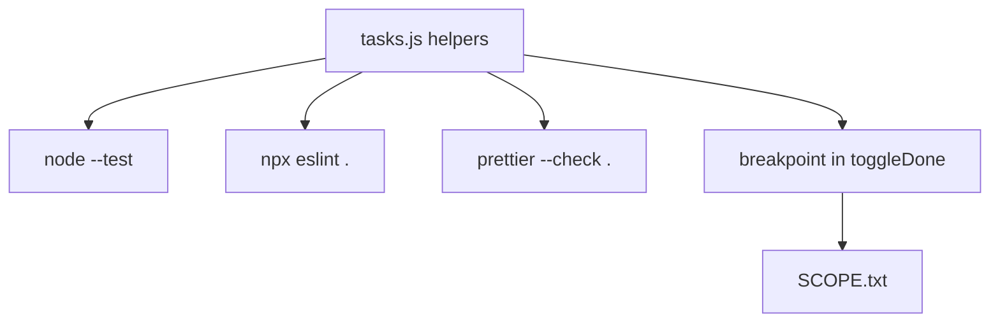

# Month 4 · Week 3 · Day 4
# Quality on the Task Module

**Program:** Full-Stack Mastery · 18 months  
**Phase:** 1 — Foundations  
**Month index:** [../../README.md](../../README.md)  
**Week 3:** [1](day-01.md) · [2](day-02.md) · [3](day-03.md) · Day 4 (today) · [5](day-05.md) · [6](day-06.md) · [7](day-07.md)  
**Week rhythm today:** Add a real lab feature  
**Study time:** 3–4 focused hours  
**Prereq:** Day 3 gate. You can write tests and pause in Scope.

Apply Day 2 tools to **your** Week 1 `tasks.js` (copy into `week-03/day-04/` by retyping or git path — still your code). This is the dress rehearsal for Week 4: a folder a stranger can `cd` into and run test / lint / format without asking you which subdirectory is “the real one.”

The Month 4 gate app is still closed. You are wiring **habit** onto code you already understand.

---

## How to read this chapter

A quality folder is not “I installed ESLint once in quality/.” It is **this** module, **these** scripts, **this** README with PowerShell commands that work from here.



Read the contract. Type configs **again** (muscle memory — do not copy-paste a mystery `eslint.config.js` from the internet). Then pause in `toggleDone` so Week 4 is not the first time you see a list in Scope.

---

## Today's contract

By the end of this day you will be able to:

1. Ship a folder with `"type": "module"` and scripts `test`, `lint`, `format`, `format:check`.
2. Retype ESLint + Prettier configs (including `eslint-config-prettier` last).
3. Run `node --test` on every `*.test.js` in the folder.
4. Write a README a stranger can follow in PowerShell.
5. Pause inside `toggleDone` and record `id` and `list.length`.

**Today's gate**

> From `day-04/`, `npm test`, `npm run lint`, and `npm run format:check` all succeed, and `SCOPE.txt` came from a real pause — not from guessing.

The Month 4 gate will expect this same ritual on the **broken** app: test, lint, format, then PR.

---

## Time box

| Block | Minutes | Work |
|---|---|---|
| A | 35 | Theory: scripts as contracts, what to copy vs retype |
| B | 40 | Configs + scripts |
| C | 70 | Tests on your helpers + breakpoint |
| D | 20 | README + Git |
| E | 15 | Recall |

---

# Theory (complete)

## 1. Scripts are the contract

A teammate (or future you, on the exam day) will not remember whether the runner is `node --test` or `npx vitest`. `package.json` `scripts` are how you **name** the jobs.

```json
{
  "name": "month04-week03-day04",
  "private": true,
  "type": "module",
  "scripts": {
    "test": "node --test",
    "lint": "eslint .",
    "format": "prettier --write .",
    "format:check": "prettier --check ."
  }
}
```

`"type": "module"` makes `.js` ESM so `import` / `export` work in Node. Without it, Node treats `.js` as CommonJS and your tests explode with `Unexpected token export`.

**Wrong belief:** “I’ll run `npx eslint` from memory every time.”  
**Correct:** the script is the name. README documents `npm test` / `npm run lint` / `npm run format:check`.

---

## 2. What you retype (and why)

Day 2’s `quality/` playground was throwaway. Today’s configs belong **next to** `tasks.js`.

**Prettier** — `.prettierrc.json` with the same options as Day 2 (`semi`, `singleQuote`, `trailingComma`, `printWidth`). `.prettierignore` lists `node_modules` and `package-lock.json`.

**ESLint** — flat `eslint.config.js`: `js.configs.recommended`, `eqeqeq`, `no-unused-vars` with `^_`, `no-debugger`, **`prettier` last**.

Install from **this** folder:

```powershell
cd ~\fullstack-lab\month-04\week-03\day-04
npm init -y
npm install --save-dev prettier eslint @eslint/js eslint-config-prettier
```

Then merge `"type": "module"` and the scripts into `package.json`. `npm init -y` may not add them.

**Wrong belief:** “I’ll npm install in `week-03/` once and every day shares it.”  
**Correct:** you may hoist later. Today, `day-04` must work **standalone** so the README is honest. If you already have a parent `package.json`, you may point scripts there — then the README must say `cd` to **that** folder. Pick one. Document it.

---

## 3. Tests that belong on a task module

You are not inventing new product features. You are locking claims:

| Claim | Why |
|---|---|
| Empty list filter → `[]` | Boundary |
| Add does not mutate input | Week 1 memory model |
| Parse garbage → `[]` | Month 3 storage habit |
| Toggle by id flips **that** id | Identity, not index-by-accident |
| Sort helper does not destroy caller order **if** that is your contract | Mutation |

If your Week 1 `toggleDone` mutates in place, **document it** and test the returned list’s `done` flag. Prefer returning a new list (`map`) so tests can snapshot the old array. Either contract is teachable; an **undocumented** mix is not.

`innerHTML` still does not belong in `tasks.js`. If your copy still paints in the helper, split: helpers return data; `ui.js` paints with `textContent`.

---

## 4. Breakpoint in `toggleDone`

Serve a tiny page that imports your module and calls `toggleDone` on a click, **or** use Node inspect on a demo file that calls it.

You need:

- A `list` with **at least two** items  
- An `id` you pass in  

Pause on the line that compares `item.id` to `id`. `SCOPE.txt`:

- `id` (the argument)  
- `list.length`  
- Whether `list` is Local or a closed-over name  

**Wrong belief:** “I’ll write SCOPE.txt from the source because I know the values.”  
**Correct:** the point is the pane. If you never paused, the file is fiction.

Call stack should show the click handler or the demo file under `toggleDone`. Write two function names.

---

## 5. README as a door, not a diary

A stranger (exam-you, or a reviewer) needs:

```powershell
cd ~\fullstack-lab\month-04\week-03\day-04
npm install
npm test
npm run lint
npm run format:check
```

If a command must be `npx eslint .` because the script name differs, say so. Do not write “run the tests” with no command.

Three sentences on what a breakpoint is (from Day 2): pause on a line; Scope shows locals/closure/`this`; call stack shows callers. Link is optional; the sentences are required.

---

# Feature

1. `package.json` in `day-04` with `"type": "module"`, scripts `test`, `lint`, `format`, `format:check`.
2. ESLint + Prettier configs as in Day 2 (type them again — muscle memory).
3. `node --test` all `*.test.js`.
4. README: exact PowerShell commands from this folder.
5. Breakpoint: pause inside `toggleDone`. `SCOPE.txt`: `id` and `list.length`.

Retype `tasks.js` from Week 1 (or `git show` a path and retype). Do not paste the gate fixture. Do not open `fixtures/broken-priority-list/`.

If `npm run lint` flags `==` in a helper, **fix the helper**. That is the tool working.

`format:check` failing after you edited: run `npm run format`, then check again. Do not commit a mix of tabs you did not mean.

```powershell
git add month-04/week-03/day-04
git commit -m "Wire test/lint/format scripts on task helpers."
```

Do not commit `node_modules`. Commit `package-lock.json`.

---

# Block B extra — configs you retype (full enough to work)

`.prettierrc.json`:

```json
{
  "semi": true,
  "singleQuote": false,
  "trailingComma": "all",
  "printWidth": 80
}
```

`.prettierignore`:

```
node_modules
package-lock.json
```

`eslint.config.js` — ESM, Prettier **last**:

```js
import js from "@eslint/js";
import prettier from "eslint-config-prettier";

export default [
  js.configs.recommended,
  {
    files: ["**/*.js"],
    languageOptions: {
      ecmaVersion: 2023,
      sourceType: "module",
    },
    rules: {
      eqeqeq: ["error", "always"],
      "no-unused-vars": ["error", { argsIgnorePattern: "^_" }],
      "no-debugger": "error",
    },
  },
  prettier,
];
```

If ESLint 9 asks for `ignores`, add `ignores: ["node_modules/**"]` in the array. Read the error. Do not copy `.eslintrc.json` from 2022 blogs.

**`toggleDone` tests (shape):**

```js
test("toggleDone flips only the matching id", () => {
  const list = [
    { id: "a", done: false },
    { id: "b", done: false },
  ];
  const next = toggleDone(list, "a");
  assert.equal(next.find((x) => x.id === "a").done, true);
  assert.equal(next.find((x) => x.id === "b").done, false);
});
```

If your function mutates `list`, `next` and `list` are the same reference — still assert both ids. Prefer `map` + new objects. Document.

**HTTP for the pause:** a 15-line `index.html` + `demo.js` that imports `toggleDone`, keeps a `list` in module scope, a `button type="button"` calls `toggleDone(list, "a")`. Serve:

```powershell
npx --yes serve -p 5500
```

Sources → `toggleDone` → line breakpoint on the `id` compare. That is `SCOPE.txt`. `file://` is why Sources is empty.

**Wrong belief:** “README can say ‘see Day 2’.”  
**Correct:** a stranger in this folder never opened the textbook. Commands here.

**Wrong belief:** “I’ll eslint the whole `month-04` tree and fight Week 1 files.”  
**Correct:** `cd` to `day-04`. The contract is this folder unless the README says otherwise.

If `npm test` prints `0 passing` because no `*.test.js` matched, your files are named `test.js` without the `.test.` pattern — rename or pass a path: `"test": "node --test ./"`.

---

# Block E — Recall

1. Why `"type": "module"` sits next to the scripts.  
2. Why Prettier last in ESLint config.  
3. What `SCOPE.txt` must contain.

---

## Definition of done

- [ ] `npm test` green from `day-04/`
- [ ] `npm run lint` green (`eqeqeq`, `no-debugger`)
- [ ] `npm run format:check` green
- [ ] README has the four PowerShell commands
- [ ] `SCOPE.txt` from a real pause in `toggleDone`
- [ ] `node_modules` gitignored
- [ ] Commit exists

---

## Optional review links

Scripts and configs are explained above.

- [ESLint: configuration](https://eslint.org/docs/latest/use/configure/)
- [Prettier: CLI](https://prettier.io/docs/cli.html)
- [Node: test runner](https://nodejs.org/api/test.html)

---

## Tomorrow

A quality checklist on this week: prove each claim is testable, introduce a deliberate `==` and watch lint (or a test) complain, restore, write `week-03/README.md`.
