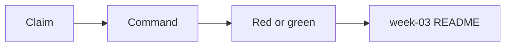
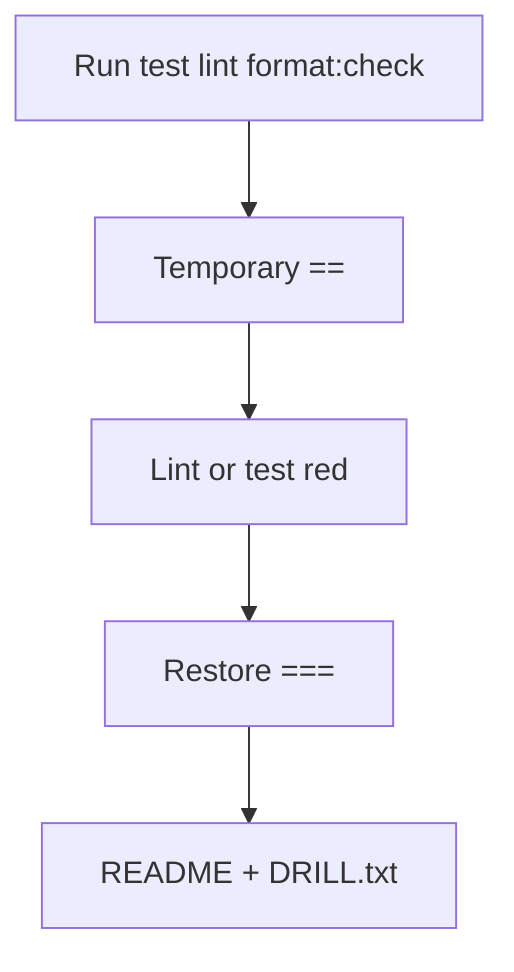

# Month 4 · Week 3 · Day 5
# Tests, Refactor, Docs — Quality Week

**Program:** Full-Stack Mastery · 18 months  
**Phase:** 1 — Foundations  
**Month index:** [../../README.md](../../README.md)  
**Week 3:** [1](day-01.md) · [2](day-02.md) · [3](day-03.md) · [4](day-04.md) · Day 5 (today) · [6](day-06.md) · [7](day-07.md)  
**Week rhythm today:** Test, refactor, document  
**Study time:** 3–4 focused hours  
**Prereq:** Day 4 folder runs test / lint / format.

Quality is not a feeling that the code is “pretty.” It is a **list of claims** you can re-run. Today you write that list down, then you **break** one rule on purpose to prove a machine notices, then you restore. That is how you will trust Week 4’s suite: you have seen red mean something.

---

## How to read this chapter

A checklist you never execute is a wish. Each row below has a command or a file to open. Do the command. Tick the row in **your** README, not only in this book.



The deliberate `==` is not a joke. It is a fire drill. If lint stays green with `==`, `eqeqeq` is not on. Fix the config, not the story.

---

## Today's contract

By the end of this day you will be able to:

1. Run a quality table and record actual commands.
2. Show that `eqeqeq` (or a unit test) catches a deliberate `==`.
3. Confirm mutation tests exist in `tasks.test.js` (or equivalent).
4. Write `week-03/README.md` a stranger can follow.
5. Explain a breakpoint in three sentences in that README.

**Today's gate**

> I can prove tests, lint, and format from a README, and I watched a machine complain about `==` before I put `===` back.

---

## Time box

| Block | Minutes | Work |
|---|---|---|
| A | 30 | Theory: claims vs trophies; what mutation tests are |
| B | 40 | Run the table on Day 4 (or week-03) code |
| C | 50 | Deliberate `==`, restore, mutation test audit |
| D | 40 | `week-03/README.md` |
| E | 15 | Git + recall |

---

# Theory (complete)

## 1. Quality is itself testable

| Claim | How |
|---|---|
| Unit tests pass | `node --test` |
| Lint pass | `npx eslint .` |
| Format pass | `npx prettier --check .` |
| No `debugger` | eslint `no-debugger` |
| Mutation tests exist | read `tasks.test.js` |

“Mutation tests exist” is **not** a coverage percentage. It means: you open the test file and find a test that snapshots the input (ids/order) and asserts it is unchanged after a helper that must not sort-in-place or push onto the caller’s array. If that test is missing, add it today. If the helper mutates and you **want** that contract, the test should say so in the name (`toggleDone mutates the matching item`) — honesty over fashion. This course prefers **new arrays** for add/sort/filter.

**Wrong belief:** “Green CI means the design is testable.”  
**Correct:** green means the claims you wrote are true. If you never claimed “input order survives sort,” a mutating sort stays green.

---

## 2. The fire drill (`==`)

Deliberate: introduce `==` in `filterOpen` (or the equivalent filter). Lint or a unit test should complain (`eqeqeq` or a wrong-type test). Restore.

Why this drill:

- `==` coerces. `"1" == 1` is true; that can **hide** a type bug or **invent** equality you did not mean. This course uses `===` and converts **in the open**.  
- If ESLint does not fail, your Day 4 config is not applied to this file (`files` glob, wrong `cd`, or `eqeqeq` missing).  
- A unit test that passes `"1"` and `1` as different priorities should fail on `===` and pass on `==` — that test is documenting **types**, which is gold later. You do **not** need the gate fixture to practice: invent two items `{ priority: 1 }` and filter with `"1"`.

Procedure:

1. `npm run lint` green.  
2. Change one comparison to `==`. Do not commit.  
3. `npm run lint` — expect red. Save the error text in `DRILL.txt` (one paragraph).  
4. Restore `===`. Lint green.  
5. Optional: a test `filterOpen`/`filterByPriority` with mixed types — write the **expected** contract (no match vs match) and keep `===`.

**Wrong belief:** “I’ll leave `==` because the drill was interesting.”  
**Correct:** restore. `no-debugger` and `eqeqeq` stay errors.

---

## 3. Refactor while green

Refactor means change **shape** without changing **claims**. Run tests before. Run tests after. If you extract `parseTasks` from a larger function, the old tests should still pass; add parse-garbage tests if missing.

Do not refactor the gate fixture. It is not yours yet.

Safe refactors today:

- Split `tasks.js` if it mixed render with data.  
- Rename a test to a sentence.  
- Replace `assert.ok(result)` with `assert.equal(result.length, 0)` where you meant empty.

Unsafe: rewriting filter logic “to be cleaner” without tests for empty and mixed `done` flags.

---

## 4. Docs: `week-03/README.md`

README at `~\fullstack-lab\month-04\week-03\README.md`: how a stranger runs test/lint/format; what a breakpoint is (three sentences from Day 2).

Include:

- Paths: `day-04` vs `quality/` vs `day-01` — which folder is canonical for the scripts.  
- Exact PowerShell.  
- “Do not commit `node_modules`; do commit `package-lock.json`.”  
- Three sentences: breakpoint pauses; Scope shows locals, closure, `this`; call stack shows callers.  
- Link to Day 2 in the **textbook** is optional; the sentences must stand alone.

This README is in **your lab**, not necessarily in the textbook tree. The textbook does not need a new `week-03/README.md` unless you keep notes there — the assignment is the lab folder.

---

## 5. What you are not doing

You are not hunting the Month 4 fixture. You are not writing Playwright. You are not enabling a coverage trophy. You are making Week 3 **replayable**.

---

## What we are testing

Quality is itself testable:

| Claim | How |
|---|---|
| Unit tests pass | `node --test` |
| Lint pass | `npx eslint .` |
| Format pass | `npx prettier --check .` |
| No `debugger` | eslint `no-debugger` |
| Mutation tests exist | read `tasks.test.js` |

Deliberate: introduce `==` in `filterOpen`. Lint or a unit test should complain (`eqeqeq` or a wrong-type test). Restore.

README at `week-03/README.md`: how a stranger runs test/lint/format; what a breakpoint is (three sentences from Day 2).

If `filterOpen` lives under `day-01` and scripts live under `day-04`, pick **one** tree for the drill and say which in `DRILL.txt`.

```powershell
git add month-04/week-03
git commit -m "Week 3 quality checklist and refactor."
```

---

# README template (lab, not textbook)

Put this shape in `~\fullstack-lab\month-04\week-03\README.md` and fill **your** paths:

```markdown
# Month 4 Week 3 — how to run quality

Canonical folder: week-03/day-04

npm install
npm test
npm run lint
npm run format:check

A breakpoint pauses the engine on a line. The Scope pane shows locals, closure bindings, and this. The call stack pane shows who called the paused function.
```

Replace the folder name if `independent/` is canonical after Day 6. Honesty > a pretty lie.

**Mutation test — worked claim:**

```js
test("addTask does not push onto the caller array", () => {
  const list = [];
  const snapshot = list;
  const next = addTask(list, { title: "x", priority: 1 });
  assert.equal(list.length, 0);
  assert.equal(next.length, 1);
  assert.notEqual(next, snapshot);
});
```

If this is red, your `addTask` mutates. Fix the helper (`[...list, item]`) or change the test name to admit mutation — this course prefers the copy.

**`==` drill — what you should see:** ESLint `eqeqeq` error pointing at `filterOpen` (or your name). If the error is `no-unused-vars` instead, you edited the wrong line. If there is no error, the glob missed the file (`files: ["**/*.js"]`, or you ran eslint from a parent without this config).

**Coverage still is not the goal.** A 100% line that never asserts order still misses a mutating `sort`. Prefer the snapshot test.

**Wrong belief:** “I’ll add `/* eslint-disable eqeqeq */` for the drill and forget it.”  
**Correct:** the drill is temporary. Disable comments that survive the day are a fail.

**Wrong belief:** “Format:check failed, so my logic is wrong.”  
**Correct:** run `npm run format`, then check again. Logic lives in tests and `eqeqeq`.

**CI idea (not required to set up):** a later GitHub Action would run `npm test && npm run lint && npm run format:check`. Today you are that Action. If you skip `--check` and only format on save, a classmate’s editor settings will dirty the PR.

**Refactor while green — extra:** extract `isOpen(item)` if `filterOpen` inlines `item.done === false`. Tests should still pass. If they fail, you changed claims, not shape.

Document in `CHECKLIST.txt` (optional but useful) the actual terminal exit: tests pass / lint pass / format:check pass. Tick marks in markdown without running are how Week 4 souvenirs happen.

---

# Block E — Recall

1. What a mutation test asserts.  
2. Why the `==` drill is restored before commit.  
3. Who the week-03 README is for.

---

## Definition of done

- [ ] Quality table commands actually run (green)
- [ ] `DRILL.txt` records lint (or test) failing on `==`, then restore
- [ ] Mutation claim exists in tests
- [ ] Lab `week-03/README.md` has commands + three breakpoint sentences
- [ ] Commit exists; no `debugger`; no leftover `==` from the drill

---

## What “read the test file” means

Open `tasks.test.js` (or whatever you named it). You are looking for **sentences** that mention order, mutation, empty lists, or garbage parse. If every test is `assert.ok(result)`, the file is a green light, not a suite. Add one snapshot test today even if lint was the exciting part.

**Scripts from the wrong directory:** `npm run lint` uses the nearest `package.json`. If you are in `week-03/` and scripts live in `day-04/`, you will “run lint” on nothing useful. `cd` first. README must say that.

**Prettier vs ESLint in the drill:** format will not rewrite `==` into `===`. If after format the drill line is still `==` and lint is still red, you understood the split. Restore `===`. Format again if wrapping changed. Commit only the restored, formatted, tested tree.

**Breakpoint sentences in the README — acceptable example:**

> A breakpoint pauses JavaScript on a chosen line. Scope lists locals, closures, and `this` for that pause. Call stack lists the functions that led here.

Unacceptable: “Use the debugger.” That is a slogan.

**Wrong belief:** “Day 5 is paperwork; I’ll skip the drill because Day 2 already used `==`.”  
**Correct:** Day 2 used a toy `messy.js`. Today the drill is on **your** helper, in **your** wired folder, with **your** scripts. That is the dress rehearsal.

If `filterOpen` does not exist (you named it `openItems`), drill on **that** name. The table in this book is a claim list, not a required identifier.



---

**`DRILL.txt` template:**

```text
Command: npm run lint (from …)
Error (paste one eqeqeq line):
Restored === : yes
npm run lint after restore: pass/fail
npm test after restore: pass/fail
format:check after format: pass/fail
```

If lint never failed, the drill did not happen. Fix config, rerun. Do not write “it would have failed.”

**package.json sanity:** `"test"`, `"lint"`, `"format"`, `"format:check"` still exist after you edit scripts. A JSON trailing-comma in `package.json` will make `npm` refuse to run — that error is not ESLint.

Do not open the Month 4 fixture. Do not “practice” by reading `state.js` in the textbook tree. Week 4 is that work.

`DRILL.txt` is evidence. A README with commands you never ran is a failed Day 5 even if Day 4 was green. `CHECKLIST.txt` ticks require a command you actually ran in this session.

---

## Tomorrow

Independent: a `discount(cents, percent)` module with integer money, throws, lint, format, and a 400-word essay on **regression** tests. Days 1–5 closed during the challenges.

The independent folder is new. Do not rename `tasks.js` to `price.js`. Integer cents, throws, `format:check`, 400 words. Days 1–5 stay closed while you build it.

Week 3 quality is scripts you can re-run, not a feeling that the code looks tidy.

If `format:check` is red after the restore, run `format` once more, then check. Do not commit the drill’s `==`.

---

## Optional review links

The checklist is explained above.

- [ESLint: `eqeqeq`](https://eslint.org/docs/latest/rules/eqeqeq)
- [Node: test runner](https://nodejs.org/api/test.html)
