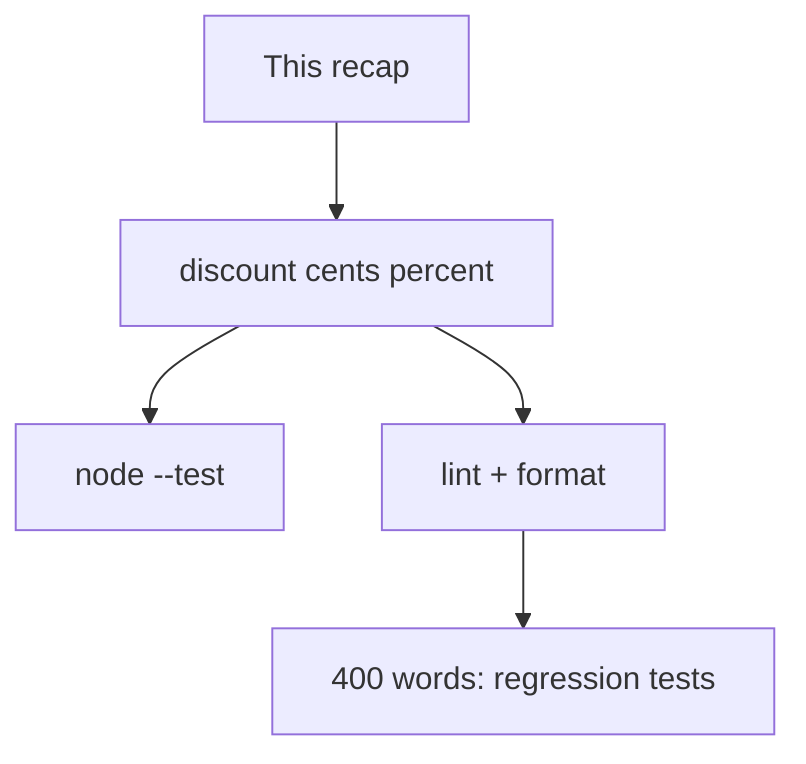
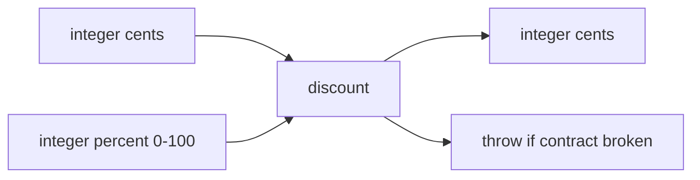

# Month 4 · Week 3 · Day 6
# Independent: Testable Mini-Module

**Program:** Full-Stack Mastery · 18 months  
**Phase:** 1 — Foundations  
**Month index:** [../../README.md](../../README.md)  
**Week 3:** [1](day-01.md) · [2](day-02.md) · [3](day-03.md) · [4](day-04.md) · [5](day-05.md) · Day 6 (today) · [7](day-07.md)  
**Week rhythm today:** Independent project work  
**Study time:** 3–4 focused hours  
**Machine today:** Windows PowerShell, Node.js 20+  
**Days 1–5 closed.** Repair from this recap.

Today is a **new** module, not a rename of `tasks.js`. Integer money, throws, tests, lint, format, and an essay that will matter on the gate: why a **regression** test is not a screenshot.

---

## How to read this chapter

The recap below **is** the lesson. Build `price.js` from these pages. Do not paste Day 4 tasks and change `priority` to `percent`.



Stuck 25 minutes: Week 3 Days 1–2 and 4 in this textbook only. Then close them and finish.

---

## Complete explanation

Arrange / act / assert. Pure functions. Inject storage. `node --test`. Prettier formats; ESLint catches `==`, unused names, leftover `debugger`. Breakpoints show Scope and the call stack. Do not commit `node_modules`.

**Unit:** one function, no network, no DOM. **Integration:** a few modules, still fake I/O. **Manual:** clicking. The gate will demand **regression** unit tests: they were red on the bug, green after the fix.

**Testable design:** the function under test is `export`ed. The page (if any) calls it. `discount` does not read the DOM.

**Money:** `0.1 + 0.2 !== 0.3` in IEEE floats. Store **integer cents**. `discount(cents, percent)` computes a new integer. Do not pass `"10.99"` dollars as a float and hope.

**Throws:** invalid input is a **contract**, not a `NaN` you hope the UI notices. `assert.throws` is the claim.

**Prettier** `--write` / `--check`. **ESLint** `eqeqeq`, `no-unused-vars`, `no-debugger`, `eslint-config-prettier` last.

**Wrong belief:** “I’ll screenshot the green terminal for the gate.”  
**Correct:** a screenshot cannot fail when the bug returns. A test can.

**Wrong belief:** “Discount can use `Math.round(cents * (1 - percent / 100))` with floats and that’s fine.”  
**Correct:** keep cents as integers; multiply carefully (see Challenge 1). Document rounding in one sentence.

**Wrong belief:** “Money in JS should be floats because dollars have decimals.”  
**Correct:** display dollars by dividing cents at the **edge** (`(cents / 100).toFixed(2)` is a later UI choice). The core stays integers.



Worked contract (you may use this table in tests):

| cents | percent | result (if you floor) |
|---|---|---|
| 1000 | 0 | 1000 |
| 1000 | 100 | 0 |
| 1000 | 10 | 900 |

Pick **floor** or **round** and **stick**. Tests must match. `discount(1, 50)` is a rounding edge — write it down.

Worked throw: `discount("100", 10)` must throw. `Number.isInteger("100")` is false. If you `Number()` first, you built `parseCents`, a different function. Today, throw.

---

## Office hours — coerced strings, `--write` without `--check`, and essays that never say red→green

**Silent `Number("100")`.** Tests pass because you converted. The contract was integers. A form can send `"100"` later; conversion belongs at the **edge**, not inside `discount`. Throw today.

**`format` but no `format:check`.** CI (and Day 7) cannot fail a dirty file if the only script rewrites it. Add `--check`. Fire-drill: extra blank line, `format:check` red, `format` write, check green.

**Teach-back is 120 words.** “Tests are good. Screenshots are bad.” Tell a story: a filter returns, the PNG in your folder still looks like Tuesday, `npm test` goes red. 400 is a floor.

**Opened the gate fixture.** Stop. Close it. Write generally: “a filter that hides every row,” “a sort that mutates the only copy.” Week 4 is the copy.

**`node_modules` in git status.** `.gitignore`. Do not `git add .` blindly. Lockfile **is** committed.

---

## Today's contract

**Today's gate**

> `discount` rejects non-integers and out-of-range percent, tests prove it, lint/format are clean, and the essay explains regression tests without quoting this file.

---

## Time box

| Block | Minutes | Work |
|---|---|---|
| A | 20 | Speak recap |
| B | 90 | Challenges 1–2 |
| C | 50 | Teach-back |
| D | 20 | Git |

---

# Challenge 1

`price.js`: `discount(cents, percent)` — integers only; throw if not integers or percent not 0–100. Tests including throws. No floating `0.1 + 0.2` money (use integer cents).

Folder: `~\fullstack-lab\month-04\week-03\independent\`.

Suggested implementation shape (you still type it):

```js
export function discount(cents, percent) {
  if (!Number.isInteger(cents) || cents < 0) {
    throw new Error("invalid cents");
  }
  if (!Number.isInteger(percent) || percent < 0 || percent > 100) {
    throw new Error("invalid percent");
  }
  return Math.floor((cents * (100 - percent)) / 100);
}
```

If you prefer `Math.round`, change the tests, not the silence. **Do not** use `cents * (1 - percent / 100)` as the only formula without an integer story — `percent / 100` is a float.

Tests (sentence names):

- `0%` returns same cents  
- `100%` returns `0`  
- invalid cents throws (`"10"`, `1.5`, `-1`)  
- invalid percent throws (`-1`, `101`, `"10"`)  
- a documented rounding example  

`assert.throws(() => discount("100", 10))`. If it does not throw, `Number.isInteger("100")` is false — good — unless you coerced with `==` or `Number()` silently. Do not coerce. Throw.

No `document`. No `fetch`. Node.js 20+. `"type": "module"`.

```powershell
cd ~\fullstack-lab\month-04\week-03\independent
node --test
```

---

# Challenge 2

Lint + format this folder. Scripts in `package.json`.

Same Day 2/4 ritual: `"type": "module"`, `test`, `lint`, `format`, `format:check`. `eqeqeq` on. `eslint-config-prettier` last. `npm install` in this folder (or document a parent). `node_modules` gitignored. Lockfile committed.

`README.md` in `independent/`: the PowerShell commands.

Optional: a breakpoint in `discount` and two lines in `SCOPE.txt`. Not required if Day 4 already proved you can pause; still useful.

---

# Challenge 3 — Teach-back

400 words: why the gate demands a **regression** test, not a screenshot.

Must include, in **your** words:

1. What red-then-green means (the test failed on the bug, passed after the fix).  
2. Why a screenshot of a green UI cannot catch the bug coming back next week.  
3. Why the test must target a **function** (or a parse of a string), not “the page looked fine.”  
4. One sentence on lint/format: they are not regression tests for filter/sort, but they catch `==` and leftover `debugger`.

Do not paste this chapter. Close it, then write `teachback.md`.

**Lint scripts reminder:** `"lint": "eslint ."` plus `npx eslint .` if PATH is messy on Windows. `format:check` must fail on a file with extra blank lines you add on purpose, then pass after `format`. That fire drill can be three minutes; do it once so Day 7 review is not the first time `--check` goes red.

If you have not seen the gate app yet, write generally: “a filter that hides every row,” “a sort that mutates the only copy of the list,” “JSON.parse that white-screens.” Do **not** open `fixtures/broken-priority-list/` to hunt causes. Week 4 is that work.

`teachback.md` first line: word count. If under 400, keep writing. Close this file first.

Challenge 2 without `format:check` is incomplete. `--write` only is not the CI-style script.

```powershell
git add month-04/week-03/independent
git commit -m "Independent discount() with tests, lint, format."
```

---

# Integer arithmetic (why this challenge exists)

`cents * (100 - percent)` is an integer if both inputs are integers. Then `/ 100` in JavaScript is a **float divide**. `Math.floor` of that is a chosen policy. `199 * 50 / 100` happens to be exact; do not assume every pair is. Write one test you computed by hand on paper.

Do not use `toFixed` and parse it back. That is a string detour.

**Throws table (fill with your messages):**

| Call | Throws? |
|---|---|
| `discount(100, 10)` | no |
| `discount(100, 0)` | no |
| `discount(100, 100)` | no |
| `discount(-1, 10)` | yes |
| `discount(100, -1)` | yes |
| `discount(100, 101)` | yes |
| `discount(10.5, 10)` | yes |
| `discount("100", 10)` | yes |
| `discount(100, "10")` | yes |

If a row does not throw, you coerced. `Number("100")` is 100 — that is a different function (`parseCents`). Today, throw.

Teach-back length: 400 words is a floor. If you finish in 120 words, you did not explain red→green. Tell a story: a filter bug returns, the screenshot still looks like last Tuesday’s folder, the test goes red on `npm test`.

---

## Worked walkthrough — paper arithmetic then a test

Pick `discount(199, 50)` with **floor**: `199 * 50 = 9950`, `/ 100` → `99.5`, floor → `99`. Write that on paper. Then `assert.equal(discount(199, 50), 99)` if you floored. If you `round`, the assert is `100` — document it. Do not copy a number you did not compute.

**Throw rows you must not skip:** `discount("100", 10)`, `discount(100, "10")`, `discount(10.5, 10)`, `discount(-1, 10)`, `discount(100, 101)`. Sentence names. `assert.throws` with a message regex is enough.

**Format fire drill (three minutes).** Add two extra blank lines at the end of `price.js`. `npm run format:check` must fail. `npm run format`. Check passes. If check never fails, the script is `--write` or you are not in this folder.

**Teach-back story spine.** A filter helper returns the wrong rows. You screenshot a green UI on Tuesday. Wednesday the helper regresses. The PNG cannot fail CI. A test that was **red on the bug** goes red again. Lint would not have caught the filter. `eqeqeq` might catch `==`. Leftover `debugger` is lint, not a regression test for sort. Write those distinctions in prose.

Windows:

```powershell
cd ~\fullstack-lab\month-04\week-03\independent
npm test
npm run lint
npm run format:check
```

Node.js 20+. Do not open `fixtures/broken-priority-list/`.

---

## Definition of done

- [ ] `discount` tests green including throws
- [ ] Integer cents only; rounding documented
- [ ] Lint + format:check green
- [ ] Teach-back ≥ 400 words on regression tests
- [ ] No `node_modules` in git
- [ ] Commit exists

---

## Stalls and repair — coerced cents, format:check that never fails, short essays

If `discount("100", 10)` does not throw, you `Number()`’d. That is `parseCents`, a different function. Throw today. Fill the throws table with **your** messages.

If `discount(199, 50)` is a number you guessed, compute on paper with your floor/round policy. Write that test. Do not `toFixed` and parse back.

If `format:check` never goes red, the script is `--write` or you are in the wrong folder. Extra blank lines, check fails, `format`, check passes. Three minutes. CI-style.

If `teachback.md` is under 400 words, tell red→green: the test failed on the bug, passed after the fix. A screenshot cannot fail next week. The test targets a **function**, not “the page looked fine.” Lint is not a filter regression test; it catches `==` and `debugger`.

If you opened `fixtures/broken-priority-list/`, close it. Write generally. Week 4 is the copy.

If `node_modules` is in `git status`, `.gitignore`. Commit the lockfile. README has PowerShell `cd` and Node 20+.

Windows:

```powershell
cd ~\fullstack-lab\month-04\week-03\independent
npm test
npm run lint
npm run format:check
```

---

## Last forty minutes

Paper: `discount(199, 50)` under **your** floor or round policy. Test matches. Throws table: strings, `10.5`, `-1`, `101` all throw. No `Number("100")` inside `discount`. Integer cents. Display dollars later at the edge.

Fire-drill `format:check` if you skipped it. Extra blank lines, red, `format`, green. `eslint-config-prettier` last. `eqeqeq` on. `node_modules` gitignored. Lockfile committed. README has PowerShell `cd` and Node 20+.

`teachback.md` first line: word count ≥ 400. Red→green story. Screenshot cannot fail CI. Function under test, not the page. Lint ≠ regression for filter. Close this file. Do not open the gate fixture.

Optional: two lines in `SCOPE.txt` from a pause inside `discount`. Not required if Day 4 already proved pause; still useful.

Commit `month-04/week-03/independent`. Tomorrow’s mini is `clamp` from the review recap.

---

## Worked checkpoint — integer cents, not dollar floats

`discount(cents, percent)` takes integers. `discount("100", 10)` throws. `discount(10.5, 10)` throws. `discount(100, -1)` throws. `discount(100, 101)` throws. Fill **your** messages in the throws table — the test asserts the throw, not a vibe.

`discount(199, 50)` is not “about a dollar.” Pick floor or round **once**. Compute on paper. Write that number in the test. Do not `toFixed` and parse back — that is float money with extra steps.

Display dollars at the edge: `(cents / 100).toFixed(2)` in a probe or README example, not inside `discount`.

Fire-drill: extra blank lines in a file, `npm run format:check` red, `npm run format` (or `format:write`), check green. If check never fails, the script is `--write` or you are in the wrong folder.

> **Wrong belief:** “`parseCents` and `discount` can share `Number()` because both touch money.”  
> **Correct:** `parseCents` is a boundary that may parse a string. `discount` is integer arithmetic. Mixing them is how `"100"` becomes a silent A-student grade in last week’s costume.

`teachback.md` ≥ 400 words: a test went red on a real bug, then green after the fix. A screenshot cannot fail next week. Lint is not a filter regression test. Do not open `fixtures/broken-priority-list/`. Windows: `npm test`, `npm run lint`, `npm run format:check` in `~\fullstack-lab\month-04\week-03\independent`.

---

## Optional review links

Testing and quality are explained in this chapter.

- [Node: `Number.isInteger`](https://developer.mozilla.org/en-US/docs/Web/JavaScript/Reference/Global_Objects/Number/isInteger)
- [Node: assert](https://nodejs.org/api/assert.html)

---

## Tomorrow

Week review: speak the synthesis, `clamp` mini-build, three debug stories. Then Week 4 Git depth.

Days 1–5 stay closed during tomorrow’s mini-build. Repair from that recap file. Do not open the gate fixture.
