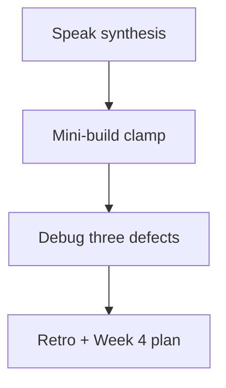
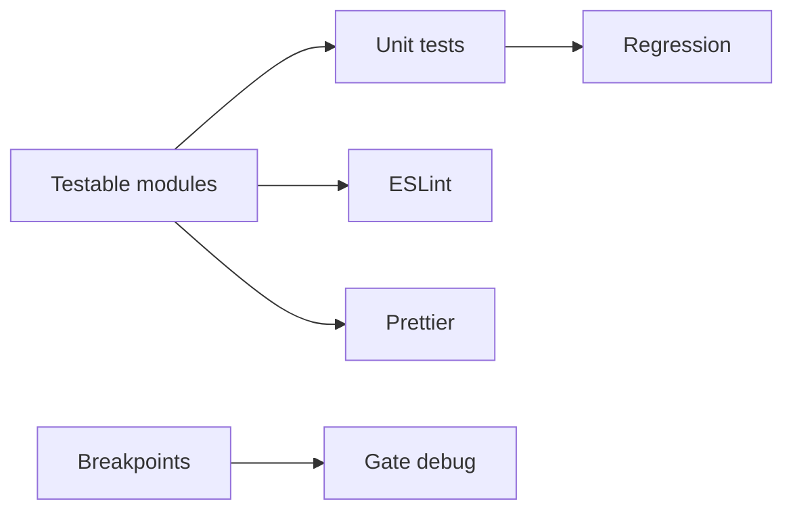

# Month 4 · Week 3 · Day 7
# Week Review — Tests and Quality

**Program:** Full-Stack Mastery · 18 months  
**Phase:** 1 — Foundations  
**Month index:** [../../README.md](../../README.md)  
**Week 3:** [1](day-01.md) · [2](day-02.md) · [3](day-03.md) · [4](day-04.md) · [5](day-05.md) · [6](day-06.md) · Day 7 (today)  
**Week rhythm today:** Review, repair, plan Week 4  
**Study time:** 3–4 focused hours  
**Machine today:** Windows PowerShell, Node.js 20+

Do not start Week 4 because the calendar moved. A branch without tests is how the gate app “looks fixed” until refresh. This file **teaches** the week again, then you prove it.

Textbook Days 1–6 stay **closed** during the mini-build and debug blocks. Repair from **this** synthesis.

---

## How to read this chapter

This is a **closed-book teaching day**. The synthesis **is** the Week 3 lesson.



If a topic is under two true sentences when you speak, it will show up as a weak gate row next week.

---

## Week synthesis



- Unit: one function, fake I/O, strict asserts.
- Design: edge vs core.
- Lint ≠ format.
- Breakpoint > log for `this` and closures.
- `node_modules` ignored; lockfile committed.

Closed-book: speak the table from Day 1.

Mini: `clamp(n, min, max)` + tests + lint clean.

Debug: test that never failed (useless); `==` in filter; `debugger` in PR.

Retro. **Week 4:** branches, merge, conflicts, **pull requests**, rebase as a concept, revert — then the **broken priority list**.

---

## Today's contract

**Today's gate**

> I can teach arrange/act/assert, testable edges, ESLint vs Prettier, and the Scope pane from this file, and I shipped `clamp` with tests and lint.

---

## Time box

| Block | Minutes | Work |
|---|---|---|
| 1 | 35 | Speak the synthesis (sections below) |
| 2 | 50 | Mini-build `clamp` |
| 3 | 30 | Debug three stories |
| 4 | 20 | Repair one weak Day 4/6 test name |
| 5 | 20 | Re-run lint/test on a known folder |
| 6 | 15 | Design: why the page is not the suite |
| 7 | 20 | Retro + Week 4 plan |

---

# Complete explanation — quality you must still own

## 1. Anatomy

Arrange builds input. Act calls **one** function. Assert compares expected to actual and throws. `node --test` plus `node:assert/strict`. One behavior per test **name**. `assert.equal` is `===`. `deepEqual` for objects/arrays. `assert.throws` / `assert.rejects` for failures you **mean**.

A test named `"it works"` is a missing comment. A test that only asserts `ok(true)` never failed and never will.

## 2. Unit vs not

**Unit:** no DOM, no live network, no real clock unless you inject `now`. **Integration:** several of *your* modules, still fakes. **E2E / manual:** browser. The Month 4 product gate wants regression **unit** tests for logic plus a breakpoint write-up when the DOM is the only way to see a bug.

## 3. Testable design

Hard: parse, sort, paint, and storage in one click handler. Easy: `export function filterOpen(list)` and a thin `main.js`. Injection: `load(storage, key)` with `{ getItem, setItem }`. `memoryStorage()` in tests. `localStorage` only in the page.

Pure helpers return new arrays when the contract is “do not destroy the caller’s order.” `sort` mutates — copy first (`[...list].sort(...)`) if that is the claim.

**Wrong belief:** “I’ll unit-test `innerHTML`.”  
**Correct:** Node has no `ul`. Assert data. Titles still go through `textContent` on the page.

## 4. Formatter vs linter

**Prettier** reprints layout. `--write` changes files. `--check` fails if it *would* change files. **ESLint** reports mistakes: `eqeqeq`, unused vars, `no-debugger`, recommended. They fight if ESLint also owns indent/quotes — `eslint-config-prettier` **last** turns those ESLint rules off. Two scripts. Two jobs.

**Wrong belief:** “Format on save is lint.”  
**Correct:** Prettier will happily print `==`.

## 5. Breakpoints and Scope

Pause on a **line**. **Local** = this call. **Closure** = outer bindings still needed. **Module** = file top-level. **`this`** = call site (arrows inherit). **Call stack** = Week 2’s stack made visible. Step over / into / out. Conditional breakpoint to skip noise. `debugger;` is the same pause in source — delete it; `no-debugger` is the net. Pause on exceptions when the screen goes white. Logs lie about *when*. Scope does not.

## 6. Regression (preview of Week 4)

A regression test is **false on the bug** and **true after the fix**. If you only fix the UI and then write a test that already passes, you have a souvenir. Paste the failing assertion once into `DEBUG.md` next week. This week you practiced the **shape** on `letter`, `discount`, and `tasks`.

## 7. Worked mini-build (`clamp`)

`clamp(n, min, max)` returns `n` limited to `[min, max]`. If `min > max`, throw. If any argument is not a finite number, throw. Tests: in range unchanged; below min → min; above max → max; throws.

```js
export function clamp(n, min, max) {
  if (![n, min, max].every(Number.isFinite)) {
    throw new Error("invalid");
  }
  if (min > max) {
    throw new Error("invalid range");
  }
  if (n < min) return min;
  if (n > max) return max;
  return n;
}
```

Type it yourself. Tests with sentence names. Lint clean. Folder `~\fullstack-lab\month-04\week-03\review\`. Node.js 20+. `"type": "module"`.

Worked extras: `clamp(NaN, 0, 1)` throws (`Number.isFinite(NaN)` is false). `clamp(2, 5, 1)` throws (min > max). `clamp("5", 0, 10)` throws if you did not coerce — throw. Do not `Number("5")` inside `clamp`.

## 8. Debug stories, fully

**Useless test.** `test("clamp", () => { clamp(1, 0, 2); })` — no assert. Always green. The runner is not a magician. Fix: assert the return value.

**`==` in filter.** `item.done == false` is true for `0` and `""` as well as `false`. `eqeqeq` should fail the lint script. A typed test (`done: 0`) documents whether you meant boolean. Restore `===`. Convert in the open if a string arrived from a form.

**`debugger` in a PR.** Reviewers pause; CI (later) fails `no-debugger`; you look like you shipped a personal breakpoint. Delete. Use a DevTools line breakpoint instead.

Speak the synthesis.

If speaking took under five minutes, you skipped Scope or lint ≠ format. Speak again with the table: unit / injection / Prettier / ESLint / breakpoint / regression.

**Wrong belief:** “Week review is a rest day.”  
**Correct:** if `clamp` has no `assert.throws`, you did not review throws. If `DEBUG.txt` is three bullet words, you did not review the stories.

---

## Office hours — always-green tests, Scope skipped, and retro that skips the branch

**No `assert.throws`.** `clamp(NaN, 0, 1)` returns `NaN` and a later UI shows a blank. The throw is the contract. Write it.

**`BREAK` / `CLAMP.txt` says “I logged n`.** Pause. Node inspect or a tiny HTTP page. Local: `n`. If `n` is missing, you paused in the runner.

**Retro: “I’ll edit main, PRs are for teams.”** Week 4’s first move is `git switch -c`. Write that sentence in `RETRO.md` even if you work solo.

**Vague test renamed in your head, not in git.** The review block asked for a committed rename. `git diff` should show a sentence name.

---

# Mini-build

`clamp(n, min, max)` + tests + lint clean. `"type": "module"`. `node --test`. No `==`. No `debugger`.

Also: `CLAMP.txt` — one pause in `clamp` (Node inspect or tiny page). What was `n` in Scope?

```powershell
cd ~\fullstack-lab\month-04\week-03\review
node --test
```

---

# Debug (write the cause, from this week)

- test that never failed (useless)
- `==` in filter
- `debugger` in PR

Full sentences in `DEBUG.txt`. Include what you would **observe** (always green, lint red, surprise pause).

---

# Review, tests, design

One committed fix: a vague test name from this week renamed to a sentence. Re-run `npm test` / `npm run lint` on Day 4 or independent.

Design paragraph (`DESIGN.txt`): why the **array** is the suite’s subject and the DOM is a view. Week 4 will copy a broken app — you will still extract or target functions, not screenshot the list.

Retro (`RETRO.md`): solid / weak / hours. What you will do first on a branch next week (spoiler: **not** edit `main` directly).

**Week 4:** branches, merge, conflicts, **pull requests**, rebase as a concept, revert — then the **broken priority list**. Do not open the fixture today “to get ahead.”

```powershell
git add month-04/week-03/review
git commit -m "Record Week 3 testing and quality review."
```

---

## Worked walkthrough — `clamp` tests that prove throws

```js
test("clamp leaves in-range n unchanged", () => {
  assert.equal(clamp(5, 0, 10), 5);
});
test("clamp raises below min", () => {
  assert.equal(clamp(-1, 0, 10), 0);
});
test("clamp lowers above max", () => {
  assert.equal(clamp(99, 0, 10), 10);
});
test("clamp throws on NaN", () => {
  assert.throws(() => clamp(NaN, 0, 1), { message: /invalid/ });
});
test("clamp throws when min > max", () => {
  assert.throws(() => clamp(2, 5, 1), { message: /invalid/ });
});
```

If `NaN` returns `NaN`, you used `<` without `Number.isFinite`. `NaN < 0` is false; `NaN > 10` is false; you return `n`. That is why the throw exists.

**CLAMP.txt.** Pause inside `clamp(5, 0, 10)`. Local: `n` is `5`, `min` is `0`, `max` is `10`. If those names are missing, you paused after the function returned. Node inspect or HTTP page — not only a log.

**DEBUG useless test.** Observation: always green. Mechanism: no assert. Fix: `assert.equal(clamp(1, 0, 2), 1)`. Write that as a paragraph, not three words.

Windows: `cd ~\fullstack-lab\month-04\week-03\review` then `node --test`. Node.js 20+. Do not copy the gate fixture tonight.

---

## Mini extras you still owe

`RETRO.md` prompts: What was still foggy after speaking — Scope, `eqeqeq`, or injection? How many hours this week? What will you do first on Monday (branch, not `main`)?

Mini-build extras: `clamp(NaN, 0, 1)` throws (`Number.isFinite(NaN)` is false). `clamp(2, 5, 1)` throws (min > max). Write both.

---

## Week 3 definition of done

- [ ] Synthesis spoken (anatomy, design, lint ≠ format, Scope)
- [ ] `clamp` tests + lint green
- [ ] Debug three stories in `DEBUG.txt`
- [ ] Retro does not skip “branch first” for Week 4
- [ ] Commit exists

---

## Stalls and repair — NaN through clamp, skipped pause, retro that edits main

If `clamp(NaN, 0, 1)` returns `NaN`, `<` and `>` are both false for `NaN`. `Number.isFinite` then throw. Write that test. `clamp("5", 0, 10)` should throw if you did not coerce — throw, do not `Number` inside `clamp`.

If `CLAMP.txt` is a log of `n`, pause. Local should show `n`, `min`, `max`. Node inspect or tiny HTTP page.

If DEBUG “useless test” is three words, write: observation always green; no assert; fix `assert.equal`. `==` in filter: `0` and `""` match `== false`; `eqeqeq`; restore `===`. `debugger` in a PR: reviewers pause; delete; use a DevTools line breakpoint.

If you did not rename a vague test in git, the review block is incomplete. `git diff` shows a sentence name.

If `RETRO.md` says PRs are for teams, rewrite: first move next week is `git switch -c`, not edit `main`. Do not copy the gate fixture tonight. Day 4 of Week 4 is the copy. Day 1 of Week 4 is branches.

Windows: `cd ~\fullstack-lab\month-04\week-03\review` then `node --test`. Node.js 20+. Speak lint ≠ format and Scope before you call the week done.

---

## Last forty minutes

`clamp` tests: in range, below min, above max, `NaN` throws, min > max throws. `CLAMP.txt` from a real pause. No `==`. No `debugger`. `"type": "module"`.

DEBUG three stories in full sentences. One test name renamed in git. Re-run lint/test on Day 4 or independent. `DESIGN.txt`: array is the suite, DOM is the view. `RETRO.md`: branch first, not `main`. Do not copy the fixture tonight.

Speak: arrange/act/assert; injection; Prettier vs ESLint; Scope Local vs Closure; regression is red then green.

Commit `month-04/week-03/review`. Week 4 Day 1 is the graph. Week 4 Day 4 is the copy.

---

## Worked checkpoint — three DEBUG stories as paragraphs

**Useless test.** Observation: `node --test` is always green. Mechanism: you called `clamp` and never `assert`. Fix: `assert.equal(clamp(1, 0, 2), 1)` and a throws test for `NaN`. Rename one vague test in git so `git diff` shows a sentence.

**`==` in a filter.** Observation: `0` and `""` disappear from a list you meant to keep. Mechanism: `== false` (or `== null` you did not intend). Fix: `eqeqeq`; restore `===`. Prettier still prints the file either way — format is not lint.

**`debugger` in a PR.** Observation: a reviewer (or you next month) pauses in production code. Mechanism: the keyword is source. Fix: delete it; use a DevTools **line** breakpoint. `CLAMP.txt` records Scope from a real pause: `n`, `min`, `max` Local.

`clamp(NaN, 0, 1)` throws (`Number.isFinite`). `clamp(2, 5, 1)` throws (min > max). `clamp("5", 0, 10)` throws if you refuse coerce — throw, do not `Number` inside `clamp`.

> **Wrong belief:** “I’ll unit-test `document.querySelector` because clamp is too small.”  
> **Correct:** Node has no `ul`. Assert numbers. The DOM still uses `textContent` on the page. `DESIGN.txt` says the array is the suite.

`RETRO.md`: first move next week is `git switch -c`, not edit `main`. Do not copy the gate fixture tonight. Windows: `cd ~\fullstack-lab\month-04\week-03\review` then `node --test`. Node.js 20+.

If you finish early, re-run lint and test on Day 4 or independent — the review is not a separate universe. Speak arrange / act / assert, injection, Prettier vs ESLint, Scope Local vs Closure, and “regression is red then green” without this file open.

---

## Optional review links

Week 3 is explained in this chapter. These pages are for later checking, not for first learning.

- [Node: test runner](https://nodejs.org/api/test.html)
- [ESLint: configuration](https://eslint.org/docs/latest/use/configure/)
- [Chrome: breakpoints](https://developer.chrome.com/docs/devtools/javascript/breakpoints)

---

## Tomorrow

Week 4 Day 1: history is a **graph**. `main` is a name. You will create a branch on purpose. `DEBUG.txt` uses full sentences, not three-word labels. `clamp` without throws tests is an incomplete mini-build. Re-run `npm test` in `review/` before you call the week done.

Do not copy the gate fixture tonight. Week 4 Day 4 is the copy. Week 4 Day 1 is branches only.

`DESIGN.txt` is a paragraph, not a slogan.
