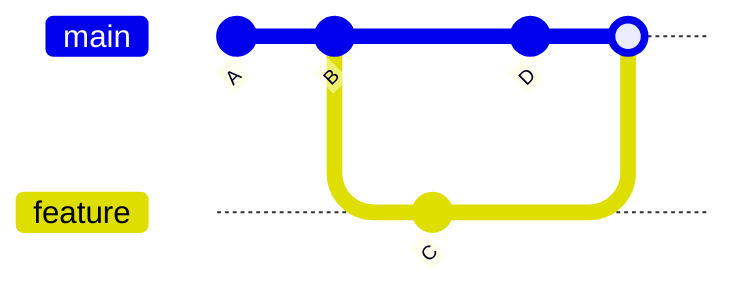
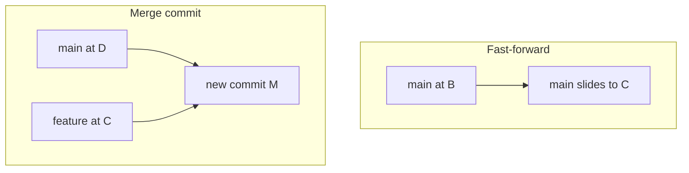
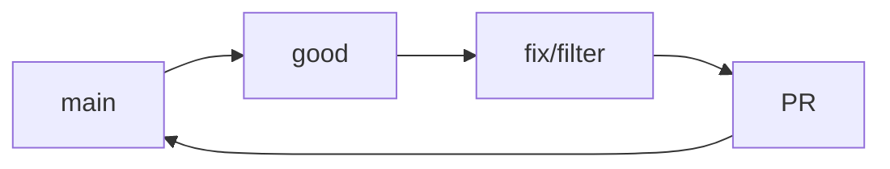

# Month 4 · Week 4 · Day 1
# Branches and Merges

**Program:** Full-Stack Mastery · 18 months  
**Phase:** 1 — Foundations  
**Month index:** [../../README.md](../../README.md)  
**Week 4:** Day 1 (today) · [2](day-02.md) · [3](day-03.md) · [4](day-04.md) · [5](day-05.md) · [6](day-06.md) · [7](day-07.md)  
**Week rhythm today:** Learn + type-along  
**Study time:** 3–4 focused hours  
**Student state:** Week 3 quality ritual works. Today history becomes a **graph**, not a single line.  
**Machine today:** Git on Windows PowerShell. GitHub can wait until Day 2/4.

**This week covers:** branches, merges, conflicts, pull requests, rebase **concept**, revert, commit messages — then the broken-app gate.

Today: what a branch **is**, how `HEAD` moves, fast-forward vs a merge commit, and a lab that proves files can exist on one branch and vanish from the working tree on another. Conflicts are Day 2. Pull requests are practiced on Day 2 and used for real on Day 4. Do not copy the gate fixture today.

---

## How to read this chapter

Git stores **commits**. Each commit is a snapshot plus a pointer to **parent** commit(s). A **branch** is not a copy of the project folder. It is a **movable name** for a commit. `main` is a name. `feature/sort` is a name. `HEAD` is “the name (or commit) I am on.”



After the merge, `main` has a commit whose parents are `D` and `C`. That is a **graph**, not a stack of USB sticks.

Read until you can say “a branch is a name” without flinching. Then type the lab. Optional links at the end are Pro Git for later checking — not the first lesson.

---

## Today's contract

By the end of this day you will be able to:

1. Explain a **branch** as a movable name for a commit.
2. Create, switch, list, and delete branches.
3. **Merge** a feature into `main` with a merge commit (default) or a fast-forward when `main` has not moved.
4. Read `git log --oneline --graph --decorate`.
5. Explain **detached HEAD** and how to get out.

**Today's gate**

> `main` is a name. `feature/sort` is a name. Both point at commits. Merging *records* a new commit with two parents (usually). You do not copy files by hand between folders to “make a branch.”

If you still think a branch is “a second directory on disk,” stay here.

---

## Time box

| Block | Minutes | Work |
|---|---|---|
| A | 55 | Theory: graph, HEAD, commands, fast-forward vs merge commit |
| B | 50 | Lab: create branch, file appears/disappears, merge |
| C | 40 | Graph notes + optional delete |
| D | 20 | Git commit for notes (if needed) |
| E | 15 | Recall |

---

# Theory (complete)

## 1. Commits form a graph

Each commit has **parents**. `main` is a **pointer**. `HEAD` is “where I am.”

When you `git commit`, Git:

1. Stores a snapshot (plus metadata: author, message, time).  
2. Points the new commit at the **current** commit as parent.  
3. Moves the **current branch name** to the new commit.  
4. `HEAD` still points at that branch name (usually).

You do not “save the branch.” You create a commit. The branch name **slides** forward.

**Why branches:** isolate the gate fix from unfinished experiments. Reviewers look at a **diff against `main`**, not your whole laptop.

**Wrong belief:** “A branch is a copy of all the files in another folder.”  
**Correct:** all branches share the object database. Checking out a branch **updates your working tree** to match that snapshot. That is why `BRANCH.txt` can vanish when you `switch main` — the file was never on `main`.

Worked picture:

```text
main ──► B
         ▲
         │
HEAD ────┘   (you are on main, at B)

git switch -c feature/sort

main ──► B ◄── feature/sort ◄── HEAD
```

Two names, **same** commit. Then you commit on `feature/sort`:

```text
main ──► B
         │
         C ◄── feature/sort ◄── HEAD
```

`main` still names `B`. Your new work is only reachable from `feature/sort` until you merge.

---

## 2. Commands (meanings, not a cheat sheet dump)

| Command | What it does |
|---|---|
| `git branch` | List names; `*` is current |
| `git branch feature/sort` | Create a name at **current commit**; does not switch |
| `git switch feature/sort` | Move HEAD to that branch (Git 2.23+). Older: `git checkout feature/sort` |
| `git switch -c feature/sort` | Create **and** switch |
| `git merge feature/sort` | While on `main`: bring feature’s commits in |
| `git branch -d feature/sort` | Delete the name after it is merged (`-D` force — avoid unless you mean to throw work away) |
| `git log --oneline --graph --decorate --all` | Draw the graph |

**`switch` vs `checkout`:** `switch` is the modern “change branch” command. `checkout` also restores files (easy to mix up). This course uses `git switch`.

**Detached HEAD:** you checked out a **commit hash**, not a branch. Commits you make can get lost when you switch away. `git switch main` to recover. If you meant a branch, create one: `git switch -c recover`.

**Wrong belief:** “`git branch` switches.”  
**Correct:** `git branch name` only creates the name. `git switch` moves you.

`git status` always: dirty files can block a switch. Commit or stash (stash is optional this month; prefer commit on a practice branch).

---

## 3. Fast-forward vs merge commit

If `main` has not moved since you branched, Git can just **slide** `main` to your commit (fast-forward). No extra merge commit.

```text
Before:  main ► A—B     feature ► A—B—C
After FF:       A—B—C ◄── main, feature
```

If `main` gained commits, Git creates a **merge commit** with two parents (unless you rebase — tomorrow as a **concept**).

```text
main:    A—B—D
feature: A—B—C
merge:   A—B—D—M
              ↘ C ↗     (M has parents D and C)
```

Neither is morally superior. GitHub PRs often show a merge commit or “squash.” You will use the GitHub UI later. Locally today, default `git merge` is enough.

**`git merge --no-ff`** forces a merge commit even when a fast-forward is possible. Some teams like the “this feature joined here” knot. This course does not require it. Know the name.

**Wrong belief:** “Merge copies files from the other folder.”  
**Correct:** merge joins **histories**. Git finds a common ancestor, diffs both sides, and applies both changes. When both sides touch the **same lines**, Git stops — that is a **conflict** (Day 2).



---

## 4. Rules for this course

- Do not commit on `main` for the gate fix. Branch first.
- Small branch names: `fix/sort-mutation`, `fix/priority-filter`.
- `main` stays green: tests pass before merge.
- Do not rebase published `main` (Day 2). Do not `push --force` to `main` (never in this course).



Names: `fix/...` for bugs, `docs/...` for notes, `practice/...` for today’s lab. Spaces in branch names are pain on Windows. Use hyphens.

**`origin`:** a **remote** name (usually GitHub). `git push -u origin feature/sort` publishes the **name** and its commits. Until you push, the branch is local only. Day 2/4 need a remote for a real PR. Today, local is enough.

---

## 5. What merge does not do

- It does not run your tests. You run `npm test`.  
- It does not review commit messages.  
- It does not delete the feature branch (`-d` is separate).  
- It does not replace `main`’s identity: after merge, `main` points at the new commit; history of `main` still includes the old commits.

**Abort:** if a merge starts and you are lost, `git merge --abort` (only while merging) puts you back. Today’s happy-path lab should not need it. Tomorrow’s conflict lab might.

---

## 6. Reading the graph

```powershell
git log --oneline --graph --decorate --all
```

- `*` is a commit.  
- `/` `\` lines are parent links.  
- Names in parentheses are branches and `HEAD`.  

You are expected to **paste** a graph into `GRAPH.txt` today (no secrets, no tokens). If the graph is a single line, you may have fast-forwarded — that is still a valid graph. Write one sentence: fast-forward or merge commit?

---

# Lab

Work in `fullstack-lab` (you already have history).

```powershell
cd ~\fullstack-lab
git status
git switch -c practice/week4-branch
```

Create `month-04/week-04/day-01/BRANCH.txt` with one sentence: what branch you are on (`git branch`).

Commit. Switch back to `main`:

```powershell
git switch main
```

Confirm `BRANCH.txt` is **gone** from the working tree (it lives on the other branch). Merge:

```powershell
git merge practice/week4-branch
```

Read the log graph. Write `GRAPH.txt`: paste `--oneline --graph` (no secrets).

Optional: `git branch -d practice/week4-branch` after merge.

If `git status` is dirty before you switch, commit on a sensible branch or you will fight Git instead of learning names.

If merge opens an editor for a message, that is a **merge commit**. Save and close. On Windows, if `vim` appears and you did not want it, `Esc` then `:wq` Enter — or set the editor another day; do not panic-kill and leave a half-merge. `git status` will say if you are in a merge.

```powershell
git add month-04/week-04
git commit -m "Week 4 Day 1: branch and merge practice notes."
```

If you already merged the file, this commit is on `main` — fine for notes.

Write `EXPLAIN.txt` (five to eight sentences): branch vs folder copy; HEAD; what you saw when you switched away; fast-forward or merge commit; why the gate fix will not start on `main`.

---

# Block E — Recall

1. What is a branch?  
2. `git branch x` vs `git switch -c x`.  
3. Why a file can vanish on `switch`.  
4. Fast-forward vs two parents.  
5. Detached HEAD in one sentence.

---

## Definition of done

- [ ] Created and switched to `practice/week4-branch`
- [ ] `BRANCH.txt` existed on the branch and was absent on `main` before merge
- [ ] Merged into `main`
- [ ] `GRAPH.txt` has a real `--graph` paste
- [ ] `EXPLAIN.txt` written
- [ ] Notes committed

---

## Optional review links

Branches and merge are explained above.

- [Pro Git: Branches](https://git-scm.com/book/en/v2/Git-Branching-Branches-in-a-Nutshell)
- [git-switch](https://git-scm.com/docs/git-switch)
- [git-merge](https://git-scm.com/docs/git-merge)

---

## Remote names (preview, still today)

`origin` is a convention, not physics. `git remote -v` lists fetch/push URLs. Until you `git push -u origin practice/week4-branch`, GitHub has never heard of that name. Day 2’s PR needs a push. Today, local merge is the lesson.

**Tracking:** after `push -u`, `git status` can say “ahead of origin/main by 1.” That is a **count of commits**, not a moral score. You still run tests.

**Wrong belief:** “If I do not push, I do not have a branch.”  
**Correct:** you have a local name. Remotes are copies of names + objects.

If `fullstack-lab` is not a git repo yet (unlikely), `git init` first — Month 1 already required history. Do not nest `git init` inside `day-01/` unless you mean a throwaway. Today’s lab is the lab repo’s graph.

---

## Tomorrow

Conflicts (both sides edited the same lines), **pull requests**, rebase as an idea you can explain, **revert** (undo by adding a commit), and commit message quality. You will cause a conflict on purpose.
