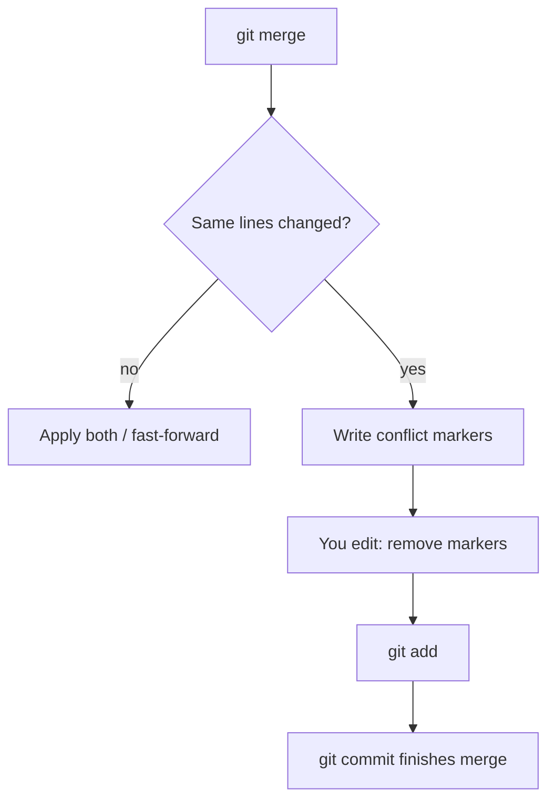
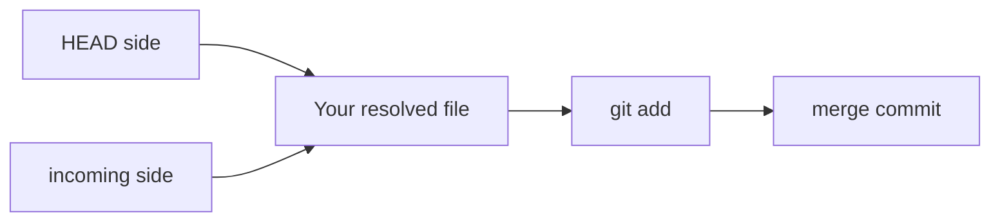
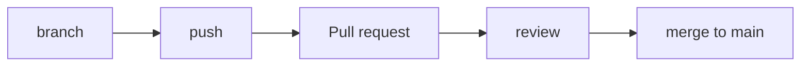

# Month 4 · Week 4 · Day 2
# Merge Conflicts, Pull Requests, Rebase Concept, Revert

**Program:** Full-Stack Mastery · 18 months  
**Phase:** 1 — Foundations  
**Month index:** [../../README.md](../../README.md)  
**Week 4:** [1](day-01.md) · Day 2 (today) · [3](day-03.md) · [4](day-04.md) · [5](day-05.md) · [6](day-06.md) · [7](day-07.md)  
**Week rhythm today:** Exercises + debugging  
**Study time:** 3–4 focused hours  
**Prereq:** Day 1 gate. You can create a branch, switch, and merge a non-conflicting change.

Yesterday Git joined histories when the same lines were **not** in dispute. Today both sides edit the **same lines**. Git refuses to guess. You will also learn what a **pull request** is, what **rebase** does as a **concept** (you will not rewrite shared `main`), what **revert** adds, and how a commit message should read. Day 4 uses PRs on the gate app; today’s PR is a dry run.

---

## How to read this chapter

A **conflict** is not Git breaking. It is Git saying: two histories both changed this hunk; a human must write the result.



Read the marker anatomy until you can draw `<<<<<<<` / `=======` / `>>>>>>>` from memory. Then cause a conflict on purpose. Then the PR / rebase / revert labs. Optional links are for later checking.

---

## Today's contract

By the end of this day you will be able to:

1. Recognize conflict markers and finish a merge (or `merge --abort`).
2. Explain a **PR** as a reviewed request to merge a **pushed** branch.
3. Explain **rebase** as replaying commits onto a new base — and why this course forbids rebasing / force-pushing shared `main`.
4. **Revert** a normal commit by adding an opposite commit.
5. Write an imperative, specific commit message.

**Today's gate**

> A **conflict** means Git will not guess. You edit the file, remove markers, `add`, `commit`. A **PR** is a request to merge a branch with a written explanation. **Rebase** replays commits on another base — you will **explain** it, not rebase published `main`. **Revert** adds a new commit that undoes an old one — it does not rewrite history.

---

## Time box

| Block | Minutes | Work |
|---|---|---|
| A | 50 | Theory: merge guts, markers, PR, rebase, revert, messages |
| B | 45 | Conflict lab |
| C | 45 | PR dry-run + revert |
| D | 20 | Git notes |
| E | 15 | Recall |

---

# Theory (complete)

## 1. What merge is doing (when it works)

Git finds the **merge base** (common ancestor). It diffs `main` vs base and `feature` vs base. It applies both diffs to the base. If the diffs do not overlap on the same lines (and some nearby context), the result is automatic.

**Content conflict:** the same region changed on both sides. Git inserts **markers** and leaves the merge **unfinished**. `git status` will list unmerged paths.

**Wrong belief:** “Conflicts mean I used Git wrong.”  
**Correct:** overlapping work is normal. Unfinished merges you ignore are wrong. Finish or abort.

---

## 2. Merge conflicts

Two branches changed the **same lines**. Git inserts markers:

```text
<<<<<<< HEAD
text from the branch you are on
=======
text from the branch you merged in
>>>>>>> feature/name
```

**You** choose the result (one side, the other, or a blend). Delete **all** marker lines. `git add` the file. `git commit` to finish the merge (Git may open a message “Merge branch …”).

If you panic: `git merge --abort` (only during a merge) returns to pre-merge state.

Conflicts are not shame. They are overlapping work. Talk if it is a team; today you cause one on purpose.

**Wrong belief:** “I’ll keep the markers so I remember both sides.”  
**Correct:** markers are not valid source. ESLint, the browser, and your future self will choke. The result file must be the **intended** text only.

Worked example. `shared.txt` on `main` after merging branch A: `alpha-from-a`. Branch B has `alpha-from-b`. Markers:

```text
<<<<<<< HEAD
alpha-from-a
=======
alpha-from-b
>>>>>>> practice/conflict-b
```

Honest merge for the lab: a sentence that **mentions both sides**, e.g. `alpha from a and b (practice merge)`. Not a silent pick of `a` without reading `b`.

**Binary files** (images) conflict too; Git cannot show hunks. This week you use text. Do not merge by guessing a PNG.

**Already committed merge:** you cannot `merge --abort` after it is done. Tomorrow’s **revert** is the honest undo on published history. `reset --hard` on shared `main` is how you punish teammates. This course does not.



`git diff` during a conflict is noisy. Open the file. Search for `<<<<<<<`. Count them. Each needs a resolution. `git add` that file. Repeat until `git status` is ready to commit.

---

## 3. Pull requests

A **pull request** (GitHub) is:

1. A **branch** pushed to a remote.
2. A web form: title, body, **base** (`main`) ← **compare** (`fix/sort`).
3. A **diff** reviewers read.
4. Optional CI (later months). This month: tests you run locally, then mention that in the body.
5. Merge button (merge commit / squash / rebase) — use **Create a merge commit** or **Squash** as you prefer; know which you clicked.

**Solo:** you still open a PR against your own `main`. That is the gate’s “PR-style workflow.” Review it yourself with the checklist: tests, lint, no `debugger`, README symptoms crossed off.

```powershell
git switch -c fix/example
# ... commits ...
git push -u origin fix/example
```

GitHub: repo → **Compare & pull request**. Or:

```powershell
gh pr create --title "Fix example" --body "What / why / how tested."
```

(`gh` is GitHub CLI; optional. The website is enough. This course allows `gh pr create`.)

**PR body this course expects:**

- What the user saw (symptom)
- What you changed (without a novel)
- How you tested (`node --test`, breakpoint, UI)
- Anything you did **not** fix



**Wrong belief:** “A PR is a fancy `git push`.”  
**Correct:** push publishes the branch. A PR is a **request + diff + conversation** to join it to `main`. Without the write-up, it is a dump.

Day 4 will copy the gate app and open a real PR. Today you practice the **shape** on a five-line markdown file.

If you cannot use GitHub today, write the PR **body** you would have used — still do the local branch. The gate still wants a URL later; do not skip GitHub all month without a written fallback (patch + body).

---

## 4. Rebase — concept (do not rebase `main` you already pushed with teammates)

**Merge** adds a merge commit: “these two histories joined.”

**Rebase** takes your branch’s commits and **replays** them on top of another commit (often updated `main`). History looks linear.

```text
Before:          After rebase onto main:
main:    A—B     main: A—B
feature: A—C     feature: A—B—C'
```

`C'` is a **new** commit (new hash) with the same patch as `C`.

**Danger:** if anyone else already used commit `C`, rewriting it is a lie they must recover from. **Never** `git push --force` to `main`. **Never** rebase commits that exist on a shared `main`.

This month you may rebase a **private** local branch onto `main` if you want (`git switch feature` then `git rebase main`) — optional. You **must** be able to **say** what rebase does. The gate does **not** require you to rebase.

**Squash** on GitHub is related: many commits become one on `main`. Fine for a student PR.

**Wrong belief:** “Rebase is the professional merge.”  
**Correct:** rebase is a rewrite. Professionals rebase **unpublished** topic branches, or they merge. They do not rewrite `main` to look pretty.

If a rebase conflicts, you resolve markers, `git add`, `git rebase --continue` (not `git commit` in the usual way). `git rebase --abort` if you are lost. Optional today. Explain in `REVERT.txt` or `EXPLAIN` if you skip the commands.

**Force-push:** `git push --force` (or `--force-with-lease`) updates the remote to your rewritten hashes. On a **private** branch you own, `--force-with-lease` can be OK. On `main`, it is how you delete teammates’ commits from the tip they pulled. This course: **no force-push to `main`.** Exam debug E will ask why.

---

## 5. Revert

You shipped a bad commit. **Reset** (especially `--hard`) rewrites; do not use it on published `main`.

**Revert** creates a **new** commit that applies the opposite patch:

```powershell
git log --oneline
git revert HEAD
```

For a merge commit, revert needs extra flags — avoid reverting merges this month; revert a normal commit.

`git revert` may conflict. Same conflict skills.

**Wrong belief:** “Revert deletes the commit from history.”  
**Correct:** both commits remain. The new one undoes the file changes. `git log` still shows the mistake and the undo. That is a feature on a shared branch.

`git reset --hard HEAD~1` on a **local unpublished** commit can drop it. If you already pushed `main`, reset+force is the forbidden path. Revert instead.

---

## 6. Commit messages

Bad: `update`, `fix`, `asdf`.

Good: **imperative**, specific, why if not obvious:

```text
Fix priority filter to compare numbers, not strings.

The select element yields "1"; tasks store 1. Strict equality hid every row.
```

(That example is a **teaching template** for message shape. It is **not** a claim about the gate fixture. You will write messages from **your** evidence next week.)

Subject ≤ ~72 characters. Body if the subject is not enough. No emoji required. No novel.

**Wrong belief:** “The PR body replaces commit messages.”  
**Correct:** `git log` is what bisect and blame see. Write both.

---

# Lab

## Conflict (required)

On `main`, add `month-04/week-04/day-02/shared.txt` with line `alpha`. Commit.

```powershell
git switch -c practice/conflict-a
```

Change the line to `alpha-from-a`. Commit.

```powershell
git switch main
git switch -c practice/conflict-b
```

Change the same line to `alpha-from-b`. Commit.

```powershell
git switch main
git merge practice/conflict-a
git merge practice/conflict-b
```

The second merge **conflicts**. Resolve to a sentence that mentions both sides (honest merge). Finish the merge. Write `CONFLICT.txt`: what the markers looked like.

If the second merge does **not** conflict, you did not change the same line (extra spaces, different files). Reset the exercise: same path, same line.

## PR dry-run (required)

Push `fullstack-lab` if not already. Create branch `docs/pr-practice`, add `month-04/week-04/day-02/PR-PRACTICE.md` (five lines), push, **open a PR** on GitHub, paste the URL in `PR-URL.txt`. You may merge it. If you cannot use GitHub today, write the PR **body** you would have used — still do the local branch.

```powershell
gh pr create --title "Docs: PR practice" --body "$(cat <<'EOF'
Practice PR for Month 4 Week 4 Day 2.

How tested: opened the markdown file locally.
EOF
)"
```

PowerShell note: `cat <<'EOF'` is bash. On Windows PowerShell, use:

```powershell
gh pr create --title "Docs: PR practice" --body "Practice PR for Month 4 Week 4 Day 2. How tested: opened the markdown file locally."
```

Or create the PR in the GitHub UI. Either counts.

## Revert (required)

On a practice branch, make a commit that adds `oops.txt`, then `git revert HEAD`. Show `oops.txt` gone in the new commit. `REVERT.txt`: revert vs reset in two sentences.

Also in `REVERT.txt` (or `REBASE.txt`): three sentences on rebase — new hashes, private branch OK, never rewrite shared `main`.

```powershell
git add month-04/week-04
git commit -m "Week 4 Day 2: conflict, PR practice, revert notes."
```

Use a better message if you want; “Week 4 Day 2…” is acceptable for notes. Gate-app commits later must name the **why**.

---

# Block E — Recall

1. What each marker line means.  
2. `merge --abort` vs revert.  
3. Why force-push to `main` is forbidden.  
4. PR vs push.

---

## Definition of done

- [ ] Conflict resolved; markers gone; merge committed
- [ ] `CONFLICT.txt` describes the markers
- [ ] PR opened **or** body written; `PR-URL.txt` or fallback
- [ ] Revert lab: `oops.txt` undone by a new commit
- [ ] Rebase explained in writing (commands optional)
- [ ] Notes committed

---

## Optional review links

Conflicts, PRs, rebase, and revert are explained above.

- [Pro Git: Basic Merging](https://git-scm.com/book/en/v2/Git-Branching-Basic-Branching-and-Merging)
- [Pro Git: rebasing](https://git-scm.com/book/en/v2/Git-Branching-Rebasing)
- [GitHub: about pull requests](https://docs.github.com/en/pull-requests/collaborating-with-pull-requests/proposing-changes-to-your-work-with-pull-requests/about-pull-requests)
- [git-revert](https://git-scm.com/docs/git-revert)

---

## Tomorrow

From memory: a tiny repo, branch, merge, graph paste, six sentences on rebase vs merge vs revert. Then Day 4 copies the gate app.
