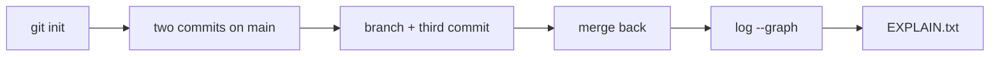
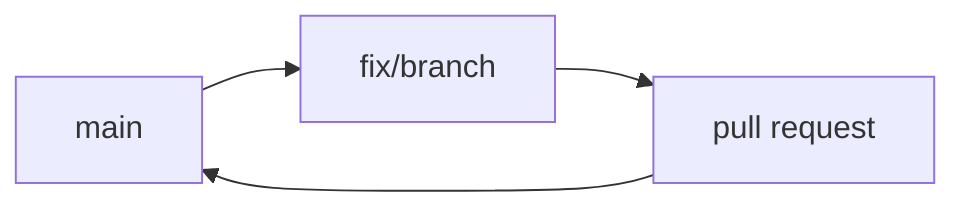

# Month 4 · Week 4 · Day 3
# From Memory: Branch → Fix → PR Story

**Program:** Full-Stack Mastery · 18 months  
**Phase:** 1 — Foundations  
**Month index:** [../../README.md](../../README.md)  
**Week 4:** [1](day-01.md) · [2](day-02.md) · Day 3 (today) · [4](day-04.md) · [5](day-05.md) · [6](day-06.md) · [7](day-07.md)  
**Week rhythm today:** Implement from memory  
**Study time:** 3–4 focused hours  
**Machine today:** Windows PowerShell, Git, Node.js 20+ (not required for the throwaway repo)  
**Days 1–2 closed.** Repair from this recap.

Tomorrow you copy the gate app. Today you prove Git vocabulary still lives in your hands: a graph you can paste, and six honest sentences on merge vs rebase vs revert.

---

## How to read this chapter

This recap **is** the lesson. Do the throwaway repo from these pages. Do not open Day 1–2 until you are stuck 25 minutes.



The gate fixture stays closed.

---

## Complete explanation

A **branch** is a name for a commit. `git switch -c fix/name` creates and moves HEAD. **Merge** joins histories (fast-forward or merge commit). **Conflict:** same lines; markers `<<<<<<<` / `=======` / `>>>>>>>`; you edit, `add`, `commit`; `merge --abort` if needed.

**PR:** push branch, ask to merge into `main`, write symptom / change / tests. Solo still opens one.

**Rebase:** replay commits on a new base; new hashes; do not rebase shared `main`; no force-push to `main`.

**Revert:** new commit that undoes an old one. Safer than rewriting published history.

**Messages:** imperative, specific.



**HEAD** points at the current branch name (usually). Detached HEAD means you checked out a raw hash — commits can get lost; `git switch -c recover` or `git switch main`.

**Fast-forward:** `main` had not moved; Git slides the name. **Merge commit:** two parents when both sides grew.

**Markers:** `<<<<<<< HEAD` is the branch you are on. `=======` separates. `>>>>>>> name` is the incoming branch. Delete every marker line. The file must be valid source.

**Reset vs revert:** `reset --hard` moves a branch pointer and can drop commits from the tip. On published `main`, that plus force-push rewrites what others pulled. `revert` adds a commit. Both sides of history remain.

**Wrong belief:** “I’ll duplicate the folder to make a branch.”  
**Correct:** `git switch -c`. The database already has the snapshots.

**Wrong belief:** “Rebase is required for a clean PR.”  
**Correct:** the gate requires a PR. Squash merge on GitHub is enough if you want one commit on `main`. Rebase is literacy, not a ritual.

**Wrong belief:** “Six sentences means six bullet fragments.”  
**Correct:** sentences with verbs. “Rebase replays commits on a new base and gives them new hashes.” not “rebase = linear.”

Worked graph after a feature merge (example):

```text
*   c3f Merge branch 'fix/demo'
|\
| * a11 Add demo note
* | b22 Notes on main
|/
* a00 Initial
```

Your hashes will differ. The shape is the lesson: two parents on the merge commit if you did not fast-forward.

Worked fast-forward: you never committed on `main` after branching. `git merge practice/memory` slides `main`. `log --graph` may look like a straight line. That is still a merge *kind*. Say so in `EXPLAIN.txt`. If you want the knot picture, diverge on purpose (section below).

---

## Office hours — wrong repo graphs, leftover markers, and force-push folklore

**Graph from fullstack-lab.** You ran `git log --graph` while still in `~\fullstack-lab`. The paste is months of lab commits, not today’s three. `cd` into `git-pr-memory` first. `Get-Content` the file and look for `practice/memory`.

**Conflict markers committed.** The file still contains `<<<<<<<`. Git may have let you `add` it. The file is not valid source. Delete markers. `git add`. Finish the merge or `git merge --abort`.

**`EXPLAIN.txt` only in the throwaway repo.** The lab commit misses it. Copy or write it at `~\fullstack-lab\month-04\week-04\EXPLAIN.txt`.

**“I’ll force-push main if the graph looks messy.”** No. Revert or a new commit. Force-push to shared `main` is forbidden in this course.

**Opened the fixture to “see Git in a real app.”** Close it. Copy is tomorrow. Today is a throwaway graph.

---

## Today's contract

**Today's gate**

> I built a tiny repo from memory, merged a branch, pasted a graph, and explained rebase vs merge vs revert in six sentences without copying Day 2.

---

## Time box

| Block | Minutes | Work |
|---|---|---|
| A | 20 | Speak recap |
| B | 70 | Throwaway repo spec |
| C | 40 | EXPLAIN.txt |
| D | 20 | Copy graph into fullstack-lab + git |

---

# Spec

Throwaway repo **outside** nested `fullstack-lab` if you want (`~/git-pr-memory/`):

1. `init`, two commits on `main`
2. Branch, third commit
3. Merge back
4. `log --graph --oneline` saved to `~\fullstack-lab\month-04\week-04\memory-graph.txt`
5. `EXPLAIN.txt`: rebase vs merge vs revert (six sentences total)

```powershell
cd $HOME
mkdir git-pr-memory -ErrorAction SilentlyContinue
cd git-pr-memory
git init
```

Use a `README.md` with one line, commit (`docs: add readme`). Change a line, commit again (`docs: expand readme`). Then:

```powershell
git switch -c practice/memory
```

Add `NOTE.txt`, commit. Switch `main`, merge `practice/memory`. If Git fast-forwards, that is fine — say so in `EXPLAIN.txt`. If you want a merge commit for the picture, make a fourth commit on `main` **before** merging (a one-line change), then merge so histories diverge.

```powershell
git log --oneline --graph --decorate --all
```

Redirect or copy into `~\fullstack-lab\month-04\week-04\memory-graph.txt`.

`EXPLAIN.txt` lives in `~\fullstack-lab\month-04\week-04\` (so it is in the lab repo):

- Two sentences: merge  
- Two sentences: rebase (new hashes; never shared `main`)  
- Two sentences: revert vs reset  

Do not paste this file. Close it.

Optional: cause a one-line conflict in the throwaway repo and abort or finish it. Write “conflict: yes/no” at the bottom of `EXPLAIN.txt`.

To diverge on purpose (merge commit, not fast-forward): after the branch exists, `git switch main`, edit README one different line, commit, then merge `practice/memory`. If it conflicts, resolve or `--abort` and say so.

`EXPLAIN.txt` path: `~\fullstack-lab\month-04\week-04\EXPLAIN.txt` (same folder as `memory-graph.txt`). If you leave it only in `git-pr-memory`, the lab commit will miss it.

Conflict markers, if you caused one: delete every `<<<<<<<`, `=======`, `>>>>>>>` line. `git add` the file. Finish or abort. Write which you chose.

```powershell
git add month-04/week-04
git commit -m "Day 3: Git graph from memory."
```

That commit is in **fullstack-lab**, not necessarily in `git-pr-memory`. The throwaway repo can stay un-pushed.

---

# PowerShell graph capture

```powershell
git log --oneline --graph --decorate --all | Out-File -Encoding utf8 $HOME\fullstack-lab\month-04\week-04\memory-graph.txt
```

If Git is not in `git-pr-memory` when you run this, the graph is the wrong repo. `cd` first. `Get-Content` the file and confirm you see your `practice/memory` name or a merge knot.

**Messages in the throwaway repo:** `docs: add readme` is enough. Gate-app messages later must name **why**. Today is graph literacy.

**Detached HEAD drill (optional):** `git log -1 --format=%H` then `git switch --detach that-hash`. `git status` should mention detached. `git switch main`. Write one line in `EXPLAIN.txt` if you did this.

Do not `git push` the throwaway unless you want a junk GitHub repo. fullstack-lab is the evidence repo for the graph file.

---

## Worked walkthrough — diverge so the graph shows a knot

After `git switch -c practice/memory` and a commit on the branch:

```powershell
git switch main
# edit README.md one different line
git add README.md
git commit -m "docs: note on main"
git merge practice/memory
```

If Git reports a conflict, you edited the same line. Delete every `<<<<<<<` / `=======` / `>>>>>>>` line. Keep one honest README. `git add`. `git commit` (merge commit). Or `git merge --abort` and write “conflict: aborted” in `EXPLAIN.txt`. Either is literacy. Leaving markers in the file is not.

**EXPLAIN.txt quality.** Two sentences merge (join vs fast-forward). Two sentences rebase (new hashes; never shared `main`; no force-push to `main`). Two sentences revert vs reset (revert adds a commit; reset `--hard` on published `main` rewrites what others pulled). Quote **your** hash prefixes from `memory-graph.txt`. Six fragments fail.

**Wrong-repo check.** `Get-Content ~\fullstack-lab\month-04\week-04\memory-graph.txt`. You should see `practice/memory` or a merge `*`. If you see months of `fullstack-lab` history, you captured the wrong cwd.

The gate fixture stays closed. Copy is tomorrow.

---

## Definition of done

- [ ] Tiny repo: init, two commits, branch, merge
- [ ] `memory-graph.txt` is a real graph
- [ ] `EXPLAIN.txt` has six sentences (merge / rebase / revert)
- [ ] fullstack-lab commit exists
- [ ] Gate fixture still unopened

---

# Six sentences — quality bar

Merge: Git joins two histories; if `main` moved, the join is often a commit with two parents. Fast-forward is still a merge *kind*: the name slides when there is nothing to join.

Rebase: Git takes each of your branch commits and reapplies the patch on a new base, producing **new hashes**. That is a rewrite; do it only on commits nobody else has pulled. Never rebase shared `main`. Never `push --force` to `main`.

Revert: Git adds a new commit that undoes a previous commit’s patch. History still contains the mistake and the undo. That is how published `main` stays honest.

If `EXPLAIN.txt` is shorter than six sentences, add examples from **today’s** repo (hash prefixes from your graph), not from a tutorial.

---

## Stalls and repair — wrong-repo graphs, leftover markers, EXPLAIN in the throwaway only

If `memory-graph.txt` is months of `fullstack-lab` history, you were in the wrong cwd. `cd $HOME\git-pr-memory` then capture. `Get-Content` must show `practice/memory` or a merge knot.

If the merge fast-forwarded and you wanted a picture with two parents, diverge: commit on `main` after the branch exists, then merge. Fast-forward is still a merge *kind* — say so in `EXPLAIN.txt` if you keep it.

If conflict markers remain, the file is not valid source. Delete every `<<<<<<<` / `=======` / `>>>>>>>`. `git add`. Finish or `merge --abort`. Write which.

If `EXPLAIN.txt` lives only in `git-pr-memory`, the lab commit misses it. Path: `~\fullstack-lab\month-04\week-04\EXPLAIN.txt`. Six sentences with verbs. Quote your hash prefixes. Rebase: new hashes; never shared `main`; no force-push to `main`. Revert adds a commit; reset `--hard` on published `main` rewrites others’ pulls.

If you opened the fixture to “see Git on a real app,” close it. Copy is tomorrow. Today is a throwaway graph. Do not `git push` the throwaway. Do not duplicate folders to “make a branch.”

Windows PowerShell `Out-File` as in the spec. Encoding utf8 is fine.

---

## Last forty minutes

`Get-Content` `memory-graph.txt`. Confirm `practice/memory` or a merge knot. If you see fullstack-lab’s month of commits, recapture from `git-pr-memory`.

`EXPLAIN.txt` in `~\fullstack-lab\month-04\week-04\`: two sentences merge, two rebase (new hashes; never shared `main`; no force-push), two revert vs reset. Quote **your** hashes. Six fragments fail. Optional conflict: yes/no at the bottom. Optional detached HEAD one line.

`git status` in the throwaway: clean or a leftover you mention. Markers gone. Do not push the throwaway. Do not open `fixtures/broken-priority-list/`. Copy is tomorrow. Branch tomorrow is still a **name** — `git switch -c`, not a duplicated folder.

Commit graph + EXPLAIN in **fullstack-lab**. The throwaway repo can stay local.

If six sentences still feel like slogans, add “In today’s repo, fast-forward happened / did not happen because…” using the graph you pasted.

---

## Worked checkpoint — merge, rebase, revert in **your** hashes

Open `~\fullstack-lab\month-04\week-04\memory-graph.txt`. If the paste is months of `fullstack-lab` history, you captured from the wrong cwd. Recapture from `$HOME\git-pr-memory` after `cd` there. `Get-Content` must show `practice/memory` or a merge knot.

`EXPLAIN.txt` lives next to that graph in **fullstack-lab**, not only in the throwaway. Two sentences merge: Git joins histories; fast-forward is still a merge *kind* when the name slides. Two sentences rebase: new hashes; never rewrite shared `main`; never `push --force` to `main`. Two sentences revert: a new commit undoes a patch; history still contains the mistake. Quote **your** hash prefixes.

If you wanted two parents and Git fast-forwarded, diverge: commit on `main` after the branch exists, then merge — or keep the fast-forward and **say so**. Conflict markers (`<<<<<<<`) are not a souvenir. Delete them. `git add`. Finish or `merge --abort`.

> **Wrong belief:** “I’ll duplicate the folder in Explorer so I have a branch.”  
> **Correct:** a branch is a name Git moves. `git switch -c`. The throwaway stays one repo. Do not `git push` it. Do not open `fixtures/broken-priority-list/` today — copy is tomorrow.

Windows PowerShell `Out-File` as in the spec. Encoding utf8 is fine. Commit graph + EXPLAIN in fullstack-lab.

Detached HEAD, if you touched it, is one honest line in `EXPLAIN.txt`: you checked out a commit, not a branch name; `git switch main` (or your branch) returns you to a moving name. Do not practice `reset --hard` on a published `main`. The throwaway can stay local forever.

`git log --oneline --graph --decorate --all` is the picture you paste. Do not invent ASCII that is not your repo. Six fragments fail — verbs and **your** hashes. The gate fixture stays closed until tomorrow’s copy.

If `EXPLAIN.txt` is still only in `git-pr-memory`, copy it to `~\fullstack-lab\month-04\week-04\EXPLAIN.txt` before you commit fullstack-lab. Two locations of truth is how the lab commit goes empty.

---

## Optional review links

Git depth is explained in this chapter.

- [Pro Git: Branches](https://git-scm.com/book/en/v2/Git-Branching-Branches-in-a-Nutshell)
- [Pro Git: rebasing](https://git-scm.com/book/en/v2/Git-Branching-Rebasing)
- [git-revert](https://git-scm.com/docs/git-revert)

---

## Tomorrow

Copy `fixtures/broken-priority-list/` into **your** lab. Read **symptoms**. Branch. Reproduce. Do not ask AI to “fix the whole app.”

`EXPLAIN.txt` belongs in `~\fullstack-lab\month-04\week-04\` next to `memory-graph.txt`. Conflict markers, if you caused any, must be gone before you call the repo done. `git status` should be clean or a deliberate leftover you mention.

A branch is still a name tomorrow. You will not “make a branch” by duplicating the fixture folder without `git switch -c`. The textbook tree stays a snapshot.

Six sentences in `EXPLAIN.txt` still means six sentences, even after the copy.

`git log --oneline --graph --decorate --all` is the picture you paste. Do not invent ASCII that is not your repo.

`EXPLAIN.txt` still needs merge, rebase, and revert — two sentences each. A graph without those sentences is an incomplete Day 3.

Do not open `fixtures/broken-priority-list/` today. Copy is tomorrow.
