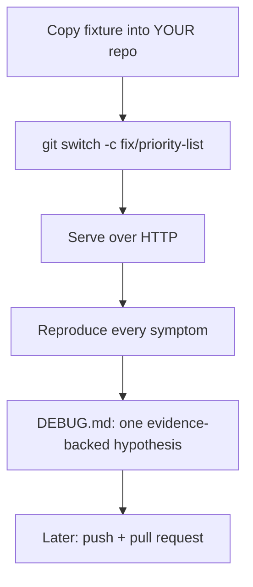
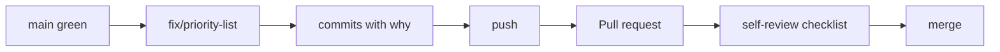

# Month 4 · Week 4 · Day 4
# Gate App: Copy, Run, Observe Symptoms — and the Pull Request Shape

**Program:** Full-Stack Mastery · 18 months  
**Phase:** 1 — Foundations  
**Month index:** [../../README.md](../../README.md)  
**Week 4:** [1](day-01.md) · [2](day-02.md) · [3](day-03.md) · Day 4 (today) · [5](day-05.md) · [6](day-06.md) · [7](day-07.md)  
**Week rhythm today:** Real feature — the Month 4 product  
**Study time:** 3–4 focused hours  

This textbook **does not** contain the fixed source.

The broken app lives at:

`textbook/month-04/fixtures/broken-priority-list/`

(From the repo root of this textbook.)

Today you **copy** that snapshot, serve it, reproduce **user-visible** symptoms, start `DEBUG.md`, and remember how a **pull request** will carry the fix. You do **not** have to finish every bug today. You **do** have to stop editing `main`.

There is no answer key in this textbook. The fixture README lists **symptoms**. It does not list root causes. Finding those is the gate.

---

## How to read this chapter

Two jobs share the day: **Git hygiene for a real change** (branch + the PR you will open by Day 6) and **honest observation** of a broken app (HTTP, debugger, notes).



Do not “fix the whole app” in one paste from an AI. You may ask an AI to explain a **stack trace you already have**. You may not ask it to rewrite `state.js` blindly.

Optional review links at the end are GitHub docs — the PR **shape** is in this chapter.

---

## Today's contract

By the end of this day you will be able to:

1. Copy the fixture into `~\fullstack-lab\month-04\priority-list\` (or a new GitHub repo).
2. Explain why the gate is **your** history, not edits in the textbook tree.
3. Serve the app over HTTP and run `npm test`.
4. Reproduce every listed symptom (or record what you tried).
5. Branch before changing code.
6. Describe the PR you will open (base `main`, compare `fix/priority-list`, body: symptom / change / tests).

**Today's gate**

> The app runs over HTTP, all listed symptoms were attempted, a branch exists, and `DEBUG.md` has at least one evidence-backed cause — from **your** debugger, not from a blog.

---

## Time box

| Block | Minutes | Work |
|---|---|---|
| A | 30 | Theory: copy vs textbook, PR anatomy for this product |
| B | 25 | Copy + install + HTTP + `npm test` |
| C | 80 | Reproduce symptoms; one breakpoint investigation |
| D | 25 | DEBUG.md + branch check |
| E | 15 | Recall / PR body draft |

---

# Theory (complete)

## 1. Why copy (and not edit the textbook)

The textbook folder is a **starting snapshot** for every student. If you fix files in `Downloads\2026\textbook\...`, you have no PR against *your* `main`, and you might destroy the only clean copy.

The gate is: debug, regression tests, **branch / pull-request workflow**. That workflow lives in a repo you own.

**Wrong belief:** “I’ll edit the fixture in the textbook and screenshot it.”  
**Correct:** copy, branch, commit, push, PR.

You may put the copy **inside** `fullstack-lab` or in a **new** GitHub repository. Either is valid. If it is a nested folder in `fullstack-lab`, commits still go to that lab repo’s history — fine. A dedicated repo makes the PR easier to show. Pick one. Write the path in `DEBUG.md`.

---

## 2. Pull requests (the product use)

Day 2’s dry run was five lines of markdown. This PR will be the **fix**. Same machine:

1. Branch exists locally (`fix/priority-list` or similar).  
2. `git push -u origin fix/priority-list`.  
3. Open a PR: **base** `main`, **compare** your branch.  
4. Body: what the user saw, what you changed, how you tested, what you did not fix.  
5. Merge only when tests you ran are green **and** symptoms in the fixture README are gone (or honestly documented).

```powershell
git push -u origin fix/priority-list
gh pr create --title "Fix priority list gate bugs" --body "See PR body in editor / DEBUG.md summary."
```

Website Compare & pull request is enough if you skip `gh`.

**Review yourself** (solo is allowed):

- No `debugger`  
- No `node_modules`  
- `npm test` mentioned with what you ran  
- Titles still must not be treated as HTML (Month 3 habit) — you will **observe** symptom 7 and write what you saw  

**Wrong belief:** “I’ll merge to main locally and never open a PR because I work alone.”  
**Correct:** the gate item is the PR-style workflow. Open one against your own `main`.

You do **not** need to open the PR **today**. You need to know the URL will exist by Day 6–7. Draft the body in `PR-DRAFT.md` in the copy if that helps.



---

## 3. How you will work (symptoms, not spoilers)

The fixture README is the spec of **user-visible** failure. Reproduce each item. Write `SYMPTOMS.md`: confirmed / could not reproduce / what you tried.

Use:

- HTTP (not `file://`)  
- DevTools **Sources** breakpoints (Week 3)  
- Console for uncaught errors (do not stop at the first red line without a pause)  
- Application → Local Storage for the storage symptom  

`npm test` may be **green while the UI is wrong**. That is information: the suite does not yet encode those user claims. Week 3 called that a missing test, not a passing product. Do not “fix” tests to match broken UI. Do not delete tests to get peace.

**Wrong belief:** “Green tests mean I can skip reproducing.”  
**Correct:** the README symptoms are the product spec. Tests will catch up on Day 5 **after** you see red for the right reason.

This chapter will **not** tell you which function is wrong. If you want a hint, the fixture README already listed what a **user** sees. That is the whole hint.

---

## 4. Rules

1. **Copy** the folder into `~\fullstack-lab\month-04\priority-list\` (or a **new** GitHub repo). Do not only edit the textbook tree if you will PR from the lab — the gate is **your** history.
2. Read **that copy’s** `README.md`. It lists **what a user sees**. It does not list root causes.
3. Serve over **HTTP**. Use the debugger (breakpoints). Network tab if you add fetch later — this fixture is local.
4. Do **not** ask an AI to “fix the whole app” in one paste. You may ask it to explain a **stack trace you already have**.
5. Branch: `git switch -c fix/priority-list` before changing code.

If `fullstack-lab` is already a git repo, create the branch **there** (or in the dedicated product repo). Do not commit secrets. Do not commit `node_modules` after `npm install`.

---

# Today's job (not “finish every bug”)

1. Copy + `npm install` if the fixture has a `package.json` + `node --test` (expect **green tests that miss bugs** — that is a hint).
2. Reproduce **every** symptom in the fixture README. Write `SYMPTOMS.md` in your copy: which ones you confirmed.
3. Pick **one** symptom. Hypothesis. Breakpoint. Evidence. Cause in `DEBUG.md` (Month 3 format). **Do not** have to fix all today.
4. Optional: one failing **regression** test that encodes that symptom (red). Leave it red until tomorrow if needed.

```powershell
# textbook is not your product repo — commit in fullstack-lab / your copy
```

`DEBUG.md` format (Month 3):

- Symptom (quote the README line)  
- What you did (click path, storage edit)  
- What you saw (UI, console, Scope pane: names and types)  
- Hypothesis  
- Evidence (not “I feel like”)  

Do not paste textbook fixture source into an AI chat with “fix this.” That skips the gate.

---

## How to copy on Windows

```powershell
$from = "C:\Users\Universe\Downloads\2026\textbook\month-04\fixtures\broken-priority-list"
# If your textbook path differs, adjust $from.
$to = "$HOME\fullstack-lab\month-04\priority-list"
New-Item -ItemType Directory -Force -Path (Split-Path $to) | Out-Null
Copy-Item -Recurse -Force $from $to
cd $to
```

Use **your** actual textbook path if this machine’s folder name is different.

Then:

```powershell
npm install
npm test
npx --yes serve -p 5500
```

Open `http://127.0.0.1:5500`. Not `file://`.

If this copy is inside `fullstack-lab`:

```powershell
cd ~\fullstack-lab
git switch -c fix/priority-list
```

If it is a **new** repo:

```powershell
cd $to
git init
git add .
git commit -m "Import broken priority list snapshot."
git switch -c fix/priority-list
```

Create an empty GitHub repo and `git remote add origin ...` when you are ready to push. Do not force-push `main`.

`.gitignore` should already list `node_modules` from the fixture. Confirm before the first commit of `node_modules` accidents.

---

## Definition of done for Day 4

- [ ] App runs over HTTP
- [ ] All listed symptoms attempted
- [ ] Branch exists
- [ ] `DEBUG.md` started with at least one evidence-backed cause
- [ ] `SYMPTOMS.md` filled
- [ ] You can say base vs compare for the future PR
- [ ] Textbook fixture folder left as the original snapshot

---

# PR body draft (write today even if you push later)

`PR-DRAFT.md` in the **copy**:

```markdown
## Symptoms
- (quote fixture README lines you confirmed)

## Changes
- (empty today, or one hypothesis — not a novel)

## Tests
- `npm test` from this folder: (pass/fail, how many tests)
- HTTP walkthrough: (which symptoms)

## Not fixed yet
- (honest list)
```

That draft becomes the `gh pr create --body` later. A PR with title `fix` and empty body fails the course even if the code is perfect.

**Observation habits (still no answer key):**

- Pause **on a line that uses the value**, not on a comment.  
- Read **types** in Scope (`typeof` in Watch if needed).  
- If the list goes blank, note whether **All** still shows rows (README already asked this).  
- If the console shows an exception, pause on exceptions once so you see the throw site.

**Wrong belief:** “Green tests from the snapshot mean the authors already tested everything.”  
**Correct:** the snapshot can have tests that never encoded the user claims. That is why regression tests are **your** job tomorrow.

**Wrong belief:** “I’ll copy with Explorer and forget `js/`.”  
**Correct:** `Copy-Item -Recurse` the whole folder. Then open `index.html` via HTTP and confirm the title of the app matches the fixture.

If `npm test` errors on `"type": "module"` or missing `node:test`, your Node is too old. This program uses Node LTS. `node -v`.

---

# Block E — Recall

1. Why copy instead of editing the textbook.  
2. Why green `npm test` does not end the day.  
3. What a PR body must contain.

---

## Optional review links

Copy steps and PR shape are explained above. The fixture README is the symptom list.

- [Fixture README](../../fixtures/broken-priority-list/README.md)
- [GitHub: about pull requests](https://docs.github.com/en/pull-requests/collaborating-with-pull-requests/proposing-changes-to-your-work-with-pull-requests/about-pull-requests)
- [gh pr create](https://cli.github.com/manual/gh_pr_create)

---

## Tomorrow

Regression tests that fail **for the right reason**, then fixes until the UI matches the fixture README. Red, then green. Not green souvenirs.
