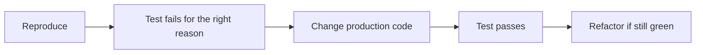
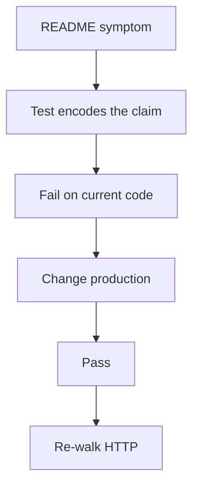

# Month 4 · Week 4 · Day 5
# Regression Tests, Then Fixes

**Program:** Full-Stack Mastery · 18 months  
**Phase:** 1 — Foundations  
**Month index:** [../../README.md](../../README.md)  
**Week 4:** [1](day-01.md) · [2](day-02.md) · [3](day-03.md) · [4](day-04.md) · Day 5 (today) · [6](day-06.md) · [7](day-07.md)  
**Week rhythm today:** Test, then change production code  
**Study time:** 3–4 focused hours  
**Prereq:** Day 4 — copy exists, symptoms reproduced, branch exists.

Today is the professional order: **red tests that encode the bug**, then **production changes**, then **green**. If you already “fixed” the UI yesterday with no test, you still write a test that would have failed on the snapshot — or you revert the fix, write red, re-apply. The gate wants the story in `DEBUG.md`.

This textbook still will **not** name root causes. The fixture README still lists symptoms. Your debugger and tests are the teachers.

---

## How to read this chapter

A **regression test** is a claim that was **false while the bug lived** and **true after you changed the code**.



If you only fix the UI and then write a test that already passes, you have a souvenir, not a regression test.

Read the order. Then work in **your copy** on `fix/priority-list`. Do not edit the textbook fixture.

---

## Today's contract

By the end of this day you will be able to:

1. Explain red → green in one paragraph.
2. Add tests for the logic symptoms the fixture README describes (filter, sort behavior, clear completed, parse garbage) **as user claims**, without copying an answer key (there is none).
3. Watch them fail; record the failure.
4. Fix until `npm test` is green **and** the UI matches the fixture README.
5. Keep titles as text in the DOM (`textContent`); recover from bad storage.

**Today's gate**

> At least three logic bugs have a test that was red, then green, and `DEBUG.md` pastes one failing assertion from the red moment.

---

## Time box

| Block | Minutes | Work |
|---|---|---|
| A | 25 | Theory: regression vs souvenir; what Node can test |
| B | 50 | Write tests; run; record red |
| C | 80 | Fix production; re-run UI symptoms |
| D | 20 | Commits on the feature branch |
| E | 15 | Recall |

---

# Theory (complete)

## What a regression test is (this book)

Order that professionals use:

1. Reproduce (Day 4).
2. Write a test that **fails** for the right reason (red).
3. Change **production** code (green).
4. Refactor if the test stays green.

If you only fix the UI and then write a test that already passes, you have a souvenir, not a regression test. The gate wants the red→green story in `DEBUG.md` (paste the failing assertion once).

Test **pure** functions in `state.js` / a `parseTasks(raw)` you extract from storage. You may extract `parseTasks` so Node can test garbage JSON without `localStorage`.

Do not snapshot the whole `main.js`. Do not test `innerHTML` from Node — prove XSS by code search + a sentence: titles go through `textContent`.

Breakpoints: pause in `filterByPriority` and read `priority`’s **type**.

**Wrong belief:** “I’ll write the test after it passes so I don’t have to see red.”  
**Correct:** red is the proof the test **could** fail. Without it, the test might assert the broken behavior.

**Wrong belief:** “I’ll change the test to match the current UI until green, then ship.”  
**Correct:** the fixture README is the spec. Tests encode the spec, not the bug.

---

## What Node can and cannot see

| Can unit-test | Harder / other proof |
|---|---|
| parse a string → list or `[]` | Click “Done” on the wrong row (DOM / `this` / delegation / loop binding) |
| filter / sort / clear as **functions** of arrays | Visual layout |
| “input list order after sort helper” | |

For UI/delegation bugs: a **breakpoint write-up** is allowed if a unit test cannot reach the DOM. Week 3 Scope pane. Write `this`, `id`, `target` vs `currentTarget` as you actually saw them.

You may add a tiny Node-testable helper by **extracting** it from a blob. Extracting is a fix-enabler, not cheating. Pasting a rewritten app from chat **is** cheating the gate.

---

## Types, equality, and forms (general, not a spoiler)

HTML controls yield **strings**. JavaScript `===` does not coerce. If a test uses a number and the UI uses a string (or the reverse), the function and the page can disagree. Convert **in the open** (`Number(...)` / `String(...)`) after you have **evidence** from Scope. Do not sprinkle `==` to make a test green — Week 3 `eqeqeq`.

Mutation: Week 1 taught that `sort` changes the array you give it. A helper that should not destroy “add order” needs a **copy** or a stored original. Write the claim first (`does not change input order` / `All restores add order` — whatever the **symptom** requires). Then implement.

Storage: `JSON.parse` throws. Uncaught → white screen. Month 3: `try/catch`, return `[]`. Test the parse function with `"NOT JSON"`.

XSS: `textContent` vs `innerHTML`. Symptom 7 in the fixture README is the user check. Search your copy for how titles are assigned. Fix the assignment. A Node test will not render bold text; the README check will.

---

## Commit messages on the fix branch

Prefer **why**:

```text
Add failing test for clear-completed user claim.

Reproduces README symptom 3 before production change.
```

Then a later commit that makes it pass. Or one commit if you already recorded red in `DEBUG.md` — still say **why**. No `update`, no `asdf`.

Do not force-push `main`. Do not commit on `main`.

---

## Today

On your **copy** (branch `fix/priority-list`):

1. Add tests for at least: filter + sort-does-not-mutate + clear-completed + parse garbage.
2. Watch them fail. Record.
3. Fix until `npm test` is green **and** the UI matches the fixture README.
4. `textContent` for titles. Recover from bad storage. `this` for stats or drop `this`. Delegation or `let` in the loop — you choose; explain in DEBUG.md.

```powershell
# commit on the feature branch in YOUR copy
```

If you added ESLint/Prettier to this copy, run them. Not required **inside the fixture** until you add them (fixture README). The PR body still says how you ran tests. `no-debugger` still applies if lint is on: delete `debugger` before you push.

Serve HTTP after fixes. Re-walk **every** README symptom. Tick `SYMPTOMS.md`.

If a symptom still fails, do not invent a story. Leave it on the list for Day 6. Do not close the PR as done.

---

# Red for the right reason

A test can fail because:

| Failure | Meaning |
|---|---|
| Assertion wrong vs **spec** | Good red — this is the bug |
| `import` path typo | Fix the test harness, not production |
| You asserted the **broken** behavior | Souvenir in reverse — rewrite the claim to match the README |
| Timeout / hang | You hit a real loop or open handle — stop, do not skip |

Record the **assertion message** in `DEBUG.md`. Example shape (invented): `Expected [] to deeply equal [ { id: 't-1', ... } ]`. Your actual message will differ.

**Extracting parse:**

```js
export function parseTasks(raw) {
  if (typeof raw !== "string") return [];
  try {
    const data = JSON.parse(raw);
    // shape checks you choose — must not throw to UI
    return /* array or [] */;
  } catch {
    return [];
  }
}
```

Test `"NOT JSON"` → `[]`. If production still `JSON.parse`s in `main.js` without this helper, the test is lying about the page. Wire `load` to call `parseTasks`.

**Filter / sort / clear tests** encode **user claims** from the README (what should happen), not “whatever the function does today.” Write the expected array in the test **before** you “fix toward green.” If you are unsure of expected, re-read the fixture README symptom — still no textbook key.

**Commits:** small is fine. `test: add failing parse garbage case` then `fix: recover from invalid JSON`. Two commits tell the red→green story better than one blob.

**Wrong belief:** “I’ll comment out the red test so `npm test` is green for the PR, then uncomment later.”  
**Correct:** a PR with skipped regression tests is a failed gate. Red on `main` is also wrong — that is why you are on a **branch**. Red on the branch is allowed until the fix commit.

**Wrong belief:** “ESLint will catch the user-facing bugs.”  
**Correct:** lint catches `==` and `debugger`. It does not know what “clear completed” means.

If you add Prettier to the copy, do not let it become the only diff in the PR. Format is fine; the review should still be about behavior.

Re-serve HTTP after each fix cluster. A green unit test with a still-blank filter means the page is not calling the function you tested, or types differ between Node literals and the `<select>`. Scope on the page. Convert in the open.

---

# Block E — Recall

1. Souvenir vs regression.  
2. Why extract `parseTasks`.  
3. What proof you use when Node cannot click.

---

## Definition of done

- [ ] Red captured for at least three logic claims (DEBUG.md paste)
- [ ] Those tests green after production changes
- [ ] UI re-checked against fixture README
- [ ] Titles are text; garbage JSON does not white-screen (user checks)
- [ ] Commits on `fix/priority-list` with real messages
- [ ] Textbook snapshot untouched

---

# DOM bugs: proof without a fake browser

Week 1’s loop-of-handlers and Week 1’s detached `this` show up in UIs as “the wrong row” or “count is 0 / throws.” Node unit tests may not attach listeners. Allowed proof:

1. Breakpoint in the listener or method. Write `this`, `id`, `target` / `currentTarget` in `DEBUG.md`.  
2. Change **one** thing (bind, arrow wrapper, `let`, delegation, drop `this`).  
3. Re-click. The user symptom in the fixture README should change.  
4. If you extracted a pure function (`toggleDone(list, id)`), **then** a Node test can lock it.

Do not invent Playwright today. Do not screenshot-only.

**XSS proof:** search the copy for `innerHTML` / `insertAdjacentHTML` / `document.write`. Titles from the user are untrusted. Assign with `textContent` (Month 3). Confirm README symptom 7 in the browser: angle brackets remain **characters**. This book will not give an exploit recipe.

**Storage proof:** DevTools → Application → Local Storage → set the key the app uses to `NOT_JSON` (the fixture README already named the key in the symptom). Reload. Page lives. Then a Node test on `parseTasks("NOT JSON")`.

**Sort / filter / clear:** these are array functions if you keep them that way. Arrange a small list in the test. Act. Assert ids and `done` flags. If the UI still fails after green tests, the page is not using those functions or is feeding different types — Scope on the event path.



**Wrong belief:** “I’ll fix all UI first, then add tests in a batch Friday.”  
**Correct:** one claim at a time. Batch souvenirs skip red.

If `npm test` uses `node --test` and you added `state.test.js`, confirm the script still discovers it (folder vs filename). The fixture `package.json` already has `"test": "node --test"`.

---

**`DEBUG.md` red paste template:**

```text
## Symptom (README #)
Test file / name:
Command: npm test
Red output (paste assertion, not the whole stack if huge):
Then I changed: (file)
Green: yes/no
```

Test names: `"filterByPriority keeps matching items when ..."` not `"test2"`. Future you will grep the PR.

**Do not** change the textbook `fixtures/` files. If `git status` in the textbook repo shows fixture edits, you copied the wrong direction. Revert those; work in `~\fullstack-lab\...` or your product repo.

**Injection reminder:** if parse still reads `localStorage` at import time, Node tests explode. Only call storage APIs inside functions the page calls. Tests pass strings.

Keep `eqeqeq` if you added ESLint to the copy. Mixed `==` “just for the filter” is how Week 3 unravels.

One symptom, one red test, one production change, one HTTP check. Then the next symptom. Parallel “I’ll rewrite state.js” is how you lose the red story.

`git status` should show you on `fix/priority-list` (or the name you chose), not `main`. If you are on `main`, switch before the next commit.

---

## Tomorrow

Independent: close remaining symptoms, open the **pull request**, teach-back tying Week 1–2 to a bug you actually found. If the copy is missing, start with Day 4’s copy instructions first — do not skip the snapshot.

The PR body is not optional. Symptom, change, tests, leftovers. `GATE-PR.txt` holds the URL. No force-push to `main`. No leftover `debugger`.

If HTTP still disagrees with `npm test`, the page is not calling the function you tested, or types differ — Scope on the click path, convert in the open, do not switch to `==`.

Day 6 still allows starting the copy if you skipped Day 4. The fixture README remains symptoms-only. This textbook still has no answer key.

Keep the red paste in `DEBUG.md` even after tests go green. The gate reads that story.

A souvenir test that you write after the UI looks good, without a recorded fail, does not satisfy “red→green.” Revert the production change, watch the test fail, then re-apply if you skipped that order.

Do not merge to `main` locally as a shortcut around the PR. Day 6 is the PR.

---

## Optional review links

Red-green order is explained above. Repair from your `DEBUG.md` and the fixture README.

- [Node: test runner](https://nodejs.org/api/test.html)
- [MDN: `textContent`](https://developer.mozilla.org/en-US/docs/Web/API/Node/textContent)
- [Chrome: breakpoints](https://developer.chrome.com/docs/devtools/javascript/breakpoints)
