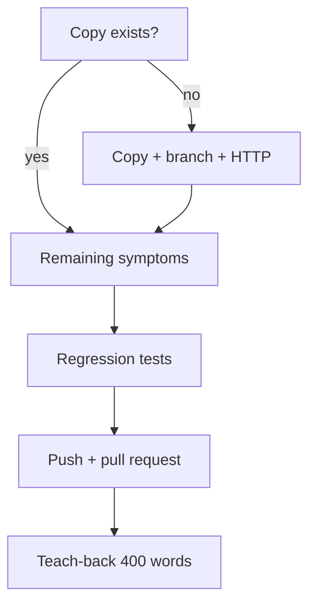

# Month 4 · Week 4 · Day 6
# Independent: Finish the PR (and Start the Gate App if Needed)

**Program:** Full-Stack Mastery · 18 months  
**Phase:** 1 — Foundations  
**Month index:** [../../README.md](../../README.md)  
**Week 4:** [1](day-01.md) · [2](day-02.md) · [3](day-03.md) · [4](day-04.md) · [5](day-05.md) · Day 6 (today) · [7](day-07.md)  
**Week rhythm today:** Independent project work  
**Study time:** 3–4 focused hours  
**Machine today:** Windows PowerShell, Git, Node.js 20+, `curl.exe` optional for HTTP checks  
**Lab textbook closed except fixture README + this recap.**

If Day 4–5 did not happen (no copy, no branch), **start the gate app today** using the copy block below, then continue the challenges. Do not wait for a perfect week. Do not edit the textbook fixture in place.

Tomorrow is the exam. The PR does not have to be merged yet, but it should **exist** (or a patch + body fallback).

This chapter will not tell you which line of the fixture is wrong. Work from **symptoms** in the copy’s README. You find causes.

---

## How to read this chapter

This recap **is** the Git + quality lesson. The fixture README **is** the product spec (symptoms). Other day files stay closed during the challenges.



AI may not write the PR body from a dumped `state.js`. You write symptom → cause → test from **your** DEBUG.md.

---

## Complete explanation

Branch from `main`. Reproduce symptoms. Red tests. Fix. Green tests. Commit messages that name the **why**. Push. Open a **pull request**. Body: symptoms, causes (now that you found them), how you tested, leftover risks.

Lint/format if you added them. No `debugger`. No `node_modules`.

**Revert** is how you undo a bad merge on `main` later — not how you finish today.

**Branch:** a name for a commit. `git switch -c fix/priority-list`. Do not commit the fix on `main`.

**Merge:** joins histories. Conflicts: markers, you edit, `add`, `commit`. `merge --abort` while merging.

**PR:** pushed branch + request to merge into `main` + written diff context. `gh pr create` or GitHub UI. Solo still opens one.

**Rebase:** replay commits; new hashes; never rewrite shared `main`; no force-push to `main`.

**Revert:** new undo commit. Safer than `reset --hard` on published history.

**Regression test:** failed on the bug, passes after. Souvenir tests that were born green do not count.

**Breakpoints:** Scope pane for `this`, closures, types. Logs are extra.

**Wrong belief:** “I’ll merge locally and skip the PR because I am the only reviewer.”  
**Correct:** the gate is the workflow. Review yourself with the checklist.

**Wrong belief:** “I’ll start Month 5 tonight if the list looks OK.”  
**Correct:** Day 7 self-mark. The exam file teaches the month. Do not skip it.

**Wrong belief:** “Day 6 is merge day; I’ll fix on `main` to save time.”  
**Correct:** merge happens through the PR (or a local merge after review). The branch is the point.

Serve the copy over **HTTP**, not `file://`. Modules and storage behave like production. Optional check that the server answers:

```powershell
curl.exe -I http://127.0.0.1:5500
```

You want a successful HTTP status, not a browser mystery. If `curl` without `.exe` runs `Invoke-WebRequest`, that is PowerShell’s alias — use `curl.exe`.

---

## Office hours — empty GATE-PR, souvenir tests, and AI-fixed apps

**Empty `GATE-PR.txt`.** Day 7 gate 5 fails. One URL, or `UNAVAILABLE` plus patch paths. Not a blank file.

**Tests written after the UI looked fine.** You never saw red. Paste one failing assertion into `DEBUG.md` from when the bug lived, or re-break a helper on a scratch branch, watch red, restore, keep the test. Souvenir tests do not count.

**AI pasted a whole `state.js`.** You cannot explain a line. Revert that commit. Fix one symptom. Write the cause yourself.

**Edited the textbook `fixtures/` folder.** Copy into `~\fullstack-lab\month-04\priority-list` (or your documented path). The textbook tree stays a snapshot.

**Force-push to `main`.** Forbidden. If you did it on a private throwaway, stop. The product repo’s `main` stays honest.

**Teach-back never names your app.** “Closures are important” is not Challenge 3. Name a function or a Scope fact from **your** DEBUG.md.

---

## Today's contract

**Today's gate**

> Every fixture README symptom has a DEBUG.md line, a PR (or patch + body) exists, and a 400-word teach-back ties Week 1 or 2 to a bug I actually saw.

---

## Time box

| Block | Minutes | Work |
|---|---|---|
| A | 15 | Speak recap; confirm copy/branch |
| B | 30 | Start gate app if missing (copy block) |
| C | 80 | Remaining symptoms + tests |
| D | 40 | PR + teach-back |
| E | 15 | GATE-PR.txt |

---

# Start gate app (if Day 4 did not)

Copy from the textbook **snapshot** into **your** repo. Adjust `$from` if your textbook path differs.

```powershell
$from = "C:\Users\Universe\Downloads\2026\textbook\month-04\fixtures\broken-priority-list"
$to = "$HOME\fullstack-lab\month-04\priority-list"
New-Item -ItemType Directory -Force -Path (Split-Path $to) | Out-Null
Copy-Item -Recurse -Force $from $to
cd $to
npm install
npm test
npx --yes serve -p 5500
```

Open `http://127.0.0.1:5500`. Read **this copy’s** `README.md` (symptoms only).

```powershell
cd ~\fullstack-lab
git switch -c fix/priority-list
```

If the copy is its own repo, `git init` / first commit / `git switch -c fix/priority-list` there instead. Then do Day 4’s reproduce job **quickly** (SYMPTOMS.md) before Challenge 1. You still must not ask AI to fix the whole app in one paste.

---

# Challenge 1 — Close remaining symptoms

Every fixture README item has a line in `DEBUG.md`: evidence + cause + fix + test name (or “DOM, breakpoint”).

Re-walk the list on HTTP. Garbage JSON in Local Storage. Title with angle brackets. Filter, sort, clear, done, count — as **users** see them.

If you cannot reproduce one item, write what you tried. Do not skip it silently.

This textbook still will not list root causes. Symptoms live in the fixture README. Your DEBUG.md is the answer key you wrote.

---

# Challenge 2 — Pull request

URL in `~\fullstack-lab\month-04\week-04\GATE-PR.txt` (or the product repo). If GitHub is unavailable, a patch file plus the PR body text.

```powershell
git push -u origin fix/priority-list
gh pr create --title "Fix broken priority list (Month 4 gate)" --body "Symptoms, causes, tests: see DEBUG.md in this branch. How tested: npm test and HTTP walkthrough of fixture README."
```

PR body (required topics):

- Symptoms you fixed (user language)  
- Causes **you** found (now allowed in the PR — the textbook still has no key)  
- How you tested (`npm test`, breakpoint, UI)  
- Leftover risks  

Self-review: no `debugger`, no `node_modules`, messages are imperative.

You may merge after review. Merging is not required before Day 7 if the PR is open and honest. The exam asks for `GATE-PR.txt`.

---

# Challenge 3 — Teach-back

400 words: event loop **or** closures **or** `this` — whichever actually caused one of your bugs. Tie the Week 1–2 lesson to the symptom.

If a bug was “wrong boolean filter” or “parse throw,” you may write about **testable design** instead — still 400 words, still tied to **your** DEBUG evidence. Do not write a generic essay that never mentions your app.

```powershell
# commits live on the fix branch
```

If `gh` is not installed, the GitHub **Compare & pull request** button after a push is the same gate. Install `gh` another day; do not block the PR on CLI taste.

Do not start Month 5 tonight. Day 7’s synthesis is the last teacher for this month. The exam file will re-teach Weeks 1–4; other day files stay closed during those blocks.

Lab notes (`GATE-PR.txt`, teach-back copy) may be committed on `main` or the fix branch — do not lose the URL.

Write `GATE-PR.txt` as a single URL or `UNAVAILABLE` plus the path to the patch directory. Empty files fail Day 7 gate 5.

---

# Self-review checklist (before you click Create)

- [ ] Branch is not `main`
- [ ] `npm test` green on the copy
- [ ] Fixture README symptoms walked on HTTP after the fixes
- [ ] `DEBUG.md` has evidence, not only conclusions
- [ ] No `debugger` in source (`rg debugger` in PowerShell: `Select-String -Path js\*.js -Pattern debugger`)
- [ ] `node_modules` not in the commit
- [ ] PR body has symptoms / tests / leftovers
- [ ] No `git push --force` to `main`

**Patch fallback** (GitHub down):

```powershell
cd $HOME\fullstack-lab\month-04\priority-list
git format-patch main..HEAD -o $HOME\fullstack-lab\month-04\week-04\patches
```

Put the PR body in `GATE-PR.txt` above the patch paths. The exam still wants that file.

Teach-back is **not** a recap of this recap. Name a **function** or a **Scope fact** from your session. If you never paused, go pause before you write.

---

## Worked walkthrough — PR body and GATE-PR.txt

`GATE-PR.txt` is one line that is a URL, or the word `UNAVAILABLE` plus patch directory paths. Empty fails Day 7.

PR body (your words, not this paragraph pasted):

- **Symptoms:** user language from the fixture README (filter empty, sort stuck, and the rest **you** still see or saw).  
- **Causes:** what **you** found in **your** copy — this textbook still has no key.  
- **Tests:** `npm test`, which names went red→green, breakpoint note if DOM-only.  
- **Leftovers:** risks you did not harden.

**HTTP walk.** `npx --yes serve -p 5500` from the copy. `http://127.0.0.1:5500`. Optional `curl.exe -I http://127.0.0.1:5500`. Garbage JSON in Application → Local Storage as the README says. Title with angle brackets as **plain text**. Do not invent extra symptoms to look busy; do not skip a README item silently.

**Regression bar.** At least three logic bugs with tests that failed on the bug. If you only have green tests written after the UI looked fine, re-break one helper on a scratch commit, watch red, restore, keep the test, paste the failing assertion into `DEBUG.md`.

Do not start Month 5 tonight. Do not force-push `main`. Node.js 20+ for `npm test` on the copy.

---

## Definition of done

- [ ] Copy exists outside the textbook tree; branch exists
- [ ] DEBUG.md covers every README symptom
- [ ] Regression tests for at least three logic bugs (red→green story)
- [ ] PR URL or patch+body in `GATE-PR.txt`
- [ ] Teach-back ≥ 400 words
- [ ] No force-push to `main`

---

## Stalls and repair — empty GATE-PR, souvenir tests, textbook fixture edits

If `GATE-PR.txt` is empty, Day 7 gate 5 fails. One URL, or `UNAVAILABLE` plus patch paths from `git format-patch`.

If tests were born green after the UI looked fine, they are souvenirs. Re-break one helper, watch red, restore, keep the test, paste the failing assertion into `DEBUG.md`. At least three logic bugs with red→green.

If AI dumped a whole `state.js`, revert. Fix one symptom. Causes in DEBUG are yours. This textbook still has no answer key. Work from README **symptoms** on HTTP. `curl.exe -I http://127.0.0.1:5500` if the tab is mysterious. Not `file://`. Not PowerShell `curl` alias.

If you edited `textbook\month-04\fixtures\`, stop. Copy into `~\fullstack-lab\month-04\priority-list` (or your documented path). The textbook tree stays a snapshot.

If you committed on `main`, branch now if you still can, or be honest in GATE-PR that the workflow failed — then still open a PR from a branch going forward. No force-push to `main`.

If the teach-back never names a function from your DEBUG, it is a generic essay. 400 words tied to **your** bug. Pause if you never paused.

Do not start Month 5 tonight. Bring GATE-PR and DEBUG to the exam. Node.js 20+ for `npm test` on the copy.

---

## Last forty minutes

Walk every fixture README symptom on HTTP. Each has a DEBUG.md line: evidence, cause **you** found, fix, test name or breakpoint. This book still has no key.

`GATE-PR.txt`: URL or `UNAVAILABLE` + patches. PR body: symptoms, causes, tests, leftovers. Self-review: no `debugger`, no `node_modules`, not `main`, no force-push to `main`. `curl.exe -I` if the server is up.

Regression: three logic bugs red→green. Souvenir tests do not count. Teach-back 400 words names a function or Scope fact from **your** session.

If Day 4 never happened, you used the copy block today. Still a branch. Still not the textbook `fixtures/` tree.

Tomorrow is the exam file’s synthesis. Other day files close. Do not start Month 5 because the calendar moved.

---

## Worked checkpoint — GATE-PR and symptoms, not a key

Walk the fixture **README symptoms** on HTTP. Each line in `DEBUG.md`: what you saw, the cause **you** found, the fix, the test name or breakpoint. This textbook still has no answer key. Do not paste a whole `state.js` from AI. Do not edit `textbook\month-04\fixtures\`. The copy is `~\fullstack-lab\month-04\priority-list` (or the path you documented on Day 4).

`GATE-PR.txt` is a URL, or `UNAVAILABLE` plus `git format-patch` paths. PR body: symptoms, causes, tests, leftovers. Self-review: no `debugger`, no `node_modules`, not merged on `main` as the only history, no force-push to `main`.

Regression: at least three **logic** bugs with a red→green story. Re-break one helper, watch red, restore, keep the test. Souvenir tests born after the UI looked fine do not count.

`curl.exe -I http://127.0.0.1:5500` if the tab is mysterious. Not PowerShell `curl`. Not `file://`. Node.js 20+ for `npm test` on the copy.

> **Wrong belief:** “I’ll start Month 5 if the list looks OK.”  
> **Correct:** the month gate asks for GATE-PR and DEBUG. An empty `GATE-PR.txt` fails. TypeScript is next month after an honest exam.

Teach-back ≥ 400 words names a function or Scope fact from **your** session. If Day 4 never happened, you used the copy block today — still a branch.

If the PR is still draft, that is allowed. An empty `GATE-PR.txt` is not. Bring both files to tomorrow’s exam. Do not start Month 5 because the calendar moved. Node.js 20+ for `npm test` on the copy.

---

## Optional review links

Git workflow is explained in this chapter. Symptoms live in the fixture README.

- [Fixture README](../../fixtures/broken-priority-list/README.md)
- [GitHub: creating a pull request](https://docs.github.com/en/pull-requests/collaborating-with-pull-requests/proposing-changes-to-your-work-with-pull-requests/creating-a-pull-request)
- [gh pr create](https://cli.github.com/manual/gh_pr_create)

---

## Tomorrow

Month 4 exam + gate. Textbook closed except **that** file’s synthesis. The exam file teaches the month again. Do not start Month 5 because the calendar moved.

Bring `GATE-PR.txt` and `DEBUG.md`. The self-mark table is evidence, not a vibe.

If the PR is still draft, that is allowed. An empty `GATE-PR.txt` is not. Month 5 stays closed until the exam self-mark is honest.

The exam synthesis will re-teach closures, `this`, the event loop, tests, and Git. Bring questions, not a blank `exam-01.md`.
