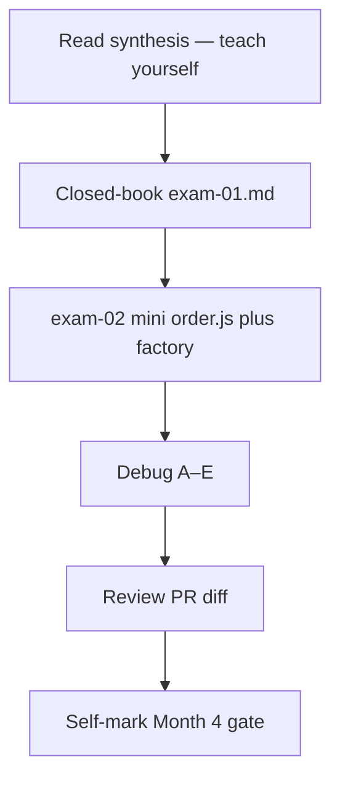
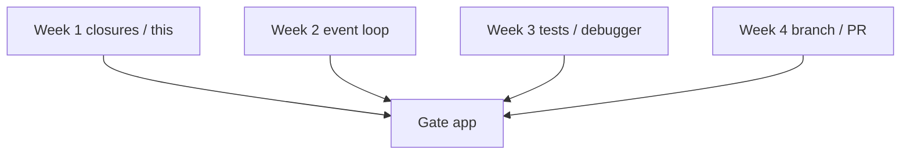
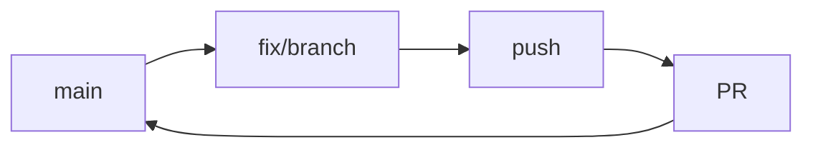

# Month 4 · Week 4 · Day 7
# Month 4 Exam + Gate

**Program:** Full-Stack Mastery · 18 months  
**Phase:** 1 — Foundations  
**Month index:** [../../README.md](../../README.md)  
**Week 4:** [1](day-01.md) · [2](day-02.md) · [3](day-03.md) · [4](day-04.md) · [5](day-05.md) · [6](day-06.md) · Day 7 (today)  
**Week rhythm today:** Monthly exam  
**Study time:** 3–4 focused hours

Textbook files stay **closed** except:

- **this file** (synthesis + exam blocks + self-mark),
- [Month 4 README](../../README.md) **for the gate table wording**,
- the **fixture README** in **your copy** (symptoms only) when you re-run the product checks — not as a source of causes.

Repair forgotten facts from **this synthesis**, not from Week 1–4 day files and not from a random JS blog.

Work in `~\fullstack-lab\month-04-exam\` for exam evidence. Do **not** start Month 5 because the calendar moved.

---

## How to read this chapter

This file is the **exam and the teacher**. The synthesis is written so a student whose Weeks 1–4 notes are foggy can still re-learn the month from **today’s pages**, then prove it with the blocks and the gate.



During blocks 1–3, other day files stay closed. If you go blank, re-read **this synthesis**. AI may not write exam-01, the mini files, or DEBUG answers.

---

## Today's contract

Teach Month 4 aloud from this synthesis and show evidence for every gate row.

**Today's gate** is the Month 4 Gate table at the end — not “I attended four weeks.”

---

## Time box

| Block | Minutes | Work |
|---|---|---|
| 0 | 25 | Read the complete explanation; speak it |
| 1 | 40 | Closed-book `exam-01.md` |
| 2 | 40 | Mini-build `order.js` + `make.js` |
| 3 | 25 | Debug A–E |
| 4 | 20 | Review PR diff |
| 5 | 20 | Re-run `npm test`; break one regression; restore |
| 6 | 15 | Design: merge vs private rebase |
| 7 | 20 | Retro + self-mark |

---

## Month 4 synthesis (the lesson, in this book)

**Names:** lexical scope; TDZ; closures as live environments; `var` loop vs `let`/factory.

**`this`:** call site; bind; arrows; prototypes; `class` as prototype sugar.

**Modules / memory:** ESM; primitives copy; objects share; shallow spread; `sort` mutates.

**Runtime:** one stack; Web APIs; drain microtasks then one task; `then` before `setTimeout(0)`; `await` yields; catch rejections.

**Quality:** arrange/act/assert; testable edges; ESLint ≠ Prettier; breakpoints show Scope.

**Git:** branches are names; merge joins; conflict markers; PR is a reviewed merge; rebase replays (do not rewrite shared `main`); revert adds an undo commit.



---

# Complete explanation — Month 4 you must still own

## 1. Scope and closures (Week 1)

A name is resolved where the function was **written**, not where it was **called**. Walk block → function → module. Missing name → `ReferenceError`.

`var` is function-scoped and hoisted as `undefined`. `let` / `const` are block-scoped; reading before init is the **temporal dead zone** (`ReferenceError`).

A **closure** is a function plus the **live** outer bindings it still needs. Two calls to `makeCounter()` create two `count`s. Closures are not snapshots: if the outer binding changes, the inner function sees the new value.

The loop bug: `for (var i = 0; i < n; i++) { buttons[i].onclick = () => use(i); }` — one `i`, final value. Fix: `let` in the `for` head (fresh binding per iteration) or a factory `makeHandler(n)` so each function closes over a **parameter**.

**Wrong belief:** “JavaScript looks up variables at the call site.”  
**Correct:** call site sets `this` (ordinary functions). Lexical scope sets `const` / `let` / `var`.

## 2. `this`, prototypes, classes

Ordinary functions: `this` from the **call**. `obj.fn()` → `this === obj`. Detached `const f = obj.fn; f()` → `undefined` in modules (strict). `bind` locks `this`. DOM `addEventListener` calls your function its way — `this` may be the element.

Arrows have no own `this`; they use the enclosing `this`. Do not use arrows as `this`-methods if you meant the object.

Prototypes: missing properties delegate up a chain to `null`. `class` puts methods on `Constructor.prototype`; instance fields belong in `constructor`. Extracting a class method still loses `this`.

## 3. Modules and memory

ES modules: file scope, named `export` / `import`, `.js` extension in the browser, HTTP not `file://`, `"type": "module"` in Node. Imports are live bindings.

Primitives copy. Objects share. `{ ...obj }` is **shallow** — nested arrays/objects are the same reference. `list.sort(...)` **mutates** `list`. Helpers that must keep caller order copy first (`[...list].sort(...)`). Tests `deepEqual` contents and snapshot order when that is the claim.

## 4. Event loop (Week 2)

One main thread. Nested calls push a **stack**. A tight `while` never empties it → no clicks, no timers, no paint.

The host holds timers, network, DOM in **Web APIs**. When ready, they enqueue work.

**Event loop:** stack empty → **drain the microtask queue** → run **one** task → maybe render → repeat.

| Queue | Examples |
|---|---|
| Microtask | `Promise.then` / `catch`, `queueMicrotask`, `await` continuation |
| Task | `setTimeout`, `setInterval`, most DOM events, `fetch` completion as a task that then queues microtasks |

Order you must know: synchronous logs first; then microtasks (`then`); then `setTimeout(0)`.

`await` yields; the rest of the async function is not “inline before the caller finishes.”

Errors: a thrown rejection should be `catch`ed. Unhandled rejection is a bug. A throw inside a timeout does not stop later timeouts (separate tasks). `fetch` without `ok` check can parse an error body as success — then a later `then` throws; that throw is on a **microtask** unless you `await` in `async` with try/catch.

## 5. Tests and quality (Week 3)

**Arrange** input, **act** one function, **assert** expected vs actual (`node:assert/strict`). One behavior per test name. Unit tests: no live network, no `document`. Inject `{ getItem, setItem }` or parse **strings**.

If the only way to know `filterOpen` works is to click, extract the function. The page calls the same function.

**Regression:** the test was **red on the bug** and **green after the fix**. A test written after the fix that never failed is a souvenir. Paste one failing assertion in `DEBUG.md`.

**Prettier** reprints layout (`--write` / `--check`). **ESLint** catches mistakes (`eqeqeq`, unused, `no-debugger`). `eslint-config-prettier` last so they do not fight. Format is not lint.

**Breakpoint:** pause on a line. **Scope:** Local (this call), Closure (outer bindings still needed), module, `this`. **Call stack:** who called you. Step over / into / out. `debugger;` then delete. Pause on exceptions for white screens. Logs lie about timing; Scope shows **now**.

## 6. Git (Week 4)

A **branch** is a movable **name** for a commit, not a second folder of files. `git switch -c fix/name` creates and moves `HEAD`. `git branch` without `switch` only creates the name.

**Merge** joins histories. Fast-forward slides a name when `main` has not moved. Otherwise a **merge commit** has two parents. Same-line edits → **conflict markers** `<<<<<<<` / `=======` / `>>>>>>>`. You delete markers, `git add`, `git commit`. `git merge --abort` only while merging.

A **pull request** is a pushed branch plus a request to merge into `main` plus a written explanation (symptom, change, tests). Solo still opens one (`gh pr create` or GitHub UI).

**Rebase** replays your commits on a new base; hashes change. Allowed as a **concept** and on a **private** unpublished branch. **Never** rebase / force-push **shared `main`**.

**Revert** adds a commit that applies the opposite patch. It does not erase history. `reset --hard` on published `main` plus force-push punishes anyone who pulled.

Commit messages: imperative, specific, why if not obvious. Not `update`.



## 7. The product gate (no answer key)

`fixtures/broken-priority-list/` was a **symptom** list. Your copy + branch + tests + PR are the evidence. This exam file will not tell you which line was wrong. If a gate row is false, repair the product — do not tick it.

---

# Block 0 — Speak the synthesis (25 min)

Out loud, this file open once, then closed:

1. Lexical scope vs `this`.  
2. Closure + loop `var` vs `let`/factory.  
3. Shallow copy + `sort` mutates.  
4. Microtask vs `setTimeout(0)`.  
5. Arrange / act / assert.  
6. ESLint vs Prettier.  
7. Scope pane sections.  
8. Branch as a name.  
9. Conflict markers.  
10. Rebase vs revert vs force-push to `main`.

If a topic is under two true sentences, it is weak — it will show up on the self-mark.

---

## Month 4 Gate (self-mark)

| # | Claim | Evidence | Pass? |
|---|---|---|---|
| 1 | Closures + loop binding explained | exam-01.md | |
| 2 | `this` detached method explained | exam-01.md | |
| 3 | Event loop order `A D C B` | exam-01.md | |
| 4 | Unit tests + one breakpoint used | DEBUG.md / SCOPE note | |
| 5 | Branch + PR | GATE-PR.txt | |
| 6 | Fixture symptoms gone | UI + tests | |
| 7 | Regression tests red→green | DEBUG.md | |

Fill this table in `exam-05-retro.md` as well. Wishful ticking is a failed exam.

---

# 1. Closed-book explanation (40 min)

`~\fullstack-lab\month-04-exam\exam-01.md` — every row of the synthesis. Include a drawn stack/queue (Mermaid or ASCII).

Also required:

- One paragraph: why `then` runs before `setTimeout(0)` in the usual `A D C B` snippet (`A`/`D` sync, `C` microtask, `B` timer) — write the snippet you mean.  
- One paragraph: detached method `this`.  
- One paragraph: `var` loop handlers.  
- Two sentences: ESLint vs Prettier.  
- Two sentences: revert vs reset on published `main`.

No editor for **product** code in this block. Prose and diagrams.

# 2. Mini-build (40 min)

`mini/order.js` — predict `setTimeout` vs `Promise.then`; `mini/make.js` factory with tests. No fixture paste.

`order.js` should **print** (or export a recorded array of strings) for:

```js
console.log("A");
setTimeout(() => console.log("B"), 0);
Promise.resolve().then(() => console.log("C"));
console.log("D");
```

Write `PREDICT.txt` **before** running. Then run. Explain mismatches from **this** synthesis.

`make.js`: `makeCounter()` (or `makeToggle`) with tests: two instances independent. `node --test`. `"type": "module"`.

# 3. Debug (25 min)

`exam-03-DEBUG.md` — **full sentences**. Labels are the exam. Write **your** causes and fixes.

**A.** All timeouts log the same `i`.  
**B.** `button.addEventListener("click", obj.method)` and `this` is the button.  
**C.** `list.sort` inside a helper; UI order stuck.  
**D.** Unhandled rejection from `fetch` without `ok` check — which queue did the throw happen on?  
**E.** Force-push to `main` — why this course forbids it.

# 4. Review your PR diff. One extra commit if a test name is vague.

# 5. Re-run `npm test` on the priority list. Break one regression; show fail; restore.

# 6. Design: when merge vs when you would rebase a **private** branch.

Write `exam-06-DESIGN.md`: merge keeps a join commit (or fast-forward); rebase replays and rewrites hashes — only if nobody else has those commits. Shared `main`: merge or GitHub squash, never force-push.

# 7. Retro. Month 5 is TypeScript + Vite/npm + **Project 3** (convert Project 2 — you write it). Do not start Month 5 if this gate is false.

```powershell
cd ~\fullstack-lab
git add month-04-exam month-04/week-04
git commit -m "Complete Month 4 exam evidence."
```

Priority-list commits stay on **its** branch / repo. Do not pretend the exam folder replaced the PR.

---

## Definition of done

- [ ] exam-01.md covers synthesis rows + stack/queue drawing
- [ ] mini `order.js` + `make.js` tests exist
- [ ] exam-03-DEBUG.md has A–E
- [ ] Self-mark table filled honestly
- [ ] GATE-PR.txt still points at a real PR (or documented fallback)
- [ ] Gate 6–7 false if you only clicked the UI and never had red tests
- [ ] Commit exists in fullstack-lab for exam evidence

---

### How to fail honestly (examples)

- Gate 1 fail: exam-01 says “closures copy values at birth” with no live-binding story.  
- Gate 2 fail: “`this` is always the object I defined the method on.”  
- Gate 3 fail: predicted `A B C D` for the `then` vs `setTimeout(0)` snippet.  
- Gate 4 fail: no pause; only `console.log`.  
- Gate 5 fail: commits on `main` only; no PR URL.  
- Gate 6 fail: README symptoms still true on HTTP.  
- Gate 7 fail: tests were written after the fix and you never saw red.

Passing is not a vibe. It is ticks with paths.

---

## If you passed

You have finished the Month 4 textbook. The standard is the gate, not “I opened the files.” Month 5 is TypeScript and frontend tooling — a typed Project 3, not a skip. Open [Month 5](../../month-05/README.md) only when every gate row is true.

## If you did not pass

Repair the failed rows. Re-run this file’s blocks that failed. Do not “move on and come back.” Month 5 will not teach conflict markers or `assert.throws`.

---

## Optional review links

Repair from this synthesis first. These pages are for later checking after the exam.

- [Month 4 README](../../README.md)
- [MDN: Closures](https://developer.mozilla.org/en-US/docs/Web/JavaScript/Guide/Closures)
- [MDN: Event loop](https://developer.mozilla.org/en-US/docs/Web/JavaScript/Event_loop)
- [Pro Git: branching](https://git-scm.com/book/en/v2/Git-Branching-Branches-in-a-Nutshell)
- [Node: test runner](https://nodejs.org/api/test.html)
