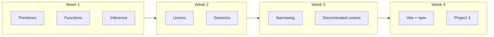
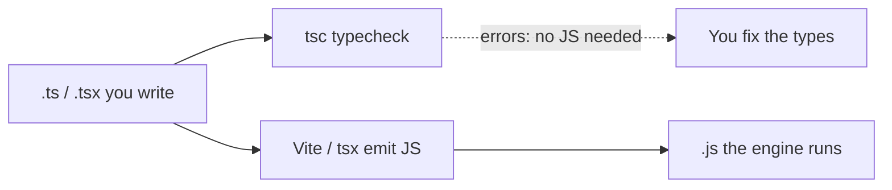

# Month 5 — TypeScript and Frontend Tooling

**Program:** Full-Stack Mastery Textbook  
**Phase:** 1 — Foundations  
**Length:** 4 weeks · 7 days each · 3–4 focused hours/day  
**Prereq:** Month 4 gate passed  
**This month’s job:** Make invalid states *harder to represent*. Use the compiler as an engineer, not as a source of red squiggles you silence with `any`. Learn the toolchain you will keep: npm, lockfiles, scripts, Vite, environment config, lint/format with TypeScript.

**Project 3** (you convert): take **your** Project 2 and rebuild it in TypeScript + Vite — redesigning data, not stamping `: any` on every line. Spec: `full_stack_project_requirements_2026/project_03_typescript_application.md`. This textbook does **not** contain the converted app.

**This textbook is the lesson.** Types, narrowing, generics, npm, and Vite are explained in the day files the same way Month 1 explained the machine: slowly, in full sentences, with pictures, then labs. If a day feels like a checklist, it is incomplete — stay until you can teach the idea out loud.

Handbook/Vite links at the end of a day are **optional review** after you already understand the chapter. They are not how you learn the first time.

These files are written to render as **web pages**: relative links, tables, and **Mermaid** diagrams.

---

## How this textbook is organized

```
month-05/
  README.md     ← you are here
  week-01/      primitives, arrays, objects, functions, inference, annotations
  week-02/      interfaces, type aliases, unions, intersections, literals, generics
  week-03/      narrowing, type guards, utility types, unknown, never, nullability, discriminated unions
  week-04/      npm, package.json, semver, lockfiles, scripts, Vite, env, lint/format
                + Project 3 (you build) + Month 5 exam
```

Labs: `~\fullstack-lab\month-05\`. Project 3 is its **own Git repository** (a Vite app), not a dump inside the lab folder.

---

## Month 5 Gate

True **without a tutorial** and **without leaning on `any`:**

1. Explain TypeScript vs JavaScript, and that **types disappear at runtime**.
2. Model an API response **and** an internal app type; transform at the boundary with a guard.
3. Use unions, narrowing, and at least one **discriminated union** for `idle | loading | success | error` (no illegal boolean combos).
4. Use a **generic** you can explain (not copy).
5. On Project 3: `npm run typecheck`, `lint`, `test`, and `build` all pass.

If any item is false, do not start Month 6.



---

## What this month must teach (complete list)

| Week | Must learn | Must practice |
|---|---|---|
| 1 | Primitive types, arrays, objects, functions, inference, annotations | `tsc --noEmit`; annotate vs infer; no `any` |
| 2 | Interfaces, type aliases, unions, intersections, literal types, generics | Model a collection; `Ok | Err` union |
| 3 | Narrowing, type guards, utility types, `unknown`, `never`, nullability, discriminated unions | Guard API JSON; `SearchState` union |
| 4 | npm, `package.json`, semver, lockfiles, scripts, Vite, env config, lint/format | Scaffold Vite+TS; convert Project 2 **yourself** |

**Avoid:** `any` to silence errors; type-level puzzles that do not serve the app.

Horizontal:

- **Debugging:** read `tsc` errors as English; they name the type that failed.
- **Documentation:** this book first.
- **Security:** untrusted JSON is `unknown` until a guard says otherwise.
- **Tests:** transform + guard tests (Project 3 spec).
- **Git:** Project 3 from commit one; small PRs if you want the Month 4 habit.

---

## Weekly rhythm and daily time box

Same as Month 1. Day 6 independent. Day 7 review. Week 4 Day 7 is the Month 5 exam + gate.

| Minutes | Block |
|---|---|
| 30–45 | Concepts from **this textbook** |
| 45–60 | Focused exercises |
| 60–90 | Independent work |
| 30–60 | Lab / Project 3 |
| 15 | Notes / recall |

---

## Tools this month

| Tool | Why |
|---|---|
| Node.js LTS + npm | Install packages, run scripts |
| TypeScript (`tsc`) | Typecheck. Source of truth for “does it typecheck?” |
| `tsx` (dev dependency, Weeks 1–3) | Run `.ts` tests without a bundler. **Does not replace `tsc`.** |
| Vite | Dev server + production bundle (Week 4 / Project 3) |
| ESLint + typescript-eslint + Prettier | Lint/format TS |
| Your Project 2 repo | Input to Project 3 — you need it |

Windows: PowerShell. Use `npx tsc`, `npx vite`, `npm run …`.

---

## How TypeScript fits (picture)



The browser and Node run **JavaScript**. Types are erased. A `string` annotation does **not** stop a lying API. That is why Week 3 teaches **guards**.

---

## Start

Open [week-01/day-01.md](week-01/day-01.md).

When Month 5’s gate is true, continue with [Month 6 — React + TypeScript](../month-06/README.md).
