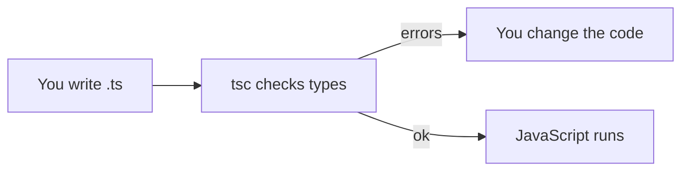
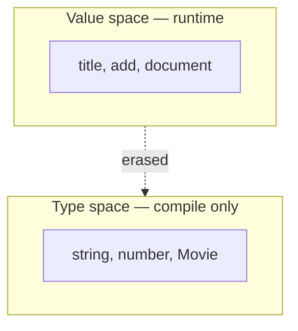

# Month 5 · Week 1 · Day 1
# What TypeScript Is: Primitives, Annotations, Inference

**Program:** Full-Stack Mastery · 18 months  
**Phase:** 1 — Foundations  
**Month index:** [../../README.md](../../README.md)  
**Week 1:** Day 1 (today) · [2](day-02.md) · [3](day-03.md) · [4](day-04.md) · [5](day-05.md) · [6](day-06.md) · [7](day-07.md)  
**Week rhythm today:** Learn + type-along  
**Student state:** Month 4 gate passed  
**Study time:** 3–4 focused hours

**This week covers:** primitive types, arrays, objects, functions, inference, annotations.

Today is the compiler as a tool: what a type *is*, how you write one, how TypeScript **infers** one, and how to run `tsc`. Arrays, object shapes, and function types deepen on Day 2. Do not skip them.

---

## How to use this month

This book is the lesson. Same rules as Months 1–4.

1. Read a section. Close it. Say the idea.
2. Type every lab. Do not paste a generated `tsconfig` you do not understand.
3. When `tsc` errors, **read the error**. It is usually naming two types that did not match.
4. Optional review links are for later rechecking on the web — not first learning.

Labs: `~\fullstack-lab\month-05\week-01\`.

---

## Today's contract

1. Explain TypeScript as **JavaScript plus a type language that is erased at compile time**.
2. Install TypeScript **locally** in a folder and run `npx tsc --noEmit`.
3. Annotate primitives: `string`, `number`, `boolean`, `null`, `undefined`, `bigint`.
4. Let the compiler **infer** when the initializer is obvious; annotate **function boundaries**.
5. Refuse `any` as a way to “make the red go away.”

**Today's gate**

> `const title: string = "Dune"` is checked **before** the file runs. At runtime there is no `: string`. A lying API can still hand you a number. Types are a design tool, not a firewall.

---

## Time box

| Block | Minutes | Work |
|---|---|---|
| A | 50 | Theory |
| B | 55 | Install + first `tsc` errors |
| C | 70 | Independent annotations |
| D | 25 | Git |
| E | 15 | Recall |

---

# Block A — Theory

## 1. Two languages in one file

A `.ts` file contains:

1. **JavaScript** that will run (after emit or bundling).
2. **Type annotations** that exist only for the compiler.

```ts
const year: number = 1965;
```

After compile, the engine sees something like `const year = 1965;`. The `: number` is gone.



**Why bother:** JavaScript will happily do `year.toUpperCase()` if `year` is actually a number at runtime — crash. TypeScript, **if you told it the truth**, refuses that call **while you type**.

> **Wrong belief:** “Once it typechecks, the data is safe.”  
> **Correct:** typecheck assumes your annotations and inferences match reality. Network JSON is not in that contract until you **validate** (Week 3).

**TypeScript is not a new runtime.** You do not deploy `tsc` to the user’s phone. You deploy JS.

---

## 2. Values vs types (two namespaces)

This is the most important picture in Month 5.

```ts
const title = "Dune";     // value
type Title = string;      // type
```

You cannot write `const x = string` and get a type. `string` (value) does not exist. You cannot write `const y: title` — `title` is a value.

Some names exist in **both** spaces (`class Counter` is a value *and* a type). Most of this month, keep them separate: `type` / `interface` for types; `const` / `function` for values.



---

## 3. Primitive types you will write

| Annotation | Meaning | Example value |
|---|---|---|
| `string` | Text | `"Dune"` |
| `number` | IEEE number (including `NaN`) | `1965` |
| `boolean` | `true` / `false` | `false` |
| `null` | Intentional empty | `null` |
| `undefined` | Missing | `undefined` |
| `bigint` | Integers beyond `Number.MAX_SAFE_INTEGER` | `10n` |
| `symbol` | Unique token | `Symbol("id")` |

There is **no** `int` vs `float`. Money in cents stays `number` (integer discipline is yours) or `bigint`.

`typeof` at runtime still has the Month 3 quirk: `typeof null === "object"`. TypeScript’s type `null` is still a distinct type.

---

## 4. Annotations vs inference

**Annotation:** you write the type.

```ts
let status: string = "idle";
```

**Inference:** you omit it; TypeScript **widens from the initializer**.

```ts
let status = "idle";
// inferred: string  (actually a string, sometimes a string literal — Day 2 / Week 2)
```

For a `const` primitive, inference is often the **literal**:

```ts
const kind = "movie";
// inferred: "movie"  (a literal type — Week 2)
```

**Rule this course uses:**

- **Variables with initializers:** prefer inference.
- **Function parameters and return types** on **exported** functions: **annotate**. That is the public contract. Callers should not have to open the function body.
- **Empty array** `const list = []` infers `never[]` or `any[]` depending on settings — **annotate** `const list: string[] = []`.

> **Wrong belief:** “More annotations = more professional.”  
> **Correct:** annotate boundaries. Let locals infer. Duplicate types everywhere is noise.

---

## 5. `any` is a surrender

```ts
let data: any = fetchThing();
data.foo.bar.baz; // tsc stays silent
```

`any` turns off checking for that value. It **infects** whatever you assign it into.

This course: **zero unjustified `any`**. If a library forces it, you document why in a comment and isolate it. Prefer `unknown` (Week 3) at JSON boundaries.

`// @ts-ignore` and `as any` are the same family. Do not use them to “go green.”

---

## 6. `tsc` and `tsconfig.json`

**TypeScript** is an npm package. Install it **in the project**, not only globally (PATH fights, version fights).

`tsconfig.json` tells `tsc` how to check. You will type this file. Each option below is explained **here**.

| Option | Meaning |
|---|---|
| `target` | Which JS features to emit *if* you emit. `"ES2022"` is fine for modern Node/browsers. |
| `module` / `moduleResolution` | How `import` works. Weeks 1–3 Node labs: `"NodeNext"` + `"NodeNext"`. Vite (Week 4) will use its own scaffold. |
| `strict` | Turns on a bundle of honest checks (`strictNullChecks`, etc.). **Always true** in this course. |
| `noEmit` | Only check; do not write `.js`. Weeks 1–3: true. Vite emits instead. |
| `skipLibCheck` | Do not typecheck all of `node_modules`. Faster; normal. |
| `include` | Which files belong to the program. |

`npx tsc --noEmit` is the **typecheck**. A file that `tsx` can *run* can still fail `tsc`. **`tsc` is the gate**, not the runner.

---

# Block B — Type-along

```powershell
mkdir ~\fullstack-lab\month-05\week-01\day-01
cd ~\fullstack-lab\month-05\week-01\day-01
npm init -y
npm install --save-dev typescript tsx
```

`package.json` — add scripts (merge with what `npm init` wrote; keep `"type": "module"`):

```json
{
  "type": "module",
  "scripts": {
    "typecheck": "tsc --noEmit",
    "test": "tsx --test"
  }
}
```

`tsconfig.json` — type this (comments are allowed in tsconfig):

```json
{
  "compilerOptions": {
    "target": "ES2022",
    "module": "NodeNext",
    "moduleResolution": "NodeNext",
    "strict": true,
    "noEmit": true,
    "skipLibCheck": true
  },
  "include": ["./**/*.ts"]
}
```

`values.ts`:

```ts
export const title: string = "Dune";
export const year: number = 1965;
export const classic: boolean = true;

export const inferred = "ok";

export function label(year: number): string {
  return `Year ${year}`;
}

// Uncomment one at a time, run typecheck, read the error, recode.
// export const broken: number = "1965";
// export const also = title.toFixed(0);
```

```powershell
npx tsc --noEmit
```

Uncomment `broken`. Read the error in English: it expected `number`, got `string`. Write that sentence in `ERRORS.txt`. Fix by converting **on purpose** (`Number(...)`) or by changing the annotation — **not** `as any`.

`values.test.ts`:

```ts
import assert from "node:assert/strict";
import { test } from "node:test";
import { label } from "./values.ts";

test("label includes the year", () => {
  assert.equal(label(1965), "Year 1965");
});
```

NodeNext often wants the `.ts` extension in imports when you run with `tsx`, or `.js` extension meaning “the emit name.” If `tsx` complains, try `from "./values.js"` (TypeScript’s usual style: import paths look like the **output** file). Record which worked in `IMPORTS.txt`. The rule: **one style per project**, consistent.

```powershell
npm test
npm run typecheck
```

---

# Block C — Independent

`grade.ts` — port Month 3 `letter` / `classifyAge` **with types**:

- `classifyAge(n: number): "invalid" | "child" | "teen" | "adult"`
- Tests including that a **string** argument is a **type error** (you do not write a test for that — `tsc` is the test). In `NOTES.txt`: how you would still reject `"18"` at **runtime** if it came from an input (`typeof n !== "number"`).

No `any`.

```powershell
cd ~\fullstack-lab
git add month-05/week-01
git commit -m "Week 1 Day 1: TypeScript primitives, tsc, classifyAge types."
```

---

## Definition of done

- [ ] `npm run typecheck` is green
- [ ] `ERRORS.txt` quotes a real `tsc` message in your words
- [ ] No `any`
- [ ] Tests run via `tsx --test` (or the import style you documented)

---

## Optional review links

Primitives, inference, and `tsc` are explained above.

- [TypeScript Handbook: Everyday Types](https://www.typescriptlang.org/docs/handbook/2/everyday-types.html)
- [tsconfig `strict`](https://www.typescriptlang.org/tsconfig/#strict)

---

## Tomorrow

Arrays, object types, and function types in full: `string[]`, `{ title: string }`, optional properties, `void`, callbacks.
