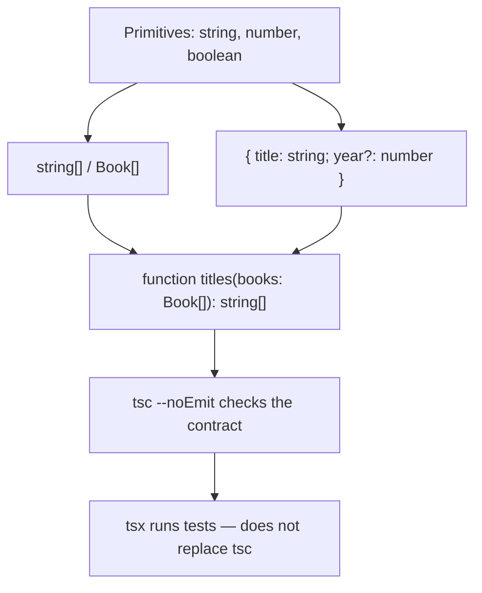
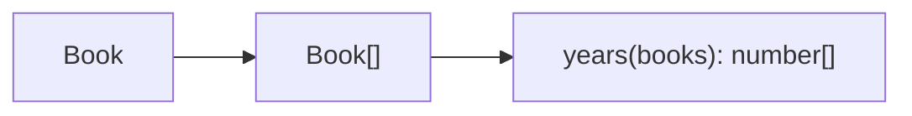

# Month 5 · Week 1 · Day 2
# Arrays, Object Types, and Functions

**Program:** Full-Stack Mastery · 18 months  
**Phase:** 1 — Foundations  
**Month index:** [../../README.md](../../README.md)  
**Week 1:** [1](day-01.md) · Day 2 (today) · [3](day-03.md) · [4](day-04.md) · [5](day-05.md) · [6](day-06.md) · [7](day-07.md)  
**Week rhythm today:** Learn + type-along  
**Student state:** Day 1 gate passed. You can install TypeScript locally, run `npx tsc --noEmit`, annotate primitives, and refuse `any`. Today the types get **structure**: lists, shapes, and call signatures.  
**Study time:** 3–4 focused hours

**This week covers:** primitive types, arrays, objects, functions, inference, annotations.

Today: `string[]`, object types, optional `?`, function types, `void`, callbacks. Day 1 was the compiler as a tool. Day 3 is from memory — do not skip the labs.

Project 3 is **not** this week. This textbook never contains the converted app. Labs: `~\fullstack-lab\month-05\`.

---

## How to use this textbook

1. Read a section. Close it. Say the idea in TypeScript words (`string[]`, `year?: number`, `void`), not “I kinda get objects.”
2. Type every lab. Do not paste a generated `Book` type you cannot explain.
3. When `tsc` errors, **read the error**. It is usually naming two types that did not match.
4. Optional review links are for later rechecking on the web — not first learning.

Labs: `~\fullstack-lab\month-05\week-01\`.

---

## How to read this chapter

A **primitive** is one value. An **array** is many values of one element type. An **object type** is a named bag of properties. A **function type** is “what you may pass in, and what comes out.”

Day 1 taught `string` and inference. Today those pieces **compose**. If you only remember `const title: string`, you cannot type a catalog, a cart, or Project 3’s saved list.



The dangerous part is not the brackets. It is **empty arrays** (inference goes wrong), **optional vs always-present-undefined**, and **mutating** an array the type said was yours to share.

---

## Today's contract

By the end of this day you will be able to:

1. Annotate `string[]` and prefer it over `Array<string>` in this course.
2. Write an object type `{ title: string; year: number }` and a `type` alias for it.
3. Explain `year?: number` as **missing or `undefined`**, not “maybe a string.”
4. Annotate function parameters and returns on **exported** helpers; use `void` for side-effect functions.
5. Pass a callback with a function type `(title: string) => string`.
6. Keep helpers **immutable**: `addBook` returns a **new** array.

**Today's gate**

> `string[]` is an array of strings. `{ title: string; year: number }` is an object type. Optional is `year?: number` — present or `undefined`, not “maybe a string.” Function types name parameters and returns. `void` means “no useful return.”

If you cannot say that closed-book, stay here. Day 3’s cart will not hide a mushy `any[]`.

---

## Time box

| Block | Minutes | Work |
|---|---|---|
| A | 55 | Theory: arrays, objects, functions |
| B | 50 | Type-along: first `Book[]` + `tsc` error |
| C | 70 | Independent: `books.ts` + tests |
| D | 20 | Git |
| E | 15 | Recall |

---

# Block A — Theory

## 1. Arrays

An array type names **what each element is**.

```ts
const titles: string[] = ["Dune", "Dune Messiah"];
const years: Array<number> = [1965, 1969]; // same idea; prefer `number[]`
```

`titles.push(1965)` is a type error: `number` is not `string`. `titles[0].toUpperCase()` is allowed because index `0` is typed as `string`.

Reading past the end is still JavaScript: `titles[99]` is `string` to TypeScript (not `string | undefined` unless you turn on `noUncheckedIndexedAccess` — this course does **not** require that flag yet). Runtime can still be `undefined`. Do not treat `tsc` green as “the index exists.”

**Empty array:** inference has nothing to look at.

```ts
const ids = [];
// often never[] under strict — then ids.push("a") is an error
```

**Annotate:** `const ids: string[] = []`.

> **Wrong belief:** “`any[]` is a fine list until I know the type.”  
> **Correct:** if you do not know yet, you do not have a list of a type. Use a named type or `unknown[]` and narrow (Week 3). `any[]` turns the checker off for every element.

**Tuples** (fixed length, per-index types):

```ts
const pair: [string, number] = ["Dune", 1965];
```

`pair[0]` is `string`. `pair[1]` is `number`. Do not fake a tuple with `string[]` if position 0 is always a title and position 1 is always a year.

**`readonly string[]`:** no `push`, no `splice`. Useful for function parameters you must not mutate. Runtime can still cheat with a cast; the type is a **discipline**, not a lock. Pair it with Month 4’s immutable helpers: return a **new** array.

```ts
function titlesOf(books: readonly { title: string }[]): string[] {
  return books.map((b) => b.title);
}
```

---

## 2. Object types

An object type lists **property names and their types**.

```ts
const book: { title: string; year: number } = {
  title: "Dune",
  year: 1965,
};
```

**Excess property check:** an **object literal** assigned to a typed variable may not have extra keys. `titel` (typo) is an error. That is a gift. Nested variables can sneak extras through (freshness rules) — still prefer named types so the intended shape is obvious.

**Optional:**

```ts
type Book = {
  title: string;
  year?: number;
};
```

`book.year` has type `number | undefined`. You must narrow before using it as `number` (Week 3). Do not write `year: number | undefined` unless you mean the key is **always present** with value `undefined`. Those are different JSON shapes: missing key vs `"year": null` vs `"year": undefined` (the last often disappears in `JSON.stringify`).

| You write | When you read `book.year` | Typical JSON |
|---|---|---|
| `year?: number` | `number \| undefined` | key may be absent |
| `year: number \| undefined` | same union | key expected; value may be `undefined` |
| `year: number \| null` | `number \| null` | key present; `null` is a real value |

Project 3 will split **remote** (messy optionals) from **internal** (strict after transform). Today you only need: `?` is a product decision, not decoration.

**Index signatures** (`{ [id: string]: Book }`) exist. Prefer `Map` or a typed `Record<string, Book>` (Week 3 utilities) over a grab-bag object. A string index means **every** string key is a `Book`, including typos.

> **Wrong belief:** “Optional means the value might be the wrong type.”  
> **Correct:** optional means the **property may be missing**. The type when present is still `number` in `year?: number`. A string year from an API is a **different type** (`string`), not “optional number.”

---

## 3. Function types

```ts
function add(a: number, b: number): number {
  return a + b;
}

const add2 = (a: number, b: number): number => a + b;
```

**Parameter types are required** for exported functions (inference cannot see callers first in a useful way). **Return inference** often works; still annotate **exports**. That is the public contract. Callers should not have to open the body.

```ts
function logTitle(title: string): void {
  console.log(title);
}
```

`void` = callers must not use the return value. Returning `undefined` explicitly is different from `void` in some assignability rules — for this course, `void` on side-effect functions. A function that returns `string | undefined` is **not** `void`; it has a useful absence.

**Callbacks:**

```ts
function mapTitles(
  books: { title: string }[],
  fn: (title: string) => string,
): string[] {
  return books.map((b) => fn(b.title));
}
```

The callback’s parameters can infer from `fn`’s type. You may write `books.map((b) => b.title)` and `b` infers from `books`.

**Rest:** `function sum(...nums: number[]): number`.

**Optional param:** `function greet(name?: string)` — `name` is `string | undefined`. Default: `function greet(name: string = "friend")` — callers may omit; inside, `name` is `string`.

**`this`:** you will almost never annotate `this` in this month’s labs. If a callback needs `this`, prefer an arrow function so `this` is lexical — same Month 3 lesson, now typed.

---

## 4. Type aliases (preview — Week 2 deepens)

Repeating `{ title: string; year: number }` is how bugs drift. Name it:

```ts
type Book = {
  title: string;
  year: number;
};

export function years(books: Book[]): number[] {
  return books.map((b) => b.year);
}
```

`type` is an alias. Tomorrow’s recap uses it. Week 2: `interface` vs `type`, unions.



Inference vs annotation **still** applies: locals inside `years` can infer; the **boundary** (`books: Book[]`, return `number[]`) is annotated.

> **Wrong belief:** “More annotations = more professional.”  
> **Correct:** annotate boundaries. Let locals infer. Duplicate inline object types in ten functions is how `year` becomes `string` in one place and `number` in another.

---

## 5. `tsc` vs `tsx` (unchanged, still the gate)

`npx tsc --noEmit` is the **typecheck**. `tsx --test` **runs** JavaScript (after a transform). A file that `tsx` can run can still fail `tsc`. **`tsc` is the gate**, not the runner.

`any` is still a surrender. `as any` on a book literal to “make addBook accept `titel`” is cheating. You will cause a type error on purpose today and **read** it.

---

# Block B — Type-along

Reuse Day 1 folder layout (`package.json`, `tsconfig`, `tsx`). New folder:

```powershell
mkdir ~\fullstack-lab\month-05\week-01\day-02
cd ~\fullstack-lab\month-05\week-01\day-02
npm init -y
npm install --save-dev typescript tsx
```

Same `package.json` scripts and `tsconfig.json` as Day 1 (`strict`, `noEmit`, `NodeNext`). Copy the files you typed yesterday if you want — **type** `tsconfig` again if you copy-paste without reading.

`demo.ts` — smallest array + object + function:

```ts
type DemoBook = { title: string; year?: number };

export function titles(books: DemoBook[]): string[] {
  return books.map((b) => b.title);
}

export function addBook(list: DemoBook[], book: DemoBook): DemoBook[] {
  return [...list, book];
}
```

```powershell
npx tsc --noEmit
```

Uncomment in a scratch file (or a commented block you enable):

```ts
addBook([], { titel: "x", id: "1" });
```

Read the error in English. Write that sentence in `ERRORS.txt`. Do **not** fix it with `any`.

---

# Block C — Independent

`books.ts` + `books.test.ts`:

- `type Book = { id: string; title: string; year?: number }`
- `titles(books: Book[]): string[]`
- `addBook(list: Book[], book: Book): Book[]` — **new array**, no mutate (Month 4)
- Tests with `assert.deepEqual`

Cause a type error on purpose: `addBook(list, { titel: "x", id: "1" })`. Paste the `tsc` line into `ERRORS.txt`.

Tests must prove:

1. `titles` returns titles in order.
2. `addBook` returns a list with one more book.
3. The **input** array is unchanged (same Month 4 mutation test: keep a copy or assert `list.length` after the call).

`year` omitted is allowed. `year: "1965"` (string) is a type error — do not write a runtime test for that; **`tsc` is the test**.

No `any`.

```powershell
npm test
npm run typecheck
```

```powershell
cd ~\fullstack-lab
git add month-05/week-01
git commit -m "Week 1 Day 2: Book type, arrays, immutable add."
```

---

# Block E — Recall

Close the editor. Answer:

1. Why must `const ids = []` be annotated?
2. `year?: number` vs `year: number | undefined` — when do you mean which?
3. What does `void` tell the caller?
4. Why is `addBook` returning a new array part of the **type** story, not only a Month 4 story?
5. Does a green `tsx` run prove the types?

If any answer is mush, re-read that subsection. Do not start Day 3.

---

## Definition of done

- [ ] `npm run typecheck` is green
- [ ] `titles` and `addBook` are fully annotated at the export boundary
- [ ] Mutation test: input list unchanged
- [ ] `ERRORS.txt` quotes a real `tsc` message for `titel` (your words)
- [ ] No `any`
- [ ] Tests run via `tsx --test` (or the import style you documented on Day 1)

---

## Optional review links

Arrays, object types, and function types are explained above.

- [Handbook: Object Types](https://www.typescriptlang.org/docs/handbook/2/objects.html)
- [Handbook: Functions](https://www.typescriptlang.org/docs/handbook/2/functions.html)
- [Handbook: Everyday Types](https://www.typescriptlang.org/docs/handbook/2/everyday-types.html)

---

## Tomorrow

From memory: a typed **cart** (`Line`, `Cart`, immutable `addLine`). Days 1–2 stay closed during the drills. Repair from **this textbook**, not from a blog.
