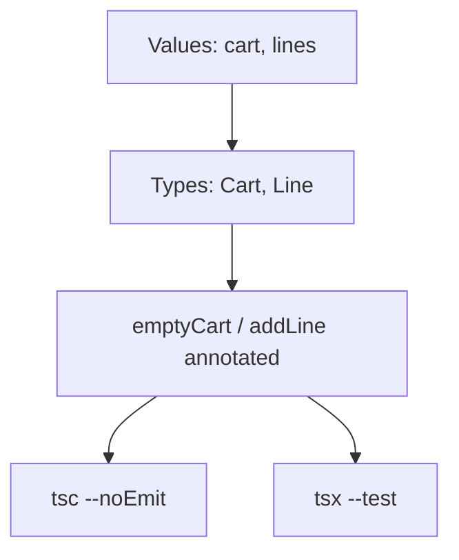
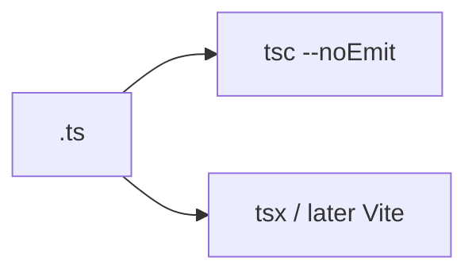

# Month 5 · Week 1 · Day 3
# From Memory: Annotate a Module

**Program:** Full-Stack Mastery · 18 months  
**Phase:** 1 — Foundations  
**Month index:** [../../README.md](../../README.md)  
**Week 1:** [1](day-01.md) · [2](day-02.md) · Day 3 (today) · [4](day-04.md) · [5](day-05.md) · [6](day-06.md) · [7](day-07.md)  
**Week rhythm today:** Implement from memory  
**Study time:** 3–4 focused hours  
**Student state:** You annotated primitives on Day 1 and arrays/objects/functions on Day 2. Today those ideas must live in your fingers.  
**Machine today:** Windows PowerShell, Node.js 20+  
**Days 1–2 of this week:** closed during the drills. Repair from **those day files in this textbook**, not from a blog.

---

## How to read this chapter

Day 1 and Day 2 had type-along scripts. During the drills they stay **closed**. This file contains a recap so you are not sent to another site to learn.

TypeScript is **JavaScript plus a type language that is erased**. Today you rebuild a Month 3 **cart** with types — from this page.



Allowed:

- The complete explanation in this file
- Your own notes in `fullstack-lab`
- The `tsc` error in front of you

Not allowed:

- Pasting a finished `cart.ts` from AI
- Copying Day 1–2 lab files
- Browsing the Handbook as the teacher
- Writing `any` to go green

If you are stuck **more than 25 minutes** on one task, open **only** the matching Day 1 or Day 2 section **in this textbook**, read it, close it, continue from memory. Record what you had to look up in `lookups.txt`.

There is **no complete solution** in this file. The module is specified. You write it.

---

## Complete explanation (this book is the lesson)

This section **is** the lesson. Read a paragraph. Close it. Say it in one honest sentence. Then type the spec.

### Two languages, one file

TypeScript = JavaScript + a **type language erased at emit**. After compile, `: string` is gone. A lying API can still hand you a number. Types are a design tool, not a firewall. Week 3 teaches **guards**. Today you type **your** code.

**`tsc --noEmit`** is the check. Runtime is still JS. **`tsx` runs tests; it does not replace `tsc`.**

> **Wrong belief:** “Once it typechecks, the data is safe.”  
> **Correct:** typecheck assumes your annotations and inferences match reality. Network JSON is not in that contract until you validate.

### Value space vs type space

`const x` is a value. `type X` is a type. You cannot write `const y: x`. Some names exist in both spaces (`class`); this week, keep them separate.

### Primitives, inference, annotation

**Primitives:** `string`, `number`, `boolean`, `null`, `undefined`. (`bigint` / `symbol` exist; you rarely need them this week.)

**Rule:** infer locals with obvious initializers. **Annotate exported function parameters and returns.** Empty arrays: **annotate** (`const lines: Line[] = []`). `const kind = "movie"` may infer the **literal** `"movie"` — Week 2 names that; today, do not fight it.

> **Wrong belief:** “More annotations = more professional.”  
> **Correct:** annotate boundaries. Duplicate types everywhere is noise.

### `any` infects

`any` turns checking off and spreads. Zero unjustified `any`. `as any` and `// @ts-ignore` are the same family. Prefer `unknown` at JSON boundaries (Week 3). Today there is no JSON — so there is no excuse.

### Arrays, objects, optional

**Arrays:** `string[]`. Prefer that spelling over `Array<string>`. `titles.push(1965)` is a type error if `titles` is `string[]`.

**Objects:** `{ title: string; year?: number }`. Name it with `type Line = { ... }` so the cart does not drift.

**Optional `?`:** the key may be **missing**. Reading it yields `T | undefined`. That is not “maybe a string.” A string quantity from a form is a **different type**; convert at the **caller**, or reject.

Excess property checks on **object literals** catch `titel`. That is today’s favorite `tsc` gift.

### Functions

`(a: number, b: number) => number`. `void` for side effects (callers must not use the return). Optional param `name?: string` is `string | undefined` inside.

### `tsconfig`

`strict: true`, `noEmit: true` in these labs. `module` / `moduleResolution`: `NodeNext` as on Day 1. `tsx` **runs**; it does not replace `tsc`.



### Immutability (Month 4, now typed)

`addLine` takes a `Cart` and returns a **new** `Cart`. Do not `cart.lines.push`. Copy: new object, new array, new line object if you change `qty`. Types do **not** freeze the object unless you write `readonly` (preview). Discipline is still yours. Tests must prove the input cart is unchanged.

> **Wrong belief:** “I’ll push onto `cart.lines` because the type says `Line[]` and arrays are mutable.”  
> **Correct:** the type allows mutation; the **module contract** does not. Return a new `{ lines: [...] }`.

---

## Worked increment (before you type it)

Start `emptyCart()` → `{ lines: [] }`. First `addLine(c, { id: "a", name: "Ada" })` → one line, `qty` 1. Same id again → still one line, `qty` 2. New id `"b"` → two lines.

Copy-on-write for the matching line: `{ ...line, qty: line.qty + 1 }`. If you mutate `line.qty += 1` on an object that still lives in the old cart, the mutation test fails — or worse, stays green because the snapshot aliased.

`tsc` is the test that `{ id: 1, name: "x" }` cannot be passed. You do not write a runtime test for that. `tsx` will not catch it if you never pass a number id.

---

## Office hours — `any` to go green, aliased carts, and tsx-only gates

**`addLine(cart: any, item: any)`.** Excess property checks die. `titel` compiles. Remove `any`. Read the error. Fix the call site or the type.

**Mutation test aliases.** `const snapshot = cart` or `snapshot.lines === cart.lines`. Map a shallow clone of the cart and each line, or `deepEqual` a structured clone you built by hand. Month 4 Day 5 again.

**Only `tsx --test`.** Happy tests, `titel` still legal if you never typecheck. Both scripts. `npm run typecheck` is `tsc --noEmit`.

**Copied Day 2 `tasks.ts`.** Different product. `Line` and `Cart` are today’s names. Do not paste `priority: 1 | 2 | 3` into a cart.

**Windows `npx tsc` uses a global.** Run from the project folder. Prefer `npm run typecheck`. Node.js 20+.

---

## Today's contract

Rebuild Week 1 skills as if this were a lab exam.

**Today's gate**

> `emptyCart` and `addLine` are fully annotated. `npm run typecheck` is green. Adding the same `id` twice increments `qty`. The input cart is not mutated. No `any`.

If you cannot, stay here. Day 4’s task helpers will not hide a mushy untyped `list`.

---

## Time box

| Block | Minutes | Work |
|---|---|---|
| A | 25 | Closed-book oral review (no typing yet) |
| B | 40 | Memory drills: annotate a tiny module |
| C | 80 | Spec: `cart.ts` + tests |
| D | 30 | Cause a type error; read it |
| E | 20 | Git + lookups |

---

# Block A — Speak first

Out loud, no notes, no editor:

1. What is erased at compile time?
2. Inference vs annotation — where do you annotate?
3. Why is `any` a surrender?
4. `string[]` vs `Array<string>` — which does this course prefer?
5. What does `year?: number` mean when you **read** `book.year`?
6. Why must `const list = []` be annotated?
7. `tsc --noEmit` vs `tsx --test`.

If any answer is mush, re-read that subsection above. Do not start the spec yet.

---

# Block B — Memory drills

Create `~\fullstack-lab\month-05\week-01\day-03\warm.ts`. From this recap only:

1. `type Item = { id: string; n: number }`.
2. `function ids(items: Item[]): string[]` returning ids.
3. An empty array annotated `Item[]`.
4. A commented line that would be a type error (`ids([{ id: 1, n: 0 }])`).

`package.json` / `tsconfig.json` as Day 1 (`strict`, `noEmit`, `tsx`). Run `npx tsc --noEmit`. Write `PREDICT.txt` **before** you uncomment the bad line: what you think `tsc` will say. Then uncomment, run, write `ACTUAL.txt`. Fix by **not** using `any`.

---

# Spec: `day-03/cart.ts` from memory (Month 3 cart, typed)

Folder: `~\fullstack-lab\month-05\week-01\day-03\`.

- `type Line = { id: string; name: string; qty: number }`
- `type Cart = { lines: Line[] }`
- `emptyCart(): Cart`
- `addLine(cart: Cart, item: { id: string; name: string }): Cart` — immutable; increment qty if id exists
- Tests. `npm run typecheck` green. No `any`.

Worked behavior (you type the code; this table is the answer key):

| Start | Call | Result lines |
|---|---|---|
| empty | `addLine(c, { id: "a", name: "Ada" })` | one line, `qty` 1 |
| that cart | `addLine(c2, { id: "a", name: "Ada" })` | still one line, `qty` 2 |
| that cart | `addLine(c3, { id: "b", name: "Bob" })` | two lines |

`qty` starts at **1** for a new id. Increment by **1** when the id already exists. Do not invent a `qty` argument today unless you also type it and test it — the spec above does not require it.

**Immutability:** after `const next = addLine(cart, item)`, `cart.lines` is the same length as before, and `cart === next` is **false**. Nested: do not mutate a `Line` that still lives in the old cart. Copy-on-write: map the matching line to `{ ...line, qty: line.qty + 1 }`.

Tests with `node:assert/strict` and `node:test`, run via `tsx --test`. Cover empty cart, first add, increment, second id, and mutation.

```powershell
cd ~\fullstack-lab\month-05\week-01\day-03
npm run typecheck
npm test
```

```powershell
cd ~\fullstack-lab
git add month-05/week-01/day-03
git commit -m "Day 3: typed cart from memory."
```

---

# Block D — A type error on purpose

In a file you do **not** leave green (or a commented example in `ERRORS.txt` only): pass a line with `titel` instead of `name`, or `qty` as a string. Run `tsc`. Quote the message in your words.

If you opened Day 1–2, `lookups.txt` lists the section titles. Tomorrow you repair those, not a random blog.

---

# Block E — Recall

Close the files. Answer:

1. Why `emptyCart(): Cart` is annotated even though the body is obvious.
2. How increment-if-id-exists is an **algorithm** the types do not invent for you.
3. `tsc` vs `tsx`.

---

## Worked walkthrough — increment without sharing a Line

```ts
const c0 = emptyCart();
const c1 = addLine(c0, { id: "a", name: "Ada" });
const c2 = addLine(c1, { id: "a", name: "Ada" });
```

`c0.lines.length` is `0` after both adds. `c1.lines[0].qty` is `1` after the second add. `c2.lines[0].qty` is `2`. If `c1` also shows `qty` 2, you mutated the line object that still lives in `c1`. Map `{ ...line, qty: line.qty + 1 }` for the match; copy other lines by reference **only if you will not mutate them** — safest is a new array always.

**Warm-up PREDICT.** Uncomment `ids([{ id: 1, n: 0 }])`. You should expect `tsc` to name `number` vs `string` on `id`. If ACTUAL is silence, `strict` is off or you used `any`. Fix the config, not the call with `as`.

**Windows.** `cd ~\fullstack-lab\month-05\week-01\day-03` then `npm run typecheck` and `npm test`. Node.js 20+. No Vite today. No Project 3 paste.

---

## Definition of done

- [ ] `emptyCart` and `addLine` fully annotated
- [ ] Same `id` increments `qty`; new `id` appends
- [ ] Input `Cart` not mutated (test)
- [ ] `npm run typecheck` green; `npm test` green
- [ ] No `any`
- [ ] PREDICT written before ACTUAL on the warm-up
- [ ] Commit exists

---

## Stalls and repair — any to go green, aliased carts, tsx-only

If `addLine` is annotated `any`, excess property checks die. Remove `any`. Read `tsc`. Fix the call site or the type. `as any` and `@ts-ignore` are the same family.

If `c1.lines[0].qty` became 2 after a second `addLine` that should only change `c2`, you mutated a shared `Line`. Map `{ ...line, qty: line.qty + 1 }`. Snapshot tests must clone items, not alias `cart.lines`.

If only `tsx --test` is green, `titel` can still be legal. `npm run typecheck` is `tsc --noEmit`. Both. `tsx` does not replace `tsc`.

If warm-up PREDICT is missing, you uncommented first. Write PREDICT, then uncomment, then ACTUAL. Fix without `any`.

If you pasted Day 2 `tasks.ts`, stop. `Line` / `Cart` / `qty` are today’s names. No Vite. No Project 3. No React.

If `npx tsc` uses a global, `cd` into `day-03` and prefer `npm run typecheck`. Node.js 20+. `strict` and `noEmit` as Day 1.

Windows:

```powershell
cd ~\fullstack-lab\month-05\week-01\day-03
npm run typecheck
npm test
```

Empty arrays: annotate `Line[]`. Infer locals. Annotate exported params and returns.

---

## Last forty minutes

Cart table: empty → first add qty 1 → same id qty 2 → new id two lines. Input cart unchanged. `cart === next` is false. No `any`. PREDICT before ACTUAL on the warm-up. `ERRORS.txt` quotes `titel` or string qty.

`emptyCart(): Cart` is annotated because it is an export boundary even if the body is obvious. Increment-if-id-exists is an algorithm types do not invent. `tsc` vs `tsx`: check vs run.

`lookups.txt` lists section titles if you opened Day 1–2. Commit `month-05/week-01/day-03`. Node.js 20+. No Vite. No Project 3. Tomorrow: typed task helpers, `design.txt` first.

---

## Optional review links

Primitives, arrays, objects, functions, inference, and `tsc` are explained in this chapter. These pages are for later checking, not for first learning.

- [TypeScript Handbook: Everyday Types](https://www.typescriptlang.org/docs/handbook/2/everyday-types.html)
- [Handbook: Object Types](https://www.typescriptlang.org/docs/handbook/2/objects.html)

---

## Tomorrow

Typed **task helpers**: `addTask`, `toggleDone`, `filterOpen`, `sortByPriority`, with `priority` as `1 | 2 | 3` if you can. Design first in `design.txt`. Days 1–3 stay available as repair, not as paste.
