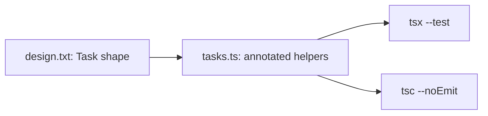
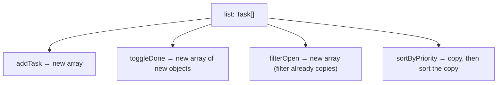
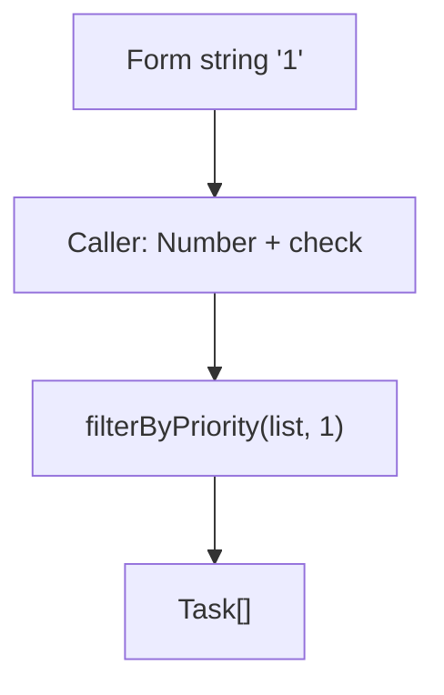

# Month 5 · Week 1 · Day 4
# Lab: Type the Task Helpers

**Program:** Full-Stack Mastery · 18 months  
**Phase:** 1 — Foundations  
**Month index:** [../../README.md](../../README.md)  
**Week 1:** [1](day-01.md) · [2](day-02.md) · [3](day-03.md) · Day 4 (today) · [5](day-05.md) · [6](day-06.md) · [7](day-07.md)  
**Week rhythm today:** Add a real lab feature  
**Study time:** 3–4 focused hours  
**Prereq:** Day 3 gate. You can type a cart from memory, run `tsc --noEmit`, and keep helpers immutable.

Port Month 4’s **idea** of task helpers — not the broken fixture. You type a **correct** immutable module.

Project 3 is **not** today. This textbook never contains the converted app.

---

## How to read this chapter

Until today, labs were small: classify, books, cart. Real modules **name the data** (`Task`) and **name the operations** (`addTask`, `toggleDone`, `filterOpen`, `sortByPriority`). The types are the product’s vocabulary. Tests prove behavior. `tsc` proves you cannot pass a typo object from typed code.

Picture two rooms:

- **Logic room:** “What is a Task?” “What does toggle return?” No DOM. `tsx` can run this.
- **UI room:** later Vite, later Project 3. Not this week.

Today you build the logic room. Tomorrow you treat **`tsc` as a test** next to unit tests.



Read Block A until you can say, without looking, why `priority` should be `1 | 2 | 3` (or `number` with a comment if you cannot write a union yet), and why `"1"` from a form is the **caller’s** conversion problem. Then type the spec. Do not paste.

---

## Today's contract

By the end of this day you will be able to:

1. Write `type Task` with `id`, `title`, `done`, and `priority`.
2. Annotate every exported function’s parameters and returns.
3. Keep every helper **immutable** (new array / new object).
4. Filter and sort without mutating the input.
5. Make string-vs-number priority visible in the types (`filterByPriority` does not silently accept `"1"`).

**Today's gate**

> Exported functions are fully annotated. Mutation tests exist. No `any`. `npm run typecheck` and `npm test` are green.

If `tasks.ts` is untyped JS with a few colons, you have not typed the module. Stay here.

---

## Time box

| Block | Minutes | Work |
|---|---|---|
| A | 45 | Theory: literals preview, immutability, conversion at the edge |
| B | 30 | Type-along: smallest `Task` + `addTask` |
| C | 80 | Feature spec: `design.txt` + `tasks.ts` + tests |
| D | 20 | Git |
| E | 15 | Recall |

---

# Block A — Theory

## 1. Design first (`design.txt`)

Types are easier when you decide the product **in words** before the editor’s red squiggles train you to add `any`.

Write `design.txt` **before** `tasks.ts`:

1. `priority` is `1 | 2 | 3` (literal union — Week 2 will name it; you may write `number` today **or** the union if you remember). Prefer the union if `tsc` allows your comparisons.
2. `id: string`, `title: string`, `done: boolean`.
3. Every function lists parameter and return types.
4. No mutate of the input array.

A **literal union** `1 | 2 | 3` means those three numbers — not `4`, not `"1"`. That is the Month 4 bug made **visible**: `===` between string `"1"` and number `1` was always false. If the helper only accepts `1 | 2 | 3`, the form’s `"1"` is a type error until the **caller** converts (`Number` + a check).

> **Wrong belief:** “I’ll type `priority: number | string` so the form is easier.”  
> **Correct:** that re-hides the bug. Convert at the edge. The core stays `1 | 2 | 3`.

Week 2 will call this a **literal type**. Today you may write it anyway. If `tsc` fights you on comparisons, `number` plus a comment in `design.txt` is honest — then try the union again before you commit.

---

## 2. Why immutability is a type-adjacent habit

TypeScript will happily type `list.push(task)` if `list` is `Task[]`. The compiler is not your architecture. Month 4 already required **new arrays**. Types make the **inputs** honest; they do not freeze them.

```ts
export function addTask(list: Task[], task: Task): Task[] {
  return [...list, task];
}
```

`toggleDone` maps to new objects: `{ ...task, done: !task.done }` for the matching `id`. Do not `task.done = !task.done` on the object that still sits in the old array.

`sortByPriority` must **copy** then sort: `[...list].sort(...)`. `Array.prototype.sort` mutates. That is a classic “types were green, the test was red” bug.



---

## 3. Filter signatures that tell the truth

`filterOpen(list: Task[]): Task[]` — tasks where `done === false`.

`filterByPriority(list: Task[], priority: 1 | 2 | 3 | "all"): Task[]` — if `"all"`, return a **copy** (or the same filtered-open policy you document). If a number, keep tasks with that priority.

If a form would give `"1"`, conversion is the **caller’s** job (`Number` + a check). Do not silently accept `"1"` inside `filterByPriority` without documenting it — the Month 4 bug was `===` between string and number. Types should make that visible: `filterByPriority(list, priority: 1 | 2 | 3 | "all")`.

`sortByPriority`: lower number first (1 before 3). Stable enough for tests: two tasks with the same priority may keep relative order if you only sort by priority.

---

## 4. Inference vs annotation on this module

Inside `filterOpen`, `task` infers from `list`. You still annotate `list: Task[]` and the return `Task[]` on the export.

Do not annotate every `.map` callback parameter unless you want noise. Do annotate **`Task`**, **`addTask`**, **`toggleDone`**, **`filterOpen`**, **`sortByPriority`**, **`filterByPriority`**.

No `any`. Empty list: `const list: Task[] = []`.

---

# Block B — Type-along

```powershell
mkdir ~\fullstack-lab\month-05\week-01\day-04
cd ~\fullstack-lab\month-05\week-01\day-04
npm init -y
npm install --save-dev typescript tsx
```

Same scripts (`typecheck`: `tsc --noEmit`, `test`: `tsx --test`) and `tsconfig` as Day 1.

Smallest `mini.ts`:

```ts
type Mini = { id: string; done: boolean };

export function toggle(list: Mini[], id: string): Mini[] {
  return list.map((item) =>
    item.id === id ? { ...item, done: !item.done } : item,
  );
}
```

Typecheck. Then write one test: toggling does not mutate the original `done` on the input object.

---

# Feature

`day-04/tasks.ts`:

- `type Task = { ... }`
- `addTask`, `toggleDone`, `filterOpen`, `sortByPriority` (copy + sort)
- `priority` stored as **number** `1 | 2 | 3`. If a form would give `"1"`, conversion is the **caller’s** job (`Number` + a check). Do not silently accept `"1"` inside `filterByPriority` without documenting it — the Month 4 bug was `===` between string and number. Types should make that visible: `filterByPriority(list, priority: 1 | 2 | 3 | "all")`.

Tests. `typecheck` + `test` scripts in this folder’s `package.json`.

Suggested test table (you write the fixtures):

| Helper | Arrange | Assert |
|---|---|---|
| `addTask` | `[]` + one task | length 1; original still `[]` |
| `toggleDone` | one open task | `done` true on result; original still false |
| `filterOpen` | one open, one done | only the open task |
| `sortByPriority` | priorities 3, 1, 2 | order 1, 2, 3; original order unchanged |
| `filterByPriority` | mix + `"all"` | copy of all; `1` keeps only priority 1 |

Cause (in a scratch comment or ERRORS.txt): `addTask(list, { titel: "x" })` or `filterByPriority(list, "1")` if you used the union. Quote `tsc`.

```powershell
git add month-05/week-01/day-04
git commit -m "Typed immutable Task helpers."
```

---

# Worked module — types you should be able to say aloud

```ts
type Priority = 1 | 2 | 3;

type Task = {
  id: string;
  title: string;
  done: boolean;
  priority: Priority;
};

export function addTask(list: Task[], task: Task): Task[] {
  return [...list, task];
}

export function toggleDone(list: Task[], id: string): Task[] {
  return list.map((task) =>
    task.id === id ? { ...task, done: !task.done } : task,
  );
}

export function filterOpen(list: Task[]): Task[] {
  return list.filter((task) => task.done === false);
}

export function sortByPriority(list: Task[]): Task[] {
  return [...list].sort((a, b) => a.priority - b.priority);
}

export function filterByPriority(
  list: Task[],
  priority: Priority | "all",
): Task[] {
  if (priority === "all") return [...list];
  return list.filter((task) => task.priority === priority);
}
```

That block is a **sketch**, not a paste-the-lab gift. Your `design.txt` must match what you actually export. If `toggleDone` on a missing id returns the list unchanged, **test that**. If you throw, test the throw. Types do not pick the product.

**`filter` already copies.** You still write `filterOpen(list: Task[]): Task[]` so the export is a contract. Do not mutate `task.done` inside the filter callback.

**Literal union `1 | 2 | 3`.** `4` is a type error. `"1"` is a type error. `priority: number` would accept `4` and hide the Month 4 bug again. Prefer the union.

**`===` is still the comparison.** Types make the operands the same kind. They do not switch you to `==`. This course keeps `===`.



The **edge** converts. The **core** stays `Priority`. Project 3 will convert API strings at a transform, not inside every filter. Practice that split today on a tiny module.

> **Wrong belief:** “`sort` returns a new array so I do not need a copy.”  
> **Correct:** `sort` returns the **same** array it mutated. `[...list].sort(...)` is the copy.

> **Wrong belief:** “Optional `priority?: number` is more flexible.”  
> **Correct:** then `sortByPriority` must handle `undefined`. If every task has a priority, make it required. Optional is a product choice.

If `tsx` is green and `tsc` is red, you are not done. If `tsc` is green and a mutation test is red, you are not done. Both scripts, every lab.

# Block E — Recall

1. Why `sort` needs a copy.
2. Why `"1"` is not `1` in the type.
3. What belongs in `design.txt` before code.
4. Where string-to-number conversion belongs (edge vs core).
5. What `Priority | "all"` allows that `Priority` alone does not.

---

## Definition of done

- [ ] Exported functions fully annotated
- [ ] Mutation tests exist
- [ ] No `any`
- [ ] `design.txt` exists and matches the code
- [ ] `npm run typecheck` and `npm test` green
- [ ] Commit exists

---

## Optional review links

Object types, function types, and (preview) literal unions are explained in this chapter.

- [Handbook: Everyday Types](https://www.typescriptlang.org/docs/handbook/2/everyday-types.html)
- [Handbook: Functions](https://www.typescriptlang.org/docs/handbook/2/functions.html)

---

If a test uses `assert.equal(list, next)` on objects, remember **reference** equality. `addTask` must return a **different** array. `assert.notEqual(list, next)` (or `assert.notStrictEqual`) plus `assert.deepEqual` on contents. Month 4 taught this; types do not replace it.

`filterOpen` on `[]` is `[]`. `sortByPriority` on one element is a copy of that one-element list — still a copy (`!==` the input).

**Toggle missing id.** Returning the same reference is a mutation-adjacent smell if you then sort it in place later. Prefer always returning a new array (`list.map(...)` already does). Document missing-id behavior in `design.txt`.

**Titles.** `title: string` may be blank (`""`). Types allow it. If you want to reject blank titles, that is a **runtime** check (or a later branded type). Do not pretend `string` means non-empty.

## Tomorrow

Treat **`tsc` as a test**. Deliberate `any` on `addTask`, watch a typo go quiet, record it, remove `any`. README for the commands.

`npx tsc --noEmit` in this folder is the typecheck. `tsx` running a test file does not replace it. If you only have time for one extra command before you stop, run `typecheck`.
