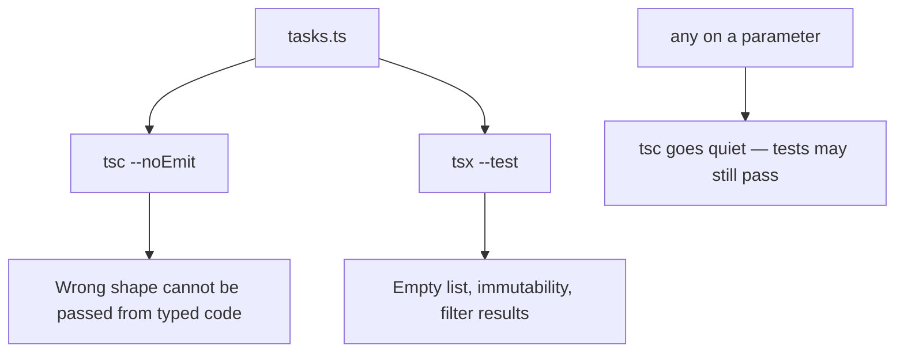
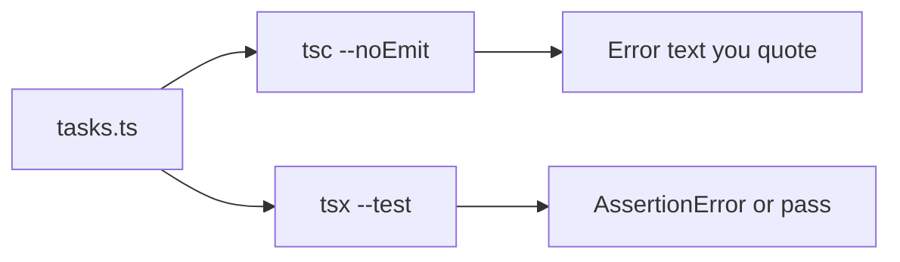

# Month 5 · Week 1 · Day 5
# Tests and `tsc` as a Test

**Program:** Full-Stack Mastery · 18 months  
**Phase:** 1 — Foundations  
**Month index:** [../../README.md](../../README.md)  
**Week 1:** [1](day-01.md) · [2](day-02.md) · [3](day-03.md) · [4](day-04.md) · Day 5 (today) · [6](day-06.md) · [7](day-07.md)  
**Week rhythm today:** Tests + refactor + documentation  
**Study time:** 3–4 focused hours  
**Student state:** You have typed task helpers (or you will recreate them). Today you stop hoping `tsc` and `tsx` are the same tool.

---

## How to read this chapter

Month 3 used `node --test`. This month uses **`tsx --test`** to **run** TypeScript tests and **`tsc --noEmit`** to **check types**. They answer different questions. If you only run tests, a typo property can still ship. If you only typecheck, `filterOpen` can still be wrong.

A test is not a vibe and not “I remember writing `addTask`.” It is a tiny program that **throws** if yesterday’s helper changed meaning. A typecheck is a tiny proof that **typed call sites** cannot pass the wrong shape.



Read Block A until you can explain both layers in your own sentences. Then write tests from the **spec**, not from a happy memory of the probe. Deliberate `any` is today’s experiment — then you **remove** it.

---

## Today's contract

By the end of this day you will be able to:

1. Name two layers: types (`tsc`) and values (`tsx` / `node --test`).
2. Write tests that prove immutability and filtering.
3. Show that `any` hides a typo object from `tsc`.
4. Document commands in a README.
5. Keep `typecheck` in `package.json` as `tsc --noEmit`.

**Today's gate**

> I can explain why tests do not replace `tsc`, I recorded what `any` did in `ANY.txt`, and both scripts are green after I removed `any`.

If you only re-ran yesterday’s tests without the `any` experiment, you missed the lesson. Stay here.

---

## Time box

| Block | Minutes | Work |
|---|---|---|
| A | 45 | Theory: two layers, `any` infection, README as a contract |
| B | 40 | Type-along: fail `tsc` on purpose; then `any`; then remove |
| C | 70 | Independent: full tests + README + ANY.txt |
| D | 20 | Git |
| E | 15 | Recall |

---

# Block A — Theory

## 1. What we are testing (explained)

Two layers:

| Layer | Tool | Proves |
|---|---|---|
| Types | `tsc --noEmit` | Wrong-shaped data cannot be *passed* from typed code |
| Values | `tsx --test` / `node --test` | Runtime behavior (empty list, immutability) |

`tsc` will **not** run `filterOpen`. Tests will **not** catch `addTask(list, { titel: "x" })` if you never typecheck. You need both.

`tsx` can execute a file that **fails** `tsc` if you never run `tsc`. That is why this course’s gate is **`tsc --noEmit`**, not “the tests printed ok.”

> **Wrong belief:** “Green tests mean the types are fine.”  
> **Correct:** tests prove **values** you chose to construct. They are already the right shape because **you** wrote the fixture. `tsc` proves **other files** cannot pass a typo.

> **Wrong belief:** “Green `tsc` means `filterOpen` is correct.”  
> **Correct:** types do not know your product. An annotated function can still return the done tasks. That is a **test**.

---

## 2. Arrange / act / assert (still)

Same as Month 3:

1. **Arrange** — build a `Task[]` fixture (literal objects that match `Task`).
2. **Act** — call `addTask` / `toggleDone` / `filterOpen`.
3. **Assert** — `assert.deepEqual` or `assert.equal` on the result; assert the **input** is unchanged.

You do not write a test that “`addTask` rejects a string id” if the parameter is already `string` — unless you mean **runtime** validation (Week 3). Today, a number `id` is a **`tsc` error**. Put that sentence in the README.

**Mutation tests:** keep a copy of JSON, or assert `list.length` and `list[0].done` after a call that returns a new list. If you only assert the result, a mutating implementation can still look green.

---

## 3. `any` as a demonstration, not a tool

Deliberate: add `any` on `addTask`’s second parameter. `tsc` goes quiet on a typo object. Record that in `ANY.txt`. Remove `any`. That is today’s lesson about unjustified `any`.

What to do, in order:

1. Start from a **green** `typecheck` (Day 4 module, or recreate it).
2. In a scratch file `typo.ts` (or a test file you will revert), call `addTask(list, { titel: "x", id: "1", done: false, priority: 1 })`.
3. Run `tsc --noEmit`. It should **fail**. Quote the error.
4. Change `addTask(list: Task[], task: any)` (or the second parameter only).
5. Run `tsc` again. It goes **quiet**. Tests may still pass because they never constructed `{ titel }`.
6. Write `ANY.txt`: what went silent, why that is dangerous, why Project 3 forbids unjustified `any`.
7. **Remove** `any`. Typecheck fails again on the typo file — delete the typo call or keep it commented.

`any` **infects**: assign an `any` into a `Task` variable and the rest of the function stops checking. That is why “just this one parameter” is not small.

`unknown` would force you to narrow (Week 3). Do not switch the lab to `unknown` today unless you already know narrowing; the point is **removing** `any`.

---

## 4. README: commands as a contract

README: commands for `typecheck` and `test`.

A README that says “run the file” is not a contract. Write:

```text
npm run typecheck   # tsc --noEmit — required
npm test            # tsx --test — required
```

State that `tsx` does **not** replace `tsc`. State that there is no `any` in `tasks.ts`.

This is the same idea as Project 3’s scripts (`typecheck`, `test`, later `lint` / `build`) — you are training the habit on a tiny module. Do **not** paste a Vite app here.

---

## 5. What a type error looks like (read it)

A typical excess-property error names:

- the object you wrote,
- the type you assigned it to (`Task`),
- the extra name (`titel`),
- sometimes a hint that you meant `title`.

Write that in English in `ANY.txt` or `ERRORS.txt`. “It is red” is not a reading.

---

# Block B — Type-along

Work in `~\fullstack-lab\month-05\week-01\day-05\` **or** continue in `day-04` and put `ANY.txt` + README there. If you copy files, type the `package.json` scripts again so you still know them.

1. Confirm `npm run typecheck` and `npm test` green.
2. Add the typo call. Typecheck red. Note the message.
3. Add `any`. Typecheck green. Note the silence.
4. Remove `any`. Delete or comment the typo call.
5. Add one **new** test you did not have yesterday (empty list, or toggle missing id — document the chosen behavior).

---

# Block C — Independent

If Day 4 is missing functions, recreate `Task`, `addTask`, `toggleDone`, `filterOpen`, `sortByPriority`, `filterByPriority` here. Same spec as Day 4. No paste from a chatbot.

Then:

- Tests cover empty list, immutability, filter, sort copy.
- `ANY.txt` records the `any` experiment.
- README documents `typecheck` and `test`.

```powershell
git add month-05/week-01
git commit -m "Document tsc plus unit tests for Task helpers."
```

---

# How to read a `tsc` error (today’s dialect)

A typical excess-property message looks like:

> Type `{ titel: string; id: string; ... }` is not assignable to type `Task`. Object literal may only specify known properties, but `titel` does not exist in type `Task`. Did you mean to write `title`?

Translate to English in `ERRORS.txt` / `ANY.txt`:

1. **What you passed** (an object literal).
2. **What was expected** (`Task`).
3. **The extra or missing name** (`titel` vs `title`).

Do not stop at “it is red.” Do not “fix” it with `as Task`. That is a lie. Fix the object or the type.

When the error is a **function argument**, `tsc` names the parameter’s type. When it is a **return**, it names what you returned vs what you promised. Read the last few lines; they often have the useful comparison.

**`--noEmit`** means: check, write no `.js`. These labs do not need emit. Vite will emit later (Week 4). `tsx` transforms in memory to **run**; that is not a typecheck.



# What belongs in the README

Not a tutorial. A **contract** for this folder:

- How to install (`npm install` in this folder).
- `npm run typecheck` → `tsc --noEmit`.
- `npm test` → `tsx --test`.
- Import style you used (`.ts` vs `.js` extension) — same as Day 1 `IMPORTS.txt`.
- “No `any` in `tasks.ts`.”
- One sentence: tests do not replace `tsc`.

If you copy Day 4 files into Day 5, the README still has to be **true** for the folder you run commands in. A README that documents yesterday’s path is a defect.

# Infection, in a picture

```ts
function addTask(list: Task[], task: any): Task[] {
  return [...list, task];
}

const next = addTask([], { titel: "x" });
// next is Task[] as far as callers see — the lie is now in the list
```

`any` on the way **in** becomes a `Task` on the way **out** if you annotated the return as `Task[]`. Callers then call `next[0].title` and crash at runtime. That is why “just the parameter” is not small.

`unknown` would refuse `.titel` until you narrow (Week 3). Today: **do not use `any`**. The experiment exists only to feel the silence, then you delete it.

> **Wrong belief:** “I’ll leave `any` on the test fixture only.”  
> **Correct:** fixtures should be `Task` literals. If a fixture needs `any`, the type or the fixture is wrong.

# Block E — Recall

1. What does `tsc --noEmit` prove?
2. What do tests prove?
3. Why did `any` make the typo compile?
4. Why must you remove it before you commit?
5. How does `any` on a parameter poison a `Task[]` return?

---

## Definition of done

- [ ] `npm run typecheck` is `tsc --noEmit` and green
- [ ] `npm test` green
- [ ] `ANY.txt` explains the deliberate `any` and that it was removed
- [ ] README lists both commands
- [ ] Mutation tests exist
- [ ] No `any` in committed `tasks.ts`
- [ ] Commit exists

---

## Optional review links

The two layers (`tsc` vs runtime tests) are explained in this chapter.

- [tsconfig `strict`](https://www.typescriptlang.org/tsconfig/#strict)
- [Handbook: Everyday Types](https://www.typescriptlang.org/docs/handbook/2/everyday-types.html)
- [Node.js test runner](https://nodejs.org/api/test.html)

---

# Imports, fail-on-purpose, and a complete ANY.txt

**Import extensions (Day 1 encore).** NodeNext + `tsx` may want `from "./tasks.ts"` or `from "./tasks.js"` (the emit name). One style per folder. If tests cannot load the module, it is not a type problem — fix the import, then run **both** scripts again.

**Breaking a test on purpose.** Change `filterOpen` to return the input unfiltered. Run `npm test`. Read `AssertionError`. Restore. That proves the test can fail — a test that cannot fail is theater.

If `ANY.txt` says only “any is bad,” rewrite it: quote the silent `titel` call, name the return type that laundered the lie (`Task[]`), and state that you removed `any` before commit.

**Minimum ANY.txt shape:**

1. The `tsc` message **before** `any` (titel / extra key).
2. The command that went green **after** `any`.
3. One sentence: tests still passed because fixtures were well-shaped.
4. Confirmation you deleted `any` and the typo call.

`// @ts-expect-error` exists to **assert** a type error in-file. This course does not require it. Commented illegal code + `ERRORS.txt` is enough. Do not leave `@ts-ignore` in the repo.

## Tomorrow

Independent: a typed **playlist** module (add/remove/search/filter/sort/totalMinutes) plus a **400–700 word** teach-back on compile-time vs runtime. Days 1–5 stay closed during the challenges.

Keep `strict: true` and `noEmit: true`. Do not “simplify” tsconfig to make `any` experiments stay green after you restore the real `Task` parameter. The experiment is temporary; the config is not.

**Scripts must both exist.** If `package.json` has `test` but no `typecheck`, add `"typecheck": "tsc --noEmit"`. If you run `npx tsc` without `--noEmit` and this `tsconfig` already has `noEmit: true`, that is fine — the script still names the intent. Do not emit `.js` next to tests and then import the emit by accident.

A README that only says `npm test` is incomplete. Two commands, every time.

`tsx` is a runner. `tsc` is the checker. Mixing them in your head is how `any` survives a “green” day. Write both names in the README so tomorrow-you does not “simplify.”

Labs stay under `~\fullstack-lab\month-05\week-01\`. Windows PowerShell. `npx tsc --noEmit`, then `npm test`.

Never commit `any` on `addTask`. The experiment lives in `ANY.txt`, not in the function signature.

That is the whole day: two tools, one forbidden shortcut.
