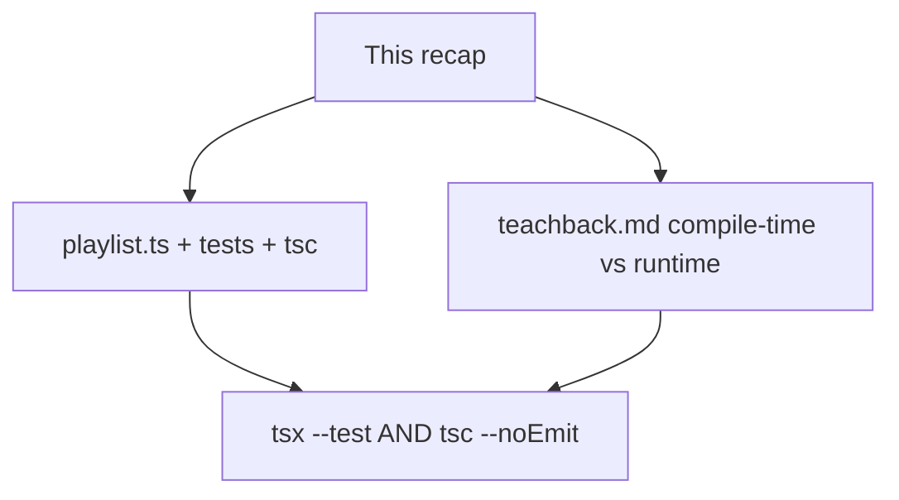
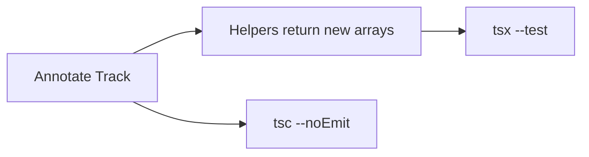

# Month 5 · Week 1 · Day 6
# Independent: Typed Pure Module

**Program:** Full-Stack Mastery · 18 months  
**Phase:** 1 — Foundations  
**Month index:** [../../README.md](../../README.md)  
**Week 1:** [1](day-01.md) · [2](day-02.md) · [3](day-03.md) · [4](day-04.md) · [5](day-05.md) · Day 6 (today) · [7](day-07.md)  
**Week rhythm today:** Independent project work  
**Study time:** 3–4 focused hours  
**Machine today:** Windows PowerShell, Node.js 20+  
**Days 1–5 textbook files:** closed for the *challenges*. Repair from **Week 1 Days 1–2 in this book**.

---

## How to read this chapter

Today you prove Week 1 without a type-along. The complete explanation below **is** the lesson. Read a section. Close it. Say it. Then write the playlist module **before** the tests, or the tests **before** the functions — either order is honest if you do not paste.

If you catch yourself copying `tasks.ts` line for line into `playlist.ts`, stop. A playlist is a different product. Same *rules* (annotate boundaries, `string[]`, immutable helpers, no `any`), new *fields* and *operations*.



Allowed during challenges: this file, your notes, the error in the terminal.  
Not allowed: Day 1–5 files as a paste source, the Handbook as the teacher, AI writing the functions or the teach-back.

If you are stuck more than 25 minutes, open **only** Day 1 or Day 2 **in this textbook**, read one section, close it, continue. Record the lookup.

---

## Complete explanation (this book is the lesson)

You already practiced these ideas. Here they are again in full, so a later review never requires another page.

### TypeScript vs JavaScript

TS checks a type language that **erases**. At runtime there is no `: string`. The engine runs JavaScript. A form can still submit `"18"` as a string. `classifyAge("18")` is a **type error** in your typed module because the parameter is `number`. A `<input>` still needs a **runtime** check (`typeof n !== "number"`, or convert then validate) because the browser does not run `tsc`.

**`tsc --noEmit`** is the typecheck. **`tsx` runs tests; it does not replace `tsc`.**

> **Wrong belief:** “Once it typechecks, the data is safe.”  
> **Correct:** typecheck assumes your annotations match reality. Untrusted input is Week 3’s `unknown` + guard. Today you still write that sentence in the teach-back.

### Inference vs annotation

Annotate **boundaries**: exported function params and returns. Infer locals. Empty arrays: annotate (`const tracks: Track[] = []`). `const list = []` infers `never[]` (or worse) — then `.push` fights you.

> **Wrong belief:** “More annotations = more professional.”  
> **Correct:** annotate the contract. Let the middle infer.

### No `any`

`any` turns the checker off and infects assignments. Zero unjustified `any`. Day 5 showed a typo going quiet. Do not “save time” with `any` on `Track`.

### Arrays, objects, optional, functions

`string[]`. Object types `{ id: string; title: string; minutes: number; genre: string }`. Optional `?:` means the key may be missing; when read, `T | undefined`. Function types name params and returns. `void` for side-effect probes, not for helpers that return new lists.

`strict` on. Immutable helpers return **new** arrays. `sort` mutates — copy first.

> **Wrong belief:** “I’ll store `minutes` as `string` because the UI shows `5 min`.”  
> **Correct:** display is a format step. Sum needs `number`. Format in a probe, not in `totalMinutes`.

### Teach-back (the point of Challenge 2)

You will write **prose**, not a table dump. A TA should believe you could teach a JavaScript-fluent classmate **why** types disappear and **why** a form still lies. Include:

1. What is erased at compile time (an example you typed).
2. Why `classifyAge("18")` is a type error when `n: number`.
3. Why a form / `JSON.parse` / `prompt` still needs a runtime check.
4. `tsc` vs `tsx` in one paragraph.
5. Why `any` is not the bridge between those worlds.

If you write bullets only, rewrite as paragraphs. **400–700 words** is the target — enough to teach, not a novel. The spec already asked for this; today it is a full assignment with a rubric, not a footnote.

---

## Office hours — mutated sorts, blank-search truthiness, and letters that skip the form

**`sortByMinutes` mutates.** You `list.sort(...)` and return `list`. Mutation test red — or green if the snapshot aliased. Copy first: `[...list].sort(...)`.

**`if (query)` for search.** `"  "` is truthy. Trim, then decide empty → `[]` or all. Document the rule. Test it.

**Teach-back is a keyword table.** Rewrite as a letter to Month 3-you. Two stories: `titel` at compile time; `"18"` from a form at runtime.

**`any` on the list to “finish faster.”** You deleted the week. Remove it. Let `tsc` speak.

**Only `tsx`.** Both scripts green. Project 3 will add `lint` and `build`; the typecheck habit starts here.

**Pasted Day 4 tasks.** New fields: `minutes`, `genre`. New operations: `totalMinutes`, `filterByGenre`. Same physics, new product.

---

## Today's contract

**Today's gate**

> `playlist.ts` typechecks and tests green. Teach-back is 400–700 words of prose that explains compile-time vs runtime with `classifyAge("18")` and a form. I did not paste Day 4.

---

## Time box

| Block | Minutes | Work |
|---|---|---|
| A | 20 | Speak this recap |
| B | 90 | Challenge 1: playlist module + tests |
| C | 50 | Challenge 2: teach-back |
| D | 20 | Git |

---

# Challenge 1

Folder: `~\fullstack-lab\month-05\week-01\independent\`.

`playlist.ts`: `{ id: string; title: string; minutes: number; genre: string }`. Typed add/remove/search/filter/sort/totalMinutes. Tests. Typecheck green.

Name the type (`Track` or `Song` — your choice, one name). Suggested exports (you may rename if tests match):

| Function | Contract |
|---|---|
| `addTrack(list, track)` | new array; no mutate |
| `removeTrack(list, id)` | new array without that id |
| `searchTracks(list, query)` | title contains query; **trim**; blank query → `[]` or all — **document and test** |
| `filterByGenre(list, genre)` | exact genre match (string) |
| `sortByMinutes(list)` | copy + sort ascending |
| `totalMinutes(list)` | sum of `minutes`; empty list `0` |

`minutes` is `number`, not `"3:30"`. Convert at a later UI edge, not inside `totalMinutes`.

Tests with `tsx --test`. Mutation tests. No `any`. `package.json` scripts: `typecheck` = `tsc --noEmit`, `test` = `tsx --test`. Same `tsconfig` discipline as Day 1 (`strict`, `noEmit`). Node.js 20+.

**Wrong belief:** “Search can use `if (query)`.”  
**Correct:** `"  "` is truthy. Blank text is `query.trim() === ""` — Month 3, still true, now typed `query: string`.

Worked key for a fixture of two tracks (5 and 10 minutes): `totalMinutes` is 15; `sortByMinutes` does not change the original order; `removeTrack` leaves the other track.

```powershell
cd ~\fullstack-lab\month-05\week-01\independent
npm run typecheck
npm test
```

# Challenge 2 — Teach-back

400–700 words: compile-time vs runtime; why `classifyAge("18")` is a type error **and** why a form still needs a runtime check.

Write `teachback.md` in the same `independent` folder. Title it as a letter to your Month 3 self. Must include the five teach-back items above. One worked `tsc` error story (`titel` or `"18"`). One worked “the input is still a string” story. Do not paste this recap.

### Teach-back anti-patterns

- A two-column markdown table of keywords and nothing else.
- “Types make everything safe.” as the thesis.
- Pasting this recap with names changed.
- Under 400 words, or 700+ of repetition.

Include `tsc --noEmit` vs `tsx` by name. If both tools are missing from the letter, rewrite it.

### Folder layout

`~\fullstack-lab\month-05\week-01\independent\` contains `playlist.ts`, tests, `tsconfig.json`, `package.json`, `teachback.md`. No network. No Vite. No Project 3 paste.

```powershell
git add month-05/week-01/independent
git commit -m "Independent typed playlist module."
```

---

## Teach-back must answer these questions

Write **paragraphs**.

**Erasure.** `const age: number = 18` checks before the file runs. The emitted JavaScript has no `: number`. Show that you know the annotation is for `tsc`, not for the CPU.

**`classifyAge("18")`.** If the parameter is `n: number`, TypeScript refuses a string argument. That is the compile-time half. It protects **call sites you typecheck**. It does not run in the browser on a form value.

**The form.** `<input type="text">` (and many number inputs) still give you strings in JS. `JSON.parse` gives you `any`-shaped data unless you validate. `Number("18")` is a conversion you choose. `typeof n !== "number"` or `Number.isFinite` is a **runtime** gate. Week 3 will call the JSON case `unknown` + a guard. Today you must already **say** that types are not a firewall.

**`any` is not the bridge.** If you type the form value as `any` and pass it to `classifyAge`, `tsc` goes quiet and you are back in Month 3, hoping. The honest path is: convert or reject at the edge, then call a function that only accepts `number`.

**Two commands.** `tsc --noEmit` never executes `totalMinutes`. `tsx --test` never proves `{ titel }` is illegal. You need both.

If your letter never mentions a form or `JSON.parse` (or `prompt`), rewrite it. That story is the strongest proof you did not treat `tsc` as magic.

### Playlist worked key (do not skip tests)

Use two tracks:

```ts
const a = { id: "1", title: "A", minutes: 5, genre: "jazz" };
const b = { id: "2", title: "Blue", minutes: 10, genre: "jazz" };
```

- `totalMinutes([a, b])` is `15`.
- `sortByMinutes([b, a])` is `[a, b]` in the **result**; the input still starts with `b`.
- `removeTrack([a, b], "1")` is `[b]`; `[a, b]` still has length 2.
- `filterByGenre([a, b], "pop")` is `[]`.
- Search: pick a rule. If blank → `[]`, then `searchTracks([a, b], "  ")` is `[]`. If blank → all, then it is both tracks. **Write the rule in a one-line comment** and test it.

`genre` is `string` today, not a literal union — that is Week 2. Do not invent `"JAZZ" | "jazz"` unless you want a type error on purpose.

Inference: inside `totalMinutes`, `t.minutes` infers from `Track`. You still annotate `list: Track[]` and `: number`.

### Teach-back length check

Paste into a word counter. Under 400: add the form story and the `tsc` vs `tsx` paragraph, not adjectives. Over 700: cut repetition; keep the two worked stories.

### Common mistakes today

| Mistake | Fix |
|---|---|
| `sortByMinutes` mutates | copy first |
| `minutes: string` | number; convert at the edge |
| teach-back is a keyword table | paragraphs with examples you ran |
| `any` on the list | remove it |
| only `tsx`, no `tsc` | both scripts green |
| blank search uses `if (query)` | trim, then decide |

---

## Worked walkthrough — two tracks, six claims

Using `a` (5 min jazz) and `b` (10 min jazz) from the fixture above:

1. `totalMinutes([a, b]) === 15`. Empty list `0`.  
2. `sortByMinutes([b, a])` result starts with `a`; input still starts with `b`.  
3. `removeTrack([a, b], "1")` has length 1; input length 2.  
4. `filterByGenre([a, b], "pop")` is `[]`.  
5. Search blank-after-trim follows **your** comment. Test `"  "`.  
6. `addTrack` does not mutate — snapshot the input array of objects.

**Teach-back two stories, named.** (1) You wrote `titel` on an object literal; `tsc` refused; the engine never ran. (2) A form gave `"18"`; `classifyAge` wanted `number`; `tsc` would refuse the call site **if** you annotated `number`; the browser still has a string until you convert or reject. `any` as the bridge deletes story (1) and does not fix story (2).

Windows: `cd ~\fullstack-lab\month-05\week-01\independent` then both scripts. Node.js 20+. No Vite. No Day 4 paste.

---

## Definition of done

- [ ] Playlist helpers annotated; immutable; tests green
- [ ] `npm run typecheck` (`tsc --noEmit`) green
- [ ] No `any`
- [ ] Teach-back is 400–700 words of prose, not a cheat sheet
- [ ] Teach-back covers `classifyAge("18")` **and** a runtime form/JSON check
- [ ] Commit exists

---

## Stalls and repair — mutated sort, blank search, teach-back without a form

If `sortByMinutes` returns the same array reference, you `list.sort`. Copy first. Mutation test: input order unchanged.

If search uses `if (query)`, `"  "` is truthy. Trim. Document blank → `[]` or all. Test it.

If `minutes` is `string` because the UI shows `5 min`, sum needs `number`. Format at the edge.

If teach-back is a keyword table, rewrite as a letter to Month 3-you. Story 1: `titel` at compile time. Story 2: `"18"` from a form at runtime. `classifyAge("18")` is a type error when `n: number`. `any` is not the bridge. `tsc --noEmit` vs `tsx` by name. 400–700 words. Count.

If only `tsx` ran, add `typecheck`. If `any` is on `Track[]`, remove it.

If you pasted Day 4 tasks, new fields (`minutes`, `genre`) and `totalMinutes`. Same physics, new product. No Vite. No Project 3.

Windows: `cd ~\fullstack-lab\month-05\week-01\independent` then both scripts. Node.js 20+. Days 1–5 closed until a 25-minute stall, then Day 1 or 2 in this book only.

---

## Last forty minutes

Six playlist claims green. Search rule commented and tested. `sortByMinutes` copies. `totalMinutes` uses `number`. No `any`. Both scripts.

`teachback.md` 400–700 words: erasure example you typed; `classifyAge("18")`; form/`JSON.parse`/`prompt` still needs a runtime check; `tsc` vs `tsx`; `any` is not the bridge. Word count on line one. Close this file.

Folder: `playlist.ts`, tests, `tsconfig`, `package.json`, `teachback.md`. No network. No Vite. No Project 3 paste.

Commit `month-05/week-01/independent`. Tomorrow: `clamp` review. Repair tonight if the letter skipped the form.

---

## Worked checkpoint — playlist fields, not a renamed `tasks.ts`

`Track` has `minutes: number` and `genre: string` (or your documented extras). `totalMinutes` sums numbers. Format `5 min` in a probe, not inside the sum. `sortByMinutes` copies first; mutation test: input order unchanged.

Search: trim. `"  "` is truthy in `if (query)` and must not mean “search for spaces.” Document blank → `[]` or all tracks. Test that rule. Comment it next to the function.

Both scripts: `tsx --test` **and** `tsc --noEmit`. `tsx` is not the type gate. Zero `any` on `Track[]`. Empty list: `const tracks: Track[] = []`, not `const tracks = []` fighting `never[]`.

Teach-back 400–700 words as a letter: `titel` caught at compile time; `"18"` from a form still needs a runtime check; `classifyAge("18")` is a type error when `n: number`; `any` is not the bridge; types erase. Word count on line one. Close this file while you write.



> **Wrong belief:** “Search can use `if (query)`.”  
> **Correct:** empty string and whitespace are different from “no filter.” Trim. Test the blank.

No Vite. No Project 3. Windows: `cd ~\fullstack-lab\month-05\week-01\independent`. Node.js 20+.

---

## Optional review links

Compile-time vs runtime, arrays, objects, and function types are explained in this chapter. These pages are for later checking, not for first learning.

- [TypeScript Handbook: Everyday Types](https://www.typescriptlang.org/docs/handbook/2/everyday-types.html)
- [Handbook: Object Types](https://www.typescriptlang.org/docs/handbook/2/objects.html)
- [tsconfig `strict`](https://www.typescriptlang.org/tsconfig/#strict)

---

## Tomorrow

Week review: speak the synthesis, mini-build `clamp`, debug empty-array inference and `any` hiding a typo. Repair the weakest topic today if the teach-back already wobbled.
