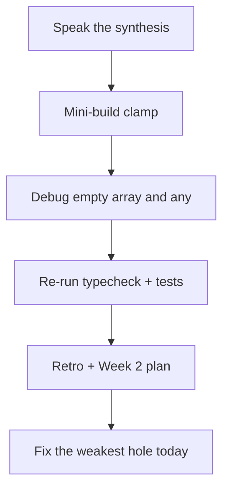
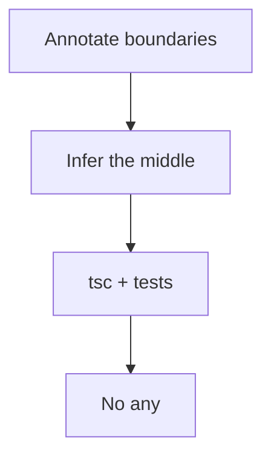

# Month 5 · Week 1 · Day 7
# Week Review — TypeScript Fundamentals

**Program:** Full-Stack Mastery · 18 months  
**Phase:** 1 — Foundations  
**Month index:** [../../README.md](../../README.md)  
**Week 1:** [1](day-01.md) · [2](day-02.md) · [3](day-03.md) · [4](day-04.md) · [5](day-05.md) · [6](day-06.md) · Day 7 (today)  
**Week rhythm today:** Review, repair, plan Week 2  
**Study time:** 3–4 focused hours  
**Machine today:** Windows PowerShell, Node.js 20+  
**Student state:** You have annotated primitives, arrays, objects, and functions; you have seen `any` go quiet on a typo. Today those ideas must still live in your head — from **this file**.

Do not start Week 2 because the calendar moved. Start Week 2 because this file’s gate is true.

---

## How to read this chapter

This is a **closed-book teaching day**. The synthesis below is the lesson, written so you can re-learn Week 1 from this page alone if the week is foggy.

1. Read a section. Close it. Say the idea in one honest sentence.
2. Then do the review blocks in order. During the mini-build, Days 1–6 stay closed. If you go blank, re-read **this synthesis**, not a random article.
3. Repair the weakest topic **today**. Week 2 (interfaces, unions, generics) assumes inference vs annotation and “no `any`” are automatic.



---

## Week synthesis (the lesson, in this book)

| Idea | Truth |
|---|---|
| TS vs JS | Types erased; JS runs |
| `tsc` | Typecheck; `--noEmit` in labs |
| Inference | Locals; annotate exports |
| `any` | Turns the checker off |
| Arrays / objects / functions | `T[]`, `{ ... }`, `(x: T) => U` |
| Optional | `?` → `T \| undefined` |



TypeScript is JavaScript plus a type language **erased at emit**. `npx tsc --noEmit` is the check. `tsx` **runs** tests; it does not replace `tsc`.

**Value space vs type space.** `const title` vs `type Title`.

**Primitives:** `string`, `number`, `boolean`, `null`, `undefined`. Infer locals; **annotate exported function params and returns**. Empty arrays need an annotation.

**`any` infects.** Day 5: a typo object compiles if the parameter is `any`. Remove it.

**Optional `year?: number`:** key may be missing; read as `number | undefined`. Not “maybe a string.”

**Immutability:** types allow `.push`; your module must not. `sort` mutates — copy first.

Closed-book: speak the table.

The rest of this file unpacks each sentence so a student who only has **today’s file** can still teach the week.

---

## Today's contract

By the end of this day you will be able to:

1. Teach Week 1 aloud from the synthesis, without opening Days 1–6.
2. Write `clamp(n: number, min: number, max: number): number` from the spec, with tests and typecheck.
3. Diagnose empty-array inference and `any` hiding a typo.
4. Re-run a `tsc` + test pair from this week.
5. Write a retro and a Week 2 plan, then repair the weakest type topic today.

**Today's gate.** Closed-book:

> I can explain erasure, inference vs annotation, `string[]`, `?:`, why `any` is forbidden, and I have green `tsc --noEmit` plus tests for `clamp`.

If you cannot, stay on Week 1. Unions on a mushy `any` habit become two problems.

---

## Time box

| Block | Minutes | Work |
|---|---|---|
| 1 | 40 | Closed-book: speak the synthesis |
| 2 | 50 | Mini-build: `review/clamp.ts` + tests |
| 3 | 30 | Debug two classic defects |
| 4 | 25 | Review independent code — one fix |
| 5 | 20 | Re-run typecheck + tests |
| 6 | 20 | Design: annotate vs infer |
| 7 | 25 | Retro + Week 2 plan + repair |

---

# Complete explanation — language you must still own

## 1. Two languages in one file

A `.ts` file contains JavaScript that will run and annotations that exist only for the compiler. After emit, `: number` is gone. You do not deploy `tsc` to the user’s phone.

> **Wrong belief:** “Once it typechecks, the data is safe.”  
> **Correct:** a form can still send `"18"`. Types are a design tool. Guards are Week 3.

## 2. Inference vs annotation

Variables with initializers: prefer inference. **Exported functions:** annotate params and returns. `const list = []` — **annotate** `string[]` (or `Task[]`). `const kind = "movie"` may infer the literal `"movie"` — Week 2.

> **Wrong belief:** “More annotations = more professional.”  
> **Correct:** annotate boundaries.

## 3. `any`

Turns checking off. Infects. `as any` and `@ts-ignore` are the same family. Zero unjustified `any`.

## 4. Arrays, objects, functions

`string[]`. Tuples `[string, number]` when positions mean different things. Object types; name them with `type`. Optional `?`. Functions: `(a: number) => string`. `void` = no useful return. Callbacks infer from the function type you wrote.

## 5. Two tools

| Tool | Job |
|---|---|
| `tsc --noEmit` | Typecheck — **the gate** |
| `tsx --test` | Run tests |

## 6. Immutability

Return new arrays. Copy before `sort`. Tests must catch mutation.

> **Wrong belief:** “I’ll `Number(item)` inside every helper so strings count.”  
> **Correct:** conversion belongs at a later form/JSON edge. This review locks the **core** as `number`.

---

## Worked `clamp`

`clamp(5, 0, 10)` is `5`. `clamp(-1, 0, 10)` is `0`. `clamp(99, 0, 10)` is `10`. `clamp("5", 0, 10)` is a **type error** — `tsc` is that test. `tsx` will not catch it if you never pass a string.

If `min > max`, document one honest choice (swap, throw, or return `n`) and **test** it. Prefer: assume `min <= max` in tests; do not silently use `any`.

Type the sketch from **this** review. Days 1–6 stay closed.

```ts
export function clamp(n: number, min: number, max: number): number {
  if (n < min) return min;
  if (n > max) return max;
  return n;
}
```

---

## Office hours — `any[]` empty lists, clamp that accepts strings, and retros that skip unions

**`const xs: any[] = []`.** You “fixed” empty-array inference by turning the checker off. Annotate `number[]`. `never[]` refusing `push(1)` was the teacher.

**`clamp` converts with `Number(n)`.** A string argument becomes a runtime maybe-NaN. Today the parameter is `number`. Conversion at the edge later.

**DEBUG.txt is two phrases.** “empty array bad. any bad.” Full sentences: what the checker does, why a beginner reaches for `any`, what to write instead.

**Retro: “I’ll learn unions from a video.”** Week 2’s teacher is this textbook. If `any` is still how you finish labs, stay in Week 1 repair tonight.

---

Closed-book: speak the synthesis.

---

# Mini-build: `clamp`

`clamp(n: number, min: number, max: number): number` + tests + typecheck.

Folder: `~\fullstack-lab\month-05\week-01\review\`.

Behavior: if `n < min`, return `min`. If `n > max`, return `max`. Otherwise `n`. If `min > max`, document one honest choice (swap, or throw, or return `n`) and **test** it. Prefer: assume `min <= max` in tests; do not silently use `any`.

`package.json` / `tsconfig` as usual. `npm run typecheck` and `npm test`. Node.js 20+.

```powershell
cd ~\fullstack-lab\month-05\week-01\review
npm run typecheck
npm test
```

---

# Debug (write the cause, from this week)

Write `DEBUG.txt` — cause in full sentences.

- `const xs = []` then `xs.push(1)` under `strict`; empty array inference.
- `any` hiding a typo (`titel` vs `title`).

For each: what the program / checker does, why a beginner believes the wrong thing, what to write instead.

**Empty array.** Inference has no element. `never[]` refuses `push(1)`. Annotate `const xs: number[] = []`. Do not “fix” with `any[]`.

**`any` hiding a typo.** The checker stops looking at that value. Tests still construct correct objects, so they stay green. Remove `any`; let `tsc` fail on the typo.

---

# Review and tests

Open **one** independent or Day 4 file. One strength, one defect, one committed fix (a missing mutation test, an unannotated export, a leftover `any`). Re-run `npm run typecheck` and `npm test`. Record PASS in `review/TESTS.md`.

---

# Design

When do you annotate, and when do you infer? Write a paragraph: exports and empty arrays get types; locals with initializers infer. Conversion of `"1"` to `1` belongs at the **edge**, not inside `filterByPriority`. NOTES in `review/ANNOTATE.txt`.

```powershell
git add month-05/week-01/review
git commit -m "Record Week 1 TypeScript review."
```

---

# Debug defects — what “full sentences” means

**Empty `[]`.** You wanted a list of numbers. TypeScript saw an empty list and chose `never[]` (or `any[]` in sloppy configs — your `strict` + `noEmit` lab should not be sloppy). `push(1)` then errors. The fix is the annotation, not a cast.

**`any` on a parameter.** You wanted the red to go away. The red was the product. A misspelled key is exactly what excess property checks are for.

### Week 2 preview (so the plan is not a slogan)

You will learn **`type` vs `interface`**, **unions**, **intersections**, **literal types**, **generics** (`Result<T>`, `first<T>`). You will split **remote** API shapes from **internal** app types. If `any` is still how you finish labs, Week 2 unions will feel like two languages at once. Repair today.

### `clamp` vs `classifyAge`

`clamp` stays in `number`. `classifyAge` returns a **string literal union** if you remember Day 1 (`"invalid" | "child" | ...`). Do not convert strings inside `clamp`. A string argument is a `tsc` error.

---

## Worked walkthrough — `clamp` plus the two debug stories as paragraphs

`clamp(5, 0, 10)` is `5`. `clamp(-1, 0, 10)` is `0`. `clamp(99, 0, 10)` is `10`. Write those tests. `clamp("5", 0, 10)` is a type error you quote in `ERRORS.txt` or leave commented.

**Empty `[]`.** You wrote `const xs = []` then `xs.push(1)`. Under `strict`, inference picked `never[]` (or fought you). Annotate `const xs: number[] = []`. `any[]` is not a fix; it is surrender. DEBUG.txt: what the checker did, why a beginner thinks the array “knows” it will hold numbers later, what to write instead.

**`any` hiding `titel`.** Parameter `item: any`. Literal `{ titel: "Ada" }` compiles. Tests construct `{ title: "Ada" }` so they stay green. Remove `any`. `tsc` fails on the typo. That failure is the product.

Windows: `cd ~\fullstack-lab\month-05\week-01\review` then `npm run typecheck` and `npm test`. Node.js 20+. Repair the weakest hole **today** if the oral table wobbled.

---

## Definition of done

- [ ] Erasure, inference, `any`, `string[]`, `?:` explained from this book
- [ ] `clamp` annotated; tests green; `tsc --noEmit` green
- [ ] DEBUG.txt has two causes (empty array, `any`)
- [ ] Retro names the Week 2 plan honestly
- [ ] Commit exists

---

## Stalls and repair — any[] empty lists, string clamp, DEBUG slogans

If you “fixed” `const xs = []` with `any[]`, you turned the checker off. Annotate `number[]`. `never[]` refusing `push(1)` was the teacher. DEBUG: what the checker did, why a beginner thinks the array will “learn” later, what to write.

If `clamp` uses `Number(n)`, a string becomes maybe-NaN. Parameter is `number`. Conversion at a later edge. `clamp("5", 0, 10)` is a `tsc` error — quote it.

If DEBUG.txt is two phrases, write paragraphs. `any` on a parameter: tests stay green because they construct correct objects; `titel` compiles; remove `any`.

If the oral table skipped `?:`, say: key may be missing; read as `T | undefined`; not “maybe a string.”

If retro says you will learn unions from a video, Week 2’s teacher is this textbook. If `any` is still how you finish labs, repair tonight. Do not start Week 2 on a mushy habit.

Windows: `cd ~\fullstack-lab\month-05\week-01\review` then both scripts. Node.js 20+. One committed fix on independent or Day 4. `ANNOTATE.txt`: exports and empty arrays annotated; locals infer.

---

## Last forty minutes

Speak the table closed-book: erasure, inference vs annotation, `any`, `string[]`, `?:`. `clamp` tests green. `tsc --noEmit` green. DEBUG two causes in paragraphs. One committed fix. `TESTS.md` PASS.

If `any` is still how you finish labs, repair tonight. Week 2 unions on a mushy habit become two problems. Do not start Week 2 because the calendar moved.

Commit `month-05/week-01/review`. Node.js 20+. No Vite. No Project 3.

---

## Worked checkpoint — empty arrays and `any` hiding `titel`

`const xs = []` infers `never[]` (or a fight on `.push`). Annotate `number[]` (or `Track[]` on the playlist). `any[]` makes the checker quiet — that is not a fix. DEBUG paragraph: what the checker did, why a beginner thinks the array will “learn,” what to write.

`clamp(n: number, min: number, max: number)` returns `number`. `clamp("5", 0, 10)` is a `tsc` error — quote it in DEBUG. Do not `Number(n)` inside `clamp`. Conversion is a later edge.

Second DEBUG: `any` on a parameter. Tests construct correct objects, so they stay green. `titel` compiles. Remove `any`. The typo becomes a type error. That is the whole story in sentences, not two labels.

Speak closed-book: erasure, inference vs annotation, `any`, `string[]`, `?:` (key may be missing; read as `T | undefined`). `ANNOTATE.txt`: exports and empty arrays annotated; locals infer. One committed fix on independent or Day 4. `TESTS.md` PASS.

> **Wrong belief:** “I’ll `Number(item)` inside every helper so strings count.”  
> **Correct:** helpers stay `number`. Parse at the boundary. Week 3 will make that boundary `unknown`.

Windows: `cd ~\fullstack-lab\month-05\week-01\review` then both scripts. Do not start Week 2 on a mushy `any` habit.

---

## Optional review links

Week 1 TypeScript is explained in this chapter. These pages are for later checking, not for first learning.

- [TypeScript Handbook: Everyday Types](https://www.typescriptlang.org/docs/handbook/2/everyday-types.html)
- [Handbook: Object Types](https://www.typescriptlang.org/docs/handbook/2/objects.html)
- [tsconfig `strict`](https://www.typescriptlang.org/tsconfig/#strict)

---

## Tomorrow

Week 2 Day 1: **naming shapes** — `type` vs `interface`, remote vs internal models. Unions and generics deepen later in the week. Do not skip them.
