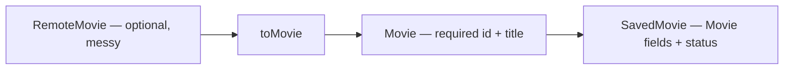
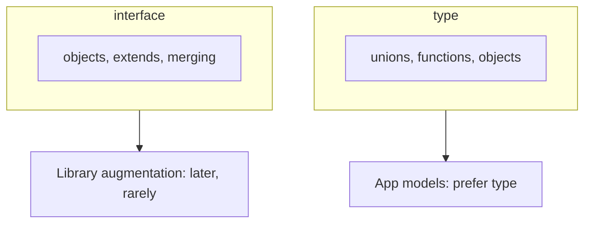
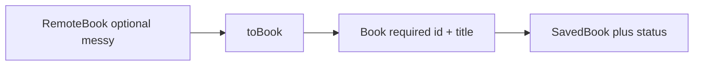

# Month 5 · Week 2 · Day 1
# Type Aliases, Interfaces, and Modeling Objects

**Program:** Full-Stack Mastery · 18 months  
**Phase:** 1 — Foundations  
**Month index:** [../../README.md](../../README.md)  
**Week 2:** Day 1 (today) · [2](day-02.md) · [3](day-03.md) · [4](day-04.md) · [5](day-05.md) · [6](day-06.md) · [7](day-07.md)  
**Week rhythm today:** Learn + type-along  
**Student state:** Week 1 gate passed. You can annotate primitives, `string[]`, object types, and function boundaries, and you refuse `any`. Today you **name** shapes so they do not drift.  
**Study time:** 3–4 focused hours

**This week covers:** interfaces, type aliases, unions, intersections, literal types, generics.

Today: **naming shapes**. Unions and generics are Day 2 and Day 4. Do not skip them.

Project 3 is **not** this week’s homework. This textbook never contains the converted app. You will practice the **same modeling rule** Project 3 requires: remote JSON is not your app type. Labs: `~\fullstack-lab\month-05\`.

---

## How to use this textbook

1. Read a section. Close it. Say `type` vs `interface` in one honest contrast.
2. Type every lab. Do not paste a generated `RemoteMovie` you cannot explain.
3. When `tsc` errors, read which **named** type failed — that is why we name them.
4. Optional review links are for later rechecking — not first learning.

Labs: `~\fullstack-lab\month-05\week-02\`.

---

## How to read this chapter

Week 1 wrote `{ title: string }` inline. That is how `year` becomes `string` in one function and `number` in another. A **type alias** or **interface** is a name for a shape. The name is the product vocabulary: `RemoteMovie` vs `Movie`.

If you only remember “TypeScript has interfaces,” you will duplicate shapes and then “fix” mismatches with `any`. Today’s job is **one name per concept**, and **two names** when the network and the UI disagree.



Unions (`A | B`) and generics (`Result<T>`) wait until later this week. You will still write `Movie | null` as a return type today — that is a union of two types, used as a **result**, not yet as a modeling lecture.

---

## Today's contract

By the end of this day you will be able to:

1. Name an object shape with `type` and with `interface`.
2. Explain what `interface` can do that `type` cannot (declaration merging) and what `type` can do that `interface` cannot (unions).
3. Prefer **one style per file**; this course defaults to `type` for app models and **always** `type` for unions.
4. Split **remote** (optional fields, string years) from **internal** (`id`, `title`, `year: number | null`).
5. Implement `toMovie` that returns `null` when the remote title is missing — without `any`.

**Today's gate**

> `type` and `interface` both name object shapes for this course. Prefer one style per file. Do not duplicate `{ title: string }` in ten functions. Optional vs required is a **product** decision, not decoration.

If you cannot say why `RemoteMovie` is not `Movie`, stay here. Day 2’s literals will not hide a single mushy object type.

---

## Time box

| Block | Minutes | Work |
|---|---|---|
| A | 55 | Theory: type, interface, remote vs internal |
| B | 50 | Type-along: smallest toMovie |
| C | 70 | Independent: models.ts + tests |
| D | 20 | Git |
| E | 15 | Recall |

---

# Block A — Theory

## 1. `type` alias

```ts
type Book = {
  id: string;
  title: string;
  year?: number;
};

type Title = string;
type Id = string;
```

A `type` can name **any** type: primitives, unions, functions, objects. That is why this course uses `type` as the default.

```ts
type Id = string | number;          // union — must be type
type Mapper = (title: string) => string; // function type
type Books = Book[];                // array of a named shape
```

An alias does not create a new runtime class. It is a name the **checker** uses. After emit, it is gone — same erasure as Week 1.

> **Wrong belief:** “`type Title = string` makes a Title class.”  
> **Correct:** it is another name for `string`. Useful for documentation; it will not stop you from assigning any `string`. If you need a distinct Title later, that is a branded type — **not** this week. Do not fake it with `any`.

---

## 2. `interface`

```ts
interface Book {
  id: string;
  title: string;
  year?: number;
}
```

For **objects**, `interface` and `type` are almost interchangeable.

Differences you must know:

| Topic | `interface` | `type` |
|---|---|---|
| Objects | Yes | Yes |
| Unions (`A \| B`) | No — use `type` | Yes |
| Declaration merging | Two `interface Book` merge (can surprise you) | Two `type Book` is an error |
| `extends` | `interface Saved extends Book` | `type Saved = Book & { savedAt: number }` |

**Declaration merging:** if two files (or the same file) declare `interface Book`, TypeScript **combines** the properties. That is useful for patching library types. It is a footgun in an app: you think you replaced `Book`, you actually added a field. **This course: do not merge interfaces accidentally by repeating the name.**

**This course:** `type` for unions and most app models. `interface` is fine for object-only models if you stay consistent. Pick one for `Movie` today and stick to it in the file.



> **Wrong belief:** “Professionals always use `interface`.”  
> **Correct:** professionals pick a convention. This program’s convention is `type` unless you have a reason (object-only + `extends` you can explain). Repeating `{ title: string }` in ten functions is worse than either keyword.

---

## 3. Nested models (Project 3 shape)

External JSON is **not** your app type.

```ts
type RemoteBook = {
  key?: string;
  title?: string;
  first_publish_year?: number;
};

type Book = {
  id: string;
  title: string;
  year: number | null;
};
```

`RemoteBook` allows missing fields because APIs lie. `Book` is what the UI may assume **after** a transform (Week 3 writes the guard). Today, write the two types and a **function signature**:

```ts
export function toBook(remote: RemoteBook): Book | null {
  // implement tomorrow-ish; today you may stub return null and still type the signature
  return null;
}
```

You will implement a real transform this week / next. The **separation** is the lesson.



**Why `year: number | null` internally** instead of `year?: number`: the UI can always read `book.year` and branch on `null`. Optional would mean “maybe the key is missing,” which is a worse UI contract. Remote `Year` as a **string** (`"1965"`) is common in OMDb-like APIs — that is why remote is not internal.

> **Wrong belief:** “I’ll type the fetch as `Movie` so the UI is simpler.”  
> **Correct:** then every optional API field becomes a lie in the UI. Project 3 requires separate external and internal shapes when they differ. You practice that today on movies, not by pasting your catalog app.

**`readonly`:**

```ts
type Book = {
  readonly id: string;
  title: string;
};
```

`readonly` is a type-level “do not assign.” Runtime can still mutate if you cheat. Pair with immutable helpers (Week 1).

---

## 4. Optional vs required is a product decision

`title?: string` on **remote** means “the JSON might omit Title.” `title: string` on **Movie** means “after `toMovie`, we have a title or we returned `null`.” Do not mark everything optional “to make `tsc` quiet.” That is `any` with extra steps.

`status: string` on `SavedMovie` today is a placeholder. Tomorrow: `"want" | "doing" | "done"`. Do not invent ten status strings in tests if you will tighten the type tomorrow — one `"want"` is enough.

---

## 5. Inference vs annotation at the boundary

`toMovie(remote: RemoteMovie): Movie | null` is annotated. Inside, `const trimmed = remote.Title.trim()` may infer. Empty arrays of movies: `const movies: Movie[] = []`.

No `any` on `remote`. If a fixture has extra keys (`Poster`, `Type`), excess property checks apply to **fresh literals** assigned to `RemoteMovie`. Extra keys on a value already typed as a wider object can sneak through — still do not type the fixture as `any`.

---

# Block B — Type-along

```powershell
mkdir ~\fullstack-lab\month-05\week-02\day-01
cd ~\fullstack-lab\month-05\week-02\day-01
npm init -y
npm install --save-dev typescript tsx
```

Same `typecheck` / `test` scripts and `strict` + `noEmit` `tsconfig` as Week 1.

`tiny.ts`:

```ts
type Remote = { Title?: string };
type Movie = { title: string };

export function toMovie(remote: Remote): Movie | null {
  const title = remote.Title?.trim() ?? "";
  if (title === "") return null;
  return { title };
}
```

`?.` is optional chaining (JavaScript). If `Title` is missing, you do not call `.trim()` on `undefined`. TypeScript tracks that. Run `tsc --noEmit`. Write one test: missing `Title` → `null`; `"  Dune  "` → `{ title: "Dune" }`.

---

# Lab

`models.ts`:

- `RemoteMovie` with optional `imdbID?`, `Title?`, `Year?` (string year is common in OMDb-like APIs)
- `Movie` with `id: string`, `title: string`, `year: number | null`
- `SavedMovie` with `Movie` fields plus `status: string` for today (tomorrow: literal union)

`toMovie(remote: RemoteMovie): Movie | null` — return `null` if `Title` missing or empty after trim. Parse `Year` with `Number`; if `NaN`, use `null`. **id:** `imdbID` or `"unknown"`.

Tests with fixture objects (plain objects in the test file). No `any`.

Worked key:

| Remote | Movie |
|---|---|
| `{ Title: "Dune", imdbID: "tt007", Year: "1965" }` | `{ id: "tt007", title: "Dune", year: 1965 }` |
| `{ Title: "  " }` | `null` |
| `{ Title: "Dune", Year: "nope" }` | `year: null` |
| `{ Title: "Dune" }` (no imdbID) | `id: "unknown"` |

`Number("")` is `0` — empty year string should become `null` if you trim first and treat empty as missing. Document that in a comment if you handle it. `Number("1965")` is `1965`. `Number("1965–")` may be `NaN` → `null`.

You may write `Movie` as `interface` **or** `type`. `SavedMovie` can be `Movie & { status: string }` (intersection — named tomorrow) or a standalone type listing all fields. Either is fine if tests match.

```powershell
git add month-05/week-02
git commit -m "Week 2 Day 1: RemoteMovie vs Movie types and toMovie."
```

---

# Block E — Recall

1. What can `type` name that `interface` cannot?
2. What is declaration merging, and why does this course avoid it for app models?
3. Why is `RemoteMovie` not `Movie`?
4. What does `toMovie` return when the title is blank after trim?

---

## Definition of done

- [ ] `RemoteMovie`, `Movie`, `SavedMovie` named (no duplicated inline shapes in every function)
- [ ] `toMovie` annotated; tests for null / year / id
- [ ] No `any`
- [ ] `npm run typecheck` (`tsc --noEmit`) and `npm test` green
- [ ] Commit exists

---

## Optional review links

Aliases vs interfaces are explained above.

- [Handbook: Object Types](https://www.typescriptlang.org/docs/handbook/2/objects.html)
- [Handbook: Everyday Types](https://www.typescriptlang.org/docs/handbook/2/everyday-types.html)

---

## Tomorrow

Unions, intersections, and **literal** types. `SavedMovie.status` becomes `"want" | "doing" | "done"`. You will write `Result<T>` and `parseYear`. Generics as a full lecture are Day 4 — today you only **use** a type parameter in a name if the lab asks.
