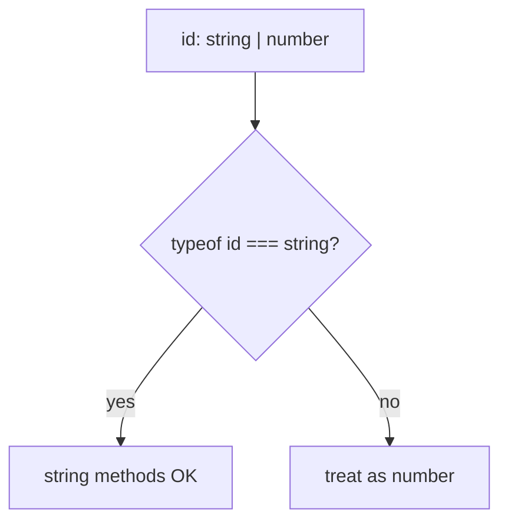

# Month 5 · Week 2 · Day 2
# Unions, Intersections, and Literal Types

**Program:** Full-Stack Mastery · 18 months  
**Phase:** 1 — Foundations  
**Month index:** [../../README.md](../../README.md)  
**Week 2:** [1](day-01.md) · Day 2 (today) · [3](day-03.md) · [4](day-04.md) · [5](day-05.md) · [6](day-06.md) · [7](day-07.md)  
**Week rhythm today:** Learn + type-along  
**Student state:** You can name `RemoteMovie` vs `Movie`. Today those names **branch**: one type or another, both at once, or one exact string.  
**Study time:** 3–4 focused hours

**This week covers:** interfaces, type aliases, unions, intersections, literal types, generics.

Today: unions, intersections, literals, and `Result<T>` as a pattern. **Generics as a full lecture** (why `T` is a hole, `first<T>`, constraints) are Day 4. You will still **write** `Result<T>` today because the lab needs it — copy the pattern, then explain `T` on Day 4.

Labs: `~\fullstack-lab\month-05\week-02\`. This textbook never contains the converted Project 3 app.

---

## How to use this textbook

1. Read a section. Close it. Say “union means one or the other” without waving your hands.
2. Type every lab. Do not paste `Result` from a gist you cannot narrow.
3. When `tsc` errors on `status: "DONE"`, that is a **success**.
4. Optional review links are for later — narrowing in full is Week 3.

---

## How to read this chapter

A **union** `A | B` is a value that is **one** of those types. You must **narrow** before using a member that only one side has. A **literal type** `"idle"` is not the same as `string`. An **intersection** `A & B` means **both**.

Week 1’s `Movie | null` was already a union. Today you name unions on purpose, including object unions that make illegal UI states **unrepresentable**.



The dangerous part is modeling loading and error as two **booleans**. Both true is allowed — nonsense. A union of objects prevents that mix.

---

## Today's contract

By the end of this day you will be able to:

1. Write `string | number` and narrow with `typeof`.
2. Write a string literal union `"want" | "doing" | "done"`.
3. Explain `const` inference (`"dark"`) vs `let` widening (`string`).
4. Intersect two object types with `&`.
5. Prefer a union of objects over independent booleans for UI state (preview of Week 3).
6. Write `Result<T>` and `parseYear` that returns it; narrow with `if (r.ok)`.

**Today's gate**

> A **union** `A | B` means one or the other. You must **narrow** before using a member that only one side has. A **literal type** `"idle"` is not the same as `string`. An **intersection** `A & B` means both. Prefer unions of objects over booleans that can form illegal combos.

If you “fix” `"DONE"` with `as Status`, you failed the gate. Stay here.

---

## Time box

| Block | Minutes | Work |
|---|---|---|
| A | 55 | Theory: union, literal, intersection, Result |
| B | 50 | Type-along: parseYear + narrowing |
| C | 70 | Lab: status literals + Result + tests |
| D | 20 | Git |
| E | 15 | Recall |

---

# Block A — Theory

## 1. Union

```ts
type Id = string | number;

function printId(id: Id): string {
  if (typeof id === "string") {
    return id.toUpperCase(); // narrowed to string
  }
  return String(id);
}
```

Without the `typeof` check, `id.toUpperCase()` is an error — `number` has no `toUpperCase`.


**`string | null`:** you must check `!== null`. `strictNullChecks` (inside `strict`) makes this real. `if (id)` is too blunt if `0` or `""` are legal ids.

Week 3 will add `in`, `instanceof`, discriminated unions, and user-defined guards. Today `typeof` and `===` and `if (r.ok)` are enough.

> **Wrong belief:** “A union means the value is both types.”  
> **Correct:** **intersection** (`&`) means both. Union means **one**. If you need both fields at once, that is an object type or an intersection, not `A | B`.

---

## 2. Literal types

```ts
type Status = "want" | "doing" | "done";
```

`"DONE"` is not assignable. That is the point — the compiler catches a typo your `===` might miss.

```ts
const mode = "dark"; // inferred "dark"
let mode2 = "dark";  // inferred string  (widened — can become any string later)
```

`const` + a primitive often infers the **literal**. `let` often **widens** to `string` / `number` because you might reassign. Annotate if you need a `let` that stays a literal union: `let status: Status = "want"`.

`as const` on an object freezes literals:

```ts
const filters = ["all", "open"] as const;
type Filter = (typeof filters)[number]; // "all" | "open"
```

You do not need `as const` everywhere. Use it when you are defining a **catalog of allowed strings**. Do not sprinkle `as const` to silence errors you do not understand.

**Numeric literals:** `1 | 2 | 3` (Week 1 `priority`) is the same idea. `"1"` is not in that union.

> **Wrong belief:** “I’ll type status as `string` so the API can send anything.”  
> **Correct:** remote may be `string`; **internal** `SavedMovie.status` should be the union **after** you accept or reject. Today you tighten the internal field. Transforming dirty strings into the union is a guard (Week 3) or a function that returns `Result<Status>`.

---

## 3. Intersection

```ts
type Identified = { id: string };
type Titled = { title: string };
type Item = Identified & Titled;
// { id: string; title: string }
```

Intersecting **conflicting** primitives (`string & number`) becomes `never` (Week 3). Do not stack intersections as a hobby. For “Movie plus saved fields,” either intersect or write one type — Week 3 prefers a **discriminated union** for UI state, not `loading: boolean & error: boolean`.

`SavedMovie` as `Movie & { status: Status }` is a good intersection: every Movie field **and** status.

---

## 4. Illegal boolean combos (why unions win)

```ts
type Bad = { loading: boolean; error: boolean; items: Movie[] };
// loading true AND error true is allowed — nonsense
```

```ts
type Good =
  | { status: "idle" }
  | { status: "loading" }
  | { status: "success"; items: Movie[] }
  | { status: "error"; message: string };
```

You cannot have `error` and `items` in an illegal mix if you **only** create these variants. Discriminated unions are Week 3’s main lab; today, write `Status` literals and a simple `Ok | Err`:

```ts
type Ok<T> = { ok: true; value: T };
type Err = { ok: false; error: string };
type Result<T> = Ok<T> | Err;
```

`Result` uses a **generic** — Day 4 explains `<T>`. You may copy this pattern today; you will explain `T` on Day 4.

`T` is a **hole**. `Result<number>` is `{ ok: true; value: number } | { ok: false; error: string }`. `Result<Movie>` swaps `number` for `Movie`. Without generics you would copy `ResultNumber`, `ResultMovie`, `ResultUser` — three chances to drift.

Narrowing:

```ts
function label(r: Result<number>): string {
  if (r.ok) {
    return String(r.value); // value exists
  }
  return r.error; // error exists
}
```

`if (r.ok)` narrows because `ok: true` and `ok: false` are **literal** types on each variant. That is a discriminated union in miniature.

> **Wrong belief:** “Generics replace runtime checks.”  
> **Correct:** they connect typed **call sites**. `parseYear` still looks at `NaN` at **runtime**. JSON is still untrusted until Week 3.

---

## 5. `interface` cannot name this union

`type Result<T> = Ok<T> | Err` **must** be a `type` alias. An `interface` cannot be `A | B`. If you started Day 1 with `interface Movie`, you still use `type` for `Result` and `Status`. That is the table from yesterday, now forced by the lab.

---

# Block B — Type-along

Reuse Week 2 Day 1 folder **or** `~\fullstack-lab\month-05\week-02\day-02\` with the same npm/`tsconfig` setup.

`parse.ts`:

```ts
type Result<T> = { ok: true; value: T } | { ok: false; error: string };

export function parseYear(raw: string): Result<number> {
  const n = Number(raw.trim());
  if (!Number.isFinite(n)) {
    return { ok: false, error: "not a year" };
  }
  return { ok: true, value: n };
}
```

Call `parseYear("1965")` and `parseYear("nope")`. Write a function `show(r: Result<number>): string` that uses `if (r.ok)`. Typecheck. Test.

Uncomment `const s: "want" | "doing" | "done" = "DONE"`. Read the error. `ERRORS.txt`.

---

# Lab

1. Change `SavedMovie.status` to `"want" | "doing" | "done"`.
2. `type Result<T> = { ok: true; value: T } | { ok: false; error: string }`.
3. `parseYear(raw: string): Result<number>` — trim; `Number`; `NaN` → `{ ok: false, error: "not a year" }`.
4. Tests. Function that accepts `Result<number>` and **narrows** with `if (r.ok)`.

Cause `status: "DONE"` as a type error. `ERRORS.txt`.

Prefer `Number.isFinite` so `NaN` and infinities fail. `Number("  1965  ")` works after trim. Empty string → fail.

If Day 1’s `toMovie` still returns `null`, you may keep it. Day 3 will switch a transform to `Result`. Do not rewrite Project 3.

```powershell
git add month-05/week-02
git commit -m "Week 2 Day 2: unions, literals, Result type."
```

---

# Narrowing you already have (Week 3 will go further)

You do **not** need a custom type guard today. These checks are enough:

| Check | Typical union |
|---|---|
| `typeof x === "string"` | `string \| number` |
| `x === null` | `T \| null` |
| `r.ok` | `Result<T>` |
| `status === "done"` | `Status` literals |

`if (r.ok)` works because `ok` is the **discriminant**: `true` on one variant, `false` on the other. After the check, TypeScript **drops** the other variant. `r.value` exists only on the ok side; `r.error` only on the err side.

Trying `r.value` without the check is a type error. That error is the product: you cannot display a year you did not parse.

```ts
function yearLabel(r: Result<number>): string {
  if (!r.ok) return r.error;
  return `Year ${r.value}`;
}
```

Early return is a narrowing style. After `if (!r.ok) return`, the rest of the function has `r.value`.

**Do not** write `r.value as number`. Narrow.

> **Wrong belief:** “`as` is how you convert a union.”  
> **Correct:** `as` is a claim. A check is evidence. This course prefers evidence.

`parseYear` still runs `Number` and `Number.isFinite` at **runtime**. The union `Result<number>` only describes what callers **may** get. The function body makes the description true.

# Block E — Recall

1. Union vs intersection in one sentence each.
2. Why `"DONE"` fails `Status`.
3. Why `if (r.ok)` lets you use `r.value`.
4. Why `loading: boolean` plus `error: boolean` is a bad model.
5. Why `Result<T>` must be a `type` alias, not an `interface`.

---

## Definition of done

- [ ] `SavedMovie.status` is a literal union
- [ ] `parseYear` returns `Result<number>`; tests for ok and err
- [ ] A consumer narrows with `if (r.ok)`
- [ ] `ERRORS.txt` quotes the `"DONE"` type error
- [ ] No `any`
- [ ] `tsc --noEmit` and tests green
- [ ] Commit exists

---

## Optional review links

Unions and literals are explained above.

- [Handbook: Narrowing](https://www.typescriptlang.org/docs/handbook/2/narrowing.html) (full treatment Week 3)
- [Handbook: Everyday Types — unions](https://www.typescriptlang.org/docs/handbook/2/everyday-types.html#union-types)
- [Handbook: Literal Types](https://www.typescriptlang.org/docs/handbook/2/everyday-types.html#literal-types)

---

## Tomorrow

From memory: `RemoteUser` → `User` via `Result<User>` (not `null`). Days 1–2 closed during drills.
