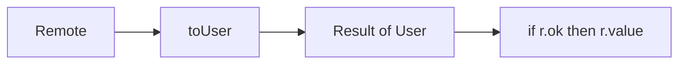
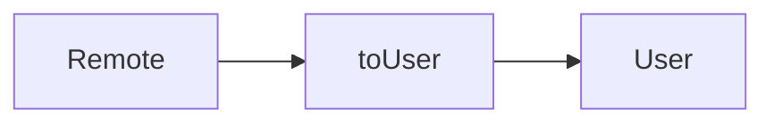

# Month 5 · Week 2 · Day 3
# From Memory: Name the Shapes

**Program:** Full-Stack Mastery · 18 months  
**Phase:** 1 — Foundations  
**Month index:** [../../README.md](../../README.md)  
**Week 2:** [1](day-01.md) · [2](day-02.md) · Day 3 (today) · [4](day-04.md) · [5](day-05.md) · [6](day-06.md) · [7](day-07.md)  
**Week rhythm today:** Implement from memory  
**Study time:** 3–4 focused hours  
**Student state:** You named remote vs internal models and wrote `Result<T>` / literal statuses. Today those ideas must live in your fingers.  
**Machine today:** Windows PowerShell, Node.js 20+  
**Days 1–2 of this week:** closed during the drills. Repair from **those day files in this textbook**, not from a blog.

---

## How to read this chapter

Day 1 and Day 2 had type-along scripts. During the drills they stay **closed**. This file contains a recap so you are not sent to another site to learn.

Today you rebuild **remote → internal** with `Result`, not `null` — from this page.



Allowed: this file, your notes, the `tsc` error in front of you.  
Not allowed: pasting `toMovie` from Day 1, AI writing `toUser`, `any`, the Handbook as the teacher.

If you are stuck **more than 25 minutes**, open **only** Day 1 or Day 2 **in this textbook**, read it, close it, continue. Record lookups in `lookups.txt`.

There is **no complete solution** in this file. The module is specified. You write it. Do not paste Project 3.

---

## Complete explanation (this book is the lesson)

This section **is** the lesson. Read a paragraph. Close it. Say it. Then type the spec.

### `type` vs `interface`

**`type`** names any type (objects, unions, functions, literals). **`interface`** names objects; can **merge** if you repeat the name — avoid surprise merges in app code. This course prefers `type` for unions and most models. `interface` is fine for object-only shapes if you stay consistent in a file.

You cannot write `interface Result<T> = Ok | Err`. Unions need `type`.

> **Wrong belief:** “I must use `interface` to look professional.”  
> **Correct:** name the shape once. Do not duplicate `{ name?: string }` in ten functions.

### Remote vs internal

API types are messy/optional. App types are strict **after** transform. `RemoteUser` might omit `name`. `User` has `id: string` and `name: string` (and whatever else you require). Extra API fields (`avatar_url`, `html_url`) are **ignored** unless you add them to the internal type on purpose.



Project 3 uses the same picture (`RemoteMovie` → `Movie`). Do not paste the converted app. Practice on **users** today.

### Union, literal, intersection

**Union `A | B`:** one or the other. Narrow (`typeof`, `===`, `if (r.ok)`) before exclusive methods.

**Literal `"idle" | "loading"`:** typos fail at compile time. `"DONE"` is not `"done"`. `const x = "want"` infers `"want"`; `let x = "want"` often widens to `string`.

**Intersection `A & B`:** both. `User & { savedAt: number }` is a saved user. Do not model UI state as independent booleans (`loading` and `error` both true). Preview: a union of objects. Week 3 names that a discriminated union.

### `Result<T>`

```ts
type Result<T> = { ok: true; value: T } | { ok: false; error: string };
```

`T` is a hole you fill: `Result<User>`, `Result<number>`. Day 4 explains generics in full. Today you **use** the pattern. Narrow with `if (r.ok)` then `r.value`; else `r.error`.

`toUser` returns `Result<User>`, **not** `null`. Missing name → `{ ok: false, error: "..." }`. You choose the error string; tests assert `ok: false`.

> **Wrong belief:** “`null` and `Result` are the same.”  
> **Correct:** `null` is one empty. `Result` carries a **reason**. Callers must narrow either way. This recap standardizes on `Result`.

> **Wrong belief:** “I’ll return `User | null` because Day 1 did.”  
> **Correct:** today’s spec is `Result<User>`. Same transform idea, better error channel.

### `tsc` vs `tsx`

`tsc --noEmit` is the check. `tsx` runs tests. No `any`. Annotate export boundaries. Infer locals. Empty arrays: annotate.

---

## Worked `toUser` table (you still type the code)

| Remote | Result |
|---|---|
| `{ id: "1", name: "Ada" }` | ok, `{ id: "1", name: "Ada" }` |
| `{ id: "1", name: "  " }` | fail if you only use name and it trims empty — unless login saves you |
| `{ name: "Ada" }` (no id) | fail, or `id: "unknown"` — **document and test** |
| `{}` | `ok: false` |

`userLabel(r)`: if `!r.ok` return `r.error`; else `r.value.name`. That helper proves you can consume `Result` without `as`.

`T` in `Result<T>` is a hole. `Result<User>` fills it with `User`. You will explain that hole on Day 4; today you use it.

---

## Office hours — pasted movies, `any` remotes, and `"DONE"` as a string

**Renamed `toMovie`.** Same fields, `User` sticker. Write `login` vs `name`. Document the rule. Extra API keys stay off `User`.

**`toUser(remote: any)`.** Call sites pass `{ titel }`. Restore `RemoteUser`.

**Status `"DONE"` assigned to a literal union.** That is Block D. Quote `tsc`. Do not `as Status`.

**Skipped `userLabel`.** Then you never narrowed `Result`. Write it. Tests for ok and err.

**Windows:** run `npm run typecheck` from `day-03`, not from `C:\Users\Universe`. Node.js 20+.

---

## Today's contract

**Today's gate**

> `toUser` returns `Result<User>`. Missing name is `ok: false`. Tests and `tsc --noEmit` are green. No `any`. I did not paste Day 1’s `toMovie` as the user transform.

If you cannot, stay here. Day 4 generics will not hide a mushy `any` remote.

---

## Time box

| Block | Minutes | Work |
|---|---|---|
| A | 25 | Closed-book oral review |
| B | 40 | Memory drills: Result + literal |
| C | 80 | Spec: RemoteUser, User, toUser |
| D | 30 | Type error on purpose |
| E | 20 | Git + lookups |

---

# Block A — Speak first

Out loud, no editor:

1. `type` vs `interface` — one difference that matters.
2. Why remote is not internal.
3. Union vs intersection.
4. What `"DONE"` does to a `"want" | "doing" | "done"` field.
5. How `if (r.ok)` unlocks `r.value`.
6. `tsc` vs `tsx`.

If any answer is mush, re-read the subsection. Do not start the spec yet.

---

# Block B — Memory drills

`~\fullstack-lab\month-05\week-02\day-03\warm.ts`:

1. `type Result<T> = { ok: true; value: T } | { ok: false; error: string }`.
2. `function wrapOk<T>(value: T): Result<T>` returning `{ ok: true, value }` — if you cannot write `<T>` yet, write `wrapOk(value: string): Result<string>` and note it in `lookups.txt` for Day 4.
3. A `Status = "on" | "off"` and a commented `const s: Status = "ON"`.

PREDICT the `ON` error, uncomment, ACTUAL.txt, recode without `any`.

---

# Spec

From memory: `RemoteUser`, `User`, `toUser` returning `Result<User>` (not `null` — use Result). Tests for missing name → `ok: false`. Typecheck green.

Folder: `~\fullstack-lab\month-05\week-02\day-03\`.

Suggested shapes (you may add fields if you test them):

- `RemoteUser`: optional `id?`, `login?`, `name?` (strings). APIs disagree on `name` vs `login` — pick a rule and document it: e.g. `name` after trim, else `login` after trim, else fail.
- `User`: `id: string`, `name: string`.
- `toUser(remote: RemoteUser): Result<User>`.

Tests: missing name → `ok: false`. Extra fields on the fixture should not need to appear on `User`. No `any`.

Same `package.json` / `tsconfig` as Week 1 (`strict`, `noEmit`, `tsx --test`).

**Id rule (pick one, test it):** Day 1 movies used `imdbID` or `"unknown"`. Users often have `id` as a number from JSON — that is a **string vs number** union you may reject. This recap: require a string `id` after `String(remote.id)` only if you **document** it; otherwise fail when `id` is missing. Missing **name** still fails even if id exists.

**Narrow in a helper you will test:**

```ts
export function userLabel(r: Result<User>): string {
  if (!r.ok) return r.error;
  return r.value.name;
}
```

`userLabel` is not extra credit; it proves you can consume `Result` without `as`. Tests: ok path returns the name; err path returns the error string you chose.

```powershell
cd ~\fullstack-lab\month-05\week-02\day-03
npm run typecheck
npm test
```

```powershell
git add month-05/week-02/day-03
git commit -m "Day 3: RemoteUser to User with Result."
```

---

# Block D — Type error on purpose

Assign `status: "DONE"` to a `"want" | "doing" | "done"` value, or pass `toUser("ada")`. Quote `tsc` in `ERRORS.txt`.

---

# Block E — Recall

1. Why `toUser` is not `Movie | null` today.
2. What `T` in `Result<T>` stands for (hole, filled at each use).
3. Why extra API fields should not leak into `User` unless you chose them.

---

## Worked walkthrough — `toUser` and `userLabel` together

Happy: `{ id: "1", name: "Ada" }` → `{ ok: true, value: { id: "1", name: "Ada" } }` → `userLabel` is `"Ada"`.

Missing name: `{ id: "1" }` or `{ id: "1", name: "  " }` if you trim → `{ ok: false, error: "..." }` → `userLabel` is that error string. Test `ok === false`. Do not `as User`.

Extra field: `{ id: "1", name: "Ada", avatar_url: "https://..." }`. `User` has no `avatar_url`. Transform drops it. A test that `deepEqual`s the value should not require the extra key.

**Warm-up `"ON"`.** `Status = "on" | "off"`. Commented `const s: Status = "ON"`. PREDICT: not assignable. Uncomment. ACTUAL. Recode without `any` — fix the literal to `"on"` or widen the union on purpose (not today).

Windows: `cd ~\fullstack-lab\month-05\week-02\day-03`. Both scripts. Node.js 20+. Do not paste `toMovie`. Do not paste Project 3.

---

## Definition of done

- [ ] `RemoteUser` / `User` named separately
- [ ] `toUser` returns `Result<User>`
- [ ] Missing name → `ok: false` (test)
- [ ] No `any`; `tsc --noEmit` green; tests green
- [ ] PREDICT before ACTUAL on the warm-up
- [ ] Commit exists

---

## Stalls and repair — movie paste, any remote, skipped userLabel

If `toUser` is `toMovie` with names changed, write `login` vs `name`. Document the rule. Extra API keys stay off `User`. Missing name → `ok: false`. Not `null` today.

If `toUser(remote: any)`, call sites pass `{ titel }`. Restore `RemoteUser`.

If you skipped `userLabel`, you never consumed `Result` without `as`. Tests: ok path name; err path error string. `if (!r.ok)` then `r.error`; else `r.value.name`.

If `"DONE"` assigned to `"want" | "doing" | "done"` did not error, `strict` is off or you used `as`. Quote `tsc` in `ERRORS.txt`.

If warm-up skipped PREDICT on `"ON"`, write it first. `wrapOk<T>` or `wrapOk(value: string): Result<string>` plus a lookup note for Day 4.

Windows: `cd ~\fullstack-lab\month-05\week-02\day-03` then both scripts. Node.js 20+. No Project 3 paste. No Handbook as teacher during drills. Stuck 25 minutes: Day 1 or 2 in this book only.

`T` in `Result<T>` is a hole you fill. Say that in recall. Types erase. Guards are Week 3 — today the transform still inspects missing names at **runtime**.

---

## Last forty minutes

`toUser` returns `Result<User>`. Missing name `ok: false`. `userLabel` narrows. Extra API fields dropped. PREDICT before ACTUAL on `"ON"`. No `any`. Both scripts green.

Recall: why not `Movie | null` today; what `T` is; why extras stay off `User`. `lookups.txt` if you opened Day 1–2.

Commit `month-05/week-02/day-03`. Node.js 20+. No Project 3. Tomorrow: generics in full — explain `T`, do not only copy it.

---

## Worked checkpoint — `RemoteUser` is not `User`

`toUser` takes a **remote** shape (extra fields allowed on the way in). It returns `Result<User>`. Missing name → `{ ok: false, error }`. Present name → `{ ok: true, value }` with **only** the fields `User` owns. Extra API keys stay off `User`. Tests: drop them; do not `deepEqual` the remote object to `value`.

`userLabel(r: Result<User>)` narrows. `if (!r.ok) return r.error;` else `r.value.name`. If you read `.name` without the check, `tsc` should stop you. Keep that error. It is the drill.

Warm-up `"ON"`: PREDICT before ACTUAL. Literal unions reject `"DONE"` assigned to `"want" | "doing" | "done"` when `strict` is on. Quote `tsc` in `ERRORS.txt`. No `as`. No `any` on the remote parameter.

`T` in `Result<T>` is a hole you fill. `wrapOk<T>` or a specific `wrapOk(value: string): Result<string>` plus a lookup note for Day 4. Types erase. Guards are Week 3 — today you still inspect missing names at **runtime** inside `toUser`.

> **Wrong belief:** “`null` and `Result` are the same.”  
> **Correct:** `null` is one value. `Result` is a tagged pair so a label function can narrow without `as`. `User | null` hid *why* it failed.

Windows: `cd ~\fullstack-lab\month-05\week-02\day-03` then `tsx --test` and `tsc --noEmit`. Node.js 20+. No movie paste from Project 2.

If you finish early, write `ERRORS.txt` with the exact `tsc` line for `"DONE"` on a literal status and for `userLabel` reading `.name` without `if (r.ok)`. Those two errors are the product. `lookups.txt` even if you stayed in this recap. Types still erase — a missing name at runtime is still a missing name.

---

## Optional review links

Aliases, unions, literals, and `Result` are explained in this chapter. These pages are for later checking, not for first learning.

- [Handbook: Object Types](https://www.typescriptlang.org/docs/handbook/2/objects.html)
- [Handbook: Everyday Types — unions](https://www.typescriptlang.org/docs/handbook/2/everyday-types.html#union-types)

---

## Tomorrow

**Generics in full:** `first<T>`, constraints `extends`, `mapResult<T, U>`. You will explain `T`, not only copy it.

If `lookups.txt` lists “what is T?”, that is tomorrow’s first paragraph — not a reason to write `any` tonight.
