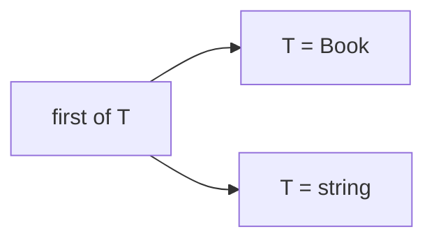
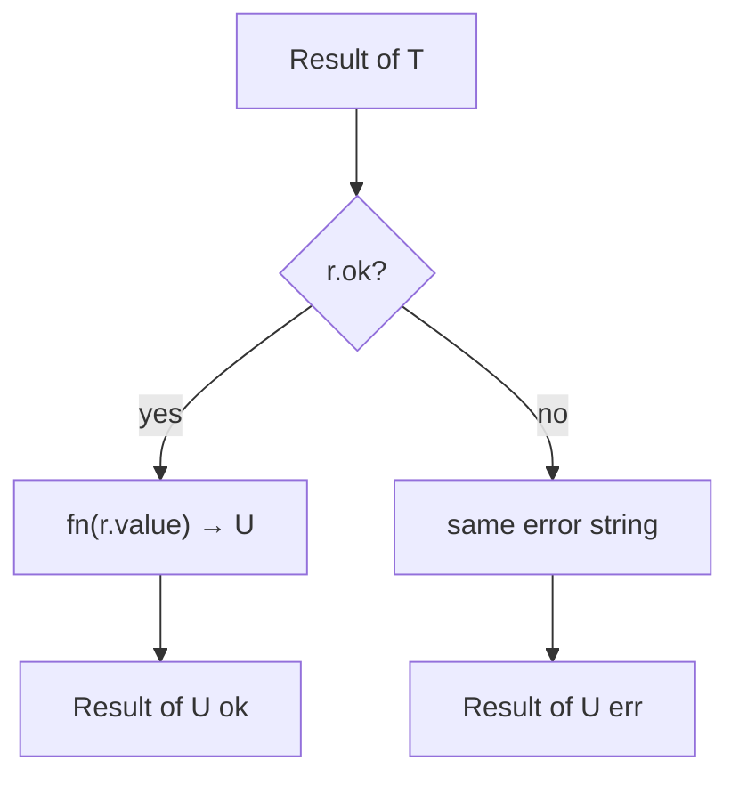

# Month 5 · Week 2 · Day 4
# Generics

**Program:** Full-Stack Mastery · 18 months  
**Phase:** 1 — Foundations  
**Month index:** [../../README.md](../../README.md)  
**Week 2:** [1](day-01.md) · [2](day-02.md) · [3](day-03.md) · Day 4 (today) · [5](day-05.md) · [6](day-06.md) · [7](day-07.md)  
**Week rhythm today:** Learn + type-along  
**Student state:** You have used `Result<T>` as a pattern. Today you can **explain** `T`.  
**Study time:** 3–4 focused hours

A **generic** is a type parameter — a hole you fill at each use. It is not copy-paste of `ResultBook`, `ResultUser`, `ResultMovie`.

Project 3 may use `Result<T>` (or the same idea). This textbook never contains the converted app. Labs: `~\fullstack-lab\month-05\week-02\`.

---

## How to use this textbook

1. Read a section. Close it. Say “`T` is chosen from the argument” in your own words.
2. Type every lab. Do not paste `mapResult` you cannot trace on paper.
3. When `tsc` errors, see whether `T` was inferred as something you did not expect.
4. Optional review links are for later rechecking.

---

## How to read this chapter

You already know functions with **value** parameters: `function first(items)`. A generic adds a **type** parameter: `function first<T>(items: T[])`. `T` is not a runtime value. It is erased. It exists so the **return type tracks the input type**.

Without generics, you write `firstBook` and `firstString` with the same body. With `any`, you write one function and throw away checking. Generics are the honest middle.



Day 2’s `Result<T>` was this idea on a **type**. Today it is also on **functions**. Constraints (`extends`) say what `T` must look like. Day 5 tests the functions. Do not skip the lab.

---

## Today's contract

By the end of this day you will be able to:

1. Write `first<T>(items: T[]): T | undefined` and explain inference at the call site.
2. Write `last<T>` the same way.
3. Constrain with `T extends { title: string }` and say why `titleOf(42)` fails.
4. Keep `Result<T>` and add `wrapOk<T>` and `mapResult<T, U>`.
5. Name when **not** to generic (one type ever; type puzzles).

**Today's gate**

> `function first<T>(items: T[]): T | undefined` works for `Book[]` and `string[]` without `any`. `T` is chosen by inference from the argument, or you write `first<Book>(books)`.

If you implement `first` as `(items: any[]) => any`, you failed the gate.

---

## Time box

| Block | Minutes | Work |
|---|---|---|
| A | 55 | Theory: hole, inference, constraints, Result |
| B | 50 | Type-along: first + mapResult |
| C | 70 | Lab: generic.ts + tests |
| D | 20 | Git |
| E | 15 | Recall |

---

# Block A — Theory

## 1. The problem

```ts
function firstBook(items: Book[]): Book | undefined {
  return items[0];
}
function firstString(items: string[]): string | undefined {
  return items[0];
}
```

Same body. A generic names the pattern:

```ts
export function first<T>(items: T[]): T | undefined {
  return items[0];
}
```


When you call `first(books)`, TypeScript **infers** `T` as `Book`. When you call `first(["a", "b"])`, `T` is `string`. You may write `first<Book>(books)` if inference is too wide or too narrow — rare today.

`undefined` is for the empty array. Runtime `items[0]` is `undefined` then; the return type tells the truth. Do not lie with `T` alone unless you also forbid empty lists (you will not, today).

> **Wrong belief:** “`T` is a runtime variable I can `console.log`.”  
> **Correct:** `T` is erased. `first` is one JavaScript function. The checker substitutes types at each **call site**.

---

## 2. Inference at the call site

```ts
const books: Book[] = [{ id: "1", title: "Dune" }];
const b = first(books);
// b: Book | undefined
```

If you pass a **mixed** array `first([1, "x"])`, `T` becomes `number | string`. That is honest. If you wanted only numbers, annotate the argument `const xs: number[] = [1]` or `first<number>([1])` — the second may error on `"x"` if you include it.

Empty array: `first([])` often infers `T` as `never` (or needs a hint). **Annotate** `first<string>([])` or pass `const xs: string[] = []`. Same Week 1 empty-array lesson, now on the type parameter.

---

## 3. Constraints

```ts
function titleOf<T extends { title: string }>(item: T): string {
  return item.title;
}
```

`T extends { title: string }` means: `T` must have at least `title: string`. `titleOf({ title: "Dune", year: 1965 })` works — extra `year` is fine. `titleOf(42)` does not.

The return is `string` here (you only needed the title). You could return `T` if you were passing the item through.

Do not write `T extends any`. That is `any` in a costume. Do not constrain with an empty `{}` as a party trick (almost everything extends `{}` in sloppy ways). Constrain with the **shape you read**.

> **Wrong belief:** “I’ll constrain everything with `extends object`.”  
> **Correct:** constrain what you **use**. `first<T>` needs no constraint. `titleOf` needs `title`.

---

## 4. Generics on types

```ts
type Ok<T> = { ok: true; value: T };
type Err = { ok: false; error: string };
type Result<T> = Ok<T> | Err;

type Paginated<T> = { items: T[]; page: number };
```

`Err` has no `T` because the error is always `string` in this course. You *could* write `Err<E>` later. Do not today.

**Multiple parameters:** `Map<K, V>` in the standard library. You may write `type Pair<A, B> = { left: A; right: B }`.

`mapResult<T, U>` has two holes: the value going in (`T`) and the value after `fn` (`U`).

```ts
export function wrapOk<T>(value: T): Result<T> {
  return { ok: true, value };
}

export function mapResult<T, U>(r: Result<T>, fn: (v: T) => U): Result<U> {
  if (!r.ok) return r;
  return { ok: true, value: fn(r.value) };
}
```

If `!r.ok`, return the **same err**. The type is `Result<U>` — an err has no `value`, so it is assignable to `Result<U>` (both sides are `{ ok: false; error: string }`). If `r.ok`, `fn(r.value)` produces `U`.

Trace on paper: `mapResult(parseYear("1965"), (n) => n + 1)` should be `{ ok: true, value: 1966 }`. `mapResult(parseYear("nope"), (n) => n + 1)` stays `{ ok: false, error: "not a year" }` — `fn` never runs.

---

## 5. When not to generic

If there is only one type ever, write that type. `first<T>` is earned. `Wrapper<T, U, V, W>` for a todo app is showing off. Project 3: `Result<T>`, maybe `Paginated<T>` — not a type-level query language.

Avoid:

- `T extends any`
- Generic wrappers you cannot explain aloud
- Replacing a simple `Movie[]` with `Container<Holder<Movie>>` for fun

> **Wrong belief:** “Generics replace runtime checks.”  
> **Correct:** they connect typed **call sites**. JSON is still `unknown` (Week 3). `parseYear` still inspects `NaN` at runtime.

> **Wrong belief:** “I should add generics to every helper.”  
> **Correct:** `totalMinutes(tracks: Track[])` does not need `T`. `first` does.

---

## 6. Generics vs `any` vs overloads

| Tool | Use |
|---|---|
| `any` | Forbidden as a shortcut |
| Overloads | Multiple signatures — not this week |
| Generic | Same logic, type tracks the input |

`first` with `any[]` “works” for books and strings and **typos**. `first<T>` works for books and strings and **still checks**.

---

# Block B — Type-along

```powershell
mkdir ~\fullstack-lab\month-05\week-02\day-04
cd ~\fullstack-lab\month-05\week-02\day-04
npm init -y
npm install --save-dev typescript tsx
```

Same scripts and `tsconfig` as Week 1.

Type `first` and `wrapOk` from this chapter. Call `first(["a", "b"])` and `first` on a small `Movie[]`. Typecheck. Write tests that `first([])` is `undefined` and `first([1, 2])` is `1`.

Then type `mapResult`. Test ok-map and err-pass-through.

---

# Lab

`generic.ts`:

- `first<T>`, `last<T>`
- `wrapOk<T>(value: T): Result<T>`
- `mapResult<T, U>(r: Result<T>, fn: (v: T) => U): Result<U>` — if `!r.ok` return the same err; else `{ ok: true, value: fn(r.value) }`

Tests with `string` and a `Movie`. No `any`.

`last` is `items[items.length - 1]` with the same `T | undefined` story. Empty → `undefined`.

You may copy `Result<T>` into this file (do not import from a path you did not write unless you maintain that path). Movie can be a tiny `{ id: string; title: string }`.

Optional (if time): `titleOf<T extends { title: string }>` with a test that a movie works. Do not spend the day on type puzzles.

```powershell
git add month-05/week-02/day-04
git commit -m "Week 2 Day 4: generics first/mapResult."
```

---

# Tracing `T` on paper (required skill)

Write this in `TRACE.txt` **before** you run tests — then confirm.

1. `first(["a", "b"])` — `T` is `string`. Return `string | undefined`. Result `"a"`.
2. `first<Movie>(movies)` — you **stated** `T`. If `movies` is `Movie[]`, fine. If you pass `string[]`, `tsc` errors.
3. `wrapOk(1965)` — `T` is `1965` (numeric literal) or `number` depending on widening. Assigning to `Result<number>` is fine.
4. `mapResult(wrapOk("dune"), (s) => s.length)` — `T` is `string`, `U` is `number`. Result `{ ok: true, value: 4 }`.
5. `mapResult({ ok: false, error: "x" }, (s: string) => s.length)` — you may need to annotate the err as `Result<string>` so `T` is `string`. `fn` must not run. Result still `{ ok: false, error: "x" }`.

If step 5 surprises you, that is the lesson: **err has no `T` in the value**, but the `Result<T>` still names what an ok value **would** have been. Mapping changes `T` → `U` only on the ok path.



**Default type parameters** (`type Result<T = string>`) exist. Skip them today. They hide what `T` is.

**Generic inference from return context** is a later trick. Today, pass arguments TypeScript can see.

> **Wrong belief:** “I’ll write `first(items: T[])` without `<T>` on the function.”  
> **Correct:** `T` must be declared: `function first<T>(items: T[])`. Otherwise `T` is an undefined name in type space.

# Block E — Recall

1. What is `T`?
2. How does `first(books)` choose `T`?
3. What does `extends { title: string }` mean?
4. Why does `mapResult` on an err not call `fn`?
5. When should you **not** write a generic?
6. Why is `function first(items: T[])` illegal without `<T>`?

---

## Definition of done

- [ ] `first` / `last` / `wrapOk` / `mapResult` implemented and annotated
- [ ] Tests for string and Movie; empty list; err pass-through
- [ ] No `any`
- [ ] `tsc --noEmit` and `tsx --test` green
- [ ] You can explain `T` closed-book
- [ ] Commit exists

---

## Optional review links

Generics are explained above.

- [Handbook: Generics](https://www.typescriptlang.org/docs/handbook/2/generics.html)

---

## Tomorrow

Tests as a suite: `toMovie` / `toUser`, `parseYear`, `mapResult`, `tsc` on `"DONE"`, deliberate `any` on remote input. README: remote vs internal is the Project 3 rule.
