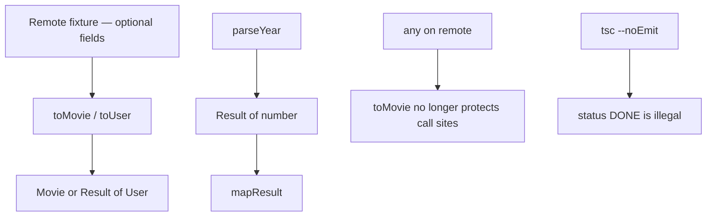
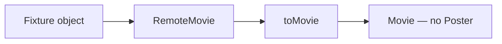

# Month 5 · Week 2 · Day 5
# Tests — Models and Generics

**Program:** Full-Stack Mastery · 18 months  
**Phase:** 1 — Foundations  
**Month index:** [../../README.md](../../README.md)  
**Week 2:** [1](day-01.md) · [2](day-02.md) · [3](day-03.md) · [4](day-04.md) · Day 5 (today) · [6](day-06.md) · [7](day-07.md)  
**Week rhythm today:** Tests + refactor + documentation  
**Study time:** 3–4 focused hours  
**Student state:** You have `toMovie` / `toUser`, `parseYear`, `Result<T>`, `first` / `mapResult`. Today you prove them as a **suite**, and you show that `any` on remote input undoes the modeling.

---

## How to read this chapter

Week 1 Day 5 taught two layers: `tsc --noEmit` vs `tsx --test`. That is still the law. This week’s tests have a **modeling** job: remote fixtures are messy; internal values are strict; `Result` is narrowed; generics keep types lined up.

A test is not “I remember `toMovie` returning null.” It is a fixture object, a call, and an assert. `tsc` is not “the file is red.” It is `"DONE"` failing to assign to `"want" | "doing" | "done"`.



Read Block A until you can say why extra API fields should be **ignored**, why `any` on the remote parameter is a security-of-design hole (not a network exploit — a **lying shape**), and why Project 3 repeats this rule. Then write tests from the spec. This textbook never contains the converted app.

---

## Today's contract

By the end of this day you will be able to:

1. Test `toMovie` / `toUser`: missing title/name fails; extra fields ignored.
2. Test `parseYear`: `"1965"` ok; `"nope"` err.
3. Test `mapResult`: maps value; passes error through.
4. Show `tsc` fails if `status: "DONE"`.
5. Put `any` on remote input, show the protection vanishing, **remove** it.
6. Write a README paragraph: remote vs internal is the Project 3 rule.

**Today's gate**

> The suite is green, `ANY.txt` records the remote-`any` experiment and that it was removed, and the README states the remote/internal rule in my words.

If you only re-ran Day 4 tests, you missed the modeling layer. Stay here.

---

## Time box

| Block | Minutes | Work |
|---|---|---|
| A | 45 | Theory: what each test proves; `any` on remote |
| B | 40 | Type-along: one missing-title test + DONE error |
| C | 70 | Independent: full suite + README + ANY.txt |
| D | 20 | Git |
| E | 15 | Recall |

---

# Block A — Theory

## 1. What we are testing

- `toMovie` / `toUser`: missing title → fail result; extra API fields ignored.
- `parseYear`: `"1965"` ok; `"nope"` err.
- `mapResult`: maps value; passes error through.
- `tsc` fails if `status: "DONE"`.

**Missing title / name.** For `toMovie`, that was `null`. For `toUser`, `ok: false`. Tests must use the actual return type you wrote. Do not assert `null` on a `Result`.

**Extra API fields.** A fixture `{ Title: "Dune", Poster: "http://...", imdbID: "tt1", Year: "1965" }` should still produce a `Movie` **without** requiring `Poster` on `Movie`. If you typed remote as `Movie`, extra fields either error (excess property) or you widened Movie until it was mush. The point of two types is: remote can be baggy; internal is tight.

**`parseYear`.** Trim. `Number`. Non-finite → err. Do not accept `"1965abc"` as `1965` unless you document `Number`’s actual behavior (`Number("1965abc")` is `NaN` — good). `Number("  ")` after trim is `0` or `NaN` depending on trim-to-empty — **treat empty as err**.

**`mapResult`.** Ok branch runs `fn`. Err branch returns the same `error` string; `fn` is not called. A test can use a `fn` that throws and assert it does **not** throw on err (or a flag `let called = false`).

**Literal `DONE`.** This is a **type** test. Comment it in a file you do not need green, or keep a `status-typo.ts` out of `include` — simplest: put the illegal assignment in a comment in `ERRORS.txt` with the quoted `tsc` line from when you uncommented it. Do not leave the repo failing typecheck.

---

## 2. Deliberate `any` on remote input

Deliberate `any` on remote input — show that `toMovie` no longer protects you. Remove it.

If `toMovie(remote: any)`, then `toMovie({ titel: "Dune" })` typechecks. At runtime you return `null` or a bad movie depending on whether you read `Title`. Tests that only pass **correct** fixtures stay green. Call sites in a UI can pass garbage. That is the Week 1 `any` lesson applied to **the Project 3 boundary**.

README: how remote vs internal is the Project 3 rule.

Write in your words:

- External JSON is not trusted application data.
- Transform (`toMovie` / `toUser`) is the boundary.
- `any` on that boundary deletes the boundary.
- Prefer `unknown` next week; today the parameter is `RemoteMovie` / `RemoteUser`.

Do **not** paste Project 3 source. Do not invent the whole Vite app.

> **Wrong belief:** “Tests that use good fixtures prove the remote type.”  
> **Correct:** those tests prove the **transform on examples you wrote**. `tsc` proves other files cannot pass a typo **unless** you used `any`.

> **Wrong belief:** “I’ll type the fetch as `Movie[]` to save a function.”  
> **Correct:** then missing `Title` becomes a lie in the list UI. Two types + transform.

---

## 3. Generics in the test file

When you `first(movies)`, the result should be `Movie | undefined`. You do not have to annotate the const if inference works. If you write `const x: string = first(movies)` , `tsc` should fail — that is a useful type test. Keep it commented in `ERRORS.txt` or as a file excluded from the program.

`mapResult(wrapOk("dune"), (s) => s.toUpperCase())` should be `{ ok: true, value: "DUNE" }`. If `wrapOk` were `any`, `toUpperCase` would not be checked.

---

## 4. Arrange / act / assert

Same as always. Fixtures are **plain objects** in the test file. Import from `node:assert/strict` and `node:test`. Run with `tsx --test`. Typecheck with `tsc --noEmit`. Both scripts in `package.json`.

Mutation is less central this week (transforms return new objects anyway) — still do not mutate the remote fixture if you assert on it later.

---

# Block B — Type-along

Work in `~\fullstack-lab\month-05\week-02\day-05\` or continue a week-02 folder you already have, as long as the suite lives in one place you can run.

1. One test: missing `Title` → fail (`null` or `ok: false`).
2. Uncomment `status: "DONE"` on a `SavedMovie`. Quote `tsc`. Comment it again.
3. Change `toMovie(remote: any)`. Show a typo fixture typechecking. Write `ANY.txt`. Restore the real parameter type.

---

# Block C — Independent

If functions are missing, recreate them from this week’s **specs** (not from AI). Then complete the bullet list in section 1.

README: how remote vs internal is the Project 3 rule.

```powershell
git add month-05/week-02
git commit -m "Tests for transforms, Result, generics."
```

---

# A suite that matches Project 3’s testing idea

Project 3 asks for tests of **transformation**, **validation**, and **error-state logic**. You are not building Project 3 today. You are practicing those *kinds* of tests on tiny functions.

| Kind | Today’s example | Not a test |
|---|---|---|
| Transform | `toMovie({ Title: "Dune", Year: "1965", imdbID: "tt1" })` | “I looked at the object in the debugger” |
| Fail path | missing `Title` / missing `name` | hoping `null` without an assert |
| Extra fields | `Poster` present, `Movie` has no `Poster` | typing the fixture as `any` |
| Parse | `parseYear("1965")` / `parseYear("nope")` | only logging the result |
| Map | `mapResult` ok and err | mapping only the happy path |
| Type | `"DONE"` fails `tsc` | a runtime `if (status === "DONE")` you never run |

Worked fixture (you type it in the test file):

```ts
const remote = {
  Title: "Dune",
  Year: "1965",
  imdbID: "tt0087182",
  Poster: "https://example.com/p.jpg",
};
```

If `toMovie` is typed as `(remote: RemoteMovie) => Movie | null`, this literal may trigger **excess property** checks because of `Poster`. Two honest options:

1. Put `Poster?: string` on `RemoteMovie` (the API really has it).
2. Assign through a variable: `const remote: RemoteMovie = { Title: "Dune", Year: "1965", imdbID: "tt1" }` and keep Poster off the typed value.

Do **not** pick option 3: `as any`. Extra fields “ignored” means: they are allowed on **remote**, absent on **Movie**. If excess-property checks block a realistic fixture, widen **remote**, not internal.



# `Result` vs `null` in tests

Day 1 `toMovie` returned `Movie | null`. Day 3 `toUser` returned `Result<User>`. Tests must follow the function you actually wrote:

```ts
assert.equal(toMovie({ Title: "  " }), null);

const r = toUser({ name: "  " });
assert.equal(r.ok, false);
```

Do not write `assert.equal(toUser(...), null)` if the spec said `Result`.

When `r.ok` is true, `assert.equal(r.value.name, "Ada")`. TypeScript in the test file **also** narrows after `if (!r.ok) throw` or after `assert.equal(r.ok, true)` — `assert` **may not** narrow. If `r.value` errors in the test, use:

```ts
if (!r.ok) throw new Error(r.error);
assert.equal(r.value.name, "Ada");
```

That is a narrowing pattern, not a cop-out.

# Block E — Recall

1. What extra API fields should do to `Movie`.
2. What `any` on `remote` destroys.
3. What `mapResult` does with `{ ok: false, error: "x" }`.
4. Why `"DONE"` is a `tsc` test, not a `tsx` test.
5. Why `assert.equal(r.ok, true)` might not narrow `r.value`.
6. Whether to widen `RemoteMovie` or `Movie` when a fixture has `Poster`.

---

## Definition of done

- [ ] Tests: missing title/name, extra fields ignored, parseYear ok/err, mapResult map + pass-through
- [ ] `ERRORS.txt` or notes: `"DONE"` type error
- [ ] `ANY.txt`: remote `any` experiment; `any` removed
- [ ] README: remote vs internal (Project 3 rule) in your words
- [ ] `tsc --noEmit` and tests green; no `any` committed
- [ ] Commit exists

---

# `first` and `mapResult` in the same suite

Do not treat generics as a separate hobby project. One test file (or two) should import `first`, `last`, `wrapOk`, `mapResult`.

```ts
const movies: Movie[] = [
  { id: "1", title: "Dune", year: 1965 },
];

assert.equal(first(movies)?.title, "Dune");
assert.equal(first([] as Movie[]), undefined);
assert.equal(last(movies)?.id, "1");

const ok = wrapOk("dune");
const mapped = mapResult(ok, (s) => s.toUpperCase());
if (!mapped.ok) throw new Error("expected ok");
assert.equal(mapped.value, "DUNE");

const err = mapResult(
  { ok: false, error: "nope" } as Result<string>,
  (s) => s.toUpperCase(),
);
assert.equal(err.ok, false);
```

`[] as Movie[]` is an annotation because empty array inference is `never[]` — Week 1. Prefer `const empty: Movie[] = []` over `as`.

**`as Result<string>`** on an err literal is a hint so `T` is `string` for `mapResult`. You may instead write `wrapErr` that returns `Result<T>` — only if you still test pass-through.

> **Wrong belief:** “Generic tests only need `first([1, 2])`.”  
> **Correct:** also a **named object type** (`Movie` / `User`) so you prove `T` is not secretly `any`.

# README paragraph (required)

Remote vs internal is the Project 3 rule. In your words, not a paste:

1. API JSON is a **remote** type (optional fields, string years).
2. The UI uses an **internal** type (required id/title, `year: number | null`).
3. A function (`toMovie` / `toUser`) is the boundary.
4. `any` on the boundary means there is no boundary.
5. `tsc --noEmit` checks call sites; `tsx` checks examples.

Do not paste the converted catalog. Do not scaffold Vite today.

## Optional review links

Transforms, `Result`, and generics testing are explained in this chapter.

- [Handbook: Generics](https://www.typescriptlang.org/docs/handbook/2/generics.html)
- [Handbook: Everyday Types — unions](https://www.typescriptlang.org/docs/handbook/2/everyday-types.html#union-types)
- [Project 3 spec](../../../full_stack_project_requirements_2026/project_03_typescript_application.md) — requirements only; **never** paste a converted app into the lab

---

## Tomorrow

Independent: a **library** domain (`RemoteWork`, `Work`, `SavedWork`) plus a 400+ word teach-back on illegal boolean combos vs a union of objects.

`tsc --noEmit` remains the gate. A green `tsx` suite with `any` on `toMovie` is a failed day, even if every assert passes. Restore the remote type before you commit.

**Folder.** `~\fullstack-lab\month-05\week-02\day-05\` (or the week-02 folder you already run). Same `strict` / `noEmit` / `tsx --test` as Week 1. Do not start a Vite app to “make tests more real.” Pure modules are the right size.

If `toUser` is missing, recreate it from Day 3’s spec in this book — not from a chat log. The suite is the product today.

Project 3 will ask for transform tests and error-state tests. Today’s suite is that habit on `toMovie` / `Result` / `"DONE"`. Still do not paste the converted app.

Labs: `~\fullstack-lab\month-05\week-02\`. Windows. `npx tsc --noEmit` is the check.

Never commit `any` on `toMovie` / `toUser`. Quote the silence in `ANY.txt`, then restore the remote type.
