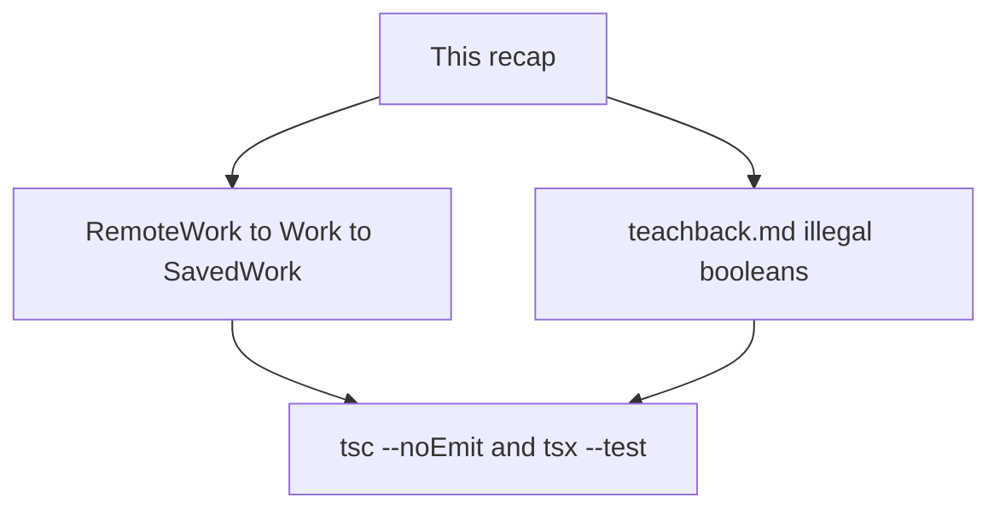
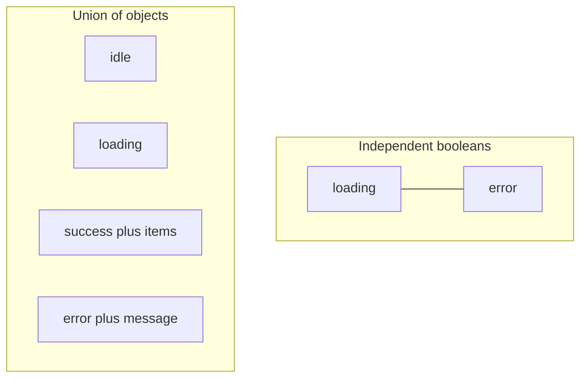

# Month 5 · Week 2 · Day 6
# Independent: Model a Collection

**Program:** Full-Stack Mastery · 18 months  
**Phase:** 1 — Foundations  
**Month index:** [../../README.md](../../README.md)  
**Week 2:** [1](day-01.md) · [2](day-02.md) · [3](day-03.md) · [4](day-04.md) · [5](day-05.md) · Day 6 (today) · [7](day-07.md)  
**Week rhythm today:** Independent project work  
**Study time:** 3–4 focused hours  
**Machine today:** Windows PowerShell, Node.js 20+  
**Days 1–5 textbook files:** closed for the *challenges*. Repair from **Week 2 Days 1–2 and Day 4 in this book**.

---

## How to read this chapter

Today you prove Week 2 without a type-along. The complete explanation below **is** the lesson. Read a section. Close it. Say it. Then model a **library** (works, not your Project 2 catalog paste).

If you catch yourself renaming `Movie` to `Work` and shipping it, stop. A work can have `authors`, a `year`, a remote key — pick a small honest shape. Same *rules*, new *names*.



Allowed: this file, your notes, the terminal error.  
Not allowed: Day 1–5 as paste, Project 2/3 source, AI writing the models or the teach-back.

If you are stuck more than 25 minutes, open **only** Day 1, 2, or 4 **in this textbook**, read one section, close it, continue. Record the lookup.

---

## Complete explanation (this book is the lesson)

Name shapes with `type` (unions) / `interface` (objects). Remote ≠ internal. Union + narrow. Literals for statuses. Intersection = both. Generics: `T` as a hole; `extends` to constrain; `Result<T>` / `first<T>`. No `any`. No type puzzles.

### `type` vs `interface`

`type` names anything, including `A | B`. `interface` names objects and can merge — do not repeat the name by accident. This course: `type` for `Result` and status unions; either keyword for `Work` if you stay consistent.

### Remote vs internal

`RemoteWork` has optional fields because catalogs lie (`title?`, `key?`, year as string or number). `Work` has required `id` and `title` after transform. `SavedWork` adds a **literal** status (`"want" | "doing" | "done"` or `"unread" | "reading" | "read"` — pick one union and test it). `"DONE"` must be a type error.

`toWork` returns `Result<Work>` (preferred) or `Work | null` if you document why. This recap prefers `Result` so Challenge 2’s state lecture and Challenge 1’s errors use the same `ok` narrowing.

### Unions, literals, intersections

Union: one or the other; narrow before exclusive fields. Literal: exact strings/numbers. Intersection: both — `Work & { status: Status }` is a fine `SavedWork`.

**Illegal booleans:** `{ loading: boolean; error: boolean }` allows loading+error. A union of objects `{ status: "idle" } | { status: "loading" } | { status: "success"; items: Work[] } | { status: "error"; message: string }` does not. That is the teach-back. Week 3 will call it a **discriminated union**. Today you must already **teach** why booleans fail.

### Generics

`first<T>(items: T[]): T | undefined`. `mapResult<T, U>`. `T` is erased. Inference from arguments. Constrain only what you read (`extends { title: string }`). Do not `extends any`. JSON is still runtime.

`tsc --noEmit` is the gate. `tsx` runs tests.

> **Wrong belief:** “Generics replace runtime checks.”  
> **Correct:** `toWork` still inspects missing titles at runtime. Types line up call sites.

> **Wrong belief:** “Independent day means I can skip `tsc` if tests pass.”  
> **Correct:** both commands. `tsx` is not the gate.

> **Wrong belief:** “I’ll set `error = false` whenever I set `loading = true`.”  
> **Correct:** that is a convention another function will break. A union makes the illegal state **unrepresentable**.

---

## Office hours — Movie stickers, `status: string`, and teach-backs that never name loading&&error

**`Work` is a renamed `Movie`.** New fields (`key`, `first_publish_year`, `authors`). Your own fixtures. Project 2 stays closed.

**`status: string` on SavedWork.** `"DONE"` compiles. Literal union. Test a type error in `ERRORS.txt` or a commented line.

**`toWork(remote: any)`.** You deleted the boundary. `RemoteWork`.

**Teach-back never says `loading && error`.** Rewrite. Four boolean combinations. What the operator sees. How `Result` is the same idea at function scale.

**Generic `first` that is not generic.** `first(works: Work[])` is fine as a *function*, but the spec asked you to reuse or retype `first<T>`. Two call sites: `Work` and `string`.

---

## Today's contract

**Today's gate**

> A library domain typechecks with remote ≠ internal, `Result<T>`, and a literal status. Teach-back is 400+ words on illegal boolean combos vs a union of objects. I did not paste Project 2.

---

## Time box

| Block | Minutes | Work |
|---|---|---|
| A | 20 | Speak this recap |
| B | 90 | Challenge 1: library models + tests |
| C | 50 | Challenge 2: teach-back |
| D | 20 | Git |

---

# Challenge 1

A **library** domain (not your Project 2 paste): `RemoteWork`, `Work`, `SavedWork` with status literals, `toWork`, `Result<T>`, `first`/`mapResult` reused or retyped. Tests.

Folder: `~\fullstack-lab\month-05\week-02\independent\`.

Minimum:

| Piece | Rule |
|---|---|
| `RemoteWork` | optional remote fields |
| `Work` | required id + title; year `number \| null` or similar |
| `SavedWork` | work fields + status literal union |
| `toWork` | `Result<Work>` (or documented `null`) |
| `first` / `mapResult` | generic; tests with `Work` and `string` |

Tests: missing title → fail; extra remote field ignored; `first([])` undefined; `mapResult` pass-through err; mutation not required unless you write list helpers.

No `any`. `package.json` `typecheck` = `tsc --noEmit`. Node.js 20+.

```powershell
cd ~\fullstack-lab\month-05\week-02\independent
npm run typecheck
npm test
```

# Challenge 2 — Teach-back

400+ words: why `loading: boolean` + `error: boolean` is an illegal combo; how a union of objects prevents it (preview of Week 3).

Write `teachback.md`. Paragraphs. A TA should believe you could teach this at a whiteboard. Include:

1. A concrete illegal combo (loading true, error true, items still `[]`).
2. Why `tsc` allows it if both are booleans.
3. The four-variant union (`idle` / `loading` / `success` / `error`).
4. Why `success` can require `items` and `error` can require `message`.
5. One sentence on Project 3 state (idle/loading/success/error) **without** pasting the app.
6. How `Result<T>` is the same *idea* at the function scale (`ok: true` vs `ok: false`).

### Teach-back anti-patterns

- A type dump with no prose.
- “Unions are better” as the only thesis.
- Under 400 words.
- Pasting this recap.

If you never mention a **boolean pair**, rewrite.

```powershell
git add month-05/week-02/independent
git commit -m "Independent typed library models."
```

---

## Teach-back must make this picture obvious



In the boolean model, four combinations of two booleans exist (true/true, true/false, false/true, false/false). At least one is nonsense (loading and error). If you also have `items: Work[]` always present, you can show a spinner **and** a stale list **and** an error banner. Operators do not know what is true.

In the union model, a value has **one** `status` literal. If it is `"loading"`, there is no `message` required, and you should not read `items` unless you included them in that variant (this course’s `Good` type on Day 2 did **not** put items on loading). TypeScript will error if you read `state.items` without narrowing `state.status === "success"`. That is the compiler doing product design.

Week 3 will teach `switch (state.status)` and exhaustiveness with `never`. Today it is enough to **want** that switch.

`Result<T>` is the same pattern: you cannot read `.value` until `.ok` is true. You practiced that with `parseYear`. The teach-back should connect those sentences.

Do not implement a full UI. Types + prose are the assignment.

### Library fixtures (your own)

```ts
const remote = {
  key: "/works/OL1",
  title: "Dune",
  first_publish_year: 1965,
  extra: "ignore me",
};
```

`toWork` should not require `extra` on `Work`. Year may be a number already on this API — still keep `RemoteWork.year` or `first_publish_year` optional. Internal `year: number | null`. Status on `SavedWork` only, not on `Work`.

`first([work])` is that work; `first([])` is `undefined`. If you retype `first` instead of importing, it must still be generic — `first(works)` is `Work | undefined`, `first(["a"])` is `string | undefined`.

### Teach-back length

400+ words. Count. If you are short, add: (1) the four boolean combinations, (2) what the operator sees, (3) how `Result` is the same idea. If you are a novel, cut slogans; keep the illegal combo.

### Common mistakes today

| Mistake | Fix |
|---|---|
| `Work` is a renamed `Movie` paste | new fields; your own fixtures |
| `status: string` | literal union |
| `toWork(remote: any)` | `RemoteWork` |
| teach-back is a keyword table | paragraphs + illegal combo story |
| only `tsx`, no `tsc` | both green |

---

## Worked walkthrough — Dune remote, ignore `extra`

```ts
const remote = {
  key: "/works/OL1",
  title: "Dune",
  first_publish_year: 1965,
  extra: "ignore me",
};
```

`toWork(remote)` is `ok` with `id` derived from `key` (document the rule) and `title: "Dune"`. `Work` has no `extra`. Missing `title` → `ok: false`. `SavedWork` adds `"unread" | "reading" | "read"` (or want/doing/done). `"DONE"` is a type error — quote it in `ERRORS.txt`.

`first([work])` is that work. `first([])` is `undefined`. `first(["a"])` is `string | undefined` if `first` is generic. If both call sites are `Work`, you did not prove `T`.

**Teach-back illegal combo.** `loading: true`, `error: true`, `items: []`. Spinner, banner, empty list. `tsc` allows it because two booleans are four combinations. Union of objects: one `status`. Connect `Result<T>` (`ok`) in a paragraph. 400+ words. Close this file first.

Windows: independent folder, both scripts. Node.js 20+. No Project 2 paste.

---

## Definition of done

- [ ] `RemoteWork` / `Work` / `SavedWork` / `toWork` / `Result<T>` / `first` or `mapResult`
- [ ] Tests green; `tsc --noEmit` green; no `any`
- [ ] Teach-back 400+ words on boolean combos vs object union
- [ ] Not a Project 2 paste
- [ ] Commit exists

---

## Stalls and repair — Movie stickers, status string, teach-back without booleans

If `Work` is a renamed `Movie`, add `key` / `first_publish_year` / `authors` and your own fixtures. Project 2 stays closed. Extra remote field `extra` must not be required on `Work`.

If `status: string`, `"DONE"` compiles. Literal union. Quote a type error.

If `toWork(remote: any)`, you deleted the boundary. `RemoteWork`. Missing title still fails at **runtime** inside `toWork`. Generics do not replace that check.

If `first` is only `Work[]`, add `first(["a"])` so `T` is proven. `first([])` is `undefined`.

If teach-back never names `loading && error`, rewrite. Four boolean combinations. Operator sees spinner + banner + empty list. Union of objects: one `status`. `Result<T>` is the same idea (`ok`). 400+ words. Close this file. No type dump.

If only `tsx` ran, `tsc --noEmit` is the gate. No `extends any`. No Project 2 paste. No UI required.

Windows: `cd ~\fullstack-lab\month-05\week-02\independent` then both scripts. Node.js 20+.

---

## Last forty minutes

`RemoteWork` / `Work` / `SavedWork` / `toWork` / `Result<T>` / `first` or `mapResult`. Tests: missing title, extra field ignored, `first([])`, `mapResult` err pass-through. Literal status. `"DONE"` type error. Both scripts. No `any`. Not a Project 2 paste.

Teach-back 400+ words names `loading && error` and the four-variant union. `Result` is the same idea. Close this file. Word count.

Commit `month-05/week-02/independent`. If the letter never named boolean pairs, add that sentence before you sleep.

---

## Worked checkpoint — illegal booleans, legal `status`

Four boolean pairs for `loading` + `error`: both false (idle-ish), loading true / error false, loading false / error true, **both true**. The last is a spinner plus a banner plus maybe an empty list. An operator cannot know which story is true. A union of objects with `status: "idle" | "loading" | "success" | "error"` makes “both” unrepresentable.

`Result<T>` is the same idea with `ok`. `toWork` is specific: `RemoteWork` → `Result<Work>`. Missing title fails at **runtime**. Extra remote fields ignored. `"DONE"` on a literal status is a **type** error. `first<T>([])` is `undefined`. `mapResult` passes `err` through.

Teach-back 400+ words names those four combinations and the union. Close this file. Word count on line one. Domain is a **library of works**, not a Project 2 movie paste.

> **Wrong belief:** “I’ll set `error = false` whenever I set `loading = true`.”  
> **Correct:** that is a convention a teammate will break. The type should refuse the illegal pair.

Both scripts. No `extends any`. No UI required. Windows: `cd ~\fullstack-lab\month-05\week-02\independent`. Node.js 20+.

If `first` is only proven on `Work[]`, add `first(["a", "b"])` so `T` is a string too. `mapResult` on `{ ok: false, error: "x" }` must not invent a value. Literal status: `"want" | "doing" | "done"` — not `string`. Teach-back word count on line one. Not a Project 2 paste.

---

## Optional review links

Modeling, unions, and generics are explained in this chapter.

- [Handbook: Everyday Types — unions](https://www.typescriptlang.org/docs/handbook/2/everyday-types.html#union-types)
- [Handbook: Generics](https://www.typescriptlang.org/docs/handbook/2/generics.html)
- [Project 3 spec](../../../full_stack_project_requirements_2026/project_03_typescript_application.md) — read the modeling rules; do not paste an app

---

## Tomorrow

Week review: speak the diagram, mini-build `Result<string>` parse, debug union-without-narrowing and remote `any`. Repair today if the teach-back wobbled.

A teach-back that never names `loading && error` is incomplete. Add that sentence before you sleep.
