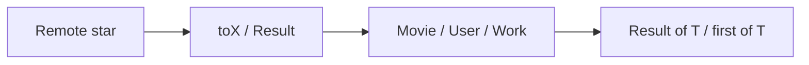
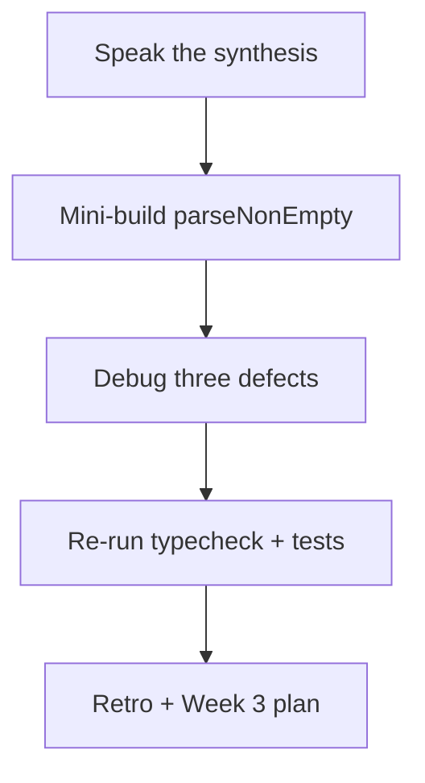

# Month 5 · Week 2 · Day 7
# Week Review — Type Modeling

**Program:** Full-Stack Mastery · 18 months  
**Phase:** 1 — Foundations  
**Month index:** [../../README.md](../../README.md)  
**Week 2:** [1](day-01.md) · [2](day-02.md) · [3](day-03.md) · [4](day-04.md) · [5](day-05.md) · [6](day-06.md) · Day 7 (today)  
**Week rhythm today:** Review, repair, plan Week 3  
**Study time:** 3–4 focused hours  
**Machine today:** Windows PowerShell, Node.js 20+  
**Student state:** You have named remote vs internal types, unions, literals, `Result<T>`, and `first<T>`. Today those ideas must still live in your head — from **this file**.

Do not start Week 3 because the calendar moved. Narrowing on a mushy `any` remote is two problems.

---

## How to read this chapter

This is a **closed-book teaching day**. The synthesis below is the lesson, written so you can re-learn Week 2 from this page alone.

1. Read a section. Close it. Say the idea.
2. During the mini-build, Days 1–6 stay closed. Repair from **this synthesis**.
3. Repair the weakest topic **today**. Week 3 assumes you can write `Result<T>` and a literal status without looking them up.





---

## Week synthesis (the lesson, in this book)

- `type` vs `interface`
- Unions / literals / intersections
- Remote vs app
- Generics with a constraint
- `Result<T>` narrowing on `ok`

**`type`** names any type. **`interface`** names objects; declaration merging can surprise you — do not repeat app interface names. Unions (`A | B`) require `type`. This course prefers `type` for models that include unions.

**Remote vs internal.** Optional messy JSON is not the UI type. `toMovie` / `toUser` / `toWork` transform. Extra fields ignored. Missing title fails (`null` or `Result`). Project 3’s rule is this picture. This textbook never contains the converted app.

**Union** = one or the other; **narrow** before exclusive members. **Literal** `"want" | "doing" | "done"` — `"DONE"` fails. `const` infers literals; `let` often widens. **Intersection** `A & B` = both. Do not model UI as `loading: boolean` plus `error: boolean`.

**Generics.** `T` is a hole, erased at runtime. `first<T>(items: T[]): T | undefined`. Inference from the argument. `T extends { title: string }` constrains. `mapResult<T, U>` maps ok values and passes errs through. No `extends any`. No type puzzles.

**`Result<T>`** = `{ ok: true; value: T } | { ok: false; error: string }`. Narrow `if (r.ok)`. Same idea as a tiny discriminated union.

**`tsc --noEmit`** is the check. **`tsx` runs tests; it does not replace `tsc`.** No unjustified `any`. `any` on remote deletes the boundary.

Closed-book: speak the diagram.

The rest of this file unpacks those sentences so the mini-build does not require Days 1–6.

---

## Today's contract

By the end of this day you will be able to:

1. Teach Week 2 aloud from the synthesis.
2. Write a `Result<string>` parse for non-empty trim.
3. Diagnose union-without-narrowing, `any` on remote, and an unconstrained generic used like `any`.
4. Re-run typecheck + tests from this week.
5. Retro + Week 3 plan; repair the weakest hole today.

**Today's gate.** Closed-book:

> I can explain type vs interface, remote vs app, union vs intersection, `Result<T>`, `first<T>`, and I have a green parse function with tests and `tsc --noEmit`.

---

## Time box

| Block | Minutes | Work |
|---|---|---|
| 1 | 40 | Speak the synthesis |
| 2 | 50 | Mini-build: `Result<string>` parse |
| 3 | 30 | Debug three defects |
| 4 | 25 | Review independent — one fix |
| 5 | 20 | Re-run typecheck + tests |
| 6 | 20 | Design: when to generic |
| 7 | 25 | Retro + Week 3 plan + repair |

---

# Complete explanation — modeling you must still own

## 1. Naming

Repeating `{ title?: string }` is how remote and internal **drift**. One name per concept. Two names when the network and the UI disagree.

> **Wrong belief:** “One `Movie` type for fetch and UI is simpler.”  
> **Correct:** it is a lie at the boundary.

## 2. Union, literal, intersection

`string | number` needs `typeof`. `"idle" | "loading"` catches typos. `Movie & { status: Status }` is a saved movie. `string & number` is `never` (Week 3).

Illegal booleans: both flags true. Union of objects: one status.

## 3. Generics

`first<T>` is earned because the body does not care what `T` is. `totalMinutes(tracks: Track[])` is not a generic. `titleOf<T extends { title: string }>` is constrained because it **reads** `title`.

> **Wrong belief:** “Generics replace runtime checks.”  
> **Correct:** they line up call sites. `parseYear` still looks at `NaN`.

## 4. Two tools

`tsc --noEmit` never runs `toWork`. `tsx --test` never proves `"DONE"` is illegal unless you also typecheck.

> **Wrong belief:** “I’ll learn narrowing by writing `as Movie`.”  
> **Correct:** `as` is a claim. Week 3 teaches **checks**. Do not start that habit in this review.

---

## Worked `parseNonEmpty`

`"  ada  "` → trim → `"ada"` → `{ ok: true, value: "ada" }`. `"   "` → `{ ok: false, error: "empty" }`. `""` same. `parseNonEmpty(1)` is a type error.

A consumer `label(r: Result<string>)` must `if (r.ok)` before `r.value`. That is today’s narrowing drill.

Optional: `mapResult(parseNonEmpty("ada"), (s) => s.toUpperCase())` → ok `"ADA"`. Err passes through.

---

## Office hours — trim skipped, `as string` after parse, and generics on `toWork`

**No trim.** `"  "` is ok with a padded value. The spec is non-empty **after** trim.

**`as string` on `JSON.parse`.** Wrong mini. Today the input is already `string`. Week 3 is `unknown`. Do not practice the lie.

**`toWork<T>` for sport.** `toWork` is `RemoteWork` → `Result<Work>`. Specific. `first` is generic. Write that in `GENERIC.txt`.

**DEBUG.txt three labels.** Full sentences: what `tsc` does, why a beginner reaches for `any`, what to write instead.

---

Closed-book: speak the synthesis.

---

# Mini-build: `Result<string>` parse non-empty trim

Folder: `~\fullstack-lab\month-05\week-02\review\`.

`parseNonEmpty(raw: string): Result<string>` — trim; if empty, `{ ok: false, error: "empty" }`; else `{ ok: true, value: trimmed }`.

```ts
type Result<T> = { ok: true; value: T } | { ok: false; error: string };

export function parseNonEmpty(raw: string): Result<string> {
  const value = raw.trim();
  if (value === "") return { ok: false, error: "empty" };
  return { ok: true, value };
}
```

You may retype that from **this** review. Days 1–6 stay closed.

Tests: `"  ada  "` → ok `"ada"`; `"   "` → err; `""` → err. A consumer `label(r: Result<string>)` that narrows `if (r.ok)`.

`package.json` / `tsconfig` as usual. `npm run typecheck` and `npm test`. Node.js 20+.

```powershell
cd ~\fullstack-lab\month-05\week-02\review
npm run typecheck
npm test
```

---

# Debug (write the cause, from this week)

Write `DEBUG.txt` — cause in full sentences.

- Union without narrowing (`id: string | number` then `id.toUpperCase()`).
- `any` on remote (`toWork(remote: any)`).
- Generic with no constraint used as `any` (`function titleOf<T>(item: T) { return item.title }` without `extends`).

For each: what `tsc` does, why a beginner reaches for `any`, what to write instead.

**No narrowing.** The union is still both. `typeof` or `if (r.ok)` or `===`.

**`any` on remote.** Call sites pass `{ titel }`. Transform cannot save typed callers. Restore `RemoteWork`.

**Unconstrained `item.title`.** `T` might be `number`. Constraint `extends { title: string }` or take `{ title: string }` and skip the generic.

---

# Review and tests

Open **one** independent or Day 4 file. One strength, one defect, one committed fix. Re-run `npm run typecheck` and `npm test`. Record PASS in `review/TESTS.md`.

---

# Design

When is a generic earned? Write `review/GENERIC.txt`: `first` yes; `toWork` no (`RemoteWork` → `Result<Work>` is specific). Conversion of dirty status strings belongs at the edge (Week 3 guard), not as `status: string` forever.

```powershell
git add month-05/week-02/review
git commit -m "Record Week 2 modeling review."
```

---

# Debug defects — what “full sentences” means

**Union without narrowing.** You treated `string | number` as `string` because the first example was a string. The checker does not hope. Narrow.

**Remote `any`.** You wanted a quick fixture. You deleted the product rule. Extra keys and missing titles became the caller’s problem with no red ink.

**Generic as `any`.** `T` without a constraint is not “flexible”; accessing `.title` is illegal. Constraint or a concrete type.

### Week 3 preview

Narrowing in full, type guards, utility types, `unknown` / `never`, nullability, **discriminated unions**. You will guard API JSON. If `Result` and literals are mushy, `idle | loading | success | error` will feel like trivia. Repair today.

---

## Worked walkthrough — `parseNonEmpty` plus `label`

`"  ada  "` → ok `"ada"`. `"   "` → err `"empty"`. `""` → err. `label` must `if (r.ok)` before `r.value`. If you skip the `if`, `tsc` should stop you — that is the drill.

**DEBUG union without narrowing.** `id: string | number` then `id.toUpperCase()`. `tsc` error. `typeof id === "string"` first, or split the union at the boundary. `any` is not the fix.

**DEBUG remote `any`.** `toWork(remote: any)` accepts `{ titel }`. Restore `RemoteWork`. Missing titles become the caller’s problem with no red ink.

**DEBUG unconstrained generic.** `titleOf<T>(item: T) { return item.title }` — `T` might be `number`. `extends { title: string }` or take that object type and skip `T`.

Windows: `cd ~\fullstack-lab\month-05\week-02\review`. Both scripts. Node.js 20+. `GENERIC.txt`: `first` yes; `toWork` no.

---

## Definition of done

- [ ] type vs interface, remote vs app, union/literal/intersection, `Result<T>`, `first<T>` explained from this book
- [ ] `parseNonEmpty` green: tests + `tsc --noEmit`
- [ ] DEBUG.txt has three causes
- [ ] Retro names Week 3 honestly
- [ ] Commit exists

---

## Stalls and repair — skipped trim, as-after-parse, generic toWork

If `parseNonEmpty("  ")` is ok, you did not trim, or you treated whitespace as a value. Empty after trim → `{ ok: false, error: "empty" }`.

If you `as string` after a pretend `JSON.parse`, stop. Today the input is `string`. Week 3 is `unknown`. Do not practice the lie.

If `label` reads `r.value` without `if (r.ok)`, `tsc` should stop you. Keep that error. It is the narrowing drill.

If `GENERIC.txt` makes `toWork` generic for sport, undo it. `RemoteWork` → `Result<Work>` is specific. `first<T>` is earned. Conversion of dirty status strings is a Week 3 guard, not `status: string` forever.

If DEBUG is three labels, write sentences: union still both until `typeof` / `ok`; remote `any` deletes the product rule; unconstrained `item.title` is illegal on `T`.

Windows: `cd ~\fullstack-lab\month-05\week-02\review` then both scripts. Node.js 20+. Repair today if `Result` is mushy. Week 3 will not save an `as Movie` habit.

---

## Last forty minutes

`parseNonEmpty` tests: padded ok, whitespace err, empty err. `label` narrows. `parseNonEmpty(1)` is a type error. DEBUG three paragraphs. `GENERIC.txt`: `first` yes; `toWork` no. One committed fix. Both scripts.

Speak: type vs interface, remote vs app, union vs intersection, `Result<T>`, `first<T>`. Retro names Week 3 honestly — narrowing, guards, `unknown`, discriminated unions.

Commit `month-05/week-02/review`. Do not start Week 3 on `as Movie`.

---

## Worked checkpoint — `parseNonEmpty` is not `as string`

Input is `string`. Trim. Padded `"  hi  "` → `{ ok: true, value: "hi" }` (or your documented trim policy). Whitespace-only and empty → `{ ok: false, error: "empty" }`. `parseNonEmpty(1)` is a **type** error — do not add an overload that accepts `unknown` today. Week 3 is `unknown`.

`label(r)` reads `r.value` only after `if (r.ok)`. Keep the `tsc` error if you skip the check.

`GENERIC.txt`: `first<T>` is earned — one machine, many row types. `toWork` stays specific. Unconstrained `T` does not have `.title`. Remote `any` deletes the product rule. DEBUG three paragraphs, not three labels.

> **Wrong belief:** “I’ll learn narrowing by writing `as Movie`.”  
> **Correct:** `as` silences `tsc`. Runtime still throws on a bad title type. Week 3 guards `unknown`. Do not practice the lie on this mini.

One committed fix from the week. Both scripts. Windows: `cd ~\fullstack-lab\month-05\week-02\review`. Node.js 20+. Retro names Week 3: narrowing, guards, `unknown`, discriminated unions — honestly, not “I will watch a video.”

If you finish early, speak type vs interface, remote vs app, union vs intersection, `Result<T>`, and `first<T>` with this file closed. A union is still both until you narrow. An intersection is both at once. Do not start Week 3 on `as Movie`.

---

## Optional review links

Week 2 modeling is explained in this chapter. These pages are for later checking, not for first learning.

- [Handbook: Object Types](https://www.typescriptlang.org/docs/handbook/2/objects.html)
- [Handbook: Generics](https://www.typescriptlang.org/docs/handbook/2/generics.html)
- [Handbook: Narrowing](https://www.typescriptlang.org/docs/handbook/2/narrowing.html) (Week 3)

---

## Tomorrow

Week 3 Day 1: **narrowing** as the compiler following your checks. Guards, `unknown`, and discriminated unions deepen later in the week. Do not skip them.
