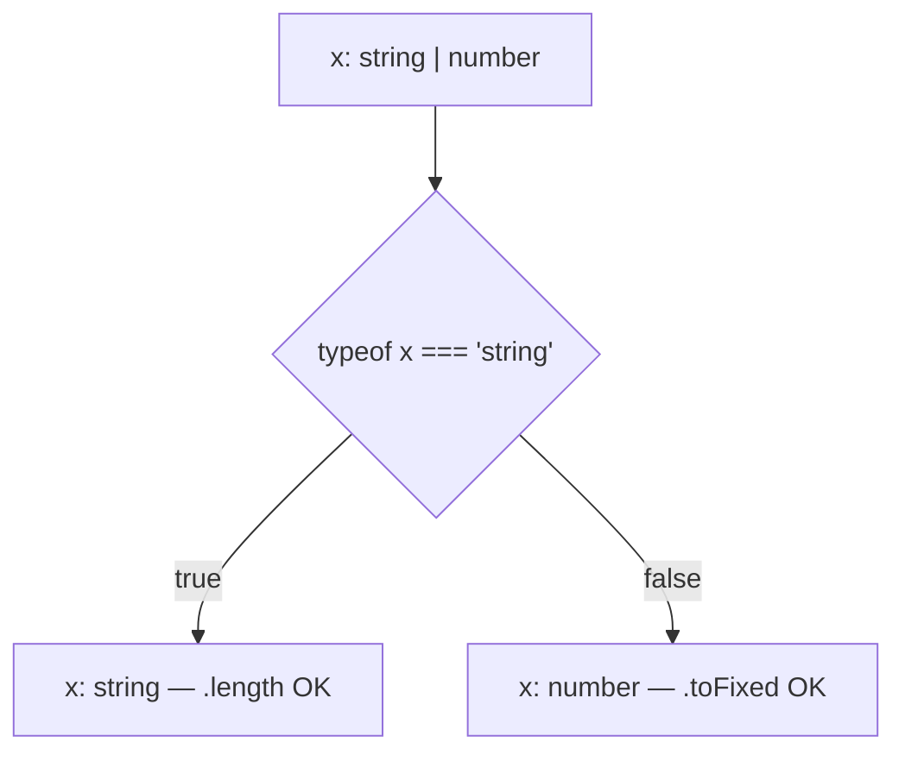
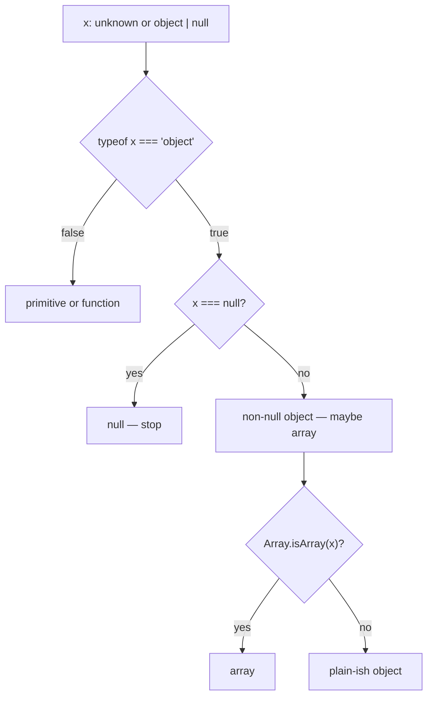

# Month 5 · Week 3 · Day 1
# Narrowing: How the Compiler Follows Your Checks

**Program:** Full-Stack Mastery · 18 months  
**Phase:** 1 — Foundations  
**Month index:** [../../README.md](../../README.md)  
**Week 3:** Day 1 (today) · [2](day-02.md) · [3](day-03.md) · [4](day-04.md) · [5](day-05.md) · [6](day-06.md) · [7](day-07.md)  
**Week rhythm today:** Learn + type-along  
**Student state:** Week 2 gate in your notes — `type`/`interface`, unions, `Result<T>`, a generic you can explain. You have not yet made the compiler *follow* a runtime check as a first-class skill.  
**Study time:** 3–4 focused hours

**This week covers:** narrowing, type guards, utility types, `unknown`, `never`, nullability, discriminated unions.

Today is **control-flow analysis**: after a check that actually proves a type, TypeScript treats the value as that type **inside** the branch. Type predicates, `unknown` JSON, and `never` exhaustiveness are Day 2. Discriminated `status` as a product model is Day 4. Do not skip them. If you only memorize `typeof x === "string"`, Project 3’s API boundary will still be `as Movie`.

Labs: `~\fullstack-lab\month-05\week-03\`.

---

## How to use this chapter

This book is the lesson. Same rules as Weeks 1–2.

1. Read a section. Close it. Say the idea in one sentence.
2. Type every lab. Do not paste a narrowing snippet you cannot redraw as a flowchart.
3. When `tsc` errors, **read the error**. It is usually naming two types that did not match, or a property that does not exist on the **current** union member.
4. Optional review links are for later rechecking on the web — not first learning.

---

## How to read this chapter

Week 2 gave you **unions**. A union is a set of possibilities. The compiler will not let you call `.toUpperCase()` on `string | number` because `number` has no such method.

**Narrowing** is what happens when a check **removes** possibilities. After `if (typeof x === "string")`, inside that block `x` is `string`. After an early `return` in that block, the rest of the function has whatever is left.

This is not a new runtime feature. `typeof` is JavaScript you already know (Month 3). TypeScript **watches** the same check and shrinks the type. If the check does not actually prove a type, nothing shrinks.



> **Wrong belief:** “A comment `// x is a string here` is narrowing.”  
> **Correct:** only checks the checker understands narrow. Comments, `console.log`, and hope do not.

---

## Today's contract

1. Explain **control-flow analysis**: the checker walks `if` / `return` / `switch` the way you do.
2. Use `typeof`, `=== null`, `in`, `instanceof`, and `Array.isArray` on purpose.
3. Treat **truthiness** as blunt: `0` and `""` are falsey; product fields often must stay.
4. With `strictNullChecks` (inside `strict`), `string` does **not** include `null` or `undefined`.
5. Refuse `title!` and `as string` as a way to skip a check.

**Today's gate**

> After `if (typeof x === "string")`, TypeScript treats `x` as `string` **inside** the block. That is **narrowing**. Equality, `in`, `instanceof`, and truthiness checks also narrow. A check that does not actually prove a type will not narrow. Types still erase at runtime — a lying API can still hand you a number. Day 2 puts a **guard** on that boundary.

---

## Time box

| Block | Minutes | Work |
|---|---|---|
| A | 50 | Theory — control flow, operators, nullability |
| B | 55 | Type-along `narrow.ts` + real `tsc` errors |
| C | 70 | Independent formatters + empty-string product choice |
| D | 20 | Git |
| E | 15 | Recall |

---

# Block A — Theory

## 1. Two languages, one check

A `.ts` file still contains JavaScript that will run and types that will erase. Narrowing is the **bridge**: a JavaScript check the compiler is willing to trust.

```ts
function len(x: string | number): number {
  if (typeof x === "string") {
    return x.length;
  }
  return x.toFixed(0).length; // x is number here
}
```

If you `return` in one branch, the rest of the function has the other type. Early returns are a narrowing **style**, not a trick.

If you **assign** after a check, the checker follows the assignment too:

```ts
function label(x: string | number): string {
  x = String(x);
  return x.toUpperCase(); // x is string after the assignment
}
```

Do not use assignment narrowing as a way to launder bad data. `String(x)` always succeeds; it does not prove the original value was a title.

---

## 2. Operators that narrow (the catalog you will actually use)

| Check | What it proves | Trap |
|---|---|---|
| `typeof x === "string"` (also `"number"`, `"boolean"`, `"function"`, `"undefined"`, `"bigint"`, `"symbol"`) | Primitive kind | `"object"` includes **arrays**, **dates**, and **`null`** |
| `x === null` / `x !== null` | Null vs not | `== null` is both `null` and `undefined` — document if you use it |
| `x !== undefined` | Removes `undefined` | Optional properties read as `T \| undefined` |
| `"title" in x` | `x` has a `title` key | `in` on a primitive throws at runtime — check object first |
| `x instanceof Date` | Instance of a **value** constructor | Does not work for interfaces (they are erased) |
| `Array.isArray(x)` | `x` is an array | `typeof [] === "object"` — never use `typeof` to detect arrays |
| Truthiness `if (x)` | Removes `null`, `undefined`, `""`, `0`, `false`, `NaN` | **Too blunt** for counts and titles |

**`typeof null === "object"`** is still true. You learned it in Month 3. TypeScript’s type `null` is still distinct. A guard that says `typeof x === "object"` **must** also reject `null`:

```ts
if (typeof x === "object" && x !== null) {
  // x is object (not null)
}
```



**`instanceof`** needs a constructor that exists at **runtime**: `Date`, `Error`, `Map`, a `class` you wrote. You cannot write `x instanceof Movie` if `Movie` is only a `type` — types are erased. Day 2’s guards check **fields**, not mythical classes.

**`"title" in x`** is useful on **object unions**:

```ts
type Text = { title: string };
type Count = { n: number };

function show(x: Text | Count): string {
  if ("title" in x) {
    return x.title;
  }
  return String(x.n);
}
```

If both sides had a `title` with different types, `in` would not finish the job. Day 4 prefers a shared **literal** field (`status` / `kind`) instead of fishing with `in`.

---

## 3. Truthiness is a product decision, not a type trick

```ts
function titleOrFallback(title: string | null | undefined): string {
  if (title) {
    return title;
  }
  return "(untitled)";
}
```

`if (title)` treats `""` as missing. For a search box, blank **should** be missing (Month 3). For a book whose title is legitimately empty in a bad API row, you may still want to show “(untitled)” — **document it**. For a **count** of `0`, truthiness is a bug: zero results is success with an empty list, not “no number.”

Prefer:

| Intent | Check |
|---|---|
| Missing nullish only | `title == null` or `title === null \|\| title === undefined` |
| Blank text | `title.trim() === ""` after you know it is a string |
| Present number including 0 | `year !== undefined && year !== null` — not `if (year)` |

> **Wrong belief:** “If it compiles, empty string is handled.”  
> **Correct:** compilation does not encode your product. Write a test for `""` and for `0`.

---

## 4. Nullability (`strictNullChecks`)

With `strict: true`, `string` does **not** include `null` or `undefined`. That is the whole point of the flag.

```ts
function label(title: string | null): string {
  if (title === null) {
    return "(untitled)";
  }
  return title.toUpperCase();
}
```

Optional `year?: number` means: the key may be absent. When you **read** `book.year`, the type is `number | undefined`. It is not “maybe a string.” Write `year: number | undefined` only if the key is **always present** and the value might be `undefined` — a different shape.

**Optional chaining** `book.year?.toFixed(0)` is a **read** that short-circuits to `undefined`. It does not prove `year` is a number afterward. You still have `string | undefined` (or whatever the expression returns). Use it for convenience in UI glue, not as a substitute for a guard on JSON.

**Non-null assertion** `title!` tells the compiler “I know it is not null.” If you are wrong, you crash at runtime. **Banned** in this course except a one-line comment if a DOM `querySelector` is guaranteed by HTML **you** wrote (still prefer `if (!el) throw`). `!` is not narrowing. It is a promise.

---

## 5. Discriminant preview (do not skip Day 4)

If every object in a union has a common **literal** field, checking that field narrows the rest:

```ts
type Msg =
  | { kind: "text"; body: string }
  | { kind: "img"; src: string };

function preview(m: Msg): string {
  if (m.kind === "text") {
    return m.body;
  }
  return m.src;
}
```

`kind` is the **discriminant**. After `m.kind === "text"`, `m.body` exists and `m.src` does not. Day 4 makes this your UI state model: `idle | loading | success | error`. Today, notice that **equality on a literal** is the cleanest narrowing you will write.

You do not need `in` if you have a discriminant. You do not need booleans `isText` + `isImg` that can both be true.

---

## 6. What does **not** narrow

| Attempt | Why it fails |
|---|---|
| `if (getType(x) === "string")` | Unless `getType` is a **type predicate** (Day 2), the checker does not understand your helper |
| `console.assert(typeof x === "string")` | Not control flow the checker trusts |
| `x as string` | Assertion, not a check |
| A comment | Erased with the types |
| `if (Math.random() > 0.5)` | Proves nothing about `x` |

If you extract a helper, Day 2’s `x is T` is how you **teach** the checker to follow it. Until then, keep the `typeof` **inline**, or `return` early in the same function.

---

# Block B — Type-along

```powershell
mkdir ~\fullstack-lab\month-05\week-03\day-01
cd ~\fullstack-lab\month-05\week-03\day-01
npm init -y
npm install --save-dev typescript tsx
```

Reuse Week 1’s `tsconfig` idea: `"strict": true`, `"noEmit": true`, `"module": "NodeNext"`, `"moduleResolution": "NodeNext"`. Scripts: `"typecheck": "tsc --noEmit"`, `"test": "tsx --test"`. `"type": "module"`.

`narrow.ts` — type this; do not paste from a gist:

```ts
export function formatId(id: string | number): string {
  if (typeof id === "string") {
    return id.trim();
  }
  return String(id);
}

export function titleOrFallback(title: string | null | undefined): string {
  if (title === null || title === undefined) {
    return "(untitled)";
  }
  if (title.trim() === "") {
    return "(untitled)";
  }
  return title;
}

export function yearLabel(year: number | undefined): string {
  if (year === undefined) {
    return "unknown";
  }
  return String(year);
}
```

Uncomment, one at a time, in a scratch file or at the bottom:

```ts
// formatId(true);
// titleOrFallback("Dune").toFixed(0);
// yearLabel(0); // must NOT become "unknown"
```

Run:

```powershell
npx tsc --noEmit
```

Write `ERRORS.txt`: quote the real `tsc` message for the boolean argument, in your words. `yearLabel(0)` must typecheck and return `"0"`. If you wrote `if (year)` you will fail that — fix it.

`narrow.test.ts`:

```ts
import assert from "node:assert/strict";
import { test } from "node:test";
import { formatId, titleOrFallback, yearLabel } from "./narrow.ts";

test("formatId trims strings and stringifies numbers", () => {
  assert.equal(formatId("  42  "), "42");
  assert.equal(formatId(7), "7");
});

test("empty title is untitled; 0 year is not unknown", () => {
  assert.equal(titleOrFallback(""), "(untitled)");
  assert.equal(titleOrFallback(null), "(untitled)");
  assert.equal(yearLabel(0), "0");
  assert.equal(yearLabel(undefined), "unknown");
});
```

If NodeNext import paths fight you, use the same extension style you documented in Week 1 `IMPORTS.txt`. One style per folder.

```powershell
npm test
npm run typecheck
```

**`in` drill** (same folder, `in-drill.ts`): `Text | Count` as in theory. Call `show` in a test. Attempt `x.title` **without** the `in` check; read the error; put one sentence in `ERRORS.txt`.

**`typeof null` drill:** a function `isObjectish(x: unknown): boolean` that uses only `typeof x === "object"`. Test that `isObjectish(null)` is `true`. Then write `isNonNullObject` that also checks `x !== null`. Tests: `null` false, `{}` true, `[]` true (arrays are objects — Day 2’s `isRecord` will reject arrays if you want a “plain object”).

---

# Block C — Independent

`grade-narrow.ts` — port ideas, **new names**:

- `formatId`, `titleOrFallback`, `yearLabel` as specified in the lab list below if you did not finish Block B — plus:
- `describeCount(n: number | null): string` — `null` → `"none"`; `0` → `"0 items"` (not `"none"`).
- `pickTitle(x: { title: string } | { label: string }): string` using `"title" in x`.

Tests including `describeCount(0)`. Product choice for `titleOrFallback("")`: empty string is untitled. Write two sentences in `NOTES.txt`: (1) how you would still reject `"18"` at **runtime** if it came from an input (`typeof n !== "number"`); (2) why `if (n)` would destroy a valid zero.

No `any`. No `!`. No `as string` to silence a union.

```powershell
cd ~\fullstack-lab
git add month-05/week-03
git commit -m "Week 3 Day 1: narrowing helpers and nullability."
```

---

## Definition of done

- [ ] `npm run typecheck` is green
- [ ] `ERRORS.txt` quotes a real `tsc` message in your words
- [ ] `yearLabel(0)` / `describeCount(0)` are not treated as missing
- [ ] Empty title documented as untitled
- [ ] No `any`, no `!` on titles
- [ ] Tests run via `tsx --test`

---

## Optional review links

Narrowing is explained above.

- [Handbook: Narrowing](https://www.typescriptlang.org/docs/handbook/2/narrowing.html)
- [Handbook: typeof type guards](https://www.typescriptlang.org/docs/handbook/2/narrowing.html#typeof-type-guards)

---

## Tomorrow

Type guards (`x is T`), `unknown` at the JSON boundary, and `never` for exhaustiveness. The compiler will not save you from `JSON.parse` until you write a check that **runs**.
