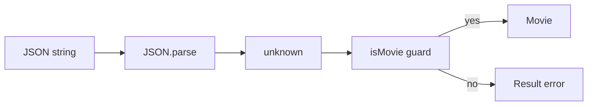
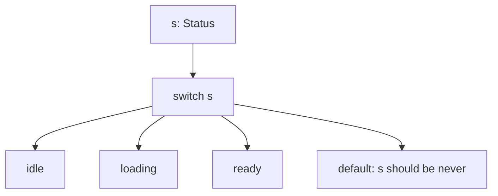

# Month 5 · Week 3 · Day 2
# Type Guards, `unknown`, and `never`

**Program:** Full-Stack Mastery · 18 months  
**Phase:** 1 — Foundations  
**Month index:** [../../README.md](../../README.md)  
**Week 3:** [1](day-01.md) · Day 2 (today) · [3](day-03.md) · [4](day-04.md) · [5](day-05.md) · [6](day-06.md) · [7](day-07.md)  
**Week rhythm today:** Learn + type-along  
**Student state:** Day 1 narrowing — `typeof`, `in`, null checks, truthiness traps. You can shrink a union **inside one function**. Today you extract that skill into a **named guard** and you treat JSON as **`unknown`**.  
**Study time:** 3–4 focused hours

**This week covers:** narrowing, type guards, utility types, `unknown`, `never`, nullability, discriminated unions.

Today: the JSON boundary. Discriminated `SearchState` is Day 4. Do not skip it. If you only `as Movie` after fetch, you failed this day even if `tsc` is green.

Labs: `~\fullstack-lab\month-05\week-03\day-02\`.

---

## How to use this chapter

1. Read a section. Close it. Say the idea.
2. Type every lab. A guard that `return true` without field checks is a lie — `tsc` cannot catch a dishonest predicate.
3. When `JSON.parse` throws, that is a **runtime** path. Wrap it. Then guard the value.
4. Optional links are review, not first teaching.

---

## How to read this chapter

Yesterday the checker followed `typeof` **in the same function**. Network data does not arrive as `Movie`. It arrives as a **string**. `JSON.parse` turns that string into a JavaScript value whose type TypeScript **does not know**. Default lib typings often say `any`. `any` infects. This course immediately assigns the result to **`unknown`**.

**`unknown`** means: you may hold it; you may not **use** it until you narrow.

A **type guard** is a function whose return type is a **type predicate**: `x is T`. After `if (isMovie(x))`, `x` is `Movie`. The predicate is a **promise you must keep with runtime checks**. If you `return true` always, the compiler believes you and the UI explodes.

**`never`** means “this code cannot run.” You use it so a forgotten union member becomes a **compile error**, not a silent `undefined` in the UI.



> **Wrong belief:** “I’ll cast `as Movie` after fetch.”  
> **Correct:** `as Movie` is a lie the compiler believes. A **guard** checks at runtime. Types erase; guards **run**.

---

## Today's contract

1. Treat external data as **`unknown`**, never as `any`.
2. Write `isRecord` and `isMovie` with **real field checks**.
3. Parse JSON in `try/catch`, then guard — `parseMovie` returns `Result<Movie>` (Week 2).
4. Use `never` in a `switch` `default` so a new union member breaks the build until you handle it.
5. Refuse `as Movie`, `as any`, and guards that always return `true`.

**Today's gate**

> `JSON.parse` returns `any` in default TS **or** you type the argument as `unknown`. Treat external data as **`unknown`**. A **type guard** is a function whose return type is `x is T`. `never` is the type that should not happen — exhaustiveness. Project 3 rule: parse → unknown → guard → internal type.

---

## Time box

| Block | Minutes | Work |
|---|---|---|
| A | 55 | Theory — unknown, predicates, never, assertions |
| B | 60 | Type-along guards + `parseMovie` |
| C | 55 | Independent `parseMovie` tests + exhaustiveness drill |
| D | 20 | Git |
| E | 10 | Recall |

---

# Block A — Theory

## 1. `unknown` vs `any`

| | `any` | `unknown` |
|---|---|---|
| Assign **into** it | Anything | Anything |
| Use it | Anything (no check) | **Nothing** until you narrow |
| Infects assignees | Yes | No — you must narrow first |
| Course policy | Unjustified: forbidden | JSON / `response.json()` / `localStorage` |

```ts
function load(raw: unknown): string {
  if (typeof raw === "string") {
    return raw;
  }
  throw new Error("expected string");
}
```

`load(42)` typechecks **as a call** (unknown accepts anything) and **throws at runtime**. That is honest. `function load(raw: any)` would let `raw.toUpperCase()` compile and then crash.

**Project 3 rule:** `JSON.parse(...)` result is `unknown`. Write:

```ts
const parsed: unknown = JSON.parse(text);
```

If `JSON.parse` is typed as `any` in your lib, **immediately** assign to `unknown`. Do not let `any` flow into `state`.

`response.json()` is the same family: `const data: unknown = await response.json()`.

---

## 2. Type predicates (`x is T`)

```ts
function isBook(x: unknown): x is { id: string; title: string } {
  if (typeof x !== "object" || x === null) {
    return false;
  }
  const rec = x as Record<string, unknown>; // isolated assertion after object check
  return typeof rec.id === "string" && typeof rec.title === "string";
}
```

Read the return type out loud: “if this function returns true, `x` is that shape.” TypeScript **trusts the annotation**. It does **not** prove your `return` matches the fields. Honesty is your job. Tests are how you keep the promise.

Why `as Record<string, unknown>`: after you know `x` is a non-null object, indexing `x.id` is still awkward (`unknown` objects do not have known keys). The assertion is **narrow** — “treat as a bag of unknown fields” — not `as Book`. Then you check fields with `typeof`.

**Do not** write:

```ts
function isBook(x: unknown): x is Book {
  return true; // costume for `as Book`
}
```

**Do not** check only `typeof x === "object"` and call it a Movie. Arrays and `null` pass that (Day 1).

After `if (isBook(x))`, `x.id` is a `string`. After `else`, `x` is still `unknown` (or whatever it was minus nothing useful — you usually `return` an error).

**`Array.isArray`:** if you expect a **list**, check array first, then guard **each element**. A JSON array of numbers is not `Movie[]` because the first element failed `isMovie`.

```ts
function isMovieArray(x: unknown): x is Movie[] {
  return Array.isArray(x) && x.every(isMovie);
}
```

`every` is a runtime loop. Types do not loop for you.

---

## 3. `never` — cannot happen, and exhaustiveness

`never` means “this code cannot run.” A function that **always throws** (or infinite-loops) can be annotated to return `never`:

```ts
function fail(message: string): never {
  throw new Error(message);
}
```

After `fail(...)`, the checker knows the next line is unreachable.

**Exhaustiveness** is the product use:

```ts
type Status = "idle" | "loading" | "ready";

function label(s: Status): string {
  switch (s) {
    case "idle":
      return "Idle";
    case "loading":
      return "…";
    case "ready":
      return "Ready";
    default: {
      const _exhaustive: never = s;
      return _exhaustive;
    }
  }
}
```

If you add `"error"` to `Status` and forget a `case`, `s` in `default` is `"error"`, not `never`. Assigning it to `never` is a **type error**. That is the alarm. Use it on discriminated unions (Day 4) so a new `status` cannot ship with a missing UI branch.



If you `return` a dummy string in `default` **without** the `never` assignment, `tsc` stays quiet and users see `"Idle"` for errors. The `never` line is the test.

---

## 4. Assertions recap — honesty scale

| Syntax | Honesty | Course |
|---|---|---|
| Narrowing / `x is T` with real checks | Honest if tests cover lies | Required at JSON / storage |
| `as Record<string, unknown>` after non-null object | Narrow, then check fields | Allowed **inside** guards |
| `as T` on fetch JSON | You promise. Easy to lie | Forbidden as the boundary |
| `as any` / `any` | Turns the checker off | Forbidden unless documented isolation |
| `!` non-null | Promise | Banned except tiny DOM comment case (Day 1) |

`as Movie` after `JSON.parse` will make a **test of the UI** pass if you never feed garbage. Production APIs feed garbage. Project 3’s spec asks for **guard tests** for that reason.

---

## 5. `Result<T>` at the boundary (Week 2, now with teeth)

```ts
type Result<T> =
  | { ok: true; value: T }
  | { ok: false; error: string };
```

`parseMovie` should **not throw** to the test runner for bad JSON. Catch `JSON.parse`, return `{ ok: false, error: "..." }`. If parse succeeds, run `isMovie`. If the guard fails, return error — do not throw.

Throwing is fine **inside** `fail()` for true programmer errors. User-facing parse of storage or HTTP bodies: **Result**.

---

# Block B — Type-along

```powershell
mkdir ~\fullstack-lab\month-05\week-03\day-02
cd ~\fullstack-lab\month-05\week-03\day-02
```

Same `package.json` / `tsconfig` pattern as Day 1 (`strict`, `noEmit`, `tsx --test`). You may copy **your** Day 1 config files — not a generated blob you cannot explain.

`guard.ts`:

```ts
export type Movie = {
  id: string;
  title: string;
  year: number | null;
};

export type Result<T> =
  | { ok: true; value: T }
  | { ok: false; error: string };

export function isRecord(x: unknown): x is Record<string, unknown> {
  return typeof x === "object" && x !== null && !Array.isArray(x);
}

export function isMovie(x: unknown): x is Movie {
  if (!isRecord(x)) {
    return false;
  }
  const yearOk = x.year === null || typeof x.year === "number";
  return (
    typeof x.id === "string" &&
    typeof x.title === "string" &&
    yearOk &&
    !(typeof x.year === "number" && Number.isNaN(x.year))
  );
}

export function parseMovie(raw: string): Result<Movie> {
  let parsed: unknown;
  try {
    parsed = JSON.parse(raw);
  } catch {
    return { ok: false, error: "invalid json" };
  }
  if (!isMovie(parsed)) {
    return { ok: false, error: "not a movie" };
  }
  return { ok: true, value: parsed };
}
```

`NaN` is a `number` in JavaScript. If you skip the `Number.isNaN` check, `{ "year": null }` is fine and `{ "year": "1965" }` fails — good — but `JSON.parse` cannot produce `NaN` easily. Still: if you later pass a raw object into `isMovie`, `NaN` year is not a year. Document in `NOTES.txt` whether you reject `NaN`.

Tests — `guard.test.ts`:

- valid JSON `{"id":"1","title":"Dune","year":1965}` → `ok: true`
- `NOT JSON` → `ok: false`, no throw
- `{ "title": 1 }` → `ok: false`
- `{ "id": "1", "title": "Dune", "year": null }` → `ok: true` if your Movie allows `null` year
- array `[]` → not a movie (`isRecord` rejects arrays)

```powershell
npm test
npm run typecheck
```

**Exhaustiveness drill** `status.ts`: `Status = "idle" | "loading" | "ready"` and `label` with `never` default. Then add `"error"` to the type **only**, run `tsc`, paste the error into `EXHAUST.txt`. Then add the `case`. That file is the proof `never` earns its keep.

---

# Block C — Independent

1. `isNonEmptyString(x: unknown): x is string` — `typeof === "string"` **and** `trim() !== ""`. Tests: `"  "` false, `"Dune"` true, `1` false.
2. `parseMovie` as above if Block B is incomplete.
3. Deliberate lie (temporary): `function isMovie(x: unknown): x is Movie { return true; }` — write `LIE.txt`: which test still passes, which production input would explode. **Restore** the real guard before you commit.

No `any`. No `as Movie` on parse.

```powershell
cd ~\fullstack-lab
git add month-05/week-03
git commit -m "Week 3 Day 2: unknown guards and parseMovie."
```

---

## Definition of done

- [ ] `isRecord` rejects `null` and arrays
- [ ] `parseMovie` never throws on `NOT JSON`
- [ ] `EXHAUST.txt` quotes a `never` assignment error
- [ ] `LIE.txt` exists; the lying guard is **not** in the committed code
- [ ] `npm run typecheck` and `npm test` green

---

## Optional review links

`unknown`, guards, and `never` are explained above.

- [Handbook: `unknown`](https://www.typescriptlang.org/docs/handbook/2/functions.html#unknown)
- [Handbook: Type predicates](https://www.typescriptlang.org/docs/handbook/2/narrowing.html#using-type-predicates)
- [Handbook: `never`](https://www.typescriptlang.org/docs/handbook/2/narrowing.html#the-never-type)

---

## Tomorrow

Closed-book: `parseSavedList` with a status literal union. Repair from [Day 3](day-03.md)’s recap, not from pasting today’s `isMovie`.
