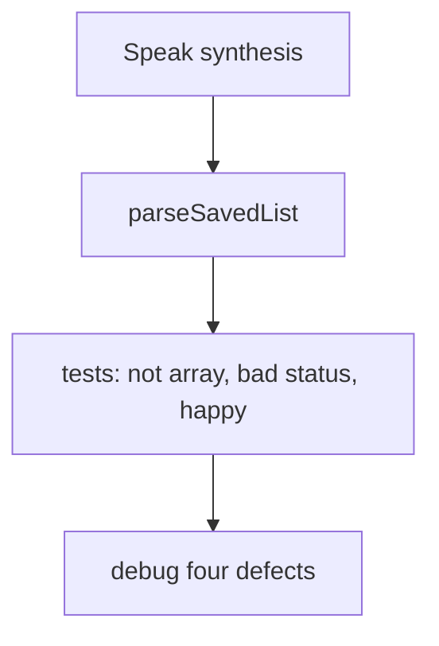
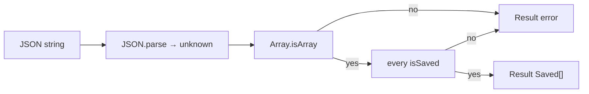

# Month 5 · Week 3 · Day 3
# From Memory: Guard the Boundary

**Program:** Full-Stack Mastery · 18 months  
**Phase:** 1 — Foundations  
**Month index:** [../../README.md](../../README.md)  
**Week 3:** [1](day-01.md) · [2](day-02.md) · Day 3 (today) · [4](day-04.md) · [5](day-05.md) · [6](day-06.md) · [7](day-07.md)  
**Week rhythm today:** Implement from memory  
**Study time:** 3–4 focused hours  
**Student state:** Days 1–2 taught narrowing, `unknown`, predicates, and `never`. Today those pages stay **closed** during the spec. Repair from **this recap**.  
**Machine today:** Windows PowerShell, Node.js 20+

Days 1–2 closed. Repair from this recap.

---

## How to read this chapter

This is a **closed-book teaching day**. The synthesis **is** the lesson. You will parse a saved-list payload the way Project 3 will parse `localStorage` and HTTP bodies: `unknown` in, `Result` out, no throw to the UI for garbage JSON.



Allowed: this file, your notes, `tsc`, the test runner. Not allowed: pasting Day 2’s `isMovie` as the saved-list guard, Handbook as teacher, AI writing `isSaved`.

Stuck 25 minutes: open Day 1 or Day 2 in this book **only**. Record lookups in `LOOKUPS.txt`.

---

## Complete explanation (narrowing + guards + never)

**Narrowing** is control-flow analysis. After a check the compiler understands, the type **shrinks**. Catalog:

| Check | Use |
|---|---|
| `typeof x === "string"` (and other typeof tags) | Primitives. `"object"` includes `null` |
| `x === null` / `x !== undefined` | Nullability under `strict` |
| `"title" in x` | Object unions without a discriminant yet |
| `x instanceof Date` | Runtime constructors only — not `type Movie` |
| `Array.isArray(x)` | Lists. Then guard **each** element |
| Truthiness `if (x)` | Blunt: `0` and `""` vanish. Prefer explicit checks |

`typeof null === "object"` is still true. `typeof x === "object" && x !== null` is the start of an object guard. Arrays still pass — `!Array.isArray(x)` if you want a record.

**`unknown`:** anything may be assigned **in**; you may not read properties until you narrow. **`any`:** must not use at JSON boundary. Immediately `const parsed: unknown = JSON.parse(text)`.

**Guard:** `function isT(x: unknown): x is T` with **real** field checks. After a non-null object check, `as Record<string, unknown>` is allowed **inside** the guard so you can `typeof rec.id === "string"`. That is not `as Saved`. A predicate that `return true` is `as` in a costume.

**Lists:** `Array.isArray(x) && x.every(isSaved)`. One bad element → the whole payload is not `Saved[]`. Do not “skip invalid rows” unless the product says so — silent skip hides corruption. Today: fail the parse.

**`never`:** `fail()` that always throws; exhaustive `switch` `default { const _x: never = s }`. Forgotten union member → `tsc` error. Dummy `return ""` in default **without** `never` hides the miss.

**`as T` / `!`:** promises. This course almost never at boundaries. Types **erase**. Guards **run**. `tsc` green does not mean the API told the truth.

**`Result<T>`:** `{ ok: true; value: T } | { ok: false; error: string }`. Parse functions return Result. They do not throw on `NOT JSON`. Callers narrow `if (r.ok)`.



**Saved shape today:** `{ id: string; status: "want" | "doing" | "done" }`. Status is a **literal union**. `"DONE"` is not assignable **if you already have a Saved**. JSON is not a Saved until the guard checks `status === "want" || status === "doing" || status === "done"`. A `typeof status === "string"` check is **not enough** — `"DONE"` would pass and then infect your filter UI.

**Wrong belief:** “If `tsc` accepts my `Saved[]` annotation on `JSON.parse`, the array is safe.”  
**Correct:** that annotation is a lie you told. Annotate `unknown`, then guard.

**Wrong belief:** “I’ll `filter` bad rows and call it validation.”  
**Correct:** unless you **log** and the spec says drop, you are hiding data loss. Today the parse fails.

**Wrong belief:** “Calling an async function is like `try/catch` at the call site for free.” — not today’s trap, but the cousin is: “`JSON.parse` in the test runner is fine to throw.”  
**Correct:** user-facing parse returns `Result`. Tests stay green on `"NOT JSON"`.

Worked happy path: string `'[{"id":"1","status":"want"}]'` → parse → array of 1 → `isSaved` true → `{ ok: true, value: [...] }`.

Worked bad status: `'[{"id":"1","status":"DONE"}]'` → `isSaved` false → `{ ok: false, error: "..." }`. Tests assert `ok === false`.

Worked not array: `'{"id":"1"}'` → not `Array.isArray` → error. `null` JSON (`'null'`) is not an array.

Worked throw: `'NOT JSON'` → `JSON.parse` throws → catch → `{ ok: false, error: "invalid json" }` — test runner stays green.

### Mini-build in words

Folder `day-03/`. `saved.ts` exports `Saved`, `isSaved`, `parseSavedList(raw: unknown): Result<Saved[]>`. Why `unknown` not `string`? Because `localStorage.getItem` is `string | null`, and `JSON.parse` output is the value you guard — callers may pass already-parsed unknown (tests). You may also export `parseSavedListText(raw: string)` that catches parse then calls `parseSavedList`. Either way, **one** guard on the value.

`isSaved`: `isRecord`, `typeof id === "string"` and id non-empty (product: empty id is invalid), `status` one of three literals.

Do not import Day 2’s Movie type. This domain is a **saved collection row**, not a search hit. Do not paste Project 3.

---

## Office hours — `typeof object` on null, status as any string, and `as Saved[]` trophies

**`isSaved(null)` true or throws.** You forgot `x !== null` after `typeof === "object"`. Test `null` and `[]`.

**`typeof status === "string"`.** `"DONE"` passes. Three `===` checks or a typed catalog `includes`.

**Scratch `as Saved[]` left in source.** `PROOF.txt` asked you to try it, watch `tsc` stay green, **delete** it. Do not ship the lie.

**`filter(isSaved)` returning ok true with a shorter array.** Data loss. Today fail the parse. Stretch E in DEBUG.

**Pasted `isMovie`.** Different fields. Write `isSaved` from the signatures below.

---

## Today's contract

**Today's gate.** Closed-book:

> I can parse unknown JSON into `Saved[]` with a real guard, fail bad status without throwing, and explain why `as Saved[]` would make the happy-path test pass and the UI still explode.

---

## Time box

| Block | Minutes | Work |
|---|---|---|
| 1 | 35 | Speak the synthesis; sketch the flowchart from memory |
| 2 | 70 | `parseSavedList` + tests |
| 3 | 30 | Debug four defects in writing |
| 4 | 25 | Repair from LOOKUPS if needed; no paste of isMovie |
| 5 | 20 | Recall + commit |

---

# Spec

`~\fullstack-lab\month-05\week-03\day-03\`

`parseSavedList(raw: unknown): Result<Saved[]>` with:

```ts
type Saved = { id: string; status: "want" | "doing" | "done" };
```

Tests (minimum):

| Case | Input | Expect |
|---|---|---|
| Happy | `[{ id: "1", status: "want" }]` as parsed JSON | `ok: true`, length 1 |
| Not array | `{ id: "1" }` or `null` | `ok: false` |
| Bad status | `[{ id: "1", status: "DONE" }]` | `ok: false` |
| Not JSON | if you accept string: `"NOT JSON"` | `ok: false`, **no throw** |
| Extra keys | `{ id: "1", status: "want", note: "x" }` | document: extra keys OK if required fields valid (typical) or reject — pick one, test it |

`PROOF.txt`: you tried `as Saved[]` on garbage in a **scratch** file, watched `tsc` stay green, then deleted it. One paragraph: why the test of `parseSavedList` would have been the only alarm.

No `any`. No `as Saved`.

```powershell
cd ~\fullstack-lab\month-05\week-03\day-03
npm run typecheck
npm test
```

```powershell
cd ~\fullstack-lab
git add month-05/week-03/day-03
git commit -m "Day 3: parseSavedList guard from memory."
```

---

# Debug (write the cause, from this recap)

Full sentences in `DEBUG.txt`.

**A. `typeof x === "object"` only.** `isSaved(null)` returns true or throws on property access. What did you forget?

**B. Status as `string`.** Guard accepts `"DONE"`. Filter UI has no branch. What check belongs in the guard?

**C. `as Saved[]` after parse.** Tests on the happy fixture pass. Production storage is `NOT JSON` or a lone object. What does the user see if you also skipped `try/catch`?

**D. Truthiness on `id`.** `if (rec.id)` rejects… wait, empty string is good to reject. But `if (rec.status)` does not prove it is `"want"`. Why not?

Stretch **E.** `every` vs `filter`: you `filter(isSaved)` and return `ok: true` with a shorter array. Why is that a data-loss bug for a collection restore?

---

# Result narrowing at the call site

After `parseSavedList`, you do **not** have `Saved[]`. You have `Result<Saved[]>`. The next function must narrow:

```ts
function titles(r: Result<Saved[]>): string[] {
  if (!r.ok) {
    return [];
  }
  return r.value.map((s) => s.id);
}
```

`r.value` in the `!r.ok` branch is a type error — same idea as `SearchState` tomorrow. If you skip the `if` and write `r.value`, `tsc` should stop you. That is the point of the discriminant `ok`.

**Call-site honesty:** UI code that gets `{ ok: false, error: "not a movie" }` must show that string with `textContent`, not ignore it and render yesterday’s list unless you **modeled** stale data.

**`unknown` vs `string` input:** `localStorage.getItem` returns `string | null`. `null` means missing key — return `{ ok: true, value: [] }` (empty collection) **or** a dedicated miss. `JSON.parse` on the string then yields `unknown`. Do not `JSON.parse(localStorage.getItem(k)!)` — `!` is a promise that getItem was non-null.

Worked missing key: first visit, getItem is `null`, you never call `JSON.parse`. Tests: `parseSavedListText(null)` or a `loadCollection` wrapper you write — document the choice.

Worked extra field: `{ id: "1", status: "want", note: "x" }`. If `isRecord` only checks required fields, extras pass. That is usually **correct** — APIs grow fields. You still must not put `note` on the DOM unless you typed it.

---

# From-memory skeleton (do not paste Day 2)

Write these signatures first, then fill bodies without looking:

```ts
type Saved = { id: string; status: "want" | "doing" | "done" };
type Result<T> = { ok: true; value: T } | { ok: false; error: string };

function isRecord(x: unknown): x is Record<string, unknown>;
function isStatus(x: unknown): x is Saved["status"];
function isSaved(x: unknown): x is Saved;
function parseSavedList(raw: unknown): Result<Saved[]>;
```

`isStatus` is a small predicate: three `===` checks (or an array `includes` with a typed catalog). `typeof x === "string"` alone is **not** `isStatus`.

If you get stuck on `Record`, say it: “a non-null non-array object whose values we have not checked yet.” Then `typeof rec.id === "string"`.

`LOOKUPS.txt` format: `time — file — what you needed`. Three lookups is a signal to re-speak the recap, not a failure. Ten lookups means you skipped Days 1–2.

---

## Worked walkthrough — four parse cases in tests

| Case | How you build the input | Expect |
|---|---|---|
| Happy | `[{ id: "1", status: "want" }]` already parsed, or JSON text then parse | `ok: true`, length 1 |
| Not array | `{ id: "1" }` or `null` | `ok: false` |
| Bad status | `[{ id: "1", status: "DONE" }]` | `ok: false` — `typeof === "string"` is not enough |
| Not JSON | `"NOT JSON"` through the **text** wrapper | `ok: false`, test runner green |

`PROOF.txt`: scratch `as Saved[]` on garbage; `tsc` green; delete it. The only alarm would have been `parseSavedList` tests.

**DEBUG A.** `typeof x === "object"` includes `null`. `x !== null` and often `!Array.isArray(x)`. Test both.

**Call site.** After parse you have `Result<Saved[]>`. `if (!r.ok) return [];` then `r.value`. Reading `.value` without narrowing is a type error — keep it that way.

Windows: `cd ~\fullstack-lab\month-05\week-03\day-03`. Both scripts. Node.js 20+. Do not paste `isMovie`. Do not paste Project 3.

---

## Definition of done

- [ ] Synthesis spoken without Day 1–2 files
- [ ] `parseSavedList` tests: not array, bad status, happy path
- [ ] Bad JSON does not throw out of the parse function
- [ ] `DEBUG.txt` A–D in full sentences
- [ ] `PROOF.txt` on `as Saved[]`
- [ ] No `any`

---

## Stalls and repair — null as object, DONE as string, leftover as Saved[]

If `isSaved(null)` is true or throws, you used `typeof === "object"` without `x !== null`. Arrays still pass that typeof — `!Array.isArray` for a record. Test `null` and `[]`.

If `"DONE"` passes the guard, `typeof status === "string"` is not `isStatus`. Three `===` checks. Bad-status test must be `ok: false`.

If scratch `as Saved[]` is still in source, delete it. `PROOF.txt` is the paragraph. Happy-path tests would not save a white screen on `NOT JSON` if you also skipped `try/catch`.

If you `filter(isSaved)` and return ok true with a shorter array, that is data loss. Today fail the parse. Stretch E.

If `parseSavedListText("NOT JSON")` throws out of the function, catch. Tests stay green. `JSON.parse` assign `unknown`. No `any`. No `as Saved`. No pasted `isMovie`. No Project 3.

Windows: `cd ~\fullstack-lab\month-05\week-03\day-03` then both scripts. Node.js 20+. Call site: `Result<Saved[]>` then `if (r.ok)`. Missing `localStorage` key: do not `JSON.parse(null!)` — `!` is a promise.

---

## Last forty minutes

Tests: happy, not array, bad status, NOT JSON no throw. `PROOF.txt` on deleted `as Saved[]`. DEBUG A–D full sentences. No `any`. No pasted `isMovie`. Signatures written first: `isRecord`, `isStatus`, `isSaved`, `parseSavedList`.

`LOOKUPS.txt` even if sparse. Commit `month-05/week-03/day-03`. Tomorrow: `SearchState` so `loading && error` cannot exist.

---

## Worked checkpoint — `unknown` JSON, then predicates

Write signatures **before** bodies: `isRecord`, `isStatus`, `isSaved`, `parseSavedList` / `parseSavedListText`. `JSON.parse` assign `unknown`. `try/catch` so `NOT JSON` returns `{ ok: false }` and the test runner stays green.

`isRecord(null)` is false (`typeof null === "object"`). `isRecord([])` is false if you reject arrays for a row. `"DONE"` is not `"done"` — three `===` checks, not `typeof status === "string"`. Bad status → `ok: false` for the **list**, not a quiet `filter` that drops rows (that is data loss unless Stretch E says otherwise).

`PROOF.txt`: you deleted `as Saved[]`. Happy-path tests would not save a white screen on `NOT JSON` if you also skipped `try/catch`. Call site: `if (r.ok)` then use `r.value`. Missing `localStorage` key: do not `JSON.parse(null!)`. `!` is a promise to the compiler, not a value.

DEBUG A–D in full sentences. No `any`. No pasted `isMovie`. No Project 3.

> **Wrong belief:** “If `tsc` accepts my `Saved[]` annotation on `JSON.parse`, the array is safe.”  
> **Correct:** that annotation is fiction. The string on disk is not a type argument.

Windows: `cd ~\fullstack-lab\month-05\week-03\day-03` then both scripts. Node.js 20+.

If you finish early, test `null` and `[]` as list JSON, not only `"NOT JSON"`. `isSaved(null)` must not throw. Stretch E is optional data-loss policy — default today is fail the parse, not silently drop rows. `LOOKUPS.txt` even if sparse.

---

## Optional review links

Repair from this recap first. Days 1–2 in this book second. Handbook last.

- [Handbook: Narrowing](https://www.typescriptlang.org/docs/handbook/2/narrowing.html)

---

## Tomorrow

Discriminated unions for **UI state**: `idle | loading | success | error` so `loading && error` cannot exist. `Partial` / `Pick` in moderation — not a puzzle contest.
