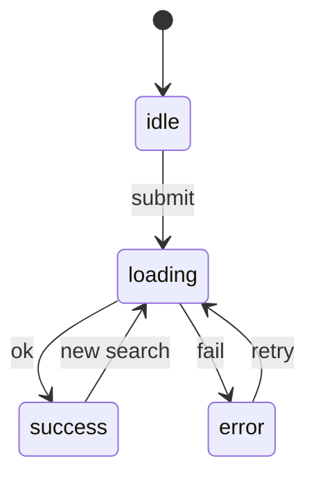
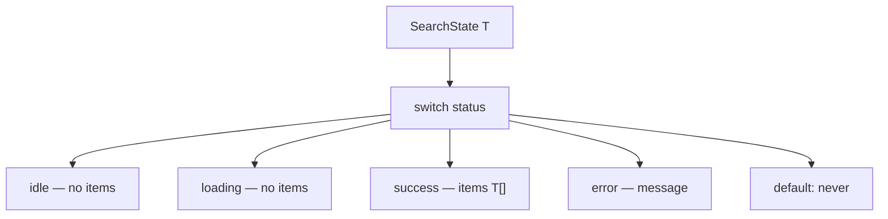

# Month 5 · Week 3 · Day 4
# Discriminated Unions and Utility Types

**Program:** Full-Stack Mastery · 18 months  
**Phase:** 1 — Foundations  
**Month index:** [../../README.md](../../README.md)  
**Week 3:** [1](day-01.md) · [2](day-02.md) · [3](day-03.md) · Day 4 (today) · [5](day-05.md) · [6](day-06.md) · [7](day-07.md)  
**Week rhythm today:** Learn + type-along  
**Student state:** You can narrow with `typeof` / `in` / guards, and you parse JSON as `unknown`. Week 2 already warned that `loading: boolean` + `error: boolean` is an illegal combo. Today that warning becomes the **Project 3 state model**.  
**Study time:** 3–4 focused hours

**This week covers:** narrowing, type guards, utility types, `unknown`, `never`, nullability, discriminated unions.

This is the **Project 3 state model**. Illegal combinations should be unrepresentable. Utilities (`Partial`, `Pick`) are catalog tools — not the main event. If you only write `Partial<Movie>` and skip `SearchState`, you missed the day.

Labs: `~\fullstack-lab\month-05\week-03\day-04\`.

---

## How to use this chapter

1. Read a section. Close it. Draw the state diagram from memory.
2. Type `SearchState` and the `switch`. The point is that `s.items` is a **type error** on the error branch.
3. Use `Pick` once for a card. Do not nest five utilities.
4. Optional links are review after you can teach the union aloud.

---

## How to read this chapter

A **discriminated union** is a union of object types that share one field with **different literal types**. That field is the **discriminant** (`status`, `kind`, `ok`). Checking it narrows the rest of the object.

This is Day 1’s equality narrowing, aimed at **UI**. You do not need a state-machine library. You need to **replace the whole object** when the phase changes: `state = { status: "loading" }`, not `state.loading = true`.

Boolean pairs can be `{ loading: true, error: true, items: [...] }` — nonsense. The union cannot say that if you only construct the four variants.



> **Wrong belief:** “I’ll keep `items` around during `error` so the old list stays on screen.”  
> **Correct:** if the product **wants** stale results, model it **explicitly** (`{ status: "error"; message: string; items: T[] }`). Do not leave `items` on every variant “just in case.” Accidental reads of error-branch `items` are the bug Week 2 described.

---

## Today's contract

1. Write `SearchState<T>` with four variants and a **literal** `status`.
2. `switch (s.status)` with a `never` default.
3. Empty success is `success` + `items: []`, not `error`.
4. Use `Pick` (or `Partial`) **once** where it shortens an obvious type.
5. Prove `tsc` stops `s.items` on the error branch (`PROOF.txt`).

**Today's gate**

> `{ status: "success"; items: T[] }` cannot also be `{ status: "error" }` on the same object. `Partial<T>`, `Pick`, `Omit`, `Record` are catalog tools — not a puzzle contest. You set a **whole new object** when status changes.

---

## Time box

| Block | Minutes | Work |
|---|---|---|
| A | 55 | Theory — unions, transitions, utilities |
| B | 60 | `state.ts` + `PROOF.txt` |
| C | 50 | `Pick` card + independent label cases |
| D | 20 | Git |
| E | 10 | Recall |

---

# Block A — Theory

## 1. The illegal combo (why booleans fail)

```ts
type Bad = { loading: boolean; error: boolean; items: Movie[] };
```

Four boolean pairs, plus items always present:

| loading | error | Meaning? |
|---|---|---|
| false | false | idle? success? |
| true | false | loading |
| false | true | error — but `items` still there |
| true | true | **illegal** — still typechecks |

```ts
type SearchState<T> =
  | { status: "idle" }
  | { status: "loading" }
  | { status: "success"; items: T[] }
  | { status: "error"; message: string };
```

`status` is the discriminant. Each variant carries **only** the data that variant needs. Error has `message`, not `items`. Loading has neither.

```ts
function label<T>(s: SearchState<T>): string {
  switch (s.status) {
    case "idle":
      return "Start a search";
    case "loading":
      return "Searching…";
    case "success":
      return s.items.length === 0 ? "No results" : `${s.items.length} hits`;
    case "error":
      return s.message;
    default: {
      const _x: never = s;
      return _x;
    }
  }
}
```

**Empty success** is `status: "success"` with `items: []` — not `error`. Month 3 already taught that; types now **enforce** it. `label` can say “No results” without pretending the network failed.



---

## 2. Replace the object; do not mutate flags

```ts
function startSearch<T>(): SearchState<T> {
  return { status: "loading" };
}

function ok<T>(items: T[]): SearchState<T> {
  return { status: "success", items };
}

function fail<T>(message: string): SearchState<T> {
  return { status: "error", message };
}
```

These return **new** objects. If you had `let state: SearchState<Movie>` and you wrote `state.status = "success"` without adding `items`, `tsc` should complain — the variant is wrong. Prefer functions that return the next state. In the DOM (Month 3) you already kept a `state` variable and re-rendered. Same idea; the type is stricter.

Do not `state.items.push(...)` on a success state as your only update if you will later reuse that array reference elsewhere — immutable `items: [...items, next]` is still the Month 2 habit. The union does not replace immutability; it replaces **flag soup**.

**Transitions you must be able to say aloud:**

| From | Event | To |
|---|---|---|
| idle | user submits non-blank query | loading |
| loading | HTTP ok, array (maybe empty) | success |
| loading | `!ok`, network, guard fail | error |
| success | new submit | loading (replace, do not keep old items on the loading variant unless you model stale) |
| error | retry | loading |

Project 3 may keep last success on screen **under** an error banner only if you **type** that. Default in this lab: error variant has no `items`.

---

## 3. Narrowing on `status` vs `in`

After `if (s.status === "error")`, `s.message` exists. `s.items` is a type error. That is the proof the model works.

`if ("items" in s)` also narrows, but it is weaker: if you later add `items` to error for stale UI, `in` would treat error as success-like. Prefer the discriminant.

`Result<T>` from Week 2 is the same pattern with discriminant `ok: true | false`.

---

## 4. Utility types (the ones you will actually use)

These are **built-in** generic types. You do not install them. They are **transformations of types you already named**.

| Utility | Meaning | Honest use |
|---|---|---|
| `Partial<T>` | All properties optional | Draft / patch object |
| `Required<T>` | All required | Opposite of Partial — rare |
| `Pick<T, "id" \| "title">` | Subset of keys | List row / card |
| `Omit<T, "year">` | T without a key | Strip a field |
| `Record<K, V>` | Keys `K`, values `V` | `Record<string, Movie>` maps |
| `Readonly<T>` | Properties readonly | Document intent; still a runtime mutable object unless you freeze |

```ts
type Movie = { id: string; title: string; year: number | null };
type MovieDraft = Partial<Movie>;
type MovieCard = Pick<Movie, "id" | "title">;
```

`Partial<Movie>` means `{ id?: string; title?: string; year?: number | null }`. A draft is **not** a Movie. Do not pass a draft into `ok(items)` without filling required fields. `toCard(m: Movie): MovieCard` is a **runtime** function that picks fields — `Pick` only names the result type.

**Do not** nest five utilities to prove you can. If `Omit<Partial<Pick<...>>>` needs a comment to understand, write an explicit `type` instead.

> **Wrong belief:** “More utility types = more TypeScript.”  
> **Correct:** name the product type. Use `Pick` when the card **is** a subset. Use `Partial` when the form **is** incomplete. Project 3: one `Pick` for a list row is enough.

**`Record<string, unknown>`** inside guards (Day 2) is the other honest use — a bag of unknown fields, not a Movie.

---

## 5. Generics on the state (`SearchState<T>`)

`T` is the row type: `Movie`, `Book`, `User`. The **status machine** does not care. You already wrote `Result<T>` and `first<T>`. Same hole. If you copy-paste `MovieSearchState` and `BookSearchState` as two unions, you missed the generic.

Constraint: you probably do **not** need `T extends { id: string }` on `SearchState` itself — `label` only uses `items.length`. When you render a row, the component/function that prints `title` will constrain or accept `Movie`.

---

## 6. `Result<T>` is the same pattern

Week 2’s `ok: true | false` **is** a discriminated union. `if (r.ok) r.value` is the same narrowing as `if (s.status === "success") s.items`. Do not keep two mental models. Fetch pipeline:

1. HTTP `ok` (runtime, Month 3) — not a TypeScript discriminant unless you encode it.
2. JSON `unknown` → guard → `Result<Movie[]>` (this week).
3. Map `Result` into `SearchState`: `ok: false` → `{ status: "error", message: r.error }`; `ok: true` → `{ status: "success", items: r.value }` even if `value.length === 0`.

A function `toSearchState<T>(r: Result<T[]>): SearchState<T>` is a good independent drill. It should not produce `loading`. Loading is **before** the Result exists.

---

## 7. Stale UI — model it or refuse it

Product people sometimes want: error banner **and** last list. Honest type:

```ts
| { status: "error"; message: string; items: T[] }
```

Now error **has** items (maybe `[]` if the first request failed). `in` / `"items" in s` would no longer distinguish success from error — you **must** switch on `status`. That is why the discriminant is the source of truth, not the presence of a key.

This lab’s default (four variants, error has no items) is simpler for Project 3. If you add stale items, write it in `NOTES.txt` and adjust `label`. Do not leave `items?: T[]` on every variant — optional items on loading is how illegal combos sneak back (`status: "loading"` plus leftover items you forgot to clear).

**Mutating `state.status = "success"`** on an object that was `{ status: "loading" }` is a type error if `status` is a literal on a union — TypeScript will not let you add `items` by mutation easily. Return a new object. That is a feature.

---

# Block B — Type-along

```powershell
mkdir ~\fullstack-lab\month-05\week-03\day-04
cd ~\fullstack-lab\month-05\week-03\day-04
```

Same Node TS setup as Days 1–2.

`state.ts`:

- `Movie` with `id`, `title`, `year: number | null`
- `SearchState<T>` as above
- `label`, `startSearch`, `ok`, `fail`

Tests:

- `label({ status: "success", items: [] })` is empty copy (“No results”), **not** an error message
- `fail("nope")` has no `items` — in a test, after `if (s.status === "error")` you must not read `s.items`
- `ok([{ id: "1", title: "Dune", year: 1965 }])` → label includes a count

`PROOF.txt`: you added a line `if (s.status === "error") { console.log(s.items); }` (or a helper), ran `tsc`, quoted the error in your words, **removed** the line. That quote is the exam evidence for “unrepresentable.”

`pick.ts`: `type MovieCard = Pick<Movie, "id" | "title">` and `toCard(m: Movie): MovieCard` returning `{ id: m.id, title: m.title }`. Test that the card has no `year` key (runtime: `assert.equal("year" in card, false)`).

```powershell
npx tsc --noEmit
npm test
```

---

# Block C — Independent

1. Add `status: "empty"` **or do not** — this course prefers empty as success. Write `NOTES.txt`: why a fifth variant is usually worse than `items.length === 0`.
2. `MovieDraft = Partial<Movie>` and `function isComplete(d: MovieDraft): d is Movie` — only if id and title are non-empty strings and year is `number | null`. Tests: `{}` false; full object true. This is a **guard**, not a puzzle.
3. Attempt `type Confused = Omit<Partial<Pick<Movie, "id" | "title" | "year">>, "id">` — if you cannot say it in one breath, delete it and write an explicit type. `UTIL.txt`: one sentence on when Pick is enough.

```powershell
cd ~\fullstack-lab
git add month-05/week-03/day-04
git commit -m "Discriminated SearchState and Pick card."
```

---

## Definition of done

- [ ] `SearchState` has four variants; no `loading: boolean`
- [ ] Empty list is success in tests
- [ ] `PROOF.txt` quotes `tsc` refusing `s.items` on error
- [ ] `never` default present
- [ ] `toCard` uses `Pick` (or you wrote an explicit card type and said why)
- [ ] No nested utility spaghetti in committed code
- [ ] No `any`

---

## Optional review links

Discriminated unions and utilities are explained above.

- [Handbook: Discriminated unions](https://www.typescriptlang.org/docs/handbook/2/narrowing.html#discriminated-unions)
- [Handbook: Utility Types](https://www.typescriptlang.org/docs/handbook/utility-types.html)

---

## Tomorrow

Tests as a product: guard failures, empty success, exhaustiveness still on, and why a test can pass when `as Movie` is lying.
