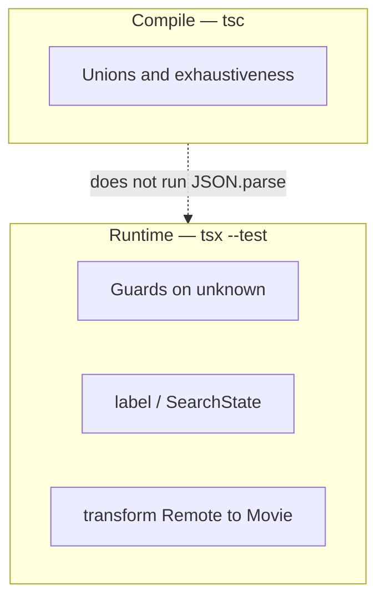

# Month 5 · Week 3 · Day 5
# Tests — Guards, State, and the Lie of `as`

**Program:** Full-Stack Mastery · 18 months  
**Phase:** 1 — Foundations  
**Month index:** [../../README.md](../../README.md)  
**Week 3:** [1](day-01.md) · [2](day-02.md) · [3](day-03.md) · [4](day-04.md) · Day 5 (today) · [6](day-06.md) · [7](day-07.md)  
**Week rhythm today:** Exercises + debugging  
**Student state:** You have `parseMovie` / `parseSavedList` and `SearchState`. Project 3’s spec will ask for tests of **transformation**, **guards**, and **error-state logic**. Today you learn what those tests **prove** and what they cannot prove.  
**Study time:** 3–4 focused hours

**This week covers:** narrowing, type guards, utility types, `unknown`, `never`, nullability, discriminated unions.

`tsc` is a test of **your annotations**. Node tests are a test of **runtime**. You need both. A green typecheck with `as Movie` is a green lie.

Labs: `~\fullstack-lab\month-05\week-03\day-05\` — you may **re-export** helpers from Days 2–4 by copying **your** files (type them again if the copy would be blind paste of something you do not own).

---

## How to use this chapter

1. Read what each ID in the checklist actually claims.
2. Write failing tests first when you can: bad JSON should already fail if Day 2 was honest.
3. Perform the deliberate `as Movie` experiment, write why it is dangerous, **remove** the assertion.
4. Optional links are not a substitute for running `tsx --test`.

---

## How to read this chapter

Month 3 taught arrange / act / assert on pure functions. Month 4 taught that tests which only click a happy path miss bugs. This week’s tests sit on **three layers**:



**`tsc`** will not execute `JSON.parse("NOT JSON")`. It will refuse `s.items` on `{ status: "error" }` if you wrote the union. **Node tests** will not refuse `as Movie` — that is erased. So:

| Question | Who answers |
|---|---|
| Can I read `items` on error? | `tsc` |
| Does garbage JSON throw? | Test + `try/catch` in parse |
| Is missing `title` a Movie? | Guard test |
| Is empty list an error string? | `label` test |
| Did I use `any`? | `grep` / ESLint later (Week 4) + your eyes |

Project 3 spec (you will open it next week, not paste an app from it): tests for **transformation**, **validation/type guards**, **error-state logic**. Today’s table is that list in lab form.

> **Wrong belief:** “If the demo search works, the guard is tested.”  
> **Correct:** the demo never sent `NOT JSON`. Tests must.

---

## Today's contract

1. Fill `TESTS.md` with G1–G5 **and** the extra rows below — each with a command or file that proves it.
2. Keep parse functions from throwing to the test runner.
3. Show empty success ≠ error in a test assertion.
4. Write and then **delete** a lying `as Movie`.
5. Confirm exhaustiveness still compiles (`never` default still there).

**Today's gate**

> Guard tests feed **unknown** garbage and expect `ok: false` without an uncaught exception. State tests treat `items: []` as success copy. `tsc` is the test that `error` has no `items`. `as Movie` can make a UI test pass and still explode in production.

---

## Time box

| Block | Minutes | Work |
|---|---|---|
| A | 40 | Theory — what each test claims |
| B | 70 | Implement checklist G1–G5 + transform |
| C | 40 | Deliberate `as` / `any` experiments; restore |
| D | 20 | Git |
| E | 15 | Recall |

---

# Block A — Theory

## 1. Transformation tests

If Project 3 maps `RemoteMovie` → `Movie`, a transform test is:

- **Arrange:** a remote-shaped object (typed as `unknown` or as `RemoteMovie` **after** a remote guard).
- **Act:** `toMovie(remote)`.
- **Assert:** `id` / `title` / `year` match the **internal** rules (empty title rejected **before** `toMovie`, or `toMovie` returns `Result`).

Do not assert that extra API keys (`Poster`, `imdbID`, …) appear in the DOM. The transform **drops** them. A test that the internal object has only your fields is a design test.

If you skip the remote guard and `as RemoteMovie`, the transform test only proves the mapper on **your fixture**, not on the network.

## 2. Guard tests

Feed values that are **not** your type:

| Garbage | Typical expect |
|---|---|
| `NOT JSON` string | parse Result error, no throw |
| `null` | not a record |
| `[]` | not a Movie; maybe a list parse |
| `{ title: 1 }` | not a Movie |
| `{ id: "1", title: "Dune", year: "1965" }` | not a Movie if year must be `number \| null` |
| missing `title` | not a Movie |

Happy path: one **minimal** valid object. Do not only test the OMDb-shaped giant fixture.

## 3. Error-state logic

`label({ status: "error", message: "offline" })` returns something that includes the message (or is the message). `label({ status: "success", items: [] })` is **empty copy**, not that message. If both strings are `"Error"`, the test is too weak.

Exhaustiveness: add a comment in `TESTS.md` that you **cannot** write a runtime test for a forgotten union member until you add the member — `tsc` is the test. G4 is “`tsc` still errors if I comment out `case "error"`” — try it in a scratch branch of the file, record, restore.

## 4. The `as Movie` demonstration (required)

```ts
const garbage: unknown = { title: 1 };
const movie = garbage as Movie;
// movie.title.toUpperCase() — tsc green; runtime throw if you call it
```

A UI test that only renders **valid** fixtures stays green. Write `LIE.txt`:

1. What `tsc` said (nothing).
2. What Node said when you called a string method on `title` (if you ran it).
3. Why Project 3 forbids this as the fetch boundary.

Then **remove** the assertion from committed code.

## 5. `any` search

```powershell
rg "\bany\b" --glob "*.ts"
```

On Windows PowerShell, `rg` if you have it; else:

```powershell
Select-String -Path *.ts -Pattern "\bany\b"
```

False positives: comments, `company`. Read hits. `no-explicit-any` arrives Week 4; today your eyes are the linter.

---

## 6. Anatomy of a guard test (write this shape)

```ts
test("missing title is not a movie", () => {
  assert.equal(isMovie({ id: "1", year: 1965 }), false);
});

test("NOT JSON does not throw", () => {
  const r = parseMovie("NOT JSON");
  assert.equal(r.ok, false);
});
```

Arrange is the garbage value. Act is `isMovie` / `parseMovie`. Assert is `false` / `ok: false`. Do **not** assert `error === "invalid json"` unless you want to freeze copy — asserting `ok === false` is enough for the gate. Optionally `assert.match(r.error, /json/i)` if you care.

**Isolation:** `isMovie` tests do not need `JSON.parse`. `parseMovie` tests do. If `isMovie` fails, you know the guard. If only `parseMovie` fails on `NOT JSON`, you know the `try/catch`.

**Type tests:** you cannot `assert` that `tsc` failed inside Node. G4 is a **manual** typecheck experiment. Write the command you ran in `TESTS.md`.

---

## 7. Anti-patterns (tests that lie)

| Anti-pattern | Why it lies |
|---|---|
| Only one happy OMDb-sized fixture | Never saw missing `title` |
| `JSON.parse` in the test then `as Movie` | Test uses the same lie as production |
| Asserting `label` contains `"result"` for both empty and error | Strings too similar |
| Testing `document` for a pure guard | Failures become “jsdom” noise |
| Snapshot of the whole `Result` object | Breaks when you reword `error` |

Project 3 will tempt you to test the page. This week, test **functions**. Week 4 still tests functions; the DOM stays `textContent` glue.

---

# Block B — Checklist you must make true

Create `TESTS.md` in the day folder (and keep tests in `*.test.ts`):

| ID | Claim | How you prove it |
|---|---|---|
| G1 | Bad JSON → error result, no throw to test runner | `parseMovie("NOT JSON")` or list parse |
| G2 | Missing title → not a Movie | `isMovie({ id: "1", year: 1965 })` false |
| G3 | `label({ status: "success", items: [] })` is empty copy, not error | string assert |
| G4 | `tsc` exhaustiveness still on | comment out a `case`, typecheck fails, restore |
| G5 | No `any` in `*.ts` (search) | command output pasted into TESTS.md |
| G6 | Wrong year type → not a Movie | `{ year: "1965" }` |
| G7 | `fail(msg)` state: after `status === "error"`, `items` is a type error | PROOF from Day 4 or redo |
| G8 | Transform: remote-like object → internal fields only | `toItem` you write today |

`toItem` today — small, **not** Project 2 paste:

```ts
type RemoteBook = { key: string; title: string; first_publish_year?: unknown };
type Book = { id: string; title: string; year: number | null };

export function toBook(remote: RemoteBook): Book {
  const year =
    typeof remote.first_publish_year === "number" &&
    !Number.isNaN(remote.first_publish_year)
      ? remote.first_publish_year
      : null;
  return { id: remote.key, title: remote.title, year };
}
```

Call `toBook` **only** after a guard that `key` and `title` are non-empty strings. Test: extra field `cover_i: 3` does not appear on `Book`. Test: missing title fails the **guard**, not `toBook`.

Wire `package.json` scripts. `npm test` and `npm run typecheck`.

**`toBook` vs guard:** if you call `toBook` on `{ key: 1, title: "Dune" }`, `tsc` may allow it if you typed the argument as `RemoteBook` with `key: string` — the **call** is a lie you told. The honest path is `isRemoteBook(unknown)` then `toBook`. A transform test that constructs a typed `RemoteBook` literal only proves the mapper on valid data. You still need a guard test on `unknown`.

**Year `unknown` on the remote type:** `first_publish_year?: unknown` is more honest than `number` when the catalog sometimes sends a string. `toBook` then narrows. If you annotate the remote as `number` and the API sends a string, you are back to `as`.

---

## 8. What Project 3 will copy from today (habits, not files)

| Habit | Project 3 |
|---|---|
| G1 no throw | `parseCollection` / `parseMovieList` |
| G2 missing title | remote guard |
| G3 empty success | `label` / UI copy |
| G4 never default | `switch (state.status)` |
| G5 no any | eslint next week, eyes today |
| G8 drop extra keys | `toMovie` / `toBook` |

You will **retype** guards in the app repo. Do not npm-link this lab folder into Vite. Duplication of ten lines of `isRecord` is fine. A shared package is Month 9+ thinking.

---

# Block C — Independent experiments

1. **Throw vs Result:** temporarily remove `try/catch` from parse; run tests; confirm G1 goes red (uncaught). Restore.
2. **Empty vs error:** temporarily make `label` treat `items.length === 0` as `"error"`. G3 goes red. Restore. `NOTES.txt`: why Month 3 and this week agree.
3. **Filter-as-guard:** `array.filter(isMovie)` on a mixed array — runtime you get fewer items; types say `Movie[]`. Write why parse of **storage** should not use this silently (Day 3 stretch E). Do not ship that as `parseSavedList`.

```powershell
cd ~\fullstack-lab
git add month-05/week-03
git commit -m "Guard and SearchState test checklist."
```

---

## Definition of done

- [ ] `TESTS.md` table filled with evidence paths
- [ ] G1–G5 true (G6–G8 strongly expected)
- [ ] `LIE.txt` written; lying `as Movie` **not** committed
- [ ] G4 restore: `case "error"` present; typecheck green
- [ ] No `any`

Search your tests for `as Movie` / `as any`. If a test uses them to “construct” a Movie, prefer a **valid literal** that typechecks as `Movie` (`const m: Movie = { id: "1", title: "Dune", year: 1965 }`). Assertions in tests are still lies.

`NOTES.txt` (required): one paragraph on compile-time vs runtime using G1 vs G4 as examples.

**Fixture discipline:** type JSON by hand. A 2 KB OMDb dump is not a better test than `{ "id": "1", "title": "Dune", "year": 1965 }`. Giant fixtures hide missing-field cases. Keep a `fixtures/` folder with `good.json`, `not-json.txt`, `bad-title.json` if you want files instead of string literals.

---

# What “green” is allowed to mean

A green `tsx --test` with only happy JSON is a demo, not a gate. After today, “green” means:

1. Garbage strings do not escape `parse*` as throws.  
2. Missing required fields fail the guard.  
3. Empty success copy is not the error copy.  
4. `tsc` still has a `never` default.  
5. You searched for `any` and found none you cannot justify.

If G1 is green because you never called `JSON.parse` in the function under test, you tested the wrong unit. If G3 is green because both strings are `"ok"`, rewrite `label`.

**Pair with a human if you can:** they try to make `isMovie` return true on `{ title: 1 }` without editing tests. If they succeed, the guard is theater.

---

## Optional review links

Testing strategy is explained above. Node’s test runner is the same as Months 3–4.

- [Node.js test runner](https://nodejs.org/api/test.html)
- [Handbook: Type predicates](https://www.typescriptlang.org/docs/handbook/2/narrowing.html#using-type-predicates)

---

## Tomorrow

Independent: a **search session** module in a new domain (books **or** products — not a paste of Project 2) plus a teach-back on compile-time vs runtime validation.
