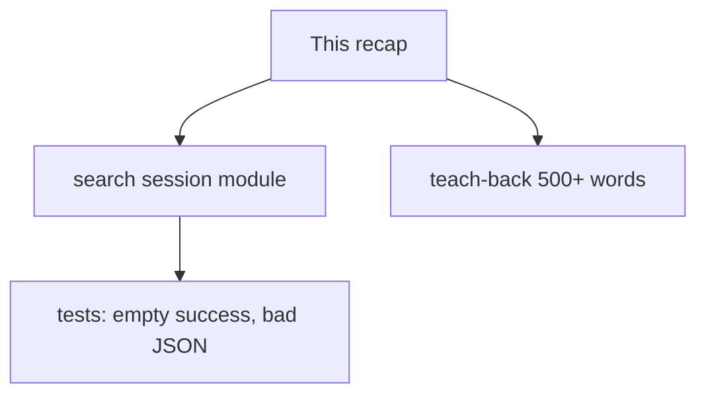
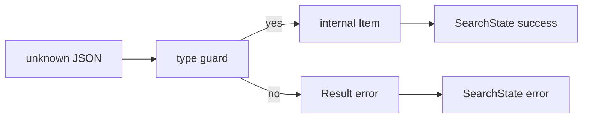

# Month 5 · Week 3 · Day 6
# Independent: Typed Search State

**Program:** Full-Stack Mastery · 18 months  
**Phase:** 1 — Foundations  
**Month index:** [../../README.md](../../README.md)  
**Week 3:** [1](day-01.md) · [2](day-02.md) · [3](day-03.md) · [4](day-04.md) · [5](day-05.md) · Day 6 (today) · [7](day-07.md)  
**Week rhythm today:** Independent  
**Study time:** 3–4 focused hours  
**Machine today:** Windows PowerShell, Node.js 20+  
**Days 1–5 closed.** Repair from this recap. You may open Day 4’s `SearchState` **shape in this file**, not your Project 2 repo.

---

## How to read this chapter

Two challenges. Challenge 1 proves the week without the catalog app open. Challenge 2 proves you can **teach** erasure vs guards — Project 3’s “why bother” paragraph.



Do not paste Project 2. Do not paste a YouTube TypeScript OMDb app. Domain: **books or products** (pick one and stick to it).

Stuck 25 minutes: open **this recap** again. If a fact is truly missing, open one Week 3 day file and log it in `LOOKUPS.txt`.

**Domain pick (commit to one):**

| Domain | Internal item (minimum) | Remote smell to map away |
|---|---|---|
| Books | `{ id: string; title: string; year: number \| null }` | `key`, `first_publish_year`, `cover_i` |
| Products | `{ id: string; name: string; priceCents: number }` | `sku`, `price` as string `"9.99"`, `imageUrl` |

Do not build both. Do not use movie titles if that is your Project 2 domain — the point is a **fresh** model so you cannot paste.

---

## Complete explanation (type safety you must still own)

**Narrow with real checks.** `typeof`, `=== null`, `in`, `instanceof` (constructors only), `Array.isArray`, discriminant `===`. Truthiness drops `0` and `""` — counts and some titles need explicit checks. `typeof null === "object"`. Object guards reject `null`; record guards often reject arrays.

**JSON → `unknown` → guard → `Result<T>` or `T`.** `JSON.parse` / `response.json()` / `localStorage` are not Movies. Assign `unknown`. `try/catch` parse throws. Guard fields. `as Movie` is a lie `tsc` believes. Predicates `x is T` must check fields; `return true` is a costume.

**`never` for exhaustiveness.** `switch (status)` `default { const _x: never = s }`. New variant without a case → type error. Dummy default string hides the miss.

**Discriminated `status`:** `idle | loading | success | error`. Success carries `items: T[]` (empty allowed). Error carries `message`, not items (unless you **explicitly** model stale). Replace the whole object on transition. Do not `loading: boolean` + `error: boolean`.

**Utilities:** `Pick` / `Partial` / `Omit` / `Record` when they **shorten** an obvious type. `MovieCard = Pick<Movie, "id" | "title">`. Nested `Omit<Partial<Pick<...>>>` is a puzzle — write an explicit type. `Partial` is a draft, not a Movie.

**Generics:** `SearchState<T>`, `Result<T>`, `first<T>` — one machine, many row types. No `any`. No `as Movie` on fetch.

**Types erase. Guards run.** `tsc` answers “did I contradict myself?” Tests answer “does garbage explode?”



**Wrong belief:** “I’ll type the fetch as `Promise<Movie[]>` so I can skip the guard.”  
**Correct:** that annotation is fiction. The network is not a type argument.

**Wrong belief:** “Empty results should set `status: error` so the UI can reuse the error CSS.”  
**Correct:** empty is success. CSS can still style an empty list. Error means the operation **failed**.

**Wrong belief:** “I’ll `as Item[]` to finish the hour.”  
**Correct:** delete the assertion. The stall is the lesson.

Worked session: user submits “dune”. You set `{ status: "loading" }`. You `fetch`, `ok` check, `unknown` JSON, guard a list of books. Zero hits → `{ status: "success", items: [] }`. `label` → “No results”. Guard fail or `!ok` → `{ status: "error", message }`. Idle is before the first submit.

Second story: storage string `NOT JSON`. `parseSavedList` returns `{ ok: false }`. UI shows empty collection or a restore error — **not** a white screen. That is Day 3 plus Month 3 parse discipline.

### Challenge 1 in words

Module `session.ts` (names yours): item type, `isItem`, `parseRemoteList(raw: unknown): Result<Item[]>`, `toItem` if remote ≠ internal, `SearchState<Item>`, `label`, helpers `startSearch` / `ok` / `fail`. Tests in Node. No `document` required today — this is the testable core Project 3 will import.

Remote vs internal: if the fake catalog uses `key` for id, map to `id`. If it is already `{ id, title }`, you may still have a Remote type with extra optional junk you drop.

### Challenge 2 in words

Teach a beginner who thinks TypeScript makes APIs safe. You must hit: erasure; `any` infection; `unknown`; predicate honesty; empty success; why Project 3 forbids unjustified `any`. 500+ words. Not a bullet dump. `TEACHBACK.md`.

---

## Office hours — movie paste, empty-as-error, and `as Item[]` at minute 25

**Used movie titles anyway.** Pick books or products. Fresh fixtures you type by hand. Three objects. No Project 2 cache download.

**Empty array → `status: "error"`.** Label can still say “No results” on success. Error is HTTP/`!ok`/guard fail.

**`items` on the error variant.** `tsc` lets you read it without narrowing. Remove it. If typecheck fails on `items` in an error branch, you succeeded at modeling — remove the read, do not add `items?:` to error.

**Teach-back under 500 words.** Add the capital-`Title` story (`{ "Title": "Dune" }` vs `title`) and what the user saw. Close this file first.

**Vite or React today.** No. Pure module. Month 6 is React. Week 4 is Vite.

---

## Today's contract

**Today's gate**

> A new domain module typechecks and tests: garbage JSON does not throw; empty list is success; `SearchState` has no illegal boolean pair; teach-back explains compile-time vs runtime without quoting this file.

---

## Time box

| Block | Minutes | Work |
|---|---|---|
| 1 | 25 | Speak recap; pick domain |
| 2 | 90 | Challenge 1 module + tests |
| 3 | 40 | Challenge 2 teach-back |
| 4 | 20 | LOOKUPS + commit |

---

# Challenge 1

Folder `~\fullstack-lab\month-05\week-03\independent\`.

A **search session** module: `SearchState<T>`, `parseRemoteList(unknown)`, `toItem`, `label`. Domain: books **or** products (not a paste of Project 2). Tests including:

- empty success label
- not-array remote
- bad field types
- `NOT JSON` if you parse text
- `tsc` green, no `any`

Fixture JSON you **type by hand** — three objects. Do not download Project 2’s cache.

`README.md` in that folder: one paragraph what `T` is and where the guard sits.

**Module split (suggested):**

| File | Owns | Must not |
|---|---|---|
| `types.ts` | `Item`, `RemoteItem`, `Result`, `SearchState` | `fetch`, `document` |
| `guards.ts` | `isRecord`, `isItem`, `parseRemoteList` | UI strings except error codes |
| `state.ts` | `label`, `startSearch`, `ok`, `fail` | JSON.parse |
| `session.test.ts` | fixtures | production imports of `fs` |

If you keep one file, that is allowed — then the README must still say where the boundary is.

**Minimum tests (copy as a checklist into TESTS.md):**

1. `isItem` false for `null`, `[]`, `{ title: 1 }`  
2. `parseRemoteList` false for a lone object  
3. Happy list of 2  
4. Empty array → `ok: true, value: []` then `label(ok([]))` is empty copy  
5. `fail("nope")` — `status === "error"`; do not read `items`  
6. `npx tsc --noEmit`  

**Remote year as string:** if your fixture has `"first_publish_year": "1965"`, the guard should reject **or** you parse in `toItem` **after** proving it is a string of digits — pick one, test it. Silent `Number("1965")` on a missing field becomes `NaN` — reject `NaN`.

---

# Challenge 2 — Teach-back

500+ words in `TEACHBACK.md`: compile-time types vs runtime validation; why Project 3 forbids unjustified `any`. Must include a short story: a catalog returns `{ "Title": "Dune" }` with a capital T while your type says `title` — `as Movie` vs a guard.

**Teach-back rubric (self-mark):**

- Erasure: types gone in JS the engine runs  
- `any` infection: one `any` silences a chain of calls  
- `unknown` forces a check before `.title`  
- Predicate must inspect fields; `return true` is a costume  
- Empty success vs HTTP/`!ok` error  
- One sentence on `never` / forgotten `status`  
- Not a paraphrase of the recap’s bullet list — a story a beginner could follow  

If you quote this file, you failed Challenge 2. Close it. Write from the spoken synthesis.

```powershell
cd ~\fullstack-lab\month-05\week-03\independent
npm run typecheck
npm test
```

```powershell
cd ~\fullstack-lab
git add month-05/week-03/independent
git commit -m "Independent SearchState and API guards."
```

---

## Worked walkthrough — empty success is not an error

`parseRemoteList([])` → `{ ok: true, value: [] }`. `ok([])` or your helper → `{ status: "success", items: [] }`. `label` → empty copy (“No results”), **not** the error CSS path. HTTP `!ok` or guard fail → `{ status: "error", message }`. Idle is before submit. Loading has no `items`.

**Minimum test 5.** `fail("nope")` then `status === "error"`. Do not read `items`. If `tsc` errors when you try, you modeled well — remove the read.

**Teach-back capital T.** Catalog JSON `{ "Title": "Dune" }`. Your type says `title`. `as Movie` compiles; `m.title.toUpperCase()` throws. Guard checks `typeof rec.title === "string"`. 500+ words. Close this file. Story a beginner can follow. No Project 2 source. No Vite. No React.

Windows: independent folder, both scripts. Node.js 20+. Commit message names `books` or `products`.

---

## Definition of done

- [ ] Independent folder has tests and `npm run typecheck`
- [ ] Empty success covered
- [ ] Teach-back ≥ 500 words, not a copy of this recap
- [ ] No Project 2 source
- [ ] No `any`

**LOOKUPS.txt** is required even if empty: write `none` or the day file you opened. Independent does not mean heroic memory; it means you did not paste Project 2.

If Challenge 1 typecheck fails on `items` in an error branch, you succeeded at modeling — remove the read, do not add `items?:` to error.

If teach-back is under 500 words, you summarized. Add the capital-`Title` story and what the user saw in the console.

**Independent anti-goals:** no `vite` today; no React; no downloading Project 2 `collection.js`. If you finish early, add `mapResult` from Week 2 on the parse Result — still no `any`.

**Commit message** should name the domain (`books` or `products`) so Week 7-you can find it.

---

# Worked hour (if you stall)

Minute 0–10: write types only. No fetch. `Item`, `RemoteItem`, `Result`, `SearchState`.  
Minute 10–25: `isRecord` + `isItem` + three false tests.  
Minute 25–40: `parseRemoteList` + empty array success.  
Minute 40–55: `label` + `never` default + empty copy test.  
Minute 55–70: `toItem` extra-key drop test.  
Minute 70–90: teach-back draft without the recap open.

If minute 25 still has `as Item[]`, stop and delete the assertion. The stall is the lesson.

`package.json` in independent: `private`, `type: module`, `typecheck`, `test`. Same `tsconfig` as Week 1. You may copy **your** config, not a random gist.

Sleep on the teach-back if it still reads like a bullet list. Challenge 2 is prose.

If `every(isItem)` is slow in your head: it is a loop. Types do not loop. That sentence belongs in the teach-back.

---

## Stalls and repair — movie domain, empty-as-error, as Item[] at minute 25

If you used movie titles because that is Project 2, stop. Books or products. Three fixtures typed by hand. No cache download. No YouTube OMDb app.

If empty array is `status: "error"`, rewrite. Empty is success. `label` can say “No results.” Error is `!ok` or guard fail. If `tsc` errors on `items` in an error branch, remove the read — do not add `items?:` to error.

If minute 25 still has `as Item[]`, delete it. The stall is the lesson. Predicates check fields; `return true` is a costume.

If teach-back is under 500 words or a bullet dump, add capital-`Title` vs `title`: `as Movie` compiles; runtime throw; guard would fail. Erasure. `any` infection. `unknown`. Empty success. `never` one sentence. Close this file. No quote of the recap.

If you scaffolded Vite or React, delete it from today’s assignment. Pure module. `LOOKUPS.txt` even if `none`. Commit message names the domain.

Windows: `cd ~\fullstack-lab\month-05\week-03\independent` then both scripts. Node.js 20+. No Project 2 source.

---

## Last forty minutes

`SearchState` is a union, not a bag of booleans. Tests cover idle, loading, success with items, success with empty, error. Empty is **success**, not error. `tsc` forbids `loading && error`. No `as Item[]`. Both scripts green. Domain is books or products — not Project 2 movies pasted in.

Teach-back is 500+ words in full sentences. Name `as Movie` compiling while runtime throws, erasure, `any` infection, `unknown`, empty success, and `never` in one honest paragraph. Word count in the file. Close this recap while you write.

Commit `month-05/week-03/independent`. If you still have `loading: boolean` and `error: string | null` together, rewrite tonight. Week 4 tooling will not hide an illegal UI state.

---

## Worked checkpoint — empty success, books or products

Pick **one** domain from the table in this chapter. Books: `title`, `year`. Products: `name`, `priceCents`. Do not use movie titles if that is Project 2. Fresh model so you cannot paste.

`SearchState<T>`: idle, loading, success with items, success with **empty** items, error with a message. Empty is `{ status: "success", items: [] }`. `label` may say “No results.” Error is `!ok`, `!response.ok`, or a failed guard — not “the list is empty.” If `tsc` errors when you read `items` on an error object, remove the read. Do not add `items?:` to error to silence it unless you **explicitly** model stale.

Session story: submit “dune” (or a SKU). Set loading. `fetch`, `ok` check, `unknown` JSON, guard. Zero hits → success empty. Guard fail → error. Storage `NOT JSON` → parse error, not a white screen.

Teach-back 500+ words: `as Movie` compiles; runtime throws on a bad field; a guard would fail; types erase; `any` infects; `unknown` is the honest parse type; `never` exhausts `switch`. Close this recap. Word count. No Vite. No React.

> **Wrong belief:** “I’ll `as Item[]` to finish the hour.”  
> **Correct:** delete the assertion. Predicates check fields. `return true` is a costume.

Windows: `cd ~\fullstack-lab\month-05\week-03\independent` then `tsx --test` and `tsc --noEmit`. Node.js 20+. `LOOKUPS.txt` even if `none`. Commit message names the domain.

If you scaffolded Vite or React, delete it from today’s assignment. Pure module. Tests cover idle, loading, success-with-items, success-empty, error. `tsc` forbids `loading && error` if you used booleans — rewrite as the union.

If teach-back is under 500 words or a bullet dump, add capital-`Title` vs `title`: `as Movie` compiles; runtime throw; guard would fail. Erasure. `any` infection. Empty success. `never` in one honest paragraph. Close this file. No quote of the recap as the essay.

If minute 25 still has `as Item[]`, delete it. The stall is the lesson. Predicates check fields; `return true` is a costume. Domain stays books **or** products — not both, not Project 2 movies.

---

## Optional review links

Repair from this recap first.

- [Handbook: Discriminated unions](https://www.typescriptlang.org/docs/handbook/2/narrowing.html#discriminated-unions)

---

## Tomorrow

Week review: speak the flowchart, mini `isNonEmptyString`, debug `typeof null` / `as T` / forgotten case. Then Week 4 tooling — npm, Vite, Project 3.
