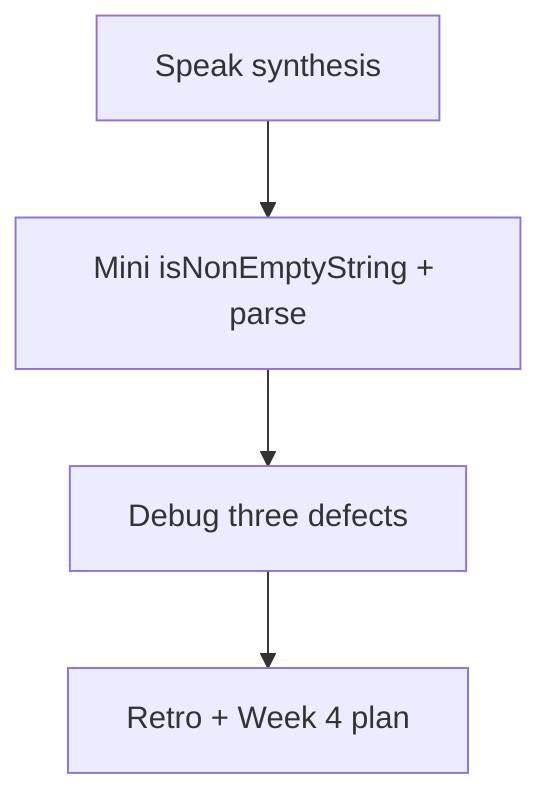
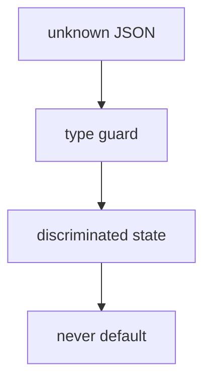

# Month 5 · Week 3 · Day 7
# Week Review — Type Safety

**Program:** Full-Stack Mastery · 18 months  
**Phase:** 1 — Foundations  
**Month index:** [../../README.md](../../README.md)  
**Week 3:** [1](day-01.md) · [2](day-02.md) · [3](day-03.md) · [4](day-04.md) · [5](day-05.md) · [6](day-06.md) · Day 7 (today)  
**Week rhythm today:** Review, repair, plan Week 4  
**Study time:** 3–4 focused hours  
**Machine today:** Windows PowerShell, Node.js 20+  
**Student state:** You can narrow, guard `unknown`, exhaust a union with `never`, and model `SearchState`. Today those ideas must still live in your head — from **this file**.

Do not start Week 4 because the calendar moved. A Vite app whose fetch is `as Movie[]` is a tooling week glued onto a failed type-safety week.

---

## How to read this chapter

This is a **closed-book teaching day**. The synthesis **is** the Week 3 lesson.



Days 1–6 closed during mini-build. Repair from **this** recap.

---

## Week synthesis (this book)

**Narrowing** is control-flow: `typeof`, null checks, `in`, `instanceof`, `Array.isArray`, discriminant `===`. Truthiness is blunt (`0`, `""`). `typeof null === "object"`.

**`unknown`** at boundaries; **`any`** is surrender. `JSON.parse` → assign `unknown`. Guards have runtime teeth: `x is T` plus field checks. `as T` is a promise.

**`never`** exhausts unions: `default` assignment fails when a case is missing.

**`SearchState<T>`** is `idle | loading | success | error`, not boolean pairs. Empty success is `items: []`. Replace whole objects.

**Utilities** (`Partial`, `Pick`, `Omit`, `Record`) in moderation. Draft ≠ complete. Card = `Pick`.

Types erase. Guards **run**. Tests cover garbage JSON, missing fields, empty success. `tsc` covers illegal property access on the wrong variant.



The sections below unpack that so you can mini-build without Days 1–6.

---

## Today's contract

**Today's gate.** Closed-book:

> I can draw unknown → guard → SearchState → never default, write `isNonEmptyString`, and explain why `as Movie` plus a happy-path UI is not validation.

---

## Time box

| Block | Minutes | Work |
|---|---|---|
| 1 | 40 | Speak the synthesis |
| 2 | 50 | Mini-build parse + guard |
| 3 | 30 | Debug three defects |
| 4 | 25 | Review independent — one fix |
| 5 | 20 | Re-run tests + checklist |
| 6 | 20 | Design: why the union is the model |
| 7 | 25 | Retro + Week 4 plan |

---

# Complete explanation — type safety you must still own

## 1. Control flow

The checker walks branches. After `typeof x === "string"`, `x` is `string` in that block. Early `return` leaves the rest with the other members. Helpers do **not** narrow unless they are predicates (`x is T`) or you inline the check.

## 2. Nullability and blunt truthiness

`strict` → `string` is not `null`. Optional `year?` reads as `number | undefined`. `if (year)` drops `0`. `if (title)` drops `""`. Product: empty title untitled; zero count is a count.

`title!` is a promise. Prefer `if (!el) throw` for DOM.

## 3. unknown JSON

```ts
const parsed: unknown = JSON.parse(text);
```

`isRecord`: object, not null, not array. Then `typeof` each field. Literal unions (`"want" | "doing" | "done"`) need **equality to those strings**, not `typeof === "string"`. Lists: `Array.isArray` + `every(guard)`. `Result<T>` for user-facing parse — do not throw to the UI.

## 4. never and state

`fail(msg): never` always throws. Exhaustive `switch` on `status`. `SearchState<T>` four variants. Loading has no items. Error has `message`. Success has `items` (maybe empty). `label` uses the switch.

`Partial` / `Pick` name drafts and cards. Do not `as Movie` a `Partial`.

## 5. Worked mini-build (in words)

`isNonEmptyString(x: unknown): x is string` — typeof string and trim nonempty. `parseNameList(raw: unknown): Result<string[]>` — must be array of nonempty strings. Garbage → `{ ok: false }`. Use it to fill `{ status: "success", items }` or `{ status: "error", message }`. Tests: `["Ada"]` ok; `[""]` fail; `"Ada"` fail (not array); `null` fail.

Malformed: `parseNameList(JSON.parse("NOT JSON"))` is the wrong split — `JSON.parse` throws **before** your function. Wrap parse in `try/catch` in `parseNameListText(text: string)`.

**Wrong belief:** “The mini is too small to need SearchState.”  
**Correct:** even a name list has idle/loading/success/error if it came from HTTP. Today you can skip idle/loading in the mini if you only parse a string — then say so in NOTES. Still: empty array is success.

**`isNonEmptyString` traps:** `typeof x === "string"` accepts `"   "`. Trim. Do not `if (x)` on a number you thought was a name. `0` is not a name; it is also not a string — `typeof` already rejects it.

**Exhaustiveness on the mini:** if you add `label(state: SearchState<string>)`, keep `never` default. Comment out `case "idle"` only long enough to watch `tsc` fail. Restore. That is G4 from Day 5, repeated closed-book.

**Utilities today:** optional `type NameCard = Pick<{ id: string; name: string }, "name">` is unnecessary — do not add Pick to look busy. If you have no object with extra fields, skip utilities. Moderation is the skill.

**What to speak before the mini (closed notes):**

1. Unknown is not any.  
2. Predicates can lie; tests catch the lie.  
3. Empty array is success.  
4. `never` is the forgotten-case alarm.  
5. Types erase.

If you cannot say (3) without hedging, you will fail Month 5’s product gate even if `tsc` is green.

## 6. Debug stories, fully

**`typeof null`.** Guard uses `typeof x === "object"` only, then reads `x.id`. `null` passes typeof, then throws. Observe: test `isRecord(null)` should be false. Fix: `x !== null`.

**`as T` lie.** `const m = JSON.parse(text) as Movie`. Happy fixture works. Storage is `{ "title": 1 }`. `m.title.toUpperCase` throws. `tsc` silent. Fix: unknown + guard.

**Forgotten union case.** Add `"stale"` to the union, forget `case`. Without `never` default, `label` returns undefined at runtime for that status. With `never`, `tsc` fails in CI. Observe: typecheck red. Fix: handle the case or do not add the variant.

**Wrong belief:** “I’ll skip Week 4 lockfile talk because I already ran npm.”  
**Correct:** the retro must name lockfile and `VITE_` publicity. Tooling week assumes type safety, not the other way around.

---

## Office hours — whitespace names, parse that throws, and retros that skip Vite `--`

**`isNonEmptyString("   ")` true.** Trim. Empty after trim is not a name.

**`parseNameListText("NOT JSON")` throws.** Catch in the text wrapper. Tests stay green. The runner is not the UI.

**Skipped `DRAWING.md`.** Speak is not enough. Mermaid or ASCII of unknown → guard → state → never.

**Retro: “I need another week of unions, I’ll skip Vite.”** If the hole is `as Movie`, repair Week 3 labs. If the hole is npm, Week 4 is the teacher — do not start Vite as avoidance of guards, and do not skip Vite as avoidance of lockfiles. Write which hole is real.

---

Speak the synthesis. Draw the flowchart from memory in `DRAWING.md` (Mermaid or ASCII).

---

# Mini-build

`~\fullstack-lab\month-05\week-03\review\`

- `isNonEmptyString(x: unknown): x is string`
- `parseNameListText(raw: string): Result<string[]>`
- tests: garbage string, valid `["Ada","Grace"]`, `[""]`, non-array `{}`
- optional: `label(state: SearchState<string>)` for success empty vs error
- `npx tsc --noEmit` green
- no `any`

HTTP not required. Pure module.

`package.json` in review: `"type": "module"`, `typecheck`, `test`. Same `tsconfig` idea as Week 1 (`strict`, `noEmit`). Import style: the one you documented in Week 1. Node.js 20+.

**Mini-build tests (write them):**

| Input | Expect |
|---|---|
| `'["Ada","Grace"]'` | ok, length 2 |
| `'NOT JSON'` | ok false, no throw |
| `'[""]'` | ok false |
| `'{"name":"Ada"}'` | ok false (not array) |
| `'[]'` | ok true, empty success if you map to SearchState |

If you skip SearchState in the mini, `NOTES.txt` must say empty array is still success **when** you wire it tomorrow in Project 3.

```powershell
cd ~\fullstack-lab\month-05\week-03\review
npm run typecheck
npm test
```

---

# Debug (write the cause, from this week)

- `typeof null`
- `as T` lie
- forgotten union case

Full sentences in `DEBUG.txt`. Include what you would observe (throw, silent tsc, missing UI branch).

---

# Review, tests, design

One committed fix on the independent module (missing test, dishonest guard, empty-as-error). Re-run `npm test`. Design paragraph in `DESIGN.txt`: why the discriminated union is the model and boolean flags are the view-killer — you cannot read `items` on error because they are not there.

---

## Worked walkthrough — `parseNameListText` table

| Input | Expect |
|---|---|
| `'["Ada","Grace"]'` | ok, length 2 |
| `'NOT JSON'` | ok false, **no throw** |
| `'[""]'` | ok false (`isNonEmptyString` after trim) |
| `'{"name":"Ada"}'` | ok false (not array) |
| `'[]'` | ok true; empty success if mapped to SearchState |

`isNonEmptyString("   ")` is false. `typeof x === "string"` alone is not enough.

**DEBUG `typeof null`.** Object check without `!== null` then `x.id` throws. `isRecord(null)` false.

**DEBUG `as T`.** Happy fixture works. `{ "title": 1 }` throws at `.toUpperCase`. `tsc` silent. unknown + guard.

**DEBUG forgotten case.** Add `"stale"`, skip `case`, no `never` default → `undefined` at runtime. With `never`, `tsc` red. Handle or do not add the variant.

Windows: `cd ~\fullstack-lab\month-05\week-03\review`. Both scripts. Node.js 20+. Retro names extra `--` on `npm create vite` and `VITE_` publicity. Speak: *types erase; the lockfile does not.*

---

## Retro and commit (Week 3)

Retro in `RETRO.md`: solid / weak / whether you still `as` at a boundary. **Week 4:** npm, semver, lockfiles, scripts, **Vite**, env vars (`VITE_` **public**), lint/format for TS, then **Project 3** — you convert Project 2 yourself; this textbook will not contain that app.

```powershell
cd ~\fullstack-lab
git add month-05/week-03/review
git commit -m "Record Week 3 type-safety review."
```

---

## Week 3 definition of done

- [ ] Flowchart drawn without day files
- [ ] Mini parse + `isNonEmptyString` tested
- [ ] DEBUG three stories
- [ ] Retro does not skip Week 4 lockfile / `VITE_` publicity
- [ ] No `any` in review folder

**Week 4 preview you must not skip in the retro:** you will run `npm create vite` with an extra `--` on Windows; you will commit `package-lock.json`; you will treat `VITE_` as public; you will convert Project 2 **yourself**. If the retro says “I need another week of unions,” stay in Week 3 labs — do not start Vite as avoidance.

Speak tomorrow’s sentence: *types erase; the lockfile does not.*

---

## Stalls and repair — whitespace names, throwing parse, retro that skips Vite

If `isNonEmptyString("   ")` is true, trim. Empty after trim is not a name. `[""]` in JSON is ok false.

If `parseNameListText("NOT JSON")` throws, wrap `JSON.parse` in try/catch. The runner is not the UI. Tests stay green.

If you skipped `DRAWING.md`, draw unknown → guard → SearchState → never. Speak is not enough.

If DEBUG `typeof null` is a slogan, write: observation throw on `.id`; mechanism `typeof null === "object"`; fix `x !== null`. `as T`: silent `tsc`, runtime throw on bad title type. Forgotten case: without `never`, `undefined` at runtime; with `never`, typecheck red.

If retro skips lockfile and `VITE_` publicity, add them. Windows extra `--` on `npm create vite@latest name -- --template vanilla-ts`. Project 3 is **your** conversion — this book will not contain that app. If the hole is `as Movie`, stay in Week 3 labs. If the hole is npm, Week 4 is the teacher — do not use Vite as avoidance of guards.

Windows: `cd ~\fullstack-lab\month-05\week-03\review` then both scripts. Node.js 20+. Speak: *types erase; the lockfile does not.*

---

## Last forty minutes

`isNonEmptyString` plus `parseNameListText` tests: happy list, not-array, NOT JSON without throw. `DRAWING.md` exists. DEBUG three causes in full sentences — `typeof null`, `as T`, forgotten case. Retro names lockfile and `VITE_` publicity even if Week 4 has not started yet.

Speak the flowchart closed-book: `unknown` → guard → `SearchState` → `never`. If `as Movie` is still how you finish labs, stay here. Do not treat Vite as a way out of narrowing.

Commit `month-05/week-03/review`. Node.js 20+. No Project 3 app in this folder. Tomorrow: npm, lockfiles, scripts — then Vite on Day 2.

---

## Worked checkpoint — `typeof null`, `as T`, forgotten case

`isNonEmptyString("   ")` is false. Trim. `[""]` in JSON is `ok: false` for a name list. `parseNameListText("NOT JSON")` does not throw out of the function — `try/catch` around `JSON.parse`, assign `unknown`.

`DRAWING.md`: unknown → guard → `SearchState` → `never` default. Speak is not enough; the file exists.

**DEBUG `typeof null`.** Observation: `.id` throws. Mechanism: `typeof null === "object"`. Fix: `x !== null` (and reject arrays if you need a record).

**DEBUG `as T`.** Observation: happy fixture works; `{ "title": 1 }` throws at `.toUpperCase`. Mechanism: `tsc` believed the assertion. Fix: `unknown` + guard.

**DEBUG forgotten case.** Add `"stale"`, skip `case`, no `never` → `undefined` at runtime. With `never`, `tsc` red.

> **Wrong belief:** “The mini is too small to need SearchState.”  
> **Correct:** even a name list has success vs error. Empty array is success. Idle/loading can wait if you only parse a string — then say so in NOTES.

Retro names lockfile and `VITE_` publicity. Windows extra `--`: `npm create vite@latest name -- --template vanilla-ts`. If the hole is `as Movie`, stay in Week 3 labs. If the hole is npm, Week 4 is the teacher — do not use Vite as avoidance of guards. Speak: *types erase; the lockfile does not.*

If you finish early, re-run both scripts. `isNonEmptyString` plus `parseNameListText` tests: happy list, not-array, NOT JSON without throw. Retro: solid / weak / whether you still `as` at a boundary. Project 3 is **your** conversion — this book will not contain that app.

---

## Optional review links

Week 3 is explained in this chapter. These pages are for later checking, not for first learning.

- [Handbook: Narrowing](https://www.typescriptlang.org/docs/handbook/2/narrowing.html)
- [Handbook: Utility Types](https://www.typescriptlang.org/docs/handbook/utility-types.html)

---

## Next week

[Week 4 Day 1](../week-04/day-01.md) — npm, `package.json`, semver, lockfiles, scripts. Vite is Day 2. Project 3 starts Day 4.
