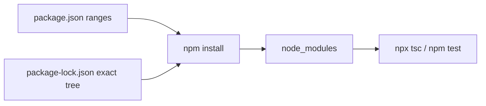

# Month 5 · Week 4 · Day 1
# npm, package.json, Semver, Lockfiles, Scripts

**Program:** Full-Stack Mastery · 18 months  
**Phase:** 1 — Foundations  
**Month index:** [../../README.md](../../README.md)  
**Week 4:** Day 1 (today) · [2](day-02.md) · [3](day-03.md) · [4](day-04.md) · [5](day-05.md) · [6](day-06.md) · [7](day-07.md)  
**Week rhythm today:** Learn + type-along  
**Student state:** Month 4 used `npm install` as a verb. Week 3 used `typescript` and `tsx` as devDependencies. Today you learn what that **is**, so Project 3’s `package.json` is a document you wrote on purpose.  
**Study time:** 3–4 focused hours

**This week covers:** npm, `package.json`, semantic versioning, lockfiles, scripts, Vite, environment configuration, lint/format — then **Project 3**.

You have run `npm install` since Month 4. Today you learn what that **is**. Vite is Day 2. Do not skip it. If you only memorize “commit the lockfile,” you will still paste `VITE_SECRET` tomorrow.

Labs: `~\fullstack-lab\month-05\week-04\day-01\`.

---

## How to use this chapter

1. Read a section. Close it. Say the idea.
2. Type the lab in a **real folder**. Open `package-lock.json` with your eyes — at least the `typescript` entry.
3. When install fails, read the npm error (network, engines, peer). Do not delete `node_modules` as a first ritual unless the error says the tree is corrupt.
4. Optional links are review after you can teach semver and lockfiles aloud.

---

## How to read this chapter

JavaScript libraries do not arrive as copies you pasted into `src/`. They arrive as **packages**: named, versioned tarballs on the **npm registry**. **npm** is Node’s default **package manager**: it downloads those tarballs into `node_modules`, records versions, and runs **scripts**.

It is not the TypeScript compiler. It is not Vite. It **installs** those tools.

**npx** runs a command from a local (or downloaded) package: `npx tsc`. Prefer local installs + `npx` / `npm run` over global `tsc` on PATH. Two machines with two global TypeScripts is how “works on my machine” starts.



> **Wrong belief:** “package.json already pins versions.”  
> **Correct:** `^5.6.0` is a **range**. The **lockfile** pins the exact tree you installed, including nested dependencies.

---

## Today's contract

1. Explain npm vs `tsc` vs Vite (install vs compile vs bundle).
2. Read and write `package.json` fields: `name`, `private`, `version`, `type`, `scripts`, `dependencies`, `devDependencies`.
3. Explain semver MAJOR.MINOR.PATCH and what `^` / `~` allow.
4. Commit **`package-lock.json`**. Gitignore **`node_modules`**.
5. Use `npm ci` mentally as “CI installs exactly the lockfile.”

**Today's gate**

> `package.json` is the manifest. The **lockfile** pins exact versions so your classmate’s install matches yours. Semver `^1.2.3` allows compatible updates **on next install** unless the lockfile already pins. Scripts are aliases for commands. `dependencies` vs `devDependencies` is “needed to *run* the product” vs “needed to *build/test* it.”

---

## Time box

| Block | Minutes | Work |
|---|---|---|
| A | 50 | Theory — npm, manifest, semver, lock, scripts |
| B | 55 | Init, install, read lockfile, scripts |
| C | 50 | Independent notes + `npm ci` dry understanding |
| D | 20 | Git |
| E | 15 | Recall |

---

# Block A — Theory

## 1. What npm is

**npm** ships with Node. It talks to the registry, writes `node_modules`, and updates the lockfile.

| Tool | Job |
|---|---|
| **npm** | Install packages, run `package.json` scripts |
| **npx** | Execute a binary from `node_modules/.bin` (or fetch once) |
| **node** | Run JavaScript |
| **tsc** | Typecheck / emit — a package you **installed** |
| **Vite** | Dev server + bundler — Day 2, also a package |

**Windows:** run install commands **inside the project folder**. `node_modules` is per-folder. A global `tsc` on PATH may be a **different version** than `npx tsc`. This course: local + `npx` / `npm run`.

`npm init -y` writes a starter `package.json`. `-y` means “accept defaults.” You still edit `private` and `type`.

---

## 2. `package.json` fields you must know

```json
{
  "name": "month-05-lab",
  "private": true,
  "version": "0.0.1",
  "type": "module",
  "scripts": {
    "typecheck": "tsc --noEmit",
    "test": "tsx --test"
  },
  "dependencies": {},
  "devDependencies": {
    "typescript": "^5.6.0",
    "tsx": "^4.19.0"
  }
}
```

| Field | Meaning |
|---|---|
| `name` | Package name (lowercase, no spaces). `private: true` means “do not publish to npm by accident.” |
| `version` | **Your** package’s semver. Apps can stay `0.0.1` until you care. |
| `type: "module"` | `.js` is ESM (`import`). Vite TS apps use this. |
| `scripts` | `npm run typecheck` runs the string in a shell. `npm test` is a shortcut for `npm run test`. |
| `dependencies` | Libraries the **running app** imports (e.g. later React). |
| `devDependencies` | Compiler, test runner, linter, Vite — needed on the developer machine and CI, not in a naive “production node_modules” story. Vite still **bundles** what you import; the user’s browser does not download your `devDependencies`. |

**Do not** commit `node_modules`. **Do** commit `package-lock.json`.

Other fields you will see and should not fear:

| Field | Meaning |
|---|---|
| `description` / `license` | Metadata. Labs can ignore. |
| `engines` | “This app expects Node ≥ 20.” A warning unless you set engine-strict. |
| `main` / `exports` | How **other** packages import this one. Apps care less; libraries care a lot. |
| `peerDependencies` | “I expect the host to provide React.” You will meet this in Month 6. Do not fake peers today. |

---

## 3. Semantic versioning (semver)

A version is **MAJOR.MINOR.PATCH** (e.g. `5.6.2`).

| Bump | Meaning (the **publisher’s promise**) |
|---|---|
| **MAJOR** | Breaking changes. `4.x` → `5.x` may require you to change code. |
| **MINOR** | New features, backward compatible **if they told the truth**. |
| **PATCH** | Bug fixes, compatible. |

**Range syntax in `package.json`:**

| Range | Means |
|---|---|
| `5.6.2` | Exact |
| `^5.6.2` | Compatible with 5.6.2: `>=5.6.2 <6.0.0` (common default) |
| `~5.6.2` | `>=5.6.2 <5.7.0` |
| `*` | Do not use |
| `>=5.6.2` | Open-ended — avoid in apps |

The promise can be a lie (a “minor” that breaks you). That is why **lockfiles** exist.

**`0.x` caveat:** many publishers treat `0.y.z` as unstable. `^0.5.0` may **not** allow `0.6.0` (npm’s caret rules for 0.x are stricter). Do not memorize every 0.x quirk — read what `npm` installed, and rely on the lockfile.


**What `^` refuses:** the next **major**. If typescript is `^5.6.0`, npm will not install `6.0.0` on a fresh range-resolve **without you editing package.json**. It **will** install `5.9.2` if the lockfile is absent or you deliberately update. With a committed lockfile, `npm ci` installs **exactly** what the lock says, even if 5.9 exists.

---

## 4. Lockfiles

When you `npm install`, npm writes **`package-lock.json`**: the **exact** version of every package **and** its children (the whole tree), plus integrity hashes.

| Command | Use |
|---|---|
| `npm install` | Update node_modules; may update lockfile if `package.json` ranges allow |
| `npm ci` | **Clean** install **exactly** from the lockfile. Fails if `package.json` and lock disagree. Use in CI. |

If you commit the lockfile, a teammate’s `npm ci` (or `npm install`) should reproduce your tree.

If you **gitignore** the lockfile, “works on my machine” becomes the course.

Open the lockfile, find `"node_modules/typescript"` (or the `packages` entry). The **resolved** version is a string like `5.6.3`. That is what you write in `LOCK.txt` — not only the `^5.6.0` range.

**Nested dependencies:** you did not choose `typescript`’s dependencies; the lockfile still pins them. Two classmates without a lockfile can get two different nested trees on the same day.

**Do not hand-edit** the lockfile. Change `package.json`, then `npm install`.

Yarn/pnpm have other lockfile names. This course: **npm** + `package-lock.json`. Do not mix package managers in one folder (`pnpm-lock.yaml` next to `package-lock.json` is a mess).

---

## 5. Install commands

```powershell
npm install typescript --save-dev
npm install   # install from package.json + lock
```

`--save-dev` / `-D` writes to `devDependencies`. Default `npm install pkg` writes to `dependencies`.

**When to use which bucket (this course):**

| Put in `dependencies` | Put in `devDependencies` |
|---|---|
| Libraries imported by **production** app code that Vite will bundle (Month 6: `react`) | `typescript`, `tsx`, `vite`, `eslint`, `prettier` |
| Runtime needed if you later run Node servers (Month 9+) | Test runners, types-only packages (`@types/node` — often dev) |

If you put `typescript` in `dependencies`, it is not a crime; it is a **signal error**. Reviewers (and you in six months) will think the browser needs `tsc`.

**Uninstall:** `npm uninstall pkg` — updates both manifest and lock.

---

## 6. Scripts are a contract

`npm run typecheck` looks up `"typecheck"` in `scripts` and runs that string with `node_modules/.bin` on the PATH **for that process**. That is why `tsc` works in a script without `npx` — npm puts the local binary first.

Lifecycle names you will see: `pretest` runs before `test` if present. Do not pile magic `preinstall` scripts. Keep scripts boring: `dev`, `build`, `typecheck`, `test`, `lint`, `format`.

`npm test` equals `npm run test`. `npm start` equals `npm run start`. Special shortcuts — still just scripts.

Quote paths with spaces. On Windows PowerShell, scripts run through `cmd` or npm’s shell — if a script fails only on Windows, the usual cause is `&&` vs `;` in old docs. npm scripts support `&&` in current npm. Prefer simple one-command scripts.

---

## 7. Reading a lockfile entry (what “resolved” means)

In modern `package-lock.json` (lockfileVersion 3), look under `"packages"` for `"node_modules/typescript"`:

- `"version"`: exact version on disk after install  
- `"resolved"`: the tarball URL npm fetched  
- `"integrity"`: hash — tampering or a corrupt cache fails install  

You do not need to memorize the JSON schema. You need to **open it once** and copy the version into `LOCK.txt`. If `typescript` is missing from the lock, you did not install it in this folder.

`npm ls typescript` prints the tree. `npm outdated` shows what ranges *could* move to if you update — do **not** upgrade on exam day for fun. Updating is a deliberate `npm install typescript@^5` (or a exact pin) plus a lockfile diff you read.

---

# Block B — Type-along

In `~\fullstack-lab\month-05\week-04\day-01\`:

1. `npm init -y`, set `"private": true`, `"type": "module"`.
2. Install `typescript` and `tsx` as devDependencies.
3. Add scripts `typecheck` and `test`.
4. `LOCK.txt`: open `package-lock.json`, write the **resolved version** of `typescript` (not only the range in package.json).
5. `SEMVER.txt`: if typescript is `^5.6.0`, which major bump would be allowed without editing package.json? (None — `^` stops at the next major.) Also answer: could a **minor** `5.9.x` appear on a lockless `npm install` later? (Yes, if the publisher released it.)
6. Confirm `node_modules` is gitignored at the lab root. If the lab root has no `.gitignore`, add one with `node_modules/` and `dist/`.
7. `SCRIPTS.txt`: run `npm run` with no extra args (lists scripts). Paste the list.

```powershell
npm init -y
npm install --save-dev typescript tsx
```

Edit `package.json` by hand for `private`, `type`, scripts. Run `npm run typecheck` after a one-line `index.ts` (`export const n: number = 1;`) and a `tsconfig.json` like Week 1 (`strict`, `noEmit`, `NodeNext`).

**`npm ci` experiment (optional but recommended):**

```powershell
Remove-Item -Recurse -Force node_modules
npm ci
```

If `npm ci` fails because `package.json` and lock drifted, you edited one and not the other — run `npm install` to resync, commit **both**.

```powershell
cd ~\fullstack-lab
git add month-05/week-04
git commit -m "Week 4 Day 1: npm manifest, lockfile, semver notes."
```

---

# Block C — Independent

`DEPEND.txt` (200+ words): explain to a teammate why Vite belongs in `devDependencies` even though `npm run dev` is how you run the app, and why React (next month) will be a `dependency`. Use the table in this chapter; do not copy it verbatim.

`BREAK.txt`: imagine the lockfile was gitignored. You installed Tuesday; classmate Friday. Same `^5.6.0`. What can differ? Nested packages. A patch that changed error text. `tsc` diagnostics. That is the story.

No need for a large TS module today. Tooling literacy is the lab.

---

## Definition of done

- [ ] `private: true`, `type: module`, lockfile present
- [ ] `LOCK.txt` has a resolved `typescript` version
- [ ] `SEMVER.txt` answers the `^` major question
- [ ] `node_modules` is not staged for commit
- [ ] `npm run typecheck` works on a tiny file

---

## Optional review links

npm, semver, and lockfiles are explained above.

- [npm: package.json](https://docs.npmjs.com/cli/v10/configuring-npm/package-json)
- [semver spec](https://semver.org/)
- [npm ci](https://docs.npmjs.com/cli/v10/commands/npm-ci)

---

## Tomorrow

Vite: dev server vs production `dist/`, `index.html` as entry, and **`VITE_` env vars that anyone can read in the bundle**. ESLint + Prettier + `tsc` as a script set.
