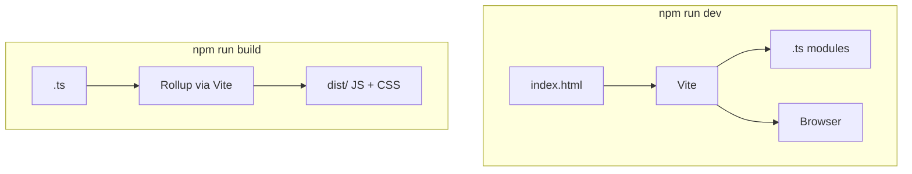

# Month 5 · Week 4 · Day 2
# Vite, Environment Config, Lint/Format for TypeScript

**Program:** Full-Stack Mastery · 18 months  
**Phase:** 1 — Foundations  
**Month index:** [../../README.md](../../README.md)  
**Week 4:** [1](day-01.md) · Day 2 (today) · [3](day-03.md) · [4](day-04.md) · [5](day-05.md) · [6](day-06.md) · [7](day-07.md)  
**Week rhythm today:** Learn + type-along  
**Student state:** You can explain `package.json`, semver, and the lockfile. Project 3 **requires** Vite. Today you learn what it does so the scaffold is not magic.  
**Study time:** 3–4 focused hours

**This week covers:** npm, `package.json`, semantic versioning, lockfiles, scripts, Vite, environment configuration, lint/format — then **Project 3**.

Project 3 **requires** Vite. Today you learn what it does so the scaffold is not magic. Do not start Project 3 until Day 4. The throwaway lab is the place to break env vars on purpose.

---

## How to use this chapter

1. Read a section. Close it. Say the idea.
2. Scaffold with the **Windows** command below (`--` extra). Type notes; do not ship the demo counter in Project 3.
3. Search `dist/` for a `VITE_` string after build — that search **is** the security lesson.
4. Optional links are review after you can teach public env aloud.

---

## How to read this chapter

Browsers run **JavaScript**. You write **TypeScript**. A **bundler** compiles TS → JS, follows `import`, and emits a `dist/` tree you can host statically (Month 2 Pages habit, now with a build step).

**Vite** (French for “fast”) is a **dev server** plus a **bundler**. In development it serves native ESM quickly and compiles `.ts` on the fly. For production `vite build` emits files. `import.meta.env.VITE_*` is how the **browser** sees env vars — they are **public**. Do not put secrets there.



> **Wrong belief:** “`.env` is a secret vault because Git ignores it.”  
> **Correct:** `VITE_*` values are **inlined into client JS**. Anyone can read them in DevTools or in `dist/`. Gitignore only hides them from GitHub, not from users.

---

## Today's contract

1. Scaffold `vanilla-ts` with `npm create vite` and the extra `--`.
2. Explain every file in the scaffold (table below).
3. Run `dev` and `build`. Open `dist/` and see JS that is **not** your `.ts` source.
4. Put `VITE_APP_TITLE` in `.env`, display it, prove it appears in `dist/`.
5. Wire ESLint + typescript-eslint + Prettier; `no-explicit-any` fails a file with `any`.

**Today's gate**

> Vite is a **dev server** plus a **bundler**. In development it serves native ESM quickly. For production `vite build` emits files you can host statically (Month 2 Pages habit, now with a `dist/` folder). `import.meta.env.VITE_*` is how the **browser** sees env vars — they are **public**. Do not put secrets there.

---

## Time box

| Block | Minutes | Work |
|---|---|---|
| A | 45 | Theory — bundler, scaffold, env, lint |
| B | 70 | Scaffold, env publicity proof, ESLint |
| C | 40 | Independent `ENV.txt` / `EXPLAIN.txt` |
| D | 20 | Git notes |
| E | 10 | Recall |

---

# Block A — Theory

## 1. Why a bundler

Browsers can load ESM, but a real app has TypeScript, many files, and libraries. A bundler:

- compiles `.ts` / `.tsx` to JS the browser accepts
- resolves `import` (including from `node_modules`)
- in production, concatenates/minifies into `dist/`
- copies `public/` as static files

**Vite** specifically:

| Command | Job |
|---|---|
| `npx vite` / `npm run dev` | Dev server, HTTP, hot reload (HMR) |
| `npx vite build` / `npm run build` | Production assets in `dist/` |
| `npx vite preview` | Serve `dist/` locally (what you host, not the TS source) |

**index.html is the entry** (not a hidden webpack template). A script tag:

```html
<script type="module" src="/src/main.ts"></script>
```

Vite intercepts `.ts` and compiles on the fly in dev.

Serve **only through Vite** in this project — not random `file://`. Month 2’s “HTTP or it lies” still applies. Vite **is** that HTTP server in development.

**HMR:** saving a module tries to patch the browser without a full reload. If state looks weird after a save, hard-refresh. Do not debug types via HMR — `tsc` is the typecheck.

---

## 2. Scaffold — then explain every file

In a **throwaway** folder (not Project 3 yet). **Windows PowerShell** — the extra `--` separates npm’s args from Vite’s args:

```powershell
cd $HOME
npm create vite@latest vite-lab -- --template vanilla-ts
cd vite-lab
npm install
npm run dev
```

If the CLI asks questions, choose **vanilla** + **TypeScript**. The `--template vanilla-ts` should skip that.

Do **not** write `npm create vite@latest vite-lab --template vanilla-ts` without the extra `--` on npm — npm may eat `--template` and you get an interactive quiz or a wrong template.

**What you just got (meanings):**

| File | Job |
|---|---|
| `package.json` | Scripts `dev`, `build`, `preview`; `vite` + `typescript` as devDependencies |
| `package-lock.json` | Exact tree — **commit it** |
| `vite.config.ts` | Optional; default is fine today. Later: aliases, env dir |
| `tsconfig.json` / `tsconfig.app.json` | Browser TS options. **`strict` should stay on.** If the template loosened it, turn `strict` true |
| `tsconfig.node.json` | Types for `vite.config.ts` (Node). Do not put app code there |
| `index.html` | Page shell; points at `src/main.ts` |
| `src/main.ts` | JS/TS entry |
| `src/vite-env.d.ts` or `src/env.d.ts` | Tells TS about `import.meta.env` |
| `public/` | Files copied as-is (favicon) — URL `/favicon.ico`, not `/public/...` |
| `.gitignore` | Includes `node_modules`, `dist` — keep both ignored |

Delete the template counter UI when you understand it. You will not ship Vite’s demo logo in Project 3.

`npm run build` must succeed. Open `dist/` and see JS that is **not** your `.ts` source. That JS is what GitHub Pages (or any static host) would serve.

---

## 3. Environment variables — `VITE_` is public only

Vite only exposes variables that start with **`VITE_`** to client code:

```ts
const base = import.meta.env.VITE_API_BASE;
```

`.env` file in the project root:

```text
VITE_API_BASE=https://example.com
VITE_APP_TITLE=Vite lab
```

**These strings are baked into the client bundle.** Anyone can read them in DevTools. **Never** put API **secrets**, private keys, or passwords in `VITE_*`. Public catalog URLs are fine. Month 9+ servers hold secrets.

`.env` is often gitignored; `.env.example` lists **names** without values. Document that in Project 3 README.

| File | Typical use |
|---|---|
| `.env` | Defaults for all modes |
| `.env.local` | Your machine; **gitignored** |
| `.env.development` / `.env.production` | Mode-specific |
| `.env.example` | Names only — **commit** this |

`import.meta.env.MODE` is `"development"` or `"production"`. `import.meta.env.PROD` is a boolean. `import.meta.env.DEV` is the opposite. These are **not** secrets; they are build-mode flags.

A variable named `API_SECRET` **without** the `VITE_` prefix is **not** available in `import.meta.env` in client code. That is a safety default — and a trap if you thought you “hid” a secret by omitting the prefix while still leaking it some other way. Do not put secrets in any file Vite might copy to `dist/`.

Restart `npm run dev` after changing `.env`. Vite reads env at server start.

**Proof you must perform:** set `VITE_APP_TITLE=Northline Lab`. Use `textContent` to show it. `npm run build`. Search `dist` for `Northline Lab`. It will be there. Write that in `ENV.txt`. That sentence is why `VITE_SECRET_KEY` is a mistake.

---

## 4. Lint and format with TypeScript

Month 4 ESLint was JS. For TS you add **typescript-eslint** so the linter understands types.

Install (in the Vite lab or Project 3):

```powershell
npm install -D eslint typescript-eslint eslint-config-prettier prettier
```

You may also need `@eslint/js` depending on the typescript-eslint version. If a package name fails, read the install error — versions change. The **rules this course requires** stay: `eqeqeq`, **no explicit `any`**, Prettier not fighting ESLint (`eslint-config-prettier` last).

`eslint.config.js` (flat config) — type this; it is the same idea as Month 4 plus TS:

```js
import eslint from "@eslint/js";
import tseslint from "typescript-eslint";
import prettier from "eslint-config-prettier";

export default tseslint.config(
  eslint.configs.recommended,
  ...tseslint.configs.recommended,
  prettier,
  {
    ignores: ["dist/**", "node_modules/**"],
    rules: {
      eqeqeq: ["error", "always"],
      "@typescript-eslint/no-explicit-any": "error",
    },
  },
);
```

If the template already has an ESLint file, **merge** the rules above rather than running two configs that fight.

Prettier: `.prettierrc` with something boring (`"semi": true`, `"singleQuote": false` — pick one style and keep it). `format` writes; `format:check` is CI.

Scripts (merge with Vite’s — do not drop `dev`):

```json
{
  "scripts": {
    "dev": "vite",
    "build": "tsc -b && vite build",
    "typecheck": "tsc -b --pretty false",
    "preview": "vite preview",
    "lint": "eslint .",
    "format": "prettier --write .",
    "format:check": "prettier --check .",
    "test": "tsx --test"
  }
}
```

Vite templates sometimes use `tsc -b` (project references). If `tsc -b` errors, `tsc --noEmit -p tsconfig.app.json` is the same idea: **typecheck the app**. Adjust the script to a command that **you** ran successfully and document it in `TYPECHECK.txt`.

**`vite build` is not a substitute for `tsc`.** Vite may transpile a file that still has a type error depending on settings. **`tsc` is the gate**, same as Weeks 1–3. Project 3 must have a `typecheck` script.

**Tests:** `tsx --test` for pure `src/*.test.ts` is enough this month. Vitest is optional (same arrange/act/assert). Do not postpone tests because “Vite is a UI tool.” Put tests next to pure modules (`parse.ts`, `state.ts`). They should not need `document`.

Install `tsx` as a devDependency if you use that test script.

---

## 5. `strict` in the scaffold

If `tsconfig.app.json` has `"strict": false` or missing `strictNullChecks`, turn **`strict` true**. A Vite template that loosens strict is convenient and **wrong for this course**. Project 3’s gate includes modeling without `any`; loose config makes `any`-shaped holes.

---

# Block B — Lab

1. Scaffold `~/vite-lab` (or under fullstack-lab). `dev` + `build` work.
2. `EXPLAIN.txt`: what Vite does in dev vs build (your words, from this chapter).
3. Add a `VITE_APP_TITLE` and display it via `textContent` in `main.ts`. Show in `ENV.txt` that it appears in the built JS (search `dist` for the string) — **that** is why secrets are forbidden.
4. ESLint + Prettier wired; `no-explicit-any` on; a file with `any` fails lint. Restore the file to no `any`.
5. Confirm `strict` true. Confirm lockfile exists.

Search `dist` on Windows:

```powershell
Select-String -Path dist\**\*.js -Pattern "Northline Lab"
```

(Adjust the title string to whatever you set.)

```powershell
cd ~\fullstack-lab
git add month-05/week-04
git commit -m "Week 4 Day 2: Vite lab notes, env publicity, TS lint."
```

The Vite project may live **outside** fullstack-lab. Put notes in the lab; commit the Vite playground if you want it in git (no `node_modules`, no secrets in `.env` if you commit the playground — use `.env.example`).

---

# Block C — Independent

`PUBLIC.txt`: 150+ words. A classmate wants to put the OMDb API **key** in `VITE_OMDB_KEY` because “it’s just a catalog.” Explain: keys in the bundle are stolen; many catalog keys are billed; public URLs without secrets are the Month 5 pattern; paid keys wait for a server (later months). You may still use a **keyless** public API.

`LINT.txt`: paste the ESLint error for `const x: any = 1` (or `any` as a parameter). Then the file with `any` removed.

---

## Definition of done

- [ ] `npm run dev` served over HTTP (not `file://`)
- [ ] `npm run build` produced `dist/`
- [ ] `ENV.txt` proves `VITE_` inlined
- [ ] Lint fails on explicit `any` and passes without it
- [ ] `typecheck` script documented and green
- [ ] No secrets in committed files

---

## Optional review links

Vite’s job, env prefix, and TS lint are explained above.

- [Vite: Getting Started](https://vite.dev/guide/)
- [Vite: Env variables](https://vite.dev/guide/env-and-mode.html)
- [typescript-eslint](https://typescript-eslint.io/)

---

## Tomorrow

Closed-book toolchain teach-back: npm, lockfile, `^`, Vite, public `VITE_`, why both `tsc` and `vite build`.
