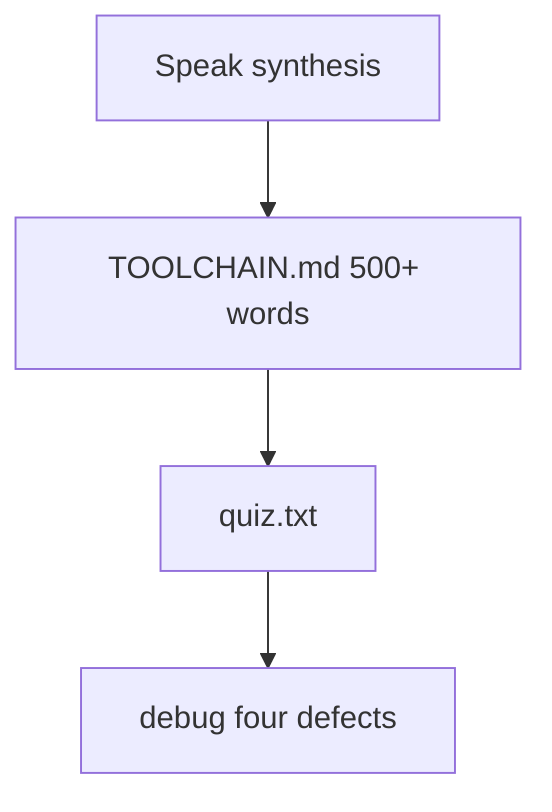
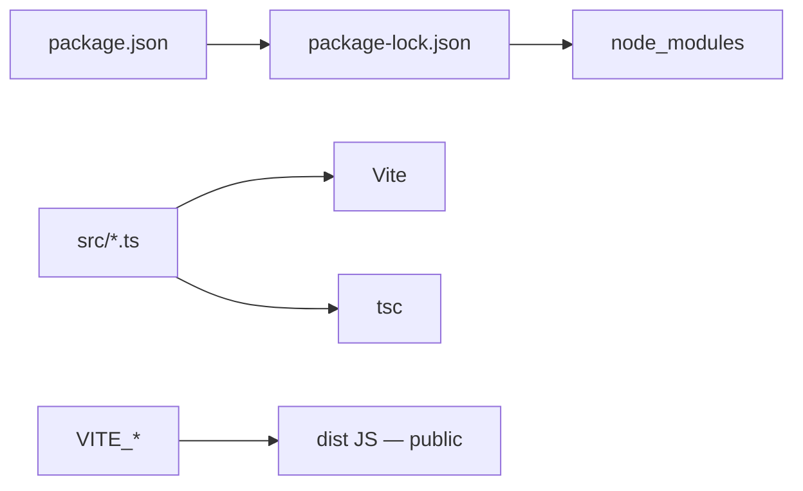

# Month 5 · Week 4 · Day 3
# From Memory: Toolchain

**Program:** Full-Stack Mastery · 18 months  
**Phase:** 1 — Foundations  
**Month index:** [../../README.md](../../README.md)  
**Week 4:** [1](day-01.md) · [2](day-02.md) · Day 3 (today) · [4](day-04.md) · [5](day-05.md) · [6](day-06.md) · [7](day-07.md)  
**Week rhythm today:** Implement from memory  
**Study time:** 3–4 focused hours  
**Machine today:** Windows PowerShell, Node.js 20+  
**Days 1–2 closed.** Repair from this recap.

---

## How to read this chapter

This is a **closed-book teaching day**. The synthesis **is** the lesson. You will write `TOOLCHAIN.md` without Day 1–2 open, then a three-question quiz. Tomorrow you start **your** Project 3 conversion — this file will not contain that app.



Allowed: this file, notes, a terminal to **check** a fact you already wrote. Not allowed: pasting Day 2’s eslint config as the essay, Vite guide as teacher, AI writing TOOLCHAIN.md.

Stuck 25 minutes: open Day 1 or Day 2 in this book **only**. Record in `LOOKUPS.txt`.

---

## Complete explanation (npm + Vite + lint)

**npm** installs packages and runs scripts. It is not `tsc` and not Vite. **npx** runs a local binary (`npx tsc`). Prefer project installs over global `tsc` on PATH. **Windows:** run npm **in the project folder**. Extra `--` on `npm create vite@latest name -- --template vanilla-ts` so npm does not swallow `--template`.

**`package.json`** is the manifest: `name`, `private: true` (do not publish labs), `version` (your app; `0.0.1` is fine), `type: "module"` (ESM `import`), `scripts`, `dependencies` vs `devDependencies`. Dependencies: libraries the **running product** imports (bundled or Node). DevDependencies: compiler, test runner, linter, **Vite**. The browser does not download `devDependencies`; Vite bundles what `src` imports into `dist/`.

**Semver** MAJOR.MINOR.PATCH. MAJOR = breaking (publisher’s promise). MINOR = features. PATCH = fixes. Range `^5.6.2` means `>=5.6.2 <6.0.0`. `~` stays within the minor. `*` is forbidden. The promise can lie. **`^` refuses the next major** — it does **not** freeze the exact version.

**Lockfile** `package-lock.json` pins the **exact** tree including nested packages and integrity hashes. **Commit it.** Gitignore `node_modules`. `npm install` may update the lock if ranges allow. **`npm ci`** installs exactly from the lock and **fails** if `package.json` and lock disagree — that is what CI should use. Hand-edit neither lock nor `node_modules`. Do not mix yarn/pnpm lockfiles in the same app.

**Scripts** are aliases. `npm run typecheck` runs the string with `node_modules/.bin` on PATH. Keep `dev`, `build`, `typecheck`, `lint`, `test`, `format:check`. `vite build` is **not** a substitute for `tsc`. Vite may emit JS from a file that still has type errors depending on config. **`tsc` is the typecheck gate.**

**Vite:** `index.html` is the entry (`script type="module" src="/src/main.ts"`). `npm run dev` is HTTP + HMR — not `file://`. `npm run build` → `dist/` (JS + CSS, not your `.ts`). `preview` serves `dist/`. `public/` files are copied as-is. Turn **`strict` true** if the template loosened it. Delete the demo counter before Project 3.

**`VITE_` env is public.** `import.meta.env.VITE_*` is **inlined into the client bundle**. Search `dist` for the string — it is there. Never API secrets, private keys, passwords. Public catalog **URLs** are fine. `.env` often gitignored; `.env.example` lists **names**; commit the example. Restart dev server after env changes. `import.meta.env.MODE` / `PROD` / `DEV` are mode flags, not secrets. A name without the `VITE_` prefix is not exposed to client code — that is not a vault for secrets either.

**Lint/format:** ESLint + typescript-eslint + Prettier. `eslint-config-prettier` **last** so format rules do not fight. Course rules: `eqeqeq` always, **`@typescript-eslint/no-explicit-any`: error**. `format:check` in CI mindset. Tests: `tsx --test` on pure modules is enough this month.



**Wrong belief:** “I’ll skip `typecheck` because `vite build` succeeded.”  
**Correct:** two different jobs. Build emits. `tsc` proves types. Project 3 requires both.

**Wrong belief:** “`.env` is gitignored so the OMDb key is safe in `VITE_OMDB_KEY`.”  
**Correct:** users download the key with the JS. Billing and abuse follow. No secrets in `VITE_*`.

**Wrong belief:** “`^` pins the exact version I installed.”  
**Correct:** `^` refuses the next **major**. The lockfile pins the exact tree. Classmates without a lock may get a newer 5.x.

Worked story: classmate clones, runs `npm ci`, gets your `typescript` 5.6.3. You had committed the lockfile. Second story: you gitignored the lock; they get 5.9.x; `tsc` messages differ; CI is not your laptop.

Worked env: `VITE_API_BASE=https://openlibrary.org`. `main.ts` reads it. Build. `Select-String` on `dist` finds `openlibrary.org`. Good for a public base URL. The same procedure would leak a secret.

Worked Windows create (write this from memory in the essay):

```powershell
npm create vite@latest vite-lab -- --template vanilla-ts
```

The token between the app name and `--template` is `--`. Without it, npm may consume `--template`.

### Essay in words

`TOOLCHAIN.md` must cover every **bold** term in the recap above in **prose** (500+ words). Not a table dump. Include one paragraph that starts “If I skip the lockfile…” and one that starts “If I put a secret in `VITE_`…”.

`quiz.txt` is closed-book **after** the essay, short answers.

---

## Office hours — missing `--`, global tsc, and essays that never say inlined

**Create command without extra `--`.** Quiz / wrong template on Windows. Write the `--` in the essay as a full sentence, not a footnote.

**`npx tsc` ≠ `npm run typecheck`.** Global surprise. Drop the global. Use the script. Both should be the local binary.

**Quiz answer 1: “because security.”** Failed. Say **inlined into the bundle** / `dist` / DevTools.

**Quiz answer 2: `^` pins exact.** Failed. Caret vs lockfile.

**Quiz answer 3: Vite typechecks.** Failed. `tsc` is the type gate.

**`node_modules` in git status.** Unstage. `.gitignore`. The teach-back fails even if the words are pretty.

**Pasted an explorer app into TOOLCHAIN.md.** This file does not contain Project 3. The essay is toolchain, not a catalog.

---

## Today's contract

**Today's gate.** Closed-book:

> I can explain lockfile vs `^`, why `VITE_*` is public, and why Project 3 runs both `tsc` and `vite build`.

---

## Time box

| Block | Minutes | Work |
|---|---|---|
| 1 | 30 | Speak the synthesis |
| 2 | 70 | TOOLCHAIN.md |
| 3 | 20 | quiz.txt |
| 4 | 30 | Debug writing |
| 5 | 20 | LOOKUPS repair + commit |

---

# Spec

`~\fullstack-lab\month-05\week-04\day-03\`

`TOOLCHAIN.md` (closed-book then repair): 500+ words covering every bold term above. Then `quiz.txt`:

1. Why is `VITE_SECRET_KEY` a mistake?
2. What does `^` refuse?
3. Why both `tsc` and `vite build`?

Full sentences. “Because security” is not an answer to 1 — say **inlined into the bundle**.

```powershell
cd ~\fullstack-lab
git add month-05/week-04/day-03
git commit -m "Day 3: toolchain teach-back from memory."
```

---

# Debug (write the cause, from this recap)

`DEBUG.txt` — full sentences.

**A.** Classmate has a different `tsc` than CI. Lockfile was not in git. What command should CI have used if the lock **had** been committed?

**B.** `npm create vite@latest app --template vanilla-ts` opened a quiz / wrong template on Windows. What token was missing?

**C.** `vite build` green; `tsc` red on `s.items` in an error branch. Which script is the gate for types? Why did Vite not save you?

**D.** `.env` has `VITE_STRIPE_SECRET=sk_live_...`. Gitignored. Still a defect. Why?

Stretch **E.** `dependencies` contains `eslint`. What signal did you send? Where should it live?

**F.** `npm install` in `C:\Users\Universe` instead of the project folder. Where did `node_modules` go? Why does `npx tsc` in the project then use a surprise version or fail?

**G.** Two lockfiles (`package-lock.json` and `pnpm-lock.yaml`). What did you mix? Pick npm for this course and delete the other lock after installing with one tool.

---

# Worked answers you must still write yourself

The quiz is not a crossword. Full-sentence **targets** (paraphrase, do not memorize):

1. `VITE_SECRET_KEY` is copied into client JavaScript at build time. Anyone can open DevTools or `dist/` and read it. Gitignore does not hide it from users. Public catalog **URLs** are the allowed `VITE_` use. Secrets wait for a server.
2. `^1.2.3` allows `>=1.2.3 <2.0.0`. It **refuses** the next major (`2.0.0`). It does **not** pin `1.2.3` exactly — that is the lockfile’s job.
3. `tsc` checks types (`--noEmit` or `-b`). `vite build` emits JS/CSS for hosting. Vite can transpile a file that still has a type error. Project 3 requires both scripts. A green `dist/` with a dishonest `any` is a failed month.

**Essay structure that still counts as yours:**

- Paragraph: npm vs npx vs node vs tsc vs Vite  
- Paragraph: package.json fields including the two dependency buckets  
- Paragraph: semver + caret + why publishers can lie  
- Paragraph: lockfile + `npm ci` + gitignore `node_modules`  
- Paragraph: scripts as the contract (`typecheck` especially)  
- Paragraph: Vite entry HTML, dev vs build vs preview, Windows `--`  
- Paragraph: `VITE_` inlined; `.env.example`; restart dev server  
- Paragraph: ESLint + Prettier + no-explicit-any + eqeqeq  

If any paragraph is two bullet words, expand it. 500 words is a floor, not a ceiling.

**`devDependencies` sentence to include:** Vite and `tsc` are not shipped as `<script src>` tags from `node_modules` to the user. They produce `dist/`. React next month is a `dependency` because the **bundled app** contains it. That distinction is the whole bucket question.

**npx vs npm run:** `npx tsc` and `npm run typecheck` should be the **same local binary** if the script is `tsc --noEmit`. If they differ, you have a global `tsc` surprise — drop the global from the story and use the script.

Write `LOOKUPS.txt` even if it says `none`. That file is evidence you stayed closed-book.

---

## Worked walkthrough — quiz sentences you must still paraphrase

1. `VITE_SECRET_KEY` is copied into client JS at build. DevTools and `dist/` show it. Gitignore hides it from GitHub, not from users. Public catalog **URLs** are allowed `VITE_` use.  
2. `^1.2.3` is `>=1.2.3 <2.0.0`. It refuses `2.0.0`. It does not pin `1.2.3`. The lockfile pins.  
3. `tsc` typechecks. `vite build` emits. Vite can transpile a file that still has a type error. Project 3 requires both.

**DEBUG B.** Missing `--` on Windows create: `npm create vite@latest app -- --template vanilla-ts`. npm swallowed `--template` without the extra `--`.

**DEBUG D.** `VITE_STRIPE_SECRET` in gitignored `.env` is still inlined. Users download it. Secrets wait for a server.

**Sketch.** package.json → lockfile → node_modules. src → tsc. src → Vite → dist. Label `VITE_` jumping into dist.

Windows PowerShell. Node.js 20+. Do not start Project 3 today. Optional `curl.exe -I` against a **Day 2** Vite lab only if it is already running — not a reason to scaffold a catalog app.

---

## Definition of done

- [ ] TOOLCHAIN.md ≥ 500 words, prose
- [ ] quiz.txt three answers in full sentences
- [ ] DEBUG A–D
- [ ] No secrets in any committed `.env`

**Closed-book sketch (in `SKETCH.md`):** draw package.json → lockfile → node_modules, and src → tsc plus src → Vite → dist. Label where `VITE_` jumps into dist. If you cannot draw it, the essay is still a list of terms you do not own — redraw, then add a paragraph.

**Repair rule:** after LOOKUPS, do not paste Day 2’s entire eslint.config into TOOLCHAIN.md. The essay explains **why** `no-explicit-any` is a course rule, not how to import `typescript-eslint`.

**Quiz self-mark:** if answer 1 never says “bundle” or “dist” or “inlined” or “DevTools,” it failed. If answer 2 says `^` pins the exact version, it failed. If answer 3 says Vite typechecks for you, it failed.

**Terms you must use correctly at least once in the essay:** npm, npx, package.json, semver, caret, lockfile, npm ci, node_modules, scripts, Vite, index.html, dist, VITE_, inlined, ESLint, Prettier, tsc, any. Missing three or more means you wrote a vibe piece — add the missing terms in sentences, not as a comma list.

**Time-box honesty:** if TOOLCHAIN.md took 15 minutes, it is too short. Read it aloud. If you cannot explain `npm ci` vs `npm install` without peeking, rewrite that paragraph.

---

# Worked hour

0–10: speak the recap; sketch the two diagrams.  
10–40: draft TOOLCHAIN.md from the sketch, no day files.  
40–50: quiz.txt.  
50–70: DEBUG A–D (and F–G if you have time).  
70–90: LOOKUPS repair; count bold terms; add missing paragraphs.

If the essay never mentions **Windows** `--`, add that sentence. This program’s machines are PowerShell-first. `npm create vite@latest app -- --template vanilla-ts` is a Month 5 fact, not trivia.

**Peer check:** hand quiz.txt to a classmate (or read it the next morning). If they cannot tell `^` from a lockfile pin, rewrite question 2’s answer.

Optional: after a local Vite lab from Day 2, `curl.exe -I http://127.0.0.1:5173` while `npm run dev` is up — HTTP, not `file://`. Do not start Project 3 today.

---

## Stalls and repair — missing `--`, global tsc, quiz that says “security”

If Windows create opened a quiz, you omitted the extra `--`. Essay must contain `npm create vite@latest name -- --template vanilla-ts` as a sentence, not a footnote. Node.js 20+.

If `npx tsc` ≠ `npm run typecheck`, a global `tsc` surprised you. Drop the global. Scripts alias local binaries.

If quiz 1 never says bundle / dist / inlined / DevTools, it failed. Gitignore does not hide `VITE_` from users. If quiz 2 says `^` pins exact, it failed — that is the lockfile. If quiz 3 says Vite typechecks, it failed — `tsc` is the type gate.

If `TOOLCHAIN.md` took 15 minutes, it is too short. 500+ words. Bold terms in sentences. “If I skip the lockfile…” and “If I put a secret in `VITE_`…” paragraphs. `npm ci` vs `npm install`. `node_modules` gitignored. No secrets in committed `.env`.

If you pasted an explorer app into the essay, delete it. This file does not contain Project 3. Sketch: pkg → lock → node_modules; src → tsc; src → Vite → dist; `VITE_` into dist.

Optional: `curl.exe -I` against a **Day 2** Vite lab already running — HTTP, not `file://`. Do not scaffold Project 3 today.

---

## Last forty minutes

`TOOLCHAIN.md` is 500+ words with `npm ci` vs `npm install`, lockfile, `node_modules` gitignored, `VITE_` inlining, and `tsc` as the type gate. Quiz three answers are full sentences, not slogans. DEBUG A–G each have a cause, not a guess. Windows extra `--` is written if you mention scaffolding.

No explorer app. No Project 3 repo started today. Sketch the toolchain on paper: package → lock → `node_modules`; `src` → `tsc`; `src` → Vite → `dist`. Commit `month-05/week-04/day-03`.

If quiz 2 still says `^` pins exact versions, rewrite it. The lockfile pins. The range in `package.json` is a policy, not a snapshot.

---

## Worked checkpoint — four jobs, one Windows `--`

Name four jobs in `TOOLCHAIN.md` without merging them: **npm** installs and runs scripts; **`tsc`** typechecks; **Vite** bundles and serves HTTP; **the lockfile** pins the exact tree. `vite build` can emit while types are still wrong depending on config. `npm ci` fails if `package.json` and lock disagree — that is what CI should use.

`VITE_*` is inlined into `dist`. Search the bundle. Public catalog URLs are fine. API secrets are not. `.env` gitignored does not hide `VITE_OMDB_KEY` from users. `.env.example` lists **names**.

Windows create from memory:

```powershell
npm create vite@latest vite-lab -- --template vanilla-ts
```

The extra `--` is so npm does not swallow `--template`. Global `tsc` on PATH is not the project compiler. Prefer `npx tsc` / `npm run typecheck` in the app folder.

Quiz: (1) bundle / dist / inlined / DevTools — not “gitignore is security.” (2) `^` refuses the next major; the lock pins exact. (3) Vite does not replace `tsc`. DEBUG A–G each have a cause. 500+ words. Bold terms in sentences. “If I skip the lockfile…” and “If I put a secret in `VITE_`…” paragraphs.

> **Wrong belief:** “I’ll skip `typecheck` because `vite build` succeeded.”  
> **Correct:** emit is not proof. Project 3 requires both.

No explorer app. No Project 3 repo started today. Optional `curl.exe -I` only against a **Day 2** Vite lab already running — HTTP, not `file://`. Commit `month-05/week-04/day-03`. Node.js 20+.

If `TOOLCHAIN.md` took 15 minutes, it is too short. Name `npm ci` vs `npm install`, why `node_modules` is gitignored, and why `eslint-config-prettier` is last. `private: true` on labs. `type: "module"`. Vite is a **devDependency**; it still bundles what `src` imports. Do not mix yarn and npm lockfiles.

Quiz answers are full sentences. DEBUG A–G: missing `--` on Windows create; global `tsc`; quiz that says gitignore is security; `^` as a pin; Vite as typecheck; secret in `VITE_`; `npm install` in CI instead of `npm ci`. Each cause in a sentence.

---

## Optional review links

Repair from this recap first.

- [semver spec](https://semver.org/)
- [Vite: Env variables](https://vite.dev/guide/env-and-mode.html)

---

## Tomorrow

Start **Project 3**: new Vite + TS repo, convert **your** Project 2. This textbook will not contain the converted app. Spec: `full_stack_project_requirements_2026/project_03_typescript_application.md`.

Day 4 is a checklist, not a paste of an explorer app. Keep this recap until PLAN.md is written.
