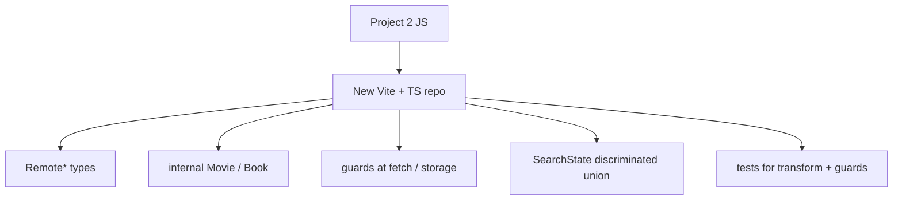

# Month 5 · Week 4 · Day 4
# Start Project 3 (Your Conversion)

**Program:** Full-Stack Mastery · 18 months  
**Phase:** 1 — Foundations  
**Month index:** [../../README.md](../../README.md)  
**Week 4:** [1](day-01.md) · [2](day-02.md) · [3](day-03.md) · Day 4 (today) · [5](day-05.md) · [6](day-06.md) · [7](day-07.md)  
**Week rhythm today:** Real product — start the conversion  
**Student state:** Toolchain literacy from Days 1–3. Week 3 `SearchState`, guards, `unknown`. Project 2 exists and passed Month 3’s product bar.  
**Study time:** 3–4 focused hours

This textbook **does not** contain Project 3 source.

Read `full_stack_project_requirements_2026/project_03_typescript_application.md`.

You convert **your** Project 2. If Project 2 is missing, stop — Month 5’s gate is not a green Vite template.

---

## How to read this chapter

Today is a **checklist plus design**, not a typed-along app. The book teaches *how to start* and *what must be true*. It will not print `api.ts` for your catalog.



**Not a mechanical rename `.js` → `.ts`.** The spec asks you to **fix design**: split API vs UI, model state as a union, kill `any`, document **three** improvements from Project 2.

> **Wrong belief:** “I’ll copy Project 2 into `src/`, add `: any` until `tsc` is quiet, then call it TypeScript.”  
> **Correct:** if `any` is the migration strategy, you did not convert. You hid JavaScript in a `.ts` file.

---

## Today's contract

1. Create a **new** Git repository for the Vite app (not a dump inside `fullstack-lab` as the only copy).
2. Scaffold `vanilla-ts` with the extra `--` on Windows.
3. Write README + `PLAN.md` before a giant paste of old JS.
4. Land **one vertical slice**: submit → loading → guard → `SearchState` → `textContent` list.
5. Scripts exist even if tests are still thin: `dev`, `build`, `typecheck`, `lint`, `test`, `format:check`.

**Today's gate**

> A new repo boots with Vite + TS, `strict` on, lockfile committed, PLAN names remote vs internal vs `SearchState`, and one search path runs without `any`. Collection may wait until Day 6.

---

## Time box

| Block | Minutes | Work |
|---|---|---|
| A | 25 | Read spec + this checklist; PLAN.md outline |
| B | 40 | Scaffold, git, scripts, strict, ignore |
| C | 90 | One vertical slice (types, guard, state, UI) |
| D | 25 | README how to run |
| E | 15 | Notes in lab if any |

---

# Block A — How the month’s types become a product

Keep Project 2’s **product baseline** (from the spec): remote search, results, details, saved collection, filters/sorting, local persistence, error/loading states. You do not have to finish collection **today**. You do have to **plan** it.

**Type what the spec lists:** external API responses, internal models, function inputs/outputs, DOM refs where needed, application state, storage format, `Result` / error structures.

**Demonstrate naturally** (do not force a zoo): inference, explicit function types, `type`/`interface`, unions, literals, optional, generics (`Result<T>`, `SearchState<T>`), narrowing, guards, `unknown`, one utility (`Pick` for a card is enough), discriminated unions.

**`any` rule:** zero unjustified. Prefer `unknown` at uncertain boundaries. If `any` exists, document why.

**Runtime:** types disappear. Validate external data. Small guard where useful — you already wrote this in Week 3.

**Tooling:** Vite, npm scripts, `tsc`, ESLint, formatter, tests. Production build with **no** TypeScript errors.

**Refactoring:** at least **three** Project 2 design problems, documented. Typical honest list: oversized `main.js`, duplication between search and saved render, weak parse, mixed UI/API, `loading`+`error` booleans, `innerHTML` you already fixed — pick three that were **true of your repo**.

**Tests:** keep the *idea* of Project 2 tests; add transform, guards, error-state logic. Pure modules in Node (`tsx --test`) do not need the browser.

---

# Block B — Scaffold checklist (required)

Do these in order. Tick in `PLAN.md` or a Day 4 note.

### 1. Empty folder, new repo

Example path: `~/explorer-ts/` (name yours). **Empty** before Vite.

```powershell
mkdir $HOME\explorer-ts
cd $HOME\explorer-ts
git init
npm create vite@latest . -- --template vanilla-ts
npm install
```

The extra `--` is required so npm passes `--template` to the Vite scaffolder. If the folder is not empty, Vite may refuse — that is good.

### 2. Git hygiene

- Vite’s default `.gitignore` includes `node_modules`, `dist` — keep them ignored.
- **Commit the lockfile.**
- First commit: scaffold only, before your conversion, so you can diff your work.
- Branch optional today (`git switch -c feature/search-slice`). Month 4 habit is welcome.

### 3. TypeScript honesty

- `strict` **true** in the app tsconfig (`tsconfig.app.json` or equivalent).
- No `any` in `src` to “get a green build.”
- `include` covers `src`. Tests: either next to modules or a `src/**/*.test.ts` pattern `tsx` can run.

### 4. Scripts (merge; keep `dev`)

You need **at least**:

| Script | Typical command (adjust to what **you** ran) |
|---|---|
| `dev` | `vite` |
| `build` | `tsc -b && vite build` or documented equivalent |
| `typecheck` | `tsc -b --pretty false` or `tsc --noEmit -p tsconfig.app.json` |
| `lint` | `eslint .` |
| `test` | `tsx --test` (install `tsx` `-D`) |
| `format` / `format:check` | Prettier |

Day 2’s ESLint flat config idea: `eqeqeq`, `no-explicit-any`, Prettier last. If install names differ, read the error; **rules stay**.

### 5. Env

If the catalog has a **public** base URL, `VITE_API_BASE` in `.env.example` (name only) and local `.env` (gitignored). **No keys** in `VITE_*`. README says so.

### 6. README (required today)

Must say: problem, which API, how to run `dev` / `typecheck` / `lint` / `test` / `build`, “Converted from Project 2.” Not a tutorial clone description.

---

# Block C — PLAN.md (required today)

Write `PLAN.md` in the **Project 3** repo before you dump 800 lines of JS. Minimum sections:

1. **Remote vs internal types** — table: API field → app field. Extra API keys **dropped**.
2. **`SearchState<T>`** — four variants; empty list is success; error has `message`.
3. **Module list** — suggested names (yours may differ): `api.ts`, `storage.ts`, `state.ts`, `ui.ts`, `main.ts`, plus `guards.ts` / `types.ts` if you split. One sentence each: what is **not** allowed in that file (e.g. `api.ts` does not touch `document`).
4. **Three Project 2 design problems** you will fix — concrete, from *your* code (“`render()` also fetched”, not “clean code”).
5. **Env** — `VITE_API_BASE` if useful (public URL only).
6. **Slice order** — today: search. Later: details, collection, filters.

You will not be graded on matching those filenames. You will be graded on **boundaries**.

---

# Block D — One vertical slice (required today)

**Move** (retype, redesign) **one** path:

1. Form submit, `preventDefault`, blank query does not fetch (Month 3).
2. Set state to `{ status: "loading" }`.
3. `fetch` with `AbortController` if you already had it — keep the habit.
4. `response.ok`; `const data: unknown = await response.json()`.
5. Guard list + `toMovie` / `toBook` (your domain).
6. `{ status: "success", items }` or `{ status: "error", message }`.
7. Render with **`textContent` / `createElement`**. No `innerHTML` of titles.
8. Empty success copy vs error copy — different strings.

Collection, filters, and localStorage **may wait until Day 6**. Do not stall the slice because the saved list is not typed yet.

**Forbidden:**

- `any` to get a green build
- copying a YouTube “OMDb TypeScript” app
- generating the whole conversion with AI
- pasting Project 2 into `src/` unchanged except extensions
- this textbook does not contain a reference `main.ts` — do not look for one

**Allowed:** open **your** Project 2 as the behavior spec. Retype functions into modules. Improve names. Split files.

If fetch CORS-blocks, same Month 3 rule: switch public API or document origin. Do not leave a red Network tab as “TS homework.”

---

## DOM types (enough for vanilla Vite)

`querySelector` returns `Element | null`. Under `strict` you must narrow:

```ts
const form = document.querySelector("#search-form");
if (!(form instanceof HTMLFormElement)) {
  throw new Error("#search-form missing");
}
```

`instanceof HTMLFormElement` is a runtime constructor check (Day 1). `as HTMLFormElement` is a promise. Prefer `instanceof` or a throw. Input values are `string`. `Number(input.value)` is a runtime conversion — still validate (`Number.isFinite`) if you need a year.

`submit` event: `event.preventDefault()`. Blank trimmed query: do not fetch; stay `idle` or show a form error `p` with `textContent`.

Abort: keep Month 3’s `AbortController`. Type `signal` as what `fetch` accepts — you do not need a custom type. If you abort, do not apply that response to `SearchState` (still loading from the **new** request, or back to the previous success if you modeled it). Default: latest request wins; aborted request ignored.

---

## What “redesign” looks like without a source dump

Project 2 might have had `function render(data) { ... fetch ... localStorage ... }`. Project 3 splits:

| Concern | Lives in | Typed as |
|---|---|---|
| HTTP + JSON | `api.ts` | `unknown` in; `Result<Movie[]>` out |
| Map remote → app | `toMovie` | Remote (after remote guard) → Movie |
| Phase of the search | `state.ts` | `SearchState<Movie>` |
| localStorage | `storage.ts` | `unknown` parse → `Result<Saved[]>` |
| DOM | `ui.ts` / `main.ts` | elements after null checks |

If `api.ts` imports `document`, the split failed. If `ui.ts` calls `JSON.parse` on the network body, the split failed.

**Details view:** a `Movie` with a required `id` is enough to fetch detail later. Do not block today’s slice on a second endpoint. PLAN.md can say “detail: Day 5–6.”

**Filters/sort:** they operate on `Movie[]` or `Saved[]` you **already** have — derived data (Month 6 will name this in React). Today: pure functions `filterByQuery(items, q)`, `sortByTitle(items)` returning **new** arrays. Type the parameters. Test them without the DOM.

---

## Definition of done for Day 4

- [ ] New repo; lockfile committed; `node_modules` ignored
- [ ] `npm run dev` over HTTP
- [ ] `strict` on; `typecheck` script exists
- [ ] README + PLAN.md as specified
- [ ] One search slice: guard + `SearchState` + `textContent`
- [ ] No `any` on the slice
- [ ] Project 3 source is **not** in this textbook (you did not need it)

Continue after Day 7 until the project Definition of Done is true. The exam will not replace a missing conversion.

---

## First commits (suggested, not law)

1. Scaffold + lockfile + `.gitignore`  
2. ESLint/Prettier/`typecheck` scripts (even if src is still the demo)  
3. `types.ts` + `SearchState` + `label` tests (no fetch yet)  
4. `api.ts` guard + one slice wired in `main.ts`  
5. Delete Vite demo counter/logo  

Small commits make Day 5 `DEBUG.md` easier — you can see when `any` appeared. Do not squash away the evidence.

**If Project 2 used a different API than you want now:** you may switch public APIs **if** you still convert *your* product (search, details, saved, filters). A brand-new unrelated todo app is not Project 3.

**If you are tempted to generate the app:** ask the tool to review **one** `tsc` error you already have. Generating `src/` wholesale is the forbidden path in Day 4’s list.

**README run section (copy the idea, type your paths):**

```text
npm ci
npm run dev          # http://localhost:5173
npm run typecheck
npm run lint
npm test
npm run build
```

`npm ci` assumes a lockfile. Document Node LTS. Do not tell the reader to `npm install -g typescript`.

**Details endpoint (plan only today):** if Project 2 opened a detail pane, PLAN.md names the function `fetchDetail(id: string): Promise<Result<Movie>>` (or equivalent) and the same `unknown` rule. You may stub the pane with “pick a result” and `textContent` of fields you already have from search, then replace with a second request later. Do not block the slice on two APIs if one list already proves the guard.

**Saved collection (plan only today):** `storage.ts` signatures in PLAN even if bodies wait for Day 6. That stops you from stuffing `localStorage` into `main.ts` “for a minute.”

**Blank query:** still no fetch. Types do not replace Month 3 product rules.

---

```powershell
# notes only in lab, if any
cd ~\fullstack-lab
git add month-05/week-04
git commit -m "Notes for Project 3 start (app lives in its own repo)."
```

Product commits stay in **the Project 3 repository**.

---

## Optional review links

The spec is the product contract. Week 3 days in this book are the type contract. Vite is Day 2.

- Project spec: `full_stack_project_requirements_2026/project_03_typescript_application.md`
- [Week 3 Day 4 — SearchState](../week-03/day-04.md)
- [Week 4 Day 2 — Vite / env](day-02.md)

---

## Tomorrow

Quality scripts must **exist and pass** (or fail for a reason you are fixing): `typecheck`, `lint`, `test`, `build`. One real `tsc` error documented in `DEBUG.md`.

**Day 4 is a start, not the month.** If the slice works and PLAN.md is honest, you passed the day. Collection, details, and three refactors continue through Day 6 and the exam. Do not stay here polishing CSS while `as Movie` is still in `api.ts`.

