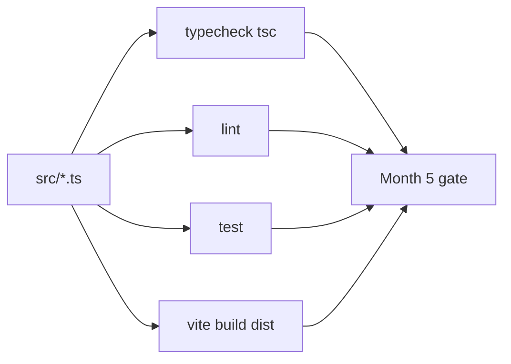

# Month 5 · Week 4 · Day 5
# Quality Scripts on Project 3

**Program:** Full-Stack Mastery · 18 months  
**Phase:** 1 — Foundations  
**Month index:** [../../README.md](../../README.md)  
**Week 4:** [1](day-01.md) · [2](day-02.md) · [3](day-03.md) · [4](day-04.md) · Day 5 (today) · [6](day-06.md) · [7](day-07.md)  
**Week rhythm today:** Exercises + debugging on **your** app  
**Student state:** Day 4 scaffold + one search slice. Today the spec’s scripts become a **gate**, not a wish.  
**Study time:** 3–4 focused hours

This textbook still **does not** contain Project 3 source. Work in **your** Project 3 repo.

---

## How to read this chapter

Scripts are claims. `npm run typecheck` claims the compiler agrees with you. `lint` claims you did not sneak `any` and `==`. `test` claims guards and empty-success logic. `build` claims `dist/` exists. A README that lists scripts you never ran is a fiction.



> **Wrong belief:** “I’ll fix lint after the UI looks good.”  
> **Correct:** `no-explicit-any` is easiest **before** `any` spreads. Run lint on the slice you already have.

---

## Today's contract

1. All four scripts **exist**. Each either **passes** or fails for a reason written in `DEBUG.md` that you are fixing **today**.
2. Record at least one **real** `tsc` error you understood (quote, two types that clashed).
3. No `innerHTML` of API titles. No secrets in committed `.env`.
4. Deliberate `any` must make `lint` (or `tsc`) fail; then restore.
5. At least one guard test and one empty-success / error-state test **run**.

**Today's gate**

> `typecheck`, `lint`, `test`, and `build` are real commands on Project 3. A quoted `tsc` error in `DEBUG.md` proves you read the compiler in English. Unjustified `any` cannot hide.

---

## Time box

| Block | Minutes | Work |
|---|---|---|
| A | 30 | Theory — what each script proves |
| B | 80 | Make scripts pass; DEBUG.md |
| C | 40 | Deliberate `any` / `innerHTML` / secret checks |
| D | 20 | Commit in Project 3 repo |
| E | 10 | Recall |

---

# Block A — What we are testing

The spec’s scripts must **exist and pass** (or fail for a reason you are fixing today):

| Script | Proves | Typical failure |
|---|---|---|
| `typecheck` | No TS errors; no `any` needed | Union not narrowed; missing field; `strictNullChecks` |
| `lint` | `eqeqeq`, no explicit any | `==`, `any`, unused vars depending on config |
| `test` | transform + guard + error-state | Happy-path only; parse throws; empty treated as error |
| `build` | `dist/` produced | `tsc -b` in the `build` script failed first; or Vite error |

Run from the **project root**. On Windows PowerShell:

```powershell
cd $HOME\explorer-ts
npm run typecheck
npm run lint
npm test
npm run build
```

Use **your** path. If `build` already runs `tsc -b && vite build`, a type error fails build **and** typecheck — good. Still keep a dedicated `typecheck` so CI can skip bundling.

**`DEBUG.md` in the Project 3 repo:** at least one real `tsc` error you understood. Structure:

1. Command you ran  
2. Quote (the compiler’s words)  
3. The **two types** that clashed, in your words  
4. The fix (narrow, change the model, or correct the value — not `as any`)

If typecheck is already green, **temporarily** break it: read `items` on `{ status: "error" }`, quote the error, restore. That is still a real error. Prefer an error you hit while converting.

---

## 1. Typecheck as English

`tsc` names types. “Type `X` is not assignable to type `Y`” means you promised `Y` and produced `X`. Common Project 3 clashes:

| Symptom | Likely clash |
|---|---|
| `Property 'items' does not exist` | You are in `error` or `loading`; union worked |
| `Object is possibly 'undefined'` | Optional field / `querySelector` |
| `'string' is not assignable to ... '"want" \| ...'` | Status not narrowed; API sent a string |
| `Type 'unknown' is not assignable` | You used JSON before a guard — **good**, now guard |

Do not “fix” these with `as Movie` or `any`. That is the Week 3 lie.

---

## 2. Lint as policy

`@typescript-eslint/no-explicit-any`: **error**. A single `fetchJson(): any` infects callers. `eqeqeq`: `===` unless you **documented** `== null` for nullish once.

If ESLint does not see TypeScript files, your `eslint.config.js` is not wired — Day 2. Fix today, not at the exam.

`ignores`: `dist/**`, `node_modules/**`. Do not lint build output.

---

## 3. Tests that match the spec

Minimum honest set (names yours):

| Kind | Example claim |
|---|---|
| Transform | Remote-shaped object → internal fields; extra keys dropped |
| Guard | Missing title / bad JSON / not array → not ok |
| Error-state | `label({ status: "success", items: [] })` ≠ error copy |

Put tests in files `tsx --test` can import **without** `document`. If a test needs the DOM, you are testing UI glue too early — extract the function.

Break a guard test on purpose: change the assertion, show red, restore. Note the command output in `DEBUG.md` or `TEST-BREAK.md`. The exam will ask you to do this again.

---

## 4. Build and `dist/`

After `npm run build`, `dist/` exists and contains JS. You do not commit `dist/` (gitignore). You **do** prove locally that build works. Hosting can wait; Month 2 Pages habit still applies if you want HTTPS later — not required to *start* Month 6, but the **script** must pass.

If `build` uses `tsc -b && vite build` and `tsc -b` needs `tsconfig` project references, match the template. Document the command you actually use in README.

---

## 5. Security checks (same as Months 2–3, now in TS)

No `innerHTML` of API titles — `textContent` / `createElement`. Search:

```powershell
Select-String -Path src\*.ts -Pattern "innerHTML"
```

Hits must be justified (none is the default).

No secrets in `.env` committed. `git status` should not show `.env` if it contains machine-local values. `.env.example` has names like `VITE_API_BASE=` with empty or public placeholder URL.

---

# Block B — Lab on your repo

1. Install any missing devDependencies (`eslint`, `typescript-eslint`, `prettier`, `tsx`).
2. Make the four scripts pass or log the failing command and fix it today.
3. Write `DEBUG.md` (quoted `tsc`).
4. Deliberate `any` on a remote type — `lint` or `tsc` should fail if you configured `no-explicit-any`. Restore.
5. Confirm `strict` still true.

```powershell
# commits in Project 3 repo
git add package.json package-lock.json eslint.config.js src DEBUG.md README.md
git commit -m "Week 4 Day 5: typecheck lint test build scripts honest."
```

Do not commit `node_modules`. Do not commit `.env` with secrets.

---

# Block C — Independent checks

`QUALITY.md` in Project 3 (short):

- Output of each of the four scripts (pass/fail)
- Whether `Select-String innerHTML` was clean
- Whether `VITE_` vars are only public URLs / titles
- One sentence: what `tsc` taught you today

If the search slice still uses `as Movie[]`, **fix it today**. That is not a Day 6 feature; it is a Week 3 defect on a Week 4 app.

---

## 6. Reading one ugly `tsc` error (practice)

A real message looks like:

```text
src/state.ts:42:14 - error TS2339: Property 'items' does not exist on type '{ status: "error"; message: string; }'.
```

English: you treated an **error** variant as if it had `items`. The two types are `SearchState`’s error member vs success member. Fix: `switch` / `if (s.status === "success")`, not `as any`.

Another:

```text
error TS2345: Argument of type 'unknown' is not assignable to parameter of type 'Movie'.
```

English: you still have `unknown` (JSON) and a function that wants `Movie`. Fix: guard, then pass. Not `as Movie`.

Write **your** quote in `DEBUG.md`. Inventing a fake error is a failed Day 5.

---

## 7. Format and CI mindset

`format:check` should fail if you mixed quotes wildly. Run `format` locally; commit the result. CI (when you have it) runs `format:check`, `lint`, `typecheck`, `test`, `build` — same order is a good README script list.

`npm ci` on a clean clone is the install CI would use. If you never ran it, run it once today after committing the lockfile:

```powershell
Remove-Item -Recurse -Force node_modules
npm ci
npm run typecheck
```

If `npm ci` fails, package.json and the lock disagree — `npm install` to repair, commit **both**, do not hand-edit the lock.

---

## Definition of done

- [ ] Four scripts exist; you ran them
- [ ] `DEBUG.md` quotes a real `tsc` message and names two types
- [ ] Deliberate `any` failed lint; restored
- [ ] Guard + empty-success tests exist
- [ ] No `innerHTML` of titles; no committed secrets
- [ ] Lockfile updated if you installed packages

**Prettier vs ESLint:** if both want to fight about semicolons, `eslint-config-prettier` must be last in the flat config. A `lint` script that fails on formatting that `format` then changes is a config bug, not a type bug. Fix the config today.

**`tsx --test` and Vite:** tests import `.ts` modules that must not touch `document` at load time. If `ui.ts` runs `querySelector` at the top level, tests will throw in Node. Move DOM work into functions called from `main.ts`. That is a quality script issue **and** a module-boundary issue.

**Build output check:** after `npm run build`, `dist/index.html` should reference hashed JS, not `/src/main.ts`. If it still points at source, you opened the wrong folder or the build failed silently. Open `dist` with `npm run preview` once so you know production ≠ `npm run dev`.

---

## Script cheat-sheet (your repo, typed by you)

After today, README should make this table true:

| Command | You observed |
|---|---|
| `npm run typecheck` | exit 0 / or quoted error you fixed |
| `npm run lint` | exit 0; `any` file was red then restored |
| `npm test` | G1-style guard + empty success |
| `npm run build` | `dist/` exists; preview works |
| `npm run format:check` | optional but recommended |

If `lint` cannot parse TypeScript, you are still on a JS-only ESLint from Month 4 — add typescript-eslint as Day 2. If `test` opens a browser, you wired the wrong runner; `tsx --test` is Node.

**Do not** disable `no-explicit-any` to go green. That is failing the month in config form.

If `build` fails only on unused files the template left behind, delete the demo counter — do not `@ts-nocheck` the project. If `test` cannot resolve `.js` vs `.ts` extensions, use the import style from Week 1 `IMPORTS.txt` and document it in README.

`QUALITY.md` timestamps: note when you ran the four scripts. The exam will ask you to run them again; today is the dress rehearsal.

---

# If a script is still red at minute 90

Pick **one** red script. Write the command, the first error line, and the two types or the missing binary. Fix that one. Do not “fix” four scripts by deleting them from `package.json`. A missing `test` script is a failed spec item, not a time-saver.

Common missing binary: `tsx` not installed → `npm install -D tsx`. Common missing config: no `eslint.config.js` → type Day 2’s idea, do not disable lint. Common typecheck: `strict` false in the template → turn it on, then fix nulls.

You are allowed to leave **collection** tests for Day 6. You are not allowed to leave `typecheck` broken.

**`npm run lint` on Windows:** run from the project root, not from `src/`. Flat config `ignores` must include `dist/**` or you will lint minified JS and drown in noise.

**Secrets grep:** `Select-String -Path .env,.env.* -Pattern "SECRET|KEY|TOKEN"` — hits belong in a server later, not in `VITE_`. Public `VITE_API_BASE=https://` URLs may remain.

**`eqeqeq`:** a leftover `==` from Project 2 JS is a lint fail. Change to `===`, or one documented `== null` for nullish. Do not turn the rule off.

**README scripts section:** if the README lists `test` but `package.json` has no `test`, you documented a wish. Align them today.

Commit in the **Project 3** repo when the four scripts are honest. Lab notes are optional. The exam will not invent scripts you never ran.

---

## Optional review links

Scripts and env publicity are explained in Days 1–2. The spec lists Definition of Done.

- [Week 4 Day 2](day-02.md)
- [typescript-eslint `no-explicit-any`](https://typescript-eslint.io/rules/no-explicit-any/)

---

## Tomorrow

Independent: typed `parseEnv` lab **if** Project 3 is blocked; otherwise collection + `localStorage` with `unknown` parse, filters/sort typed, `REFACTOR.md` with three design fixes. Feature branch `feature/collection` if you want the Month 4 PR habit.

The four scripts stay required through the exam. Do not delete `test` to go green.
