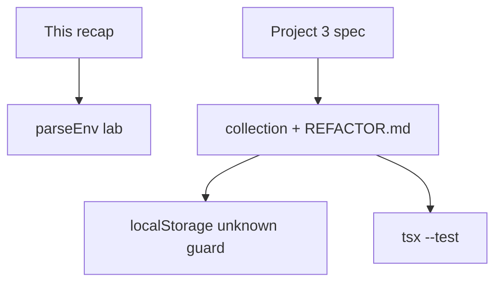
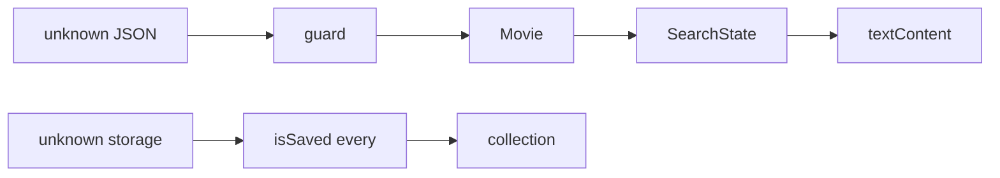

# Month 5 · Week 4 · Day 6
# Independent: Finish the Conversion Slice

**Program:** Full-Stack Mastery · 18 months  
**Phase:** 1 — Foundations  
**Month index:** [../../README.md](../../README.md)  
**Week 4:** [1](day-01.md) · [2](day-02.md) · [3](day-03.md) · [4](day-04.md) · [5](day-05.md) · Day 6 (today) · [7](day-07.md)  
**Week rhythm today:** Independent + Project 3  
**Study time:** 3–4 focused hours  
**Machine today:** Windows PowerShell, Node.js 20+, Git  
**Lab textbook days 1–5:** closed for Challenge 1. **Project 3 spec allowed** for Challenge 2. Repair toolchain facts from **this recap**.

This textbook still does **not** contain Project 3 source. You convert **your** Project 2.

---

## How to read this chapter

Two challenges. Challenge 1 proves you can guard **env-shaped** unknown data without the Vite folder open. Challenge 2 is the product: saved collection + storage parse + three documented design fixes.



If Project 3 is blocked (no Project 2, CORS unsolved), Challenge 1 is **not** optional — it is the proof you still own `unknown`. Then unstick Project 3 before you claim the month.

Do not paste a complete TypeScript catalog app from anywhere — including this book (it is not here).

---

## Complete explanation (toolchain + conversion)

**npm + lockfile + semver.** Manifest ranges (`^` refuses the next major). Lockfile pins the exact tree; commit it; `npm ci` in CI. `node_modules` ignored. Scripts alias local binaries. `dependencies` vs `devDependencies`: run-the-product vs build/test (Vite is dev; it still bundles `src` imports).

**Vite dev/build.** `index.html` entry. `npm run dev` is HTTP + HMR. `build` → `dist/` JS, not `.ts`. Extra `--` on Windows: `npm create vite@latest . -- --template vanilla-ts`. `strict` on.

**Public `VITE_` only.** Inlined into the client bundle. Search `dist` for the string. No secrets. `.env.example` names; `.env` gitignored. `import.meta.env.MODE` / `PROD` / `DEV` are mode flags.

**`tsc` + eslint + tests.** `typecheck` is the type gate (`tsc -b` or `tsc --noEmit`). `vite build` is emit. ESLint: `eqeqeq`, `no-explicit-any`, Prettier last. Tests: transform, guards, error-state. Empty success ≠ error.

**Remote → guard → internal type.** `const data: unknown = await response.json()`. Predicate checks fields. `toItem` drops extra API keys. `as Movie` is a lie.

**`SearchState` union.** `idle | loading | success | error`. Replace whole objects. `never` default on `switch`.

**Generics you can explain:** `Result<T>`, `SearchState<T>`, maybe `first<T>`. Not a type puzzle.

**Zero unjustified `any`.** Types erase; guards run. `textContent` for titles. Storage parse: `try/catch`, `Array.isArray`, status literals — Week 3 Day 3 `parseSavedList` pattern.

**Collection (Challenge 2):** immutable helpers (`add` / `remove` / `setStatus` / `filter` / `sort`) **typed**. `Saved` with `"want" | "doing" | "done"`. Do not mutate `sort` in place on state. `add` by id — no duplicates. Search results array ≠ collection array (references). Persist collection, not necessarily last search. Parse garbage → `[]` or `Result` error — **no white screen**.

**Git:** `git switch -c feature/collection` (or `checkout -b`) in the **Project 3** repo. Month 4 habit. Do not `--force`.

**Three design fixes** in `REFACTOR.md`: oversized functions, duplication, weak errors, mixed UI/API, ambiguous shapes — pick three that were true of **your** Project 2, and say how TS + modules made them harder to repeat.



**Wrong belief:** “I’ll `JSON.parse` localStorage as `Saved[]` because I wrote it.”  
**Correct:** last month’s bug, another tab, or a typo can store `NOT JSON`. Guard.

**Wrong belief:** “Env parse is Vite’s job so I won’t test it.”  
**Correct:** Vite inlines strings; **your** code still decides what to do if `VITE_API_BASE` is missing. `parseEnv` today models that as `unknown` fields.

**Wrong belief:** “I’ll paste a TypeScript OMDb starter and call it Project 3.”  
**Correct:** Project 3 is **your** Project 2, converted. This textbook never contained that app.

Worked collection: result id `OL1`, title Dune, Save copies `{ id, title, status: "want" }` into collection, `saveCollection` stringifies `{ version: 1, items }`, reload, `parseCollection` unknown → Saved[]. Search `items` unchanged.

Worked env: fake object `{ VITE_API_BASE: "https://example.com" }` → `ok` string. Missing or non-string → `{ ok: false, error }`. Tests do not need Vite.

### Challenge 1 details

Folder `~\fullstack-lab\month-05\week-04\independent\`. Node TS like Weeks 1–3 (`strict`, `tsx --test`). `parseEnv.ts`: input type `{ VITE_API_BASE?: unknown }` or `Record<string, unknown>`. Return `Result<string>` (Week 2). Reject empty string after trim. Tests: happy URL, missing key, number value, empty string. No `any`. This is **not** Project 3 source.

### Challenge 2 details

In the **Project 3** repo: saved collection + localStorage **with** `unknown` parse guard. Filter/sort typed. Three design fixes in `REFACTOR.md`. Feature branch `feature/collection` if you want Month 4 PR habit.

UI: Save on a result (delegation + `data-id`); saved list status control and remove; filter; persist on change; refresh keeps **collection**. `textContent`. Tests in the app repo: duplicate add, garbage JSON parse, empty success still true for **search**.

If collection already landed on `main` on Day 4, still put today’s parse-guard hardening and `REFACTOR.md` on a branch.

Serve Project 3 with `npm run dev` (HTTP). Optional: `curl.exe -I http://127.0.0.1:5173` while the dev server is up. Do not `file://`.

---

## Office hours — parseEnv that reads process.env, white-screen storage, and REFACTOR slogans

**`parseEnv` reads `process.env` only.** The lab is a fake object with `unknown` fields. Vite already inlined strings in the real app. Missing / empty / number → `{ ok: false }`.

**`JSON.parse` storage without catch.** `NOT JSON` white-screens. Week 3 Day 3 pattern. Tests in the **app** repo.

**`REFACTOR.md` is three slogans.** “I used types.” Name a file/function in **your** Project 2. What went wrong. What Project 3 forbids now.

**Copied a gist collection module.** Write the signatures from this recap. Tests: duplicate add, sort does not mutate.

**Four scripts not run.** `typecheck` / `lint` / `test` / `build` still in play. `vite build` is not `tsc`.

**Exam mini-app confused with this collection.** Tomorrow’s exam is **not** this repo. Do not copy Project 3 into `month-05-exam`.

---

## Today's contract

**Today's gate**

> `parseEnv` tests green in the lab **or** you already had equivalent env handling tested. Project 3 collection parses storage as `unknown`. `REFACTOR.md` names three real Project 2 problems. Four scripts still run.

---

## Time box

| Block | Minutes | Work |
|---|---|---|
| 1 | 20 | Speak recap |
| 2 | 50 | Challenge 1 `parseEnv` |
| 3 | 90 | Challenge 2 collection + REFACTOR |
| 4 | 20 | Scripts re-run + commit |

---

# Challenge 1 — Lab (if Project 3 is blocked, still do this)

Typed `parseEnv.ts`: read a fake object `{ VITE_API_BASE?: unknown }` and return `Result<string>`. Tests.

```powershell
mkdir ~\fullstack-lab\month-05\week-04\independent
cd ~\fullstack-lab\month-05\week-04\independent
```

`npm init -y`; `private`; `type: module`; `typescript` + `tsx` `-D`; `typecheck` + `test` scripts. Node.js 20+.

`parseEnv` treats the object as **unknown-shaped config**, not as Vite magic. Vite already inlined strings in the real app; this lab is the same guard idea: missing, empty, or non-string → `{ ok: false }`. Happy path: a URL string you would allow as `VITE_API_BASE`. Do not accept `"javascript:alert(1)"` if you want a stretch — `startsWith("https://")` is enough for the lab.

---

# Challenge 2 — Project 3

Saved collection + localStorage **with** `unknown` parse guard. Filter/sort typed. Three design fixes documented in `REFACTOR.md`. Feature branch `feature/collection` if you want Month 4 PR habit.

## Collection types (write these; do not import a gist)

```ts
type Status = "want" | "doing" | "done";
type Saved = { id: string; title: string; status: Status };
type CollectionFile = { version: 1; items: Saved[] };
```

`parseCollection(raw: unknown): Result<Saved[]>` (or `Result<CollectionFile>`). Check `version === 1`, `Array.isArray(items)`, `every(isSaved)`. Unknown version → error or empty — document. Do not `as CollectionFile`.

Helpers (signatures you must type):

```ts
function addItem(items: Saved[], item: Saved): Saved[];
function removeItem(items: Saved[], id: string): Saved[];
function setStatus(items: Saved[], id: string, status: Status): Saved[];
function filterByStatus(items: Saved[], status: Status | "all"): Saved[];
function sortByTitle(items: Saved[]): Saved[];
```

`addItem` returns the same array **contents** if id exists (or the old array). Tests: duplicate add length unchanged; `sortByTitle` does not mutate the input (assert a copy / original order preserved).

`saveCollection` uses `JSON.stringify`. `loadCollection` uses getItem → null → `[]`; string → parse.

**Filters on search results** stay on `Movie[]` (or Book[]). Do not store filter UI in `localStorage` unless you want another parse. Default: persist collection only.

## REFACTOR.md shape

For each of three problems:

1. What Project 2 did (file/function in **your** old repo).  
2. What went wrong for a user or for you.  
3. What Project 3’s types/modules forbid now.

Examples of honest problems (use yours, not these verbatim if they were not true): `main.js` fetched inside render; `status` was any string; parse lacked `try/catch`; search array pushed into saved by reference; `innerHTML` of titles (should already be dead).

```powershell
cd ~\fullstack-lab
git add month-05/week-04/independent
git commit -m "Independent env parse and Project 3 notes."
```

Project 3 commits stay in **its** repository.

**parseEnv tests (minimum):**

| Input | Expect |
|---|---|
| `{ VITE_API_BASE: "https://example.com" }` | `ok: true` |
| `{}` | `ok: false` |
| `{ VITE_API_BASE: 3 }` | `ok: false` |
| `{ VITE_API_BASE: "   " }` | `ok: false` |

Do not read `process.env` in this lab unless you want a second function — the fake object is the point (`unknown` fields).

If Challenge 2 is huge, land parse + add/remove + persist first; filters can be a follow-up commit the same day. Do not skip `REFACTOR.md` to chase CSS.

**Blocked Project 3:** still finish Challenge 1. Write `BLOCKED.md` with the actual blocker (missing Project 2, CORS, no Node). The exam will not accept “I did parseEnv” as a substitute for items 2–4 and 7 of the gate — it only proves you still own `unknown`.

---

## Worked walkthrough — `parseEnv` and collection parse as the same idea

`parseEnv({ VITE_API_BASE: "https://example.com" })` → ok. `{}` / `{ VITE_API_BASE: 3 }` / `{ VITE_API_BASE: "   " }` → `{ ok: false }`. Fake object. `unknown` fields. Not `process.env`. Not Vite magic.

`parseCollection` on storage: `JSON.parse` in try/catch; `unknown`; `version === 1`; `Array.isArray(items)`; `every(isSaved)`. `"NOT JSON"` does not white-screen. Status literals, not `typeof === "string"`.

**Helpers.** `addItem` duplicate id → length unchanged. `sortByTitle` does not mutate the input (Month 4 copy). `textContent` for titles. No `any`. No `VITE_` secrets.

**REFACTOR.md.** Three problems from **your** Project 2: file/function, what went wrong, what types/modules forbid now. Slogans fail.

Four scripts in the **Project 3** repo: `typecheck`, `lint`, `test`, `build`. `vite build` is not `tsc`. HTTP: `npm run dev`. Optional `curl.exe -I http://127.0.0.1:5173`. Do not paste an app. Do not copy Project 3 into `month-05-exam` tomorrow.

Windows. Node.js 20+. Two git histories: lab vs app repo.

---

## Definition of done

- [ ] Challenge 1 tests + typecheck **or** LOOKUPS explaining equivalent tests in the app
- [ ] Collection parse does not throw on `NOT JSON`
- [ ] `REFACTOR.md` has three **your** Project 2 problems
- [ ] No `any`; no `innerHTML` titles; no `VITE_` secrets
- [ ] `npm run typecheck` / `lint` / `test` / `build` still in play

**Exam preview:** tomorrow’s mini-app is **not** this collection. Do not copy Project 3 into `month-05-exam`. The exam will ask you to explain erasure without the app open. If you can only explain types by pointing at `explorer-ts`, practice teach-back tonight.

**Git:** commit Challenge 1 in fullstack-lab. Commit Challenge 2 in the app repo. Two histories. Do not copy `node_modules` either direction.

If `parseEnv` accepts a relative URL, document whether Project 3 will. Relative `/api` is not a secret; it is a later-month server. Today a full `https://` string is enough.

Tomorrow’s exam synthesis is enough to repair forgotten npm/Vite facts. Do not open Day 1–2 during the exam except this week’s Day 7 file.

---

## Stalls and repair — process.env lab, white-screen storage, slogan REFACTOR

If `parseEnv` only reads `process.env`, you missed the lab. Fake object, `unknown` fields, `Result<string>`. Missing / number / whitespace → `{ ok: false }`. Tests in the table. Stretch: `startsWith("https://")`. This is not Project 3 source.

If collection `JSON.parse` lacks try/catch or annotates `Saved[]`, `NOT JSON` white-screens or `tsc` lies. `unknown` + `isSaved` every + version 1. Status literals. `textContent`. No `any`. No `innerHTML` titles. No `VITE_` secrets.

If `sortByTitle` mutates, copy first (Month 4). Duplicate `addItem` must not grow length. Search array ≠ collection array (references).

If `REFACTOR.md` is three slogans, name **your** Project 2 file/function, the user-visible or maintainer pain, and what types/modules forbid now. Do not paste a gist collection.

If four scripts were not run in the **app** repo, run `typecheck` / `lint` / `test` / `build`. `vite build` is not `tsc`. HTTP: `npm run dev`. Optional `curl.exe -I http://127.0.0.1:5173`.

If you plan to copy Project 3 into `month-05-exam`, do not. Tomorrow’s mini is new. Two git histories. `node_modules` neither direction. Blocked? Challenge 1 still required; `BLOCKED.md` names the real blocker. ParseEnv is not gate items 2–4 and 7.

Windows. Node.js 20+. Extra `--` if you ever re-scaffold. Convert **your** Project 2. This textbook never contained that app.

---

## Last forty minutes

`parseEnv` lives in `~\fullstack-lab\month-05\week-04\independent\` with tests for missing keys and empty strings. Collection plus storage guards live in **your** Project 3 repo — not in this textbook. `REFACTOR.md` names three real Project 2 problems with file or function names from **your** app.

Four scripts in the app repo: typecheck, lint, test, build. `vite build` is not `tsc`. Optional `curl.exe -I` against `npm run dev`. Challenge 1 still required if you are blocked on Challenge 2 — `BLOCKED.md` names the real blocker.

Commit both histories separately. Do not copy Project 3 into tomorrow’s exam folder. Node.js 20+. Extra `--` if you re-scaffold vanilla-ts.

---

## Worked checkpoint — `parseEnv` here, collection in **your** repo

Challenge 1 lives in `~\fullstack-lab\month-05\week-04\independent\`. `parseEnv` takes an unknown-shaped object. Missing key or empty string → `{ ok: false, error }`. Present non-empty string → `{ ok: true, value }`. Tests do not need Vite. This is Week 3 `unknown` wearing env names.

Challenge 2 lives in **your** Project 3 git history. Collection helpers: add / remove / setStatus, immutable, no duplicate ids. Search array ≠ collection array (references). `sortByTitle` copies first. Storage: `JSON.parse` → `unknown` → guard — `NOT JSON` is empty list or `Result` error, **not** a white screen. `REFACTOR.md` names three real Project 2 problems with **your** file or function names.

Four scripts in the **app** repo: typecheck, lint, test, build. `vite build` is not `tsc`. `npm run dev` is HTTP. Optional `curl.exe -I http://127.0.0.1:5173`. Extra `--` if you re-scaffold: `npm create vite@latest name -- --template vanilla-ts`.

If Challenge 2 is blocked, Challenge 1 is still required. `BLOCKED.md` names the real blocker. ParseEnv is not gate items 2–4 and 7.

> **Wrong belief:** “I’ll paste a TypeScript OMDb starter and call it Project 3.”  
> **Correct:** Project 3 is conversion of **your** Project 2. This textbook never contained that app.

Do not copy Project 3 into `month-05-exam`. Two git histories. `node_modules` neither direction. Windows. Node.js 20+.

If `sortByTitle` mutates the collection in place, copy first (Month 4). Duplicate `addItem` must not grow length. Persist collection, not necessarily last search. `textContent` for titles. Zero unjustified `any`. `SearchState` union in the app, not `loading: boolean` plus `error: string | null`.

`REFACTOR.md` is three stories from **your** Project 2 — oversized function, duplicated fetch, mixed UI/API — and how types or modules forbid the repeat. Do not paste a gist collection. Spec: `full_stack_project_requirements_2026/project_03_typescript_application.md` for Challenge 2 only.

---

## Optional review links

Repair from this recap. Spec for Challenge 2 only.

- `full_stack_project_requirements_2026/project_03_typescript_application.md`
- [Week 3 Day 3 — parseSavedList](../week-03/day-03.md)

---

## Tomorrow

Month 5 exam. Textbook closed except the exam file’s synthesis and the Project 3 spec when self-marking. Next month is React + TypeScript — only if the gate is true: [Month 6](../../month-06/README.md).
