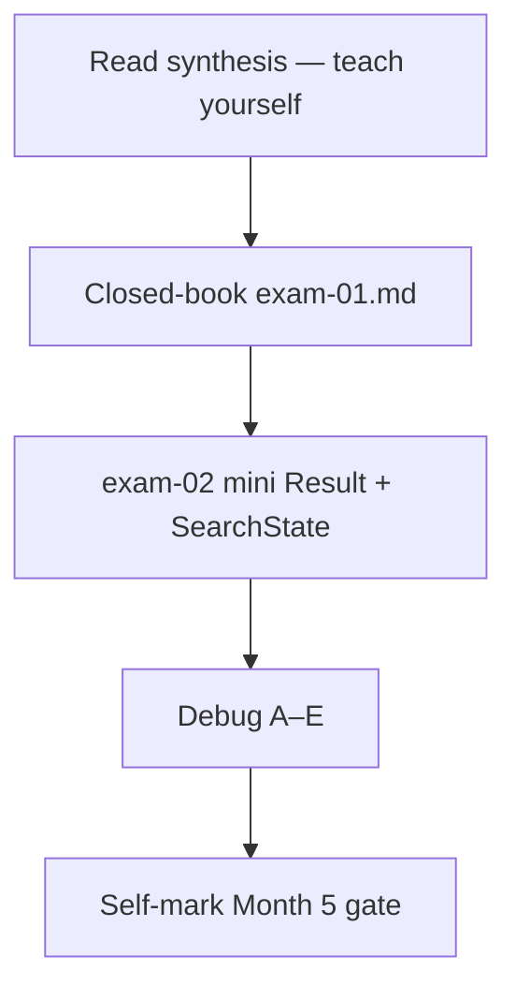
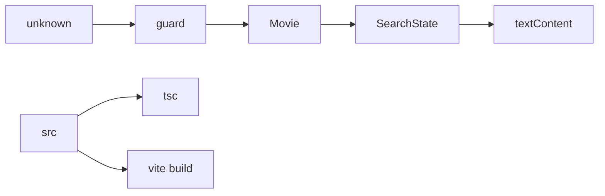

# Month 5 · Week 4 · Day 7
# Month 5 Exam + Gate

**Program:** Full-Stack Mastery · 18 months  
**Phase:** 1 — Foundations  
**Month index:** [../../README.md](../../README.md)  
**Week 4:** [1](day-01.md) · [2](day-02.md) · [3](day-03.md) · [4](day-04.md) · [5](day-05.md) · [6](day-06.md) · Day 7 (today)  
**Week rhythm today:** Monthly exam  
**Study time:** 3–4 focused hours

Textbook files stay **closed** except:

- **this file** (synthesis + exam blocks + self-mark),
- [Month 5 README](../../README.md) **for the gate wording**,
- `full_stack_project_requirements_2026/project_03_typescript_application.md` **only** when self-marking Project 3 rows — not as a source to paste.

Repair forgotten facts from **this synthesis**, not from Week 1–4 day files and not from a TypeScript catalog tutorial.

Work in `~\fullstack-lab\month-05-exam\` for exam evidence. The mini-app is **not** Project 3 and is **not** copied from `~/explorer-ts/` (or whatever you named the conversion). Do **not** start Month 6 because the calendar moved.

---

## How to read this chapter

This file is the **exam and the teacher**. The synthesis is written so a student whose Weeks 1–4 notes are foggy can still re-learn the month from **today’s pages**, then prove it with the blocks and the gate.



During blocks 1–3, other day files stay closed. If you go blank, re-read **this synthesis**. AI may not write exam-01, the mini-app, or DEBUG answers.

---

## Today's contract

Teach Month 5 aloud from this synthesis and show evidence for every gate row.

**Today's gate** is the Month 5 Gate table at the end — not “I attended four weeks.”

---

## Time box

| Block | Minutes | Work |
|---|---|---|
| 0 | 25 | Read the complete explanation; speak it |
| 1 | 40 | Closed-book `exam-01.md` |
| 2 | 45 | Mini `Result` + `isUser` + `SearchState` |
| 3 | 25 | Debug A–E |
| 4 | 20 | Project 3 glance (repo, not rewrite) |
| 5 | 20 | Four scripts + break a guard test |
| 6 | 20 | Design: three Project 2 problems |
| 7 | 15 | Self-mark + retro |

---

## Month 5 synthesis (the lesson, in this book)

**TS vs JS:** A `.ts` file is JavaScript plus a type language. **Types are erased** at compile time. The engine runs JS. `tsc` checks; it is not a runtime firewall. A lying API can still hand you a number. That is why guards exist.

**Boundaries:** annotate **exported** functions (parameters and returns). Infer locals when the initializer is obvious. Empty arrays need an annotation (`string[]`). **`any` turns the checker off** and infects assignees. Unjustified `any` is forbidden. `as Movie` is a promise. `!` non-null is a promise. Prefer `unknown` at JSON / `response.json()` / `localStorage`.

**Modeling:** `type` names any kind of type; `interface` names objects. Remote ≠ internal — extra API keys stay out of the UI model. Unions (`A | B`) need **narrowing**. Literal types (`"want" | "doing" | "done"`) catch typos. `Result<T>` is `{ ok: true; value: T } | { ok: false; error: string }`. Generics (`first<T>`, `SearchState<T>`, `Result<T>`) are holes you fill — not copy-paste of `ResultMovie`.

**Safety:** narrowing is control flow (`typeof`, `=== null`, `in`, `instanceof`, `Array.isArray`, discriminant `===`). Truthiness is blunt (`0`, `""`). `typeof null === "object"`. Type predicates `x is T` must check fields. `never` in `switch` default exhausts unions. `strictNullChecks` means `string` is not `null`. Discriminated `status`: `idle | loading | success | error` — empty list is **success** with `items: []`. Utilities (`Partial`, `Pick`, `Omit`, `Record`) in moderation; a draft is not a Movie.

**Tooling:** npm installs; `package.json` is the manifest; semver `^` allows minor/patch, **refuses the next major**; **lockfile** pins the exact tree — commit it; `npm ci` in CI; ignore `node_modules`. Scripts alias local binaries. Vite: `index.html` entry, `dev` HTTP + HMR, `build` → `dist/`. Windows: `npm create vite@latest name -- --template vanilla-ts` (extra `--`). **`VITE_*` is public** (inlined into the bundle). ESLint + typescript-eslint + Prettier; `eqeqeq`; `no-explicit-any`. **`tsc` is the typecheck** — `vite build` does not replace it.

**Product:** Project 3 is **your** conversion of Project 2 — compiler as a design tool, not `: any` on every line. This textbook never contained that source.



**Wrong belief:** “Once it typechecks, the data is safe.”  
**Correct:** typecheck assumes your annotations match reality. Network JSON is `unknown` until a guard says otherwise.

**Wrong belief:** “Redux / more types / more utilities would have been the month.”  
**Correct:** the month is erasure, modeling, guards, `SearchState`, and a toolchain you can explain.

---

# Complete explanation — Month 5 you must still own

## 1. Two spaces (Week 1)

Values exist at runtime (`title`, `add`, `document`). Types exist for the compiler (`string`, `Movie`). After emit, `: string` is gone. `tsc --noEmit` (or `tsc -b`) is the gate in labs; Vite emits for the browser.

## 2. Narrowing and guards (Week 3)

After `if (typeof x === "string")`, `x` is `string` in the block. `typeof x === "object"` includes **`null`**. Records: object, not null, not array, then field `typeof`. Lists: `Array.isArray` + `every(isItem)`. Status literals need equality to `"want" | "doing" | "done"`, not `typeof === "string"`.

```ts
const parsed: unknown = JSON.parse(text);
```

`parse` throws — `try/catch` → `Result`. Do not throw garbage JSON at the test runner or the UI.

## 3. Discriminated UI (Week 3)

```ts
type SearchState<T> =
  | { status: "idle" }
  | { status: "loading" }
  | { status: "success"; items: T[] }
  | { status: "error"; message: string };
```

`loading: boolean` + `error: boolean` allows both true. The union does not. `switch (s.status)` + `const _x: never = s` in `default`. You cannot read `s.items` on error — `tsc` proves it. Replace the **whole object** on transition.

## 4. Tooling (Week 4)

`package-lock.json` is why a classmate’s `typescript` matches yours. `^5.6.0` will not install `6.x` without editing the manifest; without a lock, it **may** install a newer `5.x`. `VITE_SECRET_KEY` appears in `dist/` — that is the leak. `npm run typecheck` and `npm run build` are different jobs.

## 5. Project 3 (Week 4, your repo)

Remote type → guard → internal type → `SearchState` → `textContent`. Storage parse as `unknown`. Tests for transform, guards, error-state. Four scripts pass. Three design fixes documented. Zero unjustified `any`.

---

# Block 0 — Speak the synthesis (25 min)

Out loud, this file open once, then closed:

1. Erasure vs runtime validation.  
2. Annotate boundaries; infer locals; no `any`.  
3. Remote ≠ internal.  
4. `unknown` + predicate honesty.  
5. `SearchState` vs boolean pairs.  
6. `never` exhaustiveness.  
7. `^` vs lockfile.  
8. Why `VITE_*` is public.  
9. Why both `tsc` and `vite build`.  
10. A generic you will write in exam-01 (`Result<T>` or `SearchState<T>`).

If a topic is under two true sentences, it is weak — it will show up on the self-mark.

---

# Block 1 — Closed-book (40 min)

Create `~\fullstack-lab\month-05-exam\exam-01.md`.

**No editor for code** except tiny type sketches if they help you think. Prose required:

- TS vs JS + erasure (a beginner could use this paragraph).  
- Why `as Movie` after fetch is a lie (story: capital `Title` vs `title`).  
- One generic, explained without “T means type”: what call sites fill in.  
- Why empty search results are `success` not `error`.

If Project 3 is incomplete, exam-01 must **say** so. Honesty is part of the grade.

---

# Block 2 — Mini-build (45 min)

`~\fullstack-lab\month-05-exam\mini\` — Node TS **or** a tiny Vite `vanilla-ts`. **Not** Project 3.

**Northline patrons** (new copy — do not paste catalog types from your app):

1. `type User = { id: string; name: string }`.  
2. `isUser(x: unknown): x is User`.  
3. `parseUser(raw: string): Result<User>` — catch JSON throw.  
4. `SearchState<User>` + `label`.  
5. Tests: valid JSON, `NOT JSON`, `{ "name": 1 }`, `label` empty success.  
6. `npx tsc --noEmit` green. No `any`. No Project 3 files.

```powershell
mkdir ~\fullstack-lab\month-05-exam\mini
cd ~\fullstack-lab\month-05-exam\mini
npm init -y
npm install --save-dev typescript tsx
```

If you prefer Vite for the mini:

```powershell
cd ~\fullstack-lab\month-05-exam
npm create vite@latest mini -- --template vanilla-ts
```

Serve HTTP if you open a page. Do not `file://`.

---

# Block 3 — Debug (25 min)

`~\fullstack-lab\month-05-exam\exam-03-DEBUG.md` — **full sentences**.

**A.** `any` on fetch; UI crashes on missing title.  

**B.** `loading` and `error` both true.  

**C.** `VITE_SECRET` in the bundle.  

**D.** Lockfile missing; classmate has different `tsc`.  

**E.** `typeof null === "object"` in a guard.

Stretch **F.** `vite build` green, `tsc` red. Which gate did they skip?  

Stretch **G.** Guard `return true` always.

Labels are the exam. Write **your** causes and fixes.

---

# Block 4 — Review Project 3 (20 min)

Do **not** implement new features unless a gate row is a five-minute fix (missing `never` default, leftover `as Movie` on one function). Record in `exam-04-PROJECT.md`:

- Path to repo  
- Remote + internal types: true/false  
- Guard at boundary + tests: true/false  
- `SearchState` (or equivalent union): true/false  
- Unjustified `any`: true/false (true means **fail**)  
- `typecheck` / `lint` / `test` / `build`: each pass/fail  

One refactor commit if a type is still `string` for status (should be a literal union). Open the spec only to compare Definition of Done.

---

# Block 5 — Run all four scripts (20 min)

In **Project 3**: `typecheck`, `lint`, `test`, `build`. Break a guard test; show fail; restore. Paste the red/green idea into `exam-05-SCRIPTS.md` (not megabytes of log).

---

# Block 6 — Design (20 min)

`exam-06-DESIGN.md`: three Project 2 problems and how TS made them harder to repeat. Concrete (`renderSearch` also wrote localStorage), not slogans.

---

# Block 7 — Self-mark + retro (15 min)

Fill the table. **Pass** requires evidence (exam files + Project 3). Wishful ticking is a failed exam.

`exam-07-retro.md`: solid / weak / hours / whether Month 6 is allowed.

```powershell
cd ~\fullstack-lab
git add month-05-exam month-05/week-04
git commit -m "Complete Month 5 exam evidence."
```

Project 3 commits stay in **its** repository.

---

# Self-mark — Month 5 Gate

True **without a tutorial** and **without leaning on `any`:**

| # | Claim | Evidence | Pass? |
|---|---|---|---|
| 1 | TS vs JS + erasure | exam-01.md | |
| 2 | Remote + internal types | Project 3 | |
| 3 | Guard at boundary | tests | |
| 4 | Discriminated search state | state.ts | |
| 5 | Generic you can explain | exam-01.md | |
| 6 | No unjustified `any` | grep / lint | |
| 7 | typecheck, lint, test, build | Project 3 README | |

All seven must be **pass** before Month 6. If Project 3 is almost done, finish it **before** you claim the gate — the exam mini-app does not replace items 2, 3, 4, and 7.

### How to fail honestly (examples)

- Gate 1 fail: exam-01 says types exist in the browser as `: string`.  
- Gate 2 fail: one `Movie` type used for both HTTP JSON and the UI, with `as Movie[]`.  
- Gate 3 fail: no test for `NOT JSON` / missing title.  
- Gate 4 fail: `loading: boolean` + `error: boolean` still.  
- Gate 5 fail: “I used `Array<T>`” with no explanation of `T`.  
- Gate 6 fail: `any` in `api.ts` to silence JSON.  
- Gate 7 fail: `vite build` only; no `typecheck` / no tests.

Passing is not a vibe. It is ticks with paths.

---

## Definition of done

- [ ] exam-01.md teaches erasure and `as Movie`
- [ ] mini parse + `SearchState` tests green
- [ ] exam-03-DEBUG.md has A–E
- [ ] Self-mark table filled honestly
- [ ] Gate 7 false if scripts were never run
- [ ] Commit exists in fullstack-lab for exam evidence

---

## If you passed

Month 6 is **React + TypeScript**. Do not start it until this gate is true. Open [Month 6](../../month-06/README.md) only then. You will keep Vite, `tsc`, guards, and `SearchState` — React will render them; it will not replace them.

## If you did not pass

Repair the failed rows. Re-run this file’s blocks that failed. Do not “move on and come back.” Month 6 will not teach `unknown` JSON.

---

## Optional review links

Repair from this synthesis first. These pages are for later checking after the exam.

- [Month 5 README](../../README.md)
- [Handbook: Everyday Types](https://www.typescriptlang.org/docs/handbook/2/everyday-types.html)
- [Vite guide](https://vite.dev/guide/)
