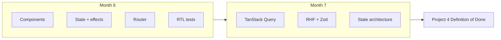
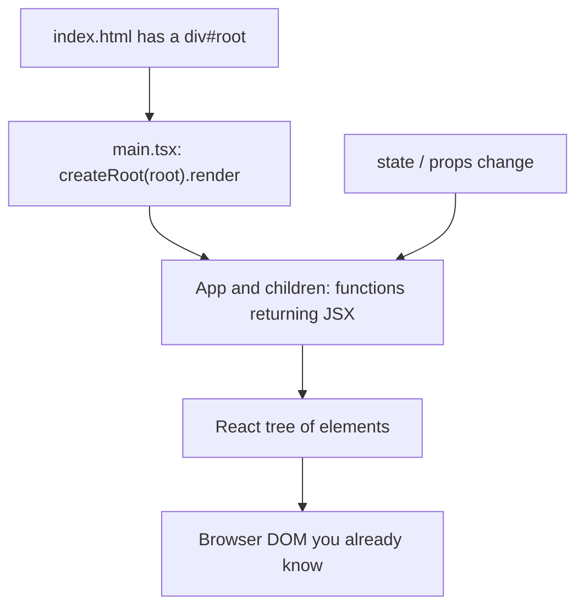

# Month 6 — React + TypeScript Fundamentals

**Program:** Full-Stack Mastery Textbook  
**Phase:** 2 — Modern frontend engineering  
**Length:** 4 weeks · 7 days each · 3–4 focused hours/day  
**Prereq:** Month 5 gate passed (Project 3 typechecks; you can explain erasure, guards, discriminated unions, Vite)  
**This month’s job:** Make **React** yours — components, JSX, props, state, effects, composition — then **React Router** and **component tests**, so you can start a multi-page app from a blank Vite project without a tutorial.

**Project 4** (you start this month, finish the *full* spec in Month 7): `full_stack_project_requirements_2026/project_04_react_admin_dashboard.md`.

Read that spec once this week so the destination is clear. Then ignore TanStack Query, React Hook Form, and Zod **until Month 7**. Those tools solve Month 7 problems. Month 6’s job is the React you must understand *before* those libraries hide it.

This textbook will **not** give you the dashboard source.

**This textbook is the lesson.** React, JSX, hooks, Router, and Testing Library are explained in the day files the same way Month 1 explained the machine: slowly, in full sentences, with pictures, then labs. If a day feels like a checklist, it is incomplete — stay until you can teach the idea out loud.

Optional review links at the end of a day are for **later rechecking**, not first learning.

These files are written to render as **web pages**: relative links, tables, and **Mermaid** diagrams.

---

## How this textbook is organized

```
month-06/
  README.md     ← you are here
  week-01/      components, JSX, props, composition, rendering, boundaries
  week-02/      state, events, lists, keys, conditional rendering, controlled forms
  week-03/      useEffect, deps, when not to use an effect, Context, useReducer, refs, custom hooks
  week-04/      React Router, nested routes, params, protected UI, error/loading, RTL tests
                + Project 4 start + Month 6 exam
```

Labs: `~\fullstack-lab\month-06\` (Vite apps you scaffold).  
Project 4: **its own Git repository** (e.g. `~/ops-dashboard/`), not a dump inside the lab folder.

---

## Month 6 vs Project 4 (honest split)

The project file lists Query, Hook Form, and Zod. The **roadmap** puts those in **Month 7**.

| Month | You build | You do **not** need yet |
|---|---|---|
| **6** | Multi-page React + TS + Vite + Router + mock auth UI + RTL tests + loading/empty/error you own | TanStack Query, RHF, Zod, Redux, Tailwind-as-a-crutch |
| **7** | Same repo: server state, schema forms, state architecture, performance | Inventing a second dashboard |

Month 6 gate is true when you can **start from `npm create vite`** and produce a routed app you can explain. You may still be adding Query in Month 7. Do not skip Month 6 hooks because a library will “do it for you.”



---

## Month 6 Gate

True **without a tutorial**:

1. Scaffold a Vite + React + TypeScript app and explain `index.html` → `main.tsx` → `App.tsx`.
2. Explain a **component** as a function of props (and later state) that returns a UI tree.
3. Type props; compose small components; name a **boundary** (what this component owns vs what it receives).
4. Use **controlled inputs**, lists with **stable keys**, and conditional rendering.
5. Explain `useState` vs **derived** values vs `useEffect` (and when an effect is the wrong tool).
6. Use React Router: layout route, nested routes, `Outlet`, params, a 404, a **protected** wrapper (mock auth).
7. Write at least one **React Testing Library** test that clicks or submits and asserts **user-visible** behavior.
8. Project 4 repo exists with routes for login (mock), dashboard shell, list, detail, create/edit **forms you own** (plain React this month), and tests running.

If any item is false, do not start Month 7.

---

## What this month must teach (complete list)

| Week | Must learn | Must practice |
|---|---|---|
| 1 | Components, JSX, props, `children`, composition, rendering, component boundaries | Scaffold Vite `react-ts`; delete the demo; build a static page from components |
| 2 | `useState`, events, lists, keys, conditional rendering, controlled inputs | Filterable list + a form that is the source of truth |
| 3 | `useEffect`, dependency arrays, cleanup, Strict Mode, derived state, lifting state, `useContext`, `useReducer`, refs, custom hooks | Fetch in an effect with abort; theme context; a hook you can explain |
| 4 | React Router (nested, params, protected UI), error/loading UI, RTL + Vitest | Multi-page lab; start Project 4; exam |

**Avoid:** class components; Redux; copying a dashboard template; `useEffect` to copy props into state; array index as a key for a list that reorders; `innerHTML`; fetching in render.

Horizontal:

- **Debugging:** React DevTools (Components + Profiler later); `console` is not a state manager.
- **Security:** user strings still go through text (JSX text is safe; `dangerouslySetInnerHTML` is `innerHTML` — forbidden unless you can name a sanitizer you do not have).
- **Tests:** Testing Library queries by role/label, not CSS class.
- **A11y:** labels, keyboard, focus — Month 2 still applies inside React.
- **Git:** lab commits daily; Project 4 from commit one.

---

## Weekly rhythm and daily time box

Same as Month 1. Day 1 learn. Day 2 exercises. Day 3 from memory. Day 4 lab feature. Day 5 tests/refactor/docs. Day 6 independent. Day 7 review. Week 4 Day 7 is the Month 6 exam + gate.

| Minutes | Block |
|---|---|
| 30–45 | Concepts from **this textbook** |
| 45–60 | Focused exercises |
| 60–90 | Independent work |
| 30–60 | Lab / Project 4 |
| 15 | Notes / recall |

---

## Tools this month

| Tool | Why |
|---|---|
| Node.js LTS + npm | You have this from Month 5. Vite 7 wants a current Node (20.19+ / 22.12+). |
| Vite template `react-ts` | Dev server, HMR, production bundle. **Not** Create React App. |
| React 19 | UI library. Function components + hooks only. |
| TypeScript | `.tsx` files. Same rules as Month 5: no `any` to silence JSX. |
| `react-router` | Client-side routes (Week 4). |
| Vitest + React Testing Library + `jsdom` | Component tests (Week 4; a first `render` appears in Week 1 Day 5). |
| React DevTools | Browser extension — install Week 1. |

Windows: PowerShell. Extra `--` after `npm create vite@latest` is required:

```powershell
npm create vite@latest hello-react -- --template react-ts
```

---

## How React fits (picture)



You still have a DOM. React **produces** it from components so you do not hand-edit nodes for every click. Month 3 `createElement` + `textContent` was the honest low-level version. React is the structured version for apps that grow.

**Wrong belief:** “React is HTML in JavaScript.”  
**Correct:** JSX **looks** like HTML. It is **function calls** that describe a tree. `className` exists because `class` is a reserved word in JavaScript.

---

## Start

Open [week-01/day-01.md](week-01/day-01.md).

When Month 6’s gate is true, continue with [Month 7](../month-07/README.md).
