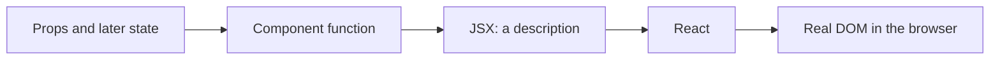
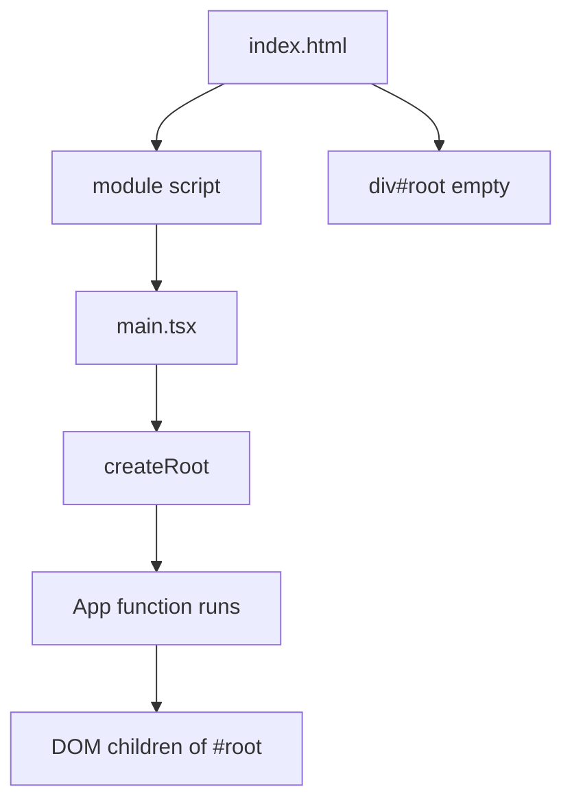

# Month 6 · Week 1 · Day 1
# What React Is: Components, JSX, and the First Render

**Program:** Full-Stack Mastery · 18 months  
**Phase:** 2 — Modern frontend  
**Month index:** [../../README.md](../../README.md)  
**Week 1:** Day 1 (today) · [2](day-02.md) · [3](day-03.md) · [4](day-04.md) · [5](day-05.md) · [6](day-06.md) · [7](day-07.md)  
**Week rhythm today:** Learn + type-along  
**Student state:** Month 5 gate passed. You can type TypeScript and run Vite. You have not been required to write React yet.  
**Study time:** 3–4 focused hours

**This week covers:** components, JSX, props, composition, rendering, component boundaries.

Today: what React **is**, how a Vite app **boots**, and how **JSX** becomes a tree. Props and composition are Day 2. Do not skip them. If you only memorize “return some tags,” Week 2 state will feel like magic.

Project 4 is **not** this week. Labs live in `~\fullstack-lab\month-06\`. This textbook will not give you the dashboard.

---

## How to use this textbook

This is not a video transcript and not a tutorial to skim.

1. Read a section. Close it. Say the idea in your own words.
2. Type every lab. Do not paste a generated `App.tsx` you cannot explain.
3. When the compiler or the browser errors, **read the error**. Then fix it. That *is* the lesson.
4. Do not keep an explanation you cannot repeat without looking.
5. AI may explain or review. It may not replace your reasoning.

If you finish early, do the stretch — not another React article.

---

## How to read this chapter

In Month 3 you built the DOM yourself: `createElement`, `textContent`, `append`. That is honest. It does not scale: every click meant more manual tree surgery.

**React** is a library that lets you describe the UI as **functions**. You say what the screen should look like for the current data. React updates the real DOM to match.

If that is still abstract, use this picture. A restaurant ticket is not the plate. The ticket says “burger, no onion.” The kitchen produces the plate. JSX is the ticket. The DOM is the plate. When the ticket changes, the kitchen does not rebuild the whole restaurant — it changes the plate.



Read each section. Close it. Say it in one sentence. Then type the lab. When JSX refuses two adjacent tags, that is a rule, not a broken install.

---

## Today's contract

By the end of this day you will be able to:

1. Explain React as a **UI library**: components in, DOM out — not a new programming language and not a replacement for HTTP.
2. Scaffold Vite **`react-ts`**, install, and run the dev server.
3. Trace **`index.html` → `main.tsx` → `App.tsx`**.
4. Write a **function component** that returns JSX.
5. Use JSX correctly: one parent (or a fragment), `{expressions}`, `className`, self-closing tags.
6. Explain why we write **`.tsx`** and why types still **erase**.

**Today's gate.** Closed-book:

> A component is a function. It receives data (tomorrow: props) and returns a description of UI. React renders that description into `#root`. JSX is not HTML; `class` is `className`.

If you cannot say that, stay here. Day 2 props will not rescue a mushy “React is HTML.”

---

## Time box

| Block | Minutes | Work |
|---|---|---|
| A | 50 | Theory |
| B | 55 | Scaffold + first component |
| C | 70 | Independent: a static studio page from components |
| D | 20 | Git |
| E | 15 | Recall |

---

# Block A — Theory

## 1. What problem React solves

A page with three buttons is easy in Month 3. A dashboard with login, a table, a detail pane, and a form is not — if every click manually patches the DOM.

**The problem:** the screen must stay in sync with **data**. If “unread count is 4” lives in a variable **and** in three different `span`s you forgot to update, you have a bug.

**React’s bet:** write a **function** of the data. When the data changes, call the function again (you will not call it yourself — React will). Compare the new description to the old one. Update only what changed.

That is **declarative** UI: you declare *what* it should look like, not the list of DOM mutations.

**Wrong belief:** “React is the whole backend.”  
**Correct:** React runs in the **browser** (for this course). It does not replace FastAPI, PostgreSQL, or `fetch`. It replaces *you* walking the DOM by hand.

**Wrong belief:** “I need React to make a website.”  
**Correct:** Month 2 sites were real websites. React is for **apps** whose UI changes a lot. Project 1 did not need it. Project 4 does.

---

## 2. What React is not

| Not | Because |
|---|---|
| A language | You still write TypeScript. JSX is syntax on top. |
| A replacement for CSS | You still write CSS (or later a library). React does not layout boxes. |
| Create React App | CRA is retired history. This course uses **Vite**. |
| A reason to forget accessibility | `<div onClick>` is still a fake button. Use `<button>`. |

You will see **Next.js** and other frameworks later (roadmap: framework literacy). They *use* React. This month you learn React **without** a framework so you can tell the library from the host.

---

## 3. The boot sequence (Vite + React)

A Vite React app is still a web page.

1. The browser loads **`index.html`**.
2. That file contains a **`<div id="root">`** — an empty mount point — and a module script to **`main.tsx`** (Vite rewrites this).
3. **`main.tsx`** finds `#root`, creates a React **root**, and **renders** your top component (`App`).
4. React turns `App`’s JSX into DOM **inside** `#root`.

```tsx
import { StrictMode } from "react";
import { createRoot } from "react-dom/client";
import App from "./App";
import "./index.css";

createRoot(document.getElementById("root")!).render(
  <StrictMode>
    <App />
  </StrictMode>,
);
```

Read that like Month 3:

- `document.getElementById("root")` — same DOM API.
- `createRoot(...).render(...)` — “React, own this node.”
- `<App />` — “start with this component.”
- **`StrictMode`** — development checks. In React 19 it can run some logic **twice** on purpose (you will feel this with `useEffect` in Week 3). It does not show an extra UI. Do not remove it to “fix” double logs; understand it.

The `!` is TypeScript: “I assert this is not null.” If `#root` is missing, that is a broken `index.html`, not a React bug.



**Wrong belief:** “`App.tsx` is the website.”  
**Correct:** `index.html` is the website. `App` is the **first component** React draws into `#root`.

---

## 4. A component is a function

```tsx
function Greeting() {
  return <h1>Hello, operator.</h1>;
}
```

Rules that matter today:

1. **Name is PascalCase.** `<Greeting />` is a component. `<greeting />` would be treated as a **HTML-like** tag (and fail or confuse). This is how React tells *your* functions from `div` / `span`.
2. It **returns JSX** (or `null` to render nothing).
3. It must be **pure enough to understand**: given the same inputs, it should describe the same UI. Do not `fetch` inside the function body as a side effect of rendering (Week 3: that belongs in `useEffect` or, later, Query).
4. You **call** it in JSX as `<Greeting />`, not `Greeting()`. The JSX form is how React knows it is a component node.

Default export vs named export: both work. This course prefers **named exports** for components you reuse (`export function Greeting`) and a default `App` is fine because Vite’s template started that way. Pick one per file and stay consistent.

---

## 5. JSX — HTML-shaped TypeScript

**JSX** is a syntax extension: you write tags in `.tsx` files. The compiler turns them into JavaScript (function calls). You do not need to write `React.createElement` by hand.

### 5.1 One parent

This is **illegal**:

```tsx
return (
  <h1>Title</h1>
  <p>Body</p>
);
```

A function returns **one** value. Two adjacent tags are two values. Wrap them:

```tsx
return (
  <>
    <h1>Title</h1>
    <p>Body</p>
  </>
);
```

`<>...</>` is a **fragment**: a parent that does **not** create an extra DOM node. A `<div>` wrapper also works; use a fragment when the extra `div` would break layout or semantics.

### 5.2 JavaScript in braces

```tsx
const name = "Northline";
return <p>Studio: {name}</p>;
```

`{name}` evaluates a **JavaScript expression**. Not a statement: no `if` keyword inside `{}` (use a ternary or `&&`, Week 2). You can call functions: `{formatDate(iso)}`.

**Text in JSX is text.** `<p>{userInput}</p>` does **not** parse HTML. That is the React equivalent of `textContent`. Month 3 XSS lesson still holds: do not use `dangerouslySetInnerHTML` this month.

### 5.3 Attributes that differ from HTML

| HTML | JSX |
|---|---|
| `class` | `className` (`class` is reserved in JS) |
| `for` | `htmlFor` (on labels) |
| `style="color: red"` | `style={{ color: "red" }}` — an **object**, camelCase keys |
| `onclick` | `onClick` — function, Week 2 |
| `tabindex` | `tabIndex` |

Boolean attributes: `<input disabled />` or `disabled={true}`. `disabled={false}` is off.

Self-closing: ``, `<input />` — in JSX they **must** close. HTML’s optional closing is not JSX.

### 5.4 Comments

`{/* this is a JSX comment */}` inside the tree. `//` works in the function body above `return`.

**Wrong belief:** “I’ll copy an HTML email signature into a component.”  
**Correct:** you will fix `class` → `className`, close inputs, and wrap multiple roots. That translation *is* the skill today.

---

## 6. `.tsx` and types (Month 5 still applies)

A **`.tsx`** file is TypeScript **plus** JSX. A **`.ts`** file cannot contain `<div>`.

Types still **erase**. `<h1>Hello</h1>` becomes JavaScript that React runs. There is no `: string` in the browser.

`any` is still banned as a way to silence “this prop is wrong.”

You do not need a special React type to return JSX today. TypeScript infers the return. Tomorrow you will type **props**.

---

## 7. Rendering — an honest beginner model

When `createRoot(...).render(<App />)` runs:

1. React calls `App`.
2. `App` returns a tree of **elements** (plain objects describing tags and children — you can imagine them as “tickets”).
3. React creates DOM nodes and inserts them under `#root`.

When data changes (Week 2: `setState`), React calls the component **again**, gets a new tree, **diffs** it against the previous tree, and updates the DOM.

You do not need the internals of the Fiber algorithm. You need this consequence: **rendering is repeatable**. Putting `document.querySelector` inside a component and mutating the DOM “around” React will fight React. Let React own `#root`.

**Wrong belief:** “React replaces the DOM.”  
**Correct:** React **uses** the DOM. DevTools Elements still shows `h1` and `p`.

---

## 8. Component boundaries (preview)

A **boundary** is the question: *what does this function own?*

- `App` owns the **page** (or the shell).
- `Header` owns the header markup, not the whole app.
- A `User` object should not be invented inside `Footer` if `App` already has it — that is Day 2 **props**.

Today, split a static page into `Header`, `Main`, `Footer` even if they take no data. The split is the habit. Props tomorrow make the split *useful*.

---

# Block B — Type-along

## B1 — Scaffold

In PowerShell:

```powershell
cd ~\fullstack-lab
mkdir month-06 -ErrorAction SilentlyContinue
cd month-06
npm create vite@latest week-01-hello -- --template react-ts
cd week-01-hello
npm install
npm run dev
```

If `create vite` asks questions, choose React + TypeScript. If Node is too old, upgrade LTS (Month 5 README: Vite 7 wants Node 20.19+ or 22.12+). Reopen the terminal after install.

Open the local URL (usually `http://127.0.0.1:5173/`). You should see the Vite + React demo.

Install the **React Developer Tools** browser extension. Open the **Components** panel. Select `App`. That tree is React’s view. Elements is the DOM. Both are true.

## B2 — Read the files (do not skip)

Open `index.html`, `src/main.tsx`, `src/App.tsx`. In `BOOT.txt` write:

1. What `id` the mount node uses  
2. What `createRoot` receives  
3. What `StrictMode` wraps  

## B3 — Replace the demo

Delete the demo logos and counter from `App.tsx`. Type:

```tsx
function App() {
  const studio = "Northline Studio";
  return (
    <>
      <h1>{studio}</h1>
      <p>Quiet software for busy operators.</p>
    </>
  );
}

export default App;
```

Save. HMR should update the page **without** a full reload. If it did not, check the terminal error.

## B4 — Break JSX on purpose

Temporarily return two adjacent tags **without** a fragment. Read the compiler error. Restore the fragment. Write one sentence in `BOOT.txt`: why two roots fail.

Cause a `class` vs `className` mistake on a `p`. Read the warning or the fact that the CSS did not apply. Fix it.

```powershell
# keep the dev server running in that terminal; another terminal:
cd ~\fullstack-lab\month-06\week-01-hello
git init
# if month-06 is already a repo, just add this folder from fullstack-lab
```

Prefer committing from `~\fullstack-lab` if that is already your lab repo:

```powershell
cd ~\fullstack-lab
git add month-06/week-01-hello
git commit -m "Month 6 Day 1: Vite react-ts hello and JSX fragment."
```

Add `node_modules` to `.gitignore` if it is not already there. **Never commit `node_modules`.**

---

# Block C — Independent

Still in this app (or a second scaffold `week-01-studio` if you want a clean tree — your choice; one app is enough).

Build a **static** page for a fictional operations studio (not Project 4’s final dashboard):

1. `Header` component — wordmark text, no second `h1` if `App` already has the page title — actually: **one `h1` in the page**. Put the `h1` in `Main` or `App`, not in both.
2. `Main` — one `h1`, one paragraph, an unordered list of three services (hard-coded).
3. `Footer` — a line of muted text.
4. `App` composes `Header`, `Main`, `Footer`.
5. Real `index.css` you type: `body` font `system-ui`, max-width on a wrapper, padding. No Tailwind. No UI kit.
6. Semantic HTML: `header`, `main`, `footer`. Skip link optional today; required again when you have a nav (Week 4).

`BOUNDARY.txt`: one sentence per component — what it **owns**.

Stretch: a `StatusBadge` that returns `<span>Operational</span>` with a `className`. Still no props if you have not read Day 2 — hard-code the text. Tomorrow you will pass the label in.

---

# Block D — Git

```powershell
cd ~\fullstack-lab
git add month-06
git commit -m "Week 1 Day 1: React hello, JSX rules, composed static page."
```

---

# Block E — Recall

Close the file.

1. What is in `#root` before React runs? After?
2. Why PascalCase for components?
3. Why `className`?
4. Why a fragment?
5. Does TypeScript still erase in a `.tsx` file?
6. Why is `dangerouslySetInnerHTML` like `innerHTML`?

---

## Definition of done

- [ ] I can explain component → JSX → DOM without saying “React is HTML”
- [ ] Dev server ran; I saw my own heading, not only the Vite logo
- [ ] I broke two-root JSX and read the error
- [ ] `App` composes at least two child components
- [ ] `node_modules` is not committed
- [ ] BOOT.txt and BOUNDARY.txt exist
- [ ] Commit exists

---

## Optional review links

React, JSX, and `createRoot` are explained in this chapter. These pages are for later checking, not for first learning.

- [React: Your first component](https://react.dev/learn/your-first-component)
- [React: Writing markup with JSX](https://react.dev/learn/writing-markup-with-jsx)
- [Vite: Getting started](https://vite.dev/guide/)
- [React: `createRoot`](https://react.dev/reference/react-dom/client/createRoot)

---

## Tomorrow

**Props** — how a parent passes data down. Composition. Typing props. Why you must not mutate props. Children. The word **boundary** becomes a rule, not a feeling.
