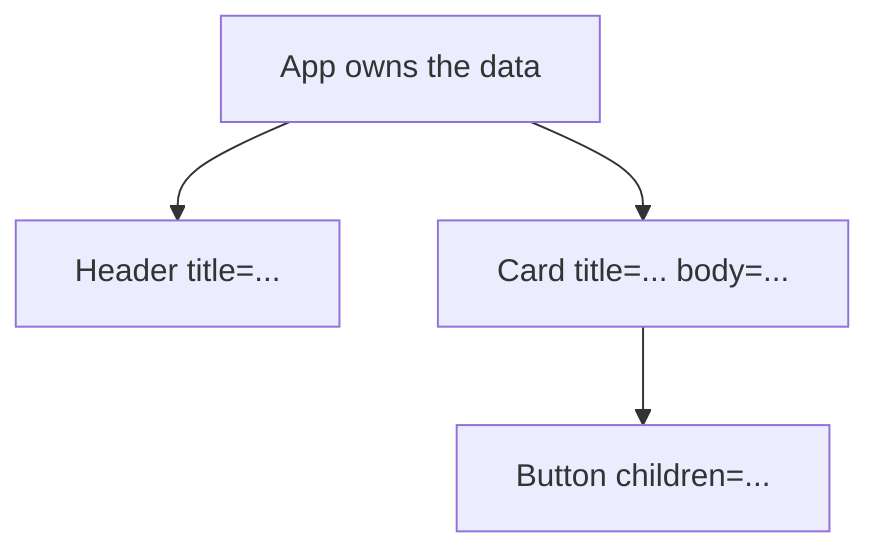

# Month 6 · Week 1 · Day 2
# Props, Children, Composition, and Boundaries

**Month index:** [../../README.md](../../README.md)  
**Week 1:** [1](day-01.md) · Day 2 (today) · [3](day-03.md) · [4](day-04.md) · [5](day-05.md) · [6](day-06.md) · [7](day-07.md)  
**Week rhythm today:** Exercises + debugging  
**Study time:** 3–4 focused hours  
**Prereq:** Day 1 gate. You have a Vite `react-ts` app and can return JSX from a function.

Yesterday a component was a function that returned a tree. Today it becomes a function of **inputs**. Those inputs are **props**. Without props, every heading is hard-coded and you will copy-paste `Card` ten times.

---

## How to read this chapter

A prop is a **named argument** to a component, written as a JSX attribute.

```tsx
<Greeting name="Ada" />
```

That is the same idea as `function Greeting({ name }: { name: string })`. The parent **passes**. The child **receives**. Data flows **down**.



If two children need the same data, the data lives in the **nearest common parent** (Week 2 will name this **lifting state**). Today the data is still constant. The *direction* is the lesson.

---

## Today's contract

By the end of this day you will be able to:

1. Pass and read **props**; type them in TypeScript.
2. Use **`children`** to compose wrappers (`Page`, `Card`).
3. Explain **composition** vs a 400-line `App`.
4. Name a **component boundary**: what it owns, what it receives, what it must not invent.
5. Refuse to **mutate** props.
6. Explain why `Greeting({ name })` in JSX is `<Greeting name={name} />`, not a random object dump.

**Today's gate.** Closed-book:

> Props are read-only inputs. The parent passes them. The child renders them. `children` is the nested JSX. I type props. I do not mutate them. I do not use `React.FC` as a superstition.

---

## Time box

| Block | Minutes | Work |
|---|---|---|
| A | 50 | Theory |
| B | 55 | Type-along: typed Card + children |
| C | 70 | Independent: compose a dashboard *shell* (static) |
| D | 20 | Git |
| E | 15 | Recall |

---

# Block A — Theory

## 1. Props are arguments

```tsx
type GreetingProps = {
  name: string;
};

function Greeting({ name }: GreetingProps) {
  return <p>Hello, {name}.</p>;
}

function App() {
  return <Greeting name="Ada" />;
}
```

- The **parent** (`App`) chooses `name`.
- The **child** (`Greeting`) does not look up Ada in a global. It renders what it was given.
- Destructuring `{ name }` is ordinary JavaScript. You could write `function Greeting(props: GreetingProps)` and use `props.name`.

Expressions as props:

```tsx
<Greeting name={user.firstName} />
<Status ok={true} />
<Count value={items.length} />
```

Strings can use quotes: `name="Ada"`. Everything else uses `{...}`.

**Wrong belief:** “Props are state.”  
**Correct:** props come **in**. State (Week 2) is **owned** by the component and can change. A child that needs to change a value either owns its own state or calls a **callback prop** the parent passed (Week 2).

---

## 2. Type the props — Month 5 habits

```tsx
type CardProps = {
  title: string;
  body: string;
  featured?: boolean; // optional
};

function Card({ title, body, featured = false }: CardProps) {
  return (
    <article className={featured ? "card card--featured" : "card"}>
      <h2>{title}</h2>
      <p>{body}</p>
    </article>
  );
}
```

- Optional props: `?` and a default in the destructure when you have a sensible default.
- Union props when the set is closed: `tone: "info" | "warning"`.
- **Do not** type a prop as `any`. If the title might be missing, `string | undefined` and handle it — or require `string` so the parent must pass it.
- Children: `children: React.ReactNode` (anything React can render: text, elements, `null`, arrays). Import type: `import type { ReactNode } from "react"` and use `ReactNode`.

This course types props with a **`type` alias** (or `interface` — both fine). It does **not** require `React.FC<Props>` / `FunctionComponent`. That helper historically injected `children` in confusing ways. Explicit `children?` is clearer.

---

## 3. `children` — composition’s socket

```tsx
type PanelProps = {
  title: string;
  children: React.ReactNode;
};

function Panel({ title, children }: PanelProps) {
  return (
    <section>
      <h2>{title}</h2>
      {children}
    </section>
  );
}

function App() {
  return (
    <Panel title="Recent activity">
      <ul>
        <li>Invoice sent</li>
        <li>Stock adjusted</li>
      </ul>
    </Panel>
  );
}
```

Whatever you nest **between** the tags becomes `children`. That is how a `Layout` wraps pages, how a `Card` wraps arbitrary body content, how a `Button` wraps its label (`<Button>Save</Button>`).

**Wrong belief:** “I’ll add `bodyHtml: string` and `dangerouslySetInnerHTML`.”  
**Correct:** pass `children`. Keep structure as components, not HTML strings.

---

## 4. Composition vs configuration soup

**Composition** means small components nested, like HTML:

```tsx
<Page>
  <Header />
  <Main>
    <Card title="Open tickets">
      <TicketTable rows={rows} />
    </Card>
  </Main>
</Page>
```

The alternative is one `App` with every `div` inline, or a `Card` with twenty optional props (`showTable`, `showChart`, `footerAlign`, …) that nobody can remember.

**Rule of thumb:** if a region can vary arbitrarily, use `children`. If a value is a single string/number/boolean the child must know, use a named prop.

**Wrong belief:** “More props is more reusable.”  
**Correct:** more props is a worse API. Compose.

---

## 5. Boundaries — who owns what

Ask three questions of every component:

| Question | Example |
|---|---|
| **What does it receive?** | `title`, `children` |
| **What does it own?** | The `<article>` markup and its CSS class |
| **What must it not invent?** | The ticket rows — those belong to a parent (or later a query) |

If `Footer` hard-codes the company name and `Header` hard-codes a different one, you have two sources of truth. Pass `studioName` from `App` (or a constant module). That is a boundary fix, not a CSS fix.

**Presentational** vs **container** is a useful *thought*, not two folders you must create today. A `Button` is presentational: it looks like a button. `App` is a container: it knows the studio name. Do not build an `containers/` empire this week.

---

## 6. Props are read-only

```tsx
function Badge({ label }: { label: string }) {
  // WRONG
  // label = label.toUpperCase();
  const text = label.toUpperCase(); // new local — fine
  return <span>{text}</span>;
}
```

Mutating `props` or mutating an object/array that was passed in (`props.items.push(...)`) surprises the parent. Week 2: treat incoming arrays as immutable; copy when you change.

**Wrong belief:** “The child can fix the data for everyone.”  
**Correct:** the child **asks** the parent to change data via a callback, or the child keeps **private** state. It does not reach up and edit the parent’s object.

---

## 7. Lists of components (preview of Week 2 keys)

```tsx
const services = ["Audit", "Uptime", "Training"];

function ServiceList({ items }: { items: string[] }) {
  return (
    <ul>
      {items.map((item) => (
        <li key={item}>{item}</li>
      ))}
    </ul>
  );
}
```

Today: `{array.map(...)}` inside JSX is an expression — that is why it works. **`key`** must be stable and unique among **siblings**. Using the string is OK if the strings are unique. Week 2: never use index as key if the list can reorder. Do not use `Math.random()` as a key.

---

## 8. File shape

One component per file is a habit, not a law. `Header.tsx` exports `Header`. Barrel `index.ts` files that re-export everything can wait. Do not invent `src/components/atoms/molecules` this month.

Suggested lab folders:

```
src/
  App.tsx
  main.tsx
  components/
    Header.tsx
    Card.tsx
    Panel.tsx
```

---

# Block B — Type-along

Continue `week-01-hello` or copy the folder to `week-01-day-02` by re-scaffolding — your choice. Keep `node_modules` out of git.

### 1. Typed `Greeting`

Type `GreetingProps`. Pass `name` from `App`. Wrongly pass `name={42}` and **read** the `tsc` error. Fix it. That is Month 5 paying rent.

### 2. `Card` with `title`, `body`, optional `featured`

Render two cards. One featured.

### 3. `Panel` with `children`

Put the cards inside a `Panel`.

### 4. Deliberate mutation

In `Card`, try `title = "x"` if `title` is a `const` binding from destructure — you should get a compile error. Write `IMMUTABLE.txt`: props are read-only; I create locals if I need a derived string.

---

# Block C — Independent

Static **operations shell** (still no `useState`):

1. `App` holds a `studio` string and an array of `{ id: string; title: string; summary: string }` (three items you invent).
2. `Header` receives `studio`.
3. `Card` receives `title` and `children` (summary as children **or** a `summary` prop — pick one and type it).
4. Map the array to `Card`s with `key={id}`.
5. `Footer` receives `studio` too — **same** string from `App`, not a second hard-code.
6. CSS you write. Semantic landmarks.
7. `BOUNDARY.md`: for `App`, `Header`, `Card` — receive / own / must not invent.

No React Router yet. No fetch. No `useState`.

```powershell
cd ~\fullstack-lab
git add month-06
git commit -m "Week 1 Day 2: typed props, children, composed cards."
```

---

# Block E — Recall

1. What is a prop in one sentence?
2. Why type props?
3. What is `children`?
4. Why not mutate props?
5. Where does shared data live when two children need it?
6. Why `key` on a list?

---

## Definition of done

- [ ] Typed props; `tsc` caught a wrong type I caused on purpose
- [ ] At least one component uses `children`
- [ ] List rendered with `map` and a stable `key`
- [ ] BOUNDARY.md exists
- [ ] No `any`, no `dangerouslySetInnerHTML`
- [ ] Commit exists

---

## Optional review links

Props, children, and composition are explained in this chapter.

- [React: Passing props to a component](https://react.dev/learn/passing-props-to-a-component)
- [React: Thinking in React](https://react.dev/learn/thinking-in-react)
- [React: Rendering lists](https://react.dev/learn/rendering-lists) (keys deepen Week 2)

---

## Tomorrow

From memory: compose a static page from typed components. Days 1–2 closed during the drills. Repair from **those files in this book**.
