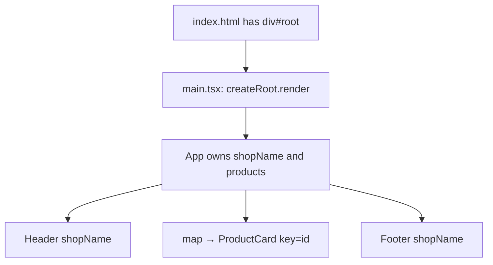

# Month 6 · Week 1 · Day 3
# From Memory: Compose a Static Page

**Month index:** [../../README.md](../../README.md)  
**Week 1:** [1](day-01.md) · [2](day-02.md) · Day 3 (today) · [4](day-04.md) · [5](day-05.md) · [6](day-06.md) · [7](day-07.md)  
**Week rhythm today:** Implement from memory  
**Study time:** 3–4 focused hours  
**Student state:** You bootstrapped Vite, returned JSX, and passed typed props. Today those ideas must live in your fingers.  
**Days 1–2 of this week:** closed during the drills. Repair from **this recap**, not from a React article.

---

## How to read this chapter

Days 1 and 2 had type-along files. During the drills they stay **closed**. This file contains the lecture so you are not sent elsewhere to re-learn.

A React page is still a web page: `index.html` holds `#root`, `main.tsx` mounts the tree, components are **functions** that return a description. Today you rebuild a catalog from that model.



Allowed: this recap, your notes in `fullstack-lab`, the compiler or browser error in front of you.  
Not allowed: pasting a finished `App.tsx`, copying Day 1–2 lab files, treating a blog as the teacher.

If you are stuck **more than 25 minutes**, open **only** the matching Day 1 or Day 2 section **in this textbook**, read it, close it, continue from memory. Record the peek in `lookups.txt`.

There is **no complete page solution** in this file. The catalog is specified. You write it.

---

## Complete explanation (React you must be able to write)

This section **is** the lesson. Read a paragraph. Close it. Say it in one honest sentence. Then type the spec.

### A component is a function

A **component** is a JavaScript function whose name is **PascalCase**. It receives data (props) and returns **JSX** — a description of UI — or `null`. React calls it. You write `<ProductCard />` in JSX; you do not write `ProductCard()` as an ordinary call when you mean “put this in the tree.”

```tsx
function Greeting({ name }: { name: string }) {
  return <p>Hello, {name}.</p>;
}
```

PascalCase is how React tells *your* function from `div` / `span`. `<greeting />` is a HTML-like tag, not your component.

This course uses **function components only**. Class components (`class Foo extends React.Component`) are history you may see in old code. Do not write them.

**Wrong belief:** “A component is a file.”  
**Correct:** a component is a **function**. A file is a convenient place to put one.

### Boot: `index.html` → `main.tsx` → `App`

The browser loads **`index.html`**. That file has an empty **`<div id="root">`** and a module script. **`main.tsx`** finds `#root`, calls **`createRoot`**, and **`render`s** `<App />` wrapped in **`StrictMode`**.

```tsx
createRoot(document.getElementById("root")!).render(
  <StrictMode>
    <App />
  </StrictMode>,
);
```

`index.html` is the website. `App` is the first component React draws into `#root`. Serve with **`npm run dev`** (Vite over **HTTP**). Do not open the `.html` file as `file://`.

**`StrictMode`** does not draw an extra box. In development it runs extra checks. In React 19 some logic may run **twice** on purpose (you will feel this with effects in Week 3). Do not delete it to “fix” double logs.

**Wrong belief:** “`App.tsx` is the website.”  
**Correct:** the HTML document is the website. React fills `#root`.

### JSX — one parent, then the rest

A function returns **one** value. Two adjacent tags are two values. Wrap them in a **fragment** `<>...</>` (no extra DOM node) or in a real element (`main`, `div`) when that element has a job.

Braces `{name}` interpolate a **JavaScript expression**. Not a statement: no `if` keyword inside `{}`. Today you can map an array because `.map(...)` **is** an expression.

| HTML habit | JSX |
|---|---|
| `class` | **`className`** (`class` is reserved in JavaScript) |
| `for` on `<label>` | **`htmlFor`** |
| `style="color: red"` | `style={{ color: "red" }}` — object, camelCase keys |
| optional `/>` | **must** self-close: ``, `<input />` |

**Wrong belief:** “JSX is HTML pasted into JavaScript.”  
**Correct:** JSX **looks** like HTML. It compiles to function calls. That is why `className` exists.

### Props are read-only arguments

The parent **passes**. The child **receives**. Data flows **down**.

```tsx
type Product = { id: string; name: string; price: string };

function ProductCard({ name, price }: { name: string; price: string }) {
  return (
    <article>
      <h2>{name}</h2>
      <p>{price}</p>
    </article>
  );
}
```

Type props with a **`type` alias**. Optional fields use `?`. **Do not** use `any` to silence a wrong prop. **Do not** assign to a prop (`name = "x"`) or mutate a passed array (`products.push(...)`). Derive a local if you need a transformed string.

Shared data lives in the **nearest common parent**. If `Header` and `Footer` both show the shop name, `App` owns `shopName` and passes it twice. Two hard-coded strings are two sources of truth.

**Wrong belief:** “The child can fix the parent’s data.”  
**Correct:** the child renders what it was given. Changes later go through state or a callback (Week 2). Today nothing changes.

### `children` and composition

Whatever you nest between tags becomes **`children`**. Type it as `ReactNode` (`import type { ReactNode } from "react"`).

```tsx
function Panel({ title, children }: { title: string; children: ReactNode }) {
  return (
    <section>
      <h2>{title}</h2>
      {children}
    </section>
  );
}
```

**Composition** means small components nested like HTML: `App` → `Header` + list of `ProductCard` + `Footer`. The alternative is a 400-line `App` or a `Card` with twenty optional flags. If a region can vary arbitrarily, use `children`. If the child must know a single string, use a named prop.

A **boundary** is three questions: what it **receives**, what it **owns**, what it **must not invent**. `ProductCard` owns the `<article>` markup. It must not invent the product list. `App` owns the array.

### Lists need a stable `key`

```tsx
{products.map((product) => (
  <ProductCard
    key={product.id}
    name={product.name}
    price={product.price}
  />
))}
```

**`key`** is a hint to React among **siblings**. It must be stable and unique in that list. Use the product **`id`**, not the array **index**, and not `Math.random()`. Index looks fine until the list reorders; then React reuses the wrong child. Week 2 will make that pain visible. Learn the habit now while the list is static.

**Wrong belief:** “Key is for CSS.”  
**Correct:** key is for React’s identity of list items. It does not appear as an HTML `id` unless you also pass `id`.

### Text is safe; HTML strings are not

**Text in JSX is text.** `{userInput}` is the React equivalent of `textContent`. The browser does not parse that string as tags.

**`dangerouslySetInnerHTML`** is `innerHTML`. It is **forbidden** this month. You do not have a sanitizer. Pass `children` or text props. Do not pipe a “description HTML” string into the DOM.

Types still **erase**. A `.tsx` file is TypeScript plus JSX. There is no `: string` in the browser. `any` still turns the checker off.

**Wrong belief:** “React made XSS impossible.”  
**Correct:** JSX **text** is safe. Opening an HTML back door is still you.

---

## Today's contract

Rebuild Week 1 skills as if this were a lab exam.

**Today's gate**

> I composed a static catalog from a typed array: one `h1`, shared `shopName` into Header and Footer, four `ProductCard`s keyed by `id`, semantic landmarks, and I can explain every rule in this recap without opening Days 1–2.

If the page only exists because you reopened Day 2 and copied, you are not done. Delete the components, wait five minutes, type them from this spec.

---

## Time box

| Block | Minutes | Work |
|---|---|---|
| A | 20 | Closed-book oral review (no typing yet) |
| B | 40 | Memory drills: boot + one typed card |
| C | 90 | Spec: catalog of four products |
| D | 25 | BOUNDARY.md + defect hunt |
| E | 15 | Git + lookups |

---

# Block A — Speak first

Out loud, no notes, no editor:

1. What is a component, in one sentence?
2. What does `createRoot(...).render(...)` do?
3. Why `StrictMode`?
4. Why two adjacent tags without a wrapper fail?
5. Why `className` and `htmlFor`?
6. Why props are read-only?
7. What is `children`?
8. Why `key={product.id}` and not `key={index}`?
9. Why is `{comment}` safe and `dangerouslySetInnerHTML` not?

If any answer is mush, re-read that subsection above. Do not start the catalog yet.

---

# Block B — Memory drills

Create `~\fullstack-lab\month-06\week-01-catalog\` **or** continue yesterday’s app. A fresh Vite app is cleaner for a from-memory day:

```powershell
cd ~\fullstack-lab\month-06
npm create vite@latest week-01-catalog -- --template react-ts
cd week-01-catalog
npm install
npm run dev
```

Keep that terminal on the dev server. Open the **`http://`** URL Vite prints. Not `file://`.

### Drill 1 — Boot on paper

In `BOOT.txt`, without looking at `main.tsx` first: what `id` does the mount node use, what does `createRoot` receive, what does `StrictMode` wrap? Then open `index.html` and `main.tsx` and mark anything you missed.

### Drill 2 — One card, typed

Replace the Vite demo in `App.tsx` with **one** `ProductCard` you type in the same file for now. Props: `name: string`, `price: string`. Pass them from `App`. Wrongly pass `price={12}` (a number) and **read** the TypeScript error. Fix it. Write one sentence in `BOOT.txt`: types still erase, and they still catch the mismatch **before** the browser.

Do not use `any` to make the error go away.

---

# Spec: a four-product catalog

Build a **static** shop preview. Invent a small shop (hardware, tea, records — **not** Project 4’s operations dashboard and not Day 2’s studio copy-pasted). This textbook will not give you the markup.

### Required

1. **`App`** owns:
   - `shopName: string`
   - `products`: an array of **four** `{ id: string; name: string; price: string; blurb: string }`
2. **`Header`** receives `shopName`. It is a `<header>`. It is **not** a second `h1` if the page title already lives in `main`.
3. **`main`** contains **exactly one `h1`** for the page (catalog title). Not in Header and Main both.
4. Map `products` to **`ProductCard`**. Each card is an `<article>` with the name as `h2`, price, and blurb. **`key={product.id}`** — not index.
5. **`Footer`** receives the **same** `shopName` from `App`.
6. Semantic landmarks: `header`, `main`, `footer`. CSS you type in `index.css`: `system-ui`, a max-width wrapper, padding. No Tailwind required. No UI kit yet (that is tomorrow).
7. **`BOUNDARY.md`**: for `App`, `Header`, `ProductCard`, `Footer` — receive / own / must not invent.
8. Named exports for reusable components; default `App` is fine.

### Constraints

- No `useState`. No React Router. No `fetch`. No class components.
- No `any`. No `dangerouslySetInnerHTML`.
- Do not invent a fifth source of the shop name inside Footer.

Suggested files (habit, not a law):

```
src/
  App.tsx
  main.tsx
  components/
    Header.tsx
    ProductCard.tsx
    Footer.tsx
```

You may keep everything in `App.tsx` for the first green page, then **split** before you commit. Splitting is the composition skill, not decoration.

Worked identity check (you type the data; this table is the rule for keys):

| Product (invent yours) | `key` |
|---|---|
| First item | its `id` string, e.g. `"sku-104"` |
| Second | its `id` |
| … | never `0`, `1`, `2`, `3` as the key |

If DevTools Components shows keys `0`, `1`, `2`, `3`, you used index. Fix it.

---

# Block D — Defect hunt

With the page open, fill `AUDIT.txt`:

1. Count of `h1` (must be 1).
2. Whether Header and Footer show the **same** shop name.
3. Four cards? Four `id`s in the source array?
4. In React DevTools, what are the keys on the `ProductCard` siblings?
5. One thing you would fail a classmate for.

If you find a defect, fix it before Git. Then introduce **one** deliberate defect (two `h1`s, or `key={index}`), write what you see, restore.

`lookups.txt`: every 25-minute peek at Day 1 / Day 2, or `none` plus the two ideas you are least sure about anyway.

---

# Block E — Git

```powershell
cd ~\fullstack-lab
git add month-06/week-01-catalog
git commit -m "Week 1 Day 3: static catalog from typed products."
```

Never commit `node_modules`. Confirm `.gitignore` includes it.

---

# Recall

Close Days 1–2 and this file after one last glance at the gate.

1. Trace `#root` from empty to filled.
2. Fragment vs extra `div`.
3. Why Footer must not hard-code `shopName`.
4. Why index is a bad key even when the list never moves *today*.

---

## Definition of done

- [ ] Oral Block A completed before the catalog
- [ ] Four `ProductCard`s from a typed array; keys are ids
- [ ] Header and Footer share `shopName` from `App`
- [ ] Exactly one `h1`; `header` / `main` / `footer`
- [ ] BOUNDARY.md exists and is honest
- [ ] No `any`, no `dangerouslySetInnerHTML`, no `useState`
- [ ] Served over Vite HTTP
- [ ] Commit exists
- [ ] I did not paste a solution

If any box is false, stay on Day 3.

---

## Optional review links

The recap in this chapter is the lesson. These pages are for later checking, not for first learning.

- [React: Your first component](https://react.dev/learn/your-first-component)
- [React: Passing props](https://react.dev/learn/passing-props-to-a-component)
- [React: Rendering lists](https://react.dev/learn/rendering-lists)

---

## Tomorrow

A small **UI kit** still without state: `Button`, `PageHeader`, `EmptyState`. Month 2’s rule returns: a **button** acts, an **`<a>`** navigates. Tests wait until Day 5.
