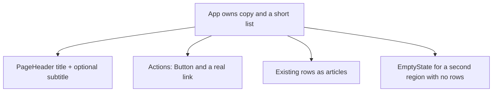
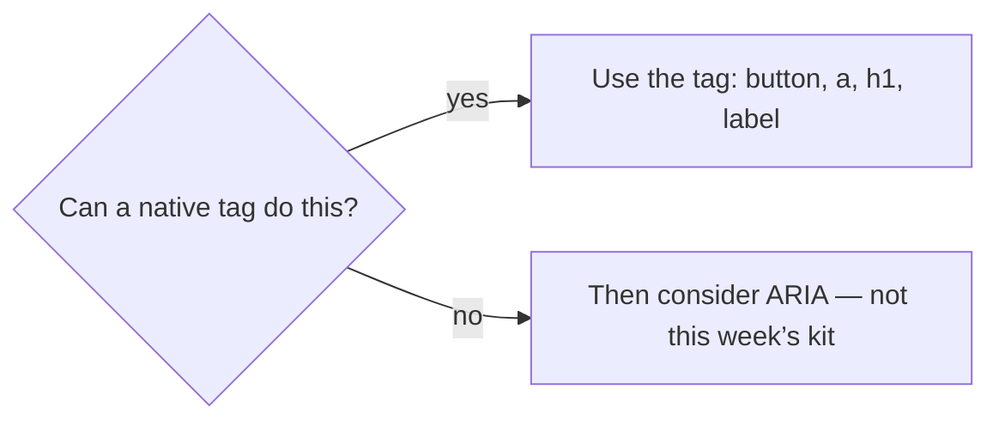

# Month 6 · Week 1 · Day 4
# Lab Feature: A Reusable UI Kit (Still Static)

**Month index:** [../../README.md](../../README.md)  
**Week 1:** [1](day-01.md) · [2](day-02.md) · [3](day-03.md) · Day 4 (today) · [5](day-05.md) · [6](day-06.md) · [7](day-07.md)  
**Week rhythm today:** Add a real lab feature  
**Study time:** 3–4 focused hours  
**Prereq:** Day 3 gate. You can compose a static page from typed props, `children`, and `map` + `key`.

Project 4 will need buttons, page titles, and empty states. Start that habit now — as **your** small kit, not a dashboard template and not TanStack / Redux / Tailwind-as-a-crutch.

This is **not** Project 4. This textbook will not give you the dashboard source. You will get three components you could later reuse *as ideas*.

---

## How to read this chapter

Until today, every component was a one-off: `Header` for this shop, `ProductCard` for this catalog. Real apps grow a **small set of primitives** that many pages share: a button that is actually a `<button>`, a page title that is actually one `h1`, an empty region that still has a heading.

Picture two mistakes:

- **Mega-prop Card:** `showHeader`, `headerAlign`, `elevated`, `footerSlot`, `onHeaderClick`, `padding`. Nobody remembers the API. Every new layout adds a flag.
- **Div soup:** `<div className="btn" onClick>` that looks clickable and is not a button. Month 2 already failed this.

Today you build three small components with **narrow props**, then compose an **inventory preview** that is still static. No `useState`. Tests are **tomorrow**.



Read Block A until you can say, without looking, why a primary “Save” is a `<button>` and “Catalog” is an `<a>`, and why `aria-label` on an already named button is usually a defect. Then type the spec.

---

## Today's contract

By the end of this day you will be able to:

1. Choose **`<button>`** for in-page actions and **`<a href>`** for navigation — the same Month 2 rule, now inside JSX.
2. Apply the **first rule of ARIA**: native HTML first; ARIA only when native cannot express it.
3. Compose **`className`** with a string join (no `clsx` required).
4. Type a **`Button`** (`variant`, `children`, optional `disabled`), a **`PageHeader`**, and an **`EmptyState`** without turning them into mega-props.
5. Build a static **inventory preview** that uses all three.

**Today's gate**

> I can point at every clickable in the page and say whether it is a button or a link, and why. My `Button` component renders a real `<button>`. Empty regions still have a heading. No `useState`.

If you styled a `div` to look like a button, you have not finished. Stay here.

---

## Time box

| Block | Minutes | Work |
|---|---|---|
| A | 50 | Theory: button vs link, ARIA, className, composition |
| B | 40 | Type-along: `Button` + `className` join |
| C | 80 | Feature: kit + inventory preview |
| D | 25 | Git |
| E | 15 | Recall |

---

# Block A — Theory

## 1. Button vs link — Month 2 still owns this

A **link** navigates. It has an `href`. The browser can open it in a new tab, copy the URL, show the destination on hover. Assistive tech announces it as a link.

A **button** **acts** on this page: submit, save, open a dialog, “add row” (the action comes in Week 2 with `onClick`). It is focusable. Space and Enter activate it. It has role **button** without you asking.

| Job | Element | Not |
|---|---|---|
| Go to another URL (or a `#fragment`) | `<a href="...">` | `<button>` with no destination |
| Do something here | `<button type="button">` | `<a href="#">` |
| Submit a form (later) | `<button type="submit">` | a `div` |

Inside a form, `<button>` **without** `type` defaults to **submit**. Always write `type`. Today you have no form. Still write `type="button"` on kit buttons so the habit exists before Week 2.

You may **style** a link to look like a button if it still **navigates**. You may style a button to look quiet if it still **acts**. Looks are CSS. Role is the tag.

**Wrong belief:** “In React I’ll use `<div onClick>` because we do not have href yet.”  
**Correct:** no `onClick` today anyway. A presentational `Button` is still a `<button type="button">`. A “Back to catalog” control that goes somewhere is an `<a>`. A `div` is neither.

**Wrong belief:** “`<a href="#">` is a fine button until we add Router.”  
**Correct:** `#` is a fake destination. It scrolls, it pollutes history, it is a link that does not mean “link.” Use `<button>` if there is no URL.

React Router is **Week 4**. Until then, a real `href` is a real URL: another lab page, a `#id` on this page, or an external page you actually intend. Do not import `react-router` today.

## 2. Accessibility is still HTML

React does not replace the accessibility tree. It **produces** DOM. Month 2 still applies:

- **Landmarks:** `header`, `main`, `footer`. One `h1`.
- **Name:** the accessible name of a button is usually its **text children**. `<Button>Save</Button>` is named “Save.” An icon-only button would need a visible text alternative or (then) `aria-label` — you do not need icon-only today.
- **Keyboard:** a real `<button>` and a real `<a href>` are in the tab order. A `div` is not, unless you fake `tabIndex` and key handlers. Do not fake them.
- **Labels:** when you have inputs (Week 2), `htmlFor` + `id`. Not `className`. Not a placeholder pretending to be a label.

**First rule of ARIA:** if native HTML can express it, use native HTML. Do not put `role="button"` on a `div`. Do not add `aria-label="Save"` on a button whose children already say Save. Wrong ARIA is worse than none: assistive tech **trusts** the role you advertised, even if keyboard behavior is missing.

ARIA attributes exist in JSX (`aria-label`, `aria-disabled`, `aria-expanded`). Existence is not a reason to use them. `disabled={true}` on a `<button>` is native; you do not also need `aria-disabled` on that same button today.



**Wrong belief:** “React components need `aria-*` to be accessible.”  
**Correct:** they need **correct HTML**. A `Button` that returns `<button>` is already a button. A `PageHeader` that returns `<h1>` is already a heading.

## 3. `className` composition — join strings on purpose

A kit button usually has a **base** class plus a **variant** class, and sometimes a class the parent passes for layout (margin). You do not need `clsx` or Tailwind for that.

```tsx
type ButtonProps = {
  variant: "primary" | "secondary";
  children: React.ReactNode;
  disabled?: boolean;
  className?: string;
};

function Button({ variant, children, disabled = false, className }: ButtonProps) {
  const classes = ["btn", `btn--${variant}`, className]
    .filter(Boolean)
    .join(" ");

  return (
    <button type="button" className={classes} disabled={disabled}>
      {children}
    </button>
  );
}
```

`.filter(Boolean)` drops `undefined` when the parent omitted `className`, so you do not get the literal `"undefined"` in the class list. `join(" ")` is ordinary JavaScript.

Variant as a **string union** (`"primary" | "secondary"`) is Month 5 paying rent. `variant: string` would accept `"Primary"` and silently miss the CSS. Do not use `any`.

**Wrong belief:** “Reusable means one component with every class as a boolean prop (`primary`, `secondary`, `large`, `small`, `danger`, `block`).”  
**Correct:** a closed union for the variants you actually have. Size and color explosions are how kits rot. Two variants are enough today.

You may write CSS:

```css
.btn { font: inherit; padding: 0.4rem 0.8rem; cursor: pointer; }
.btn:disabled { opacity: 0.5; cursor: not-allowed; }
.btn--primary { /* your colors */ }
.btn--secondary { /* quieter */ }
```

`:disabled` styles the native state. Keyboard users still land on a disabled button in some browsers; it does not activate. That is native behavior. Do not invent a fake disabled `div`.

## 4. Do not make a mega-prop Card

**Composition** from Day 2 is the API design rule.

A `Card` that takes `title` and `children` can wrap **anything**: a paragraph, a list, an `EmptyState`, two `Button`s. A `Card` that takes `showTable`, `tableRows`, `showChart`, `chartType`, `footerAlign` is a configuration file pretending to be a component.

| Need | Prefer |
|---|---|
| Arbitrary body | `children` |
| One required string the child must show | named prop (`title`) |
| Optional extra line | optional prop (`subtitle?`) |
| “Sometimes a table, sometimes a paragraph” | different children, not `mode="table"` |

Today’s three components stay **small**:

| Component | Receives | Owns | Must not invent |
|---|---|---|---|
| `Button` | `variant`, `children`, `disabled?`, `className?` | `<button type="button">` and kit classes | a URL (that would be a link) |
| `PageHeader` | `title`, `subtitle?` | the page’s `h1` (and optional subtitle) | the rest of the page |
| `EmptyState` | `title`, `children` | a region that explains “nothing here” | the inventory data |

`EmptyState` uses **`children`** for the extra sentence or a `Button` the parent wants to show. Do not add `actionLabel`, `actionHref`, `actionVariant`, `showAction` — that is a mega-prop. The parent composes:

```tsx
<EmptyState title="No archived lots">
  <p>Lots you archive will appear here.</p>
  <Button variant="secondary" disabled>
    Archive is not wired yet
  </Button>
</EmptyState>
```

Disabled is honest: there is no `onClick` this week. A button that pretends to archive would be a lie. Label the disabled control so a human knows it is a preview.

**Wrong belief:** “More props is more reusable.”  
**Correct:** more props is a worse API. Compose.

## 5. `PageHeader` and one `h1`

The page has **one** `h1`. `PageHeader` is a good place to put it. Do not also put an `h1` in `App` wrapping the same words.

```tsx
type PageHeaderProps = {
  title: string;
  subtitle?: string;
};

function PageHeader({ title, subtitle }: PageHeaderProps) {
  return (
    <header>
      <h1>{title}</h1>
      {subtitle ? <p>{subtitle}</p> : null}
    </header>
  );
}
```

`subtitle ? … : null` is an expression (legal in braces). You have not learned Week 2’s `&&` tricks yet; a ternary that returns `null` is enough. Do not render an empty `<p></p>` when subtitle is missing.

If the site chrome already has a wordmark in a banner, that wordmark is **not** a second `h1`. Text in a `p` or a `span` is fine.

## 6. Still no state, still no innerHTML

`disabled` is a **prop**, not state. You pass `disabled={true}` from the parent because the action is not wired. You do not call `useState`. You do not toggle anything.

User-facing strings still go through JSX **text**. Do not `dangerouslySetInnerHTML` an empty-state description from a CMS string you invented. Type the sentences as children.

---

# Block B — Type-along

Continue `~\fullstack-lab\month-06\week-01-catalog` **or** scaffold a dedicated kit app:

```powershell
cd ~\fullstack-lab\month-06
npm create vite@latest week-01-kit -- --template react-ts
cd week-01-kit
npm install
npm run dev
```

If you continue the catalog, keep the shop data; you will **add** kit components and an inventory **region**, not paste Project 4.

### 1. `Button`

Type `src/components/Button.tsx` from the shape in section 3. In `App`, render:

- `<Button variant="primary">Save draft</Button>`
- `<Button variant="secondary">Preview</Button>`
- `<Button variant="primary" disabled>Save draft</Button>`

Wrongly pass `variant="Primary"` and **read** the TypeScript error. Fix it.

In DevTools **Elements**, confirm the node is `button`, not `div`. In the **Accessibility** pane, confirm role `button` and the name matches the visible text.

Temporarily replace the `<button>` with a `<div className={classes}>`. Look at the Accessibility pane. Restore the `<button>`. Write `A11Y.txt`: one paragraph on what went missing (role, keyboard) when it was a `div`.

### 2. `className` from the parent

Pass `className="u-ml"` (or similar) from `App` and add a tiny CSS rule. Confirm both `btn` and `u-ml` appear on the same node. If you see `"btn btn--primary undefined"`, you forgot `.filter(Boolean)`.

---

# Feature spec: inventory preview

A static **inventory preview** for a fictional storeroom (bins, lots, SKUs — still **not** Project 4’s dashboard copy). One page. No router.

### Required components

1. **`Button`** — as specified: `variant: "primary" | "secondary"`, `children`, `disabled?`, optional `className`. Renders `<button type="button">`.
2. **`PageHeader`** — `title`, optional `subtitle`. Owns the page `h1`.
3. **`EmptyState`** — `title` (an `h2` inside the empty region is reasonable; do not add a second `h1`), `children` for the rest.

### Required page

`App` composes:

1. `PageHeader` with a real title and a subtitle.
2. A short **actions** row: one **primary `Button`** (disabled is honest if it does nothing) and one **real `<a href>`** (for example to `#inventory` or to a previous lab URL). The link text must describe the destination. Not “click here.” Not a `Button` pretending to navigate.
3. An **inventory** section with a heading (`h2`) and **two or three** static rows from a typed array (`id`, `name`, `qty` as a **number** you display with `{qty}`). `key={id}`. These can be simple `<article>`s — **do not** invent a mega `Card` with twelve flags. If you want a wrapper, `children` only.
4. A second section that uses **`EmptyState`**: “No archived lots” (or similar) with a sentence and a disabled `Button` as children.
5. Landmarks: site `header` can *be* `PageHeader`, or `PageHeader` can live inside `<main>`. Pick one story and keep **one** `h1`. `footer` with a line of muted text.
6. CSS you write. No Tailwind required.

### `BOUNDARY.md`

Receive / own / must not invent for `Button`, `PageHeader`, `EmptyState`, `App`.

### `DESIGN.txt`

One paragraph: why the “View catalog” (or equivalent) control is an `<a>` and why “Save draft” is a `<button>`. One paragraph: why `EmptyState` takes `children` instead of `actionLabel` + `onAction`.

Tests for `Button` role and card title are **Day 5**. Do not install Vitest today unless you finish early and want to peek — the lesson tomorrow is *why* we query by role.

```powershell
cd ~\fullstack-lab
git add month-06
git commit -m "Week 1 Day 4: static Button PageHeader EmptyState kit."
```

---

# Block E — Recall

Close the file.

1. Button vs link in one sentence each.
2. Why `type="button"` even without a form.
3. First rule of ARIA.
4. How you compose `className` without a library.
5. Why mega-prop `Card` is the wrong kind of reuse.
6. Why a disabled “Archive” is more honest than `<a href="#">` today.

---

## Definition of done

- [ ] `Button` is a real `<button type="button">` with a variant union
- [ ] Accessibility pane showed role button; I saw a `div` fail that check
- [ ] One real `<a href>` on the page; I can explain why it is not a `Button`
- [ ] `PageHeader` owns the only `h1`
- [ ] `EmptyState` uses `children`, not action mega-props
- [ ] No `useState`, no Router, no `any`, no `dangerouslySetInnerHTML`
- [ ] DESIGN.txt and BOUNDARY.md exist
- [ ] Commit exists

---

## Optional review links

Button vs link, ARIA’s first rule, and composition are explained in this chapter. These pages are for later checking, not for first learning.

- [MDN: `<button>`](https://developer.mozilla.org/en-US/docs/Web/HTML/Element/button)
- [MDN: `<a>`](https://developer.mozilla.org/en-US/docs/Web/HTML/Element/a)
- [WAI-ARIA: First rule](https://www.w3.org/TR/using-aria/#MUST)
- [React: Passing props](https://react.dev/learn/passing-props-to-a-component)

---

## Tomorrow

**Tests** with Vitest and React Testing Library: assert **user-visible** behavior (`getByRole`), not `.card-title` in `querySelector`. Then split files, delete leftover Vite demo assets, and write a README that can start the app cold.
