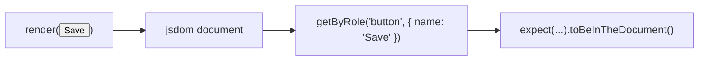

# Month 6 · Week 1 · Day 5
# Tests, Refactor, Docs — First React Testing Library

**Month index:** [../../README.md](../../README.md)  
**Week 1:** [1](day-01.md) · [2](day-02.md) · [3](day-03.md) · [4](day-04.md) · Day 5 (today) · [6](day-06.md) · [7](day-07.md)  
**Week rhythm today:** Tests + refactor + documentation  
**Study time:** 3–4 focused hours  
**Student state:** You have a static kit (`Button`, `PageHeader`, `EmptyState`) and catalog cards. Today you stop hoping DevTools still looks right and start **claiming** it.

The roadmap: React component tests while learning React. Week 4 goes deeper (clicks, forms, Router). Today is the first honest `render`.

Do **not** paste Project 4. Do **not** install TanStack Query or Redux to “make tests real.”

---

## How to read this chapter

Month 3’s `node --test` claimed things about **pure functions**. Today the claim is about **what a user can find in the UI**: a heading whose name is the card title, a control whose role is `button`.

A test is still a claim that can fail. The new piece is a **fake browser** (`jsdom`) plus **Testing Library** queries that look at the page the way assistive tech does — by **role** and **accessible name**, not by your CSS class.



Read Block A until you can explain why `container.querySelector(".card-title")` is the wrong *main* style. Then install, type the config, type **two** tests from this chapter, watch them pass, then **break** one on purpose.

If you finish early, do not add `useState`. Split files. Delete leftover Vite logos. Tighten the README.

---

## Today's contract

By the end of this day you will be able to:

1. Explain **user-visible** queries (`getByRole`, `getByLabelText`) vs implementation details (CSS selectors as the primary assertion).
2. Install Vitest, Testing Library, `jsdom`, and (as needed) `user-event`.
3. Add a minimal **`vitest.config.ts`** and an npm **`test`** script.
4. Write one test: a **Card** (or `ProductCard`) **renders the title text**.
5. Write one test: **`Button` is a real `button` role**.
6. Refactor file splits; delete unused Vite demo assets.
7. Write a **README** that covers `npm run dev` and `npm test`.

**Today's gate**

> `npm test` is green for those two claims, and I have seen a test go red when I turned `Button` into a `div` on purpose, then restored it.

If you only ran `npm run dev` and looked at the page, you do not have tests. Stay here.

---

## Time box

| Block | Minutes | Work |
|---|---|---|
| A | 40 | Theory: what RTL is testing |
| B | 50 | Install, config, two tests |
| C | 50 | Deliberate fail, restore, refactor assets |
| D | 35 | README + TESTS.md |
| E | 15 | Recall |

---

# Block A — Theory

## 1. What we are testing (and what we are not)

Two layers still exist from Month 5:

| Layer | Tool | Proves |
|---|---|---|
| Types | `tsc` / the Vite + TS pipeline | Wrong-shaped **props** cannot be passed from typed code |
| UI | Vitest + Testing Library | The **rendered** tree exposes the heading / button a user would find |

`tsc` will not tell you that `Button` returned a `div`. A role query will.

You are **not** testing today:

- click handlers (no `useState`, no `onClick` yet)
- CSS pixels, layout, colors
- React internals (`useState` identity, Fiber)
- Project 4 screens

**Wrong belief:** “Component tests mean I snapshot the whole HTML string.”  
**Correct:** you assert **meaning**: there is a heading named “Spare gaskets”; there is a button named “Save draft.” Snapshots that dump markup rot the first time you add a `className`.

## 2. Query like a user, not like a stylesheet

Testing Library’s default advice is the query priority you should feel in your fingers:

1. **`getByRole`** — `button`, `link`, `heading`, `textbox`, … plus `{ name: "Save draft" }` for the accessible name.
2. **`getByLabelText`** — inputs with a real `<label>` (Week 2). Learn the name today; you may not have a labeled input yet.
3. **`getByText`** — when the thing is not a named control (a blurb paragraph).
4. **`getByTestId`** — last resort when the UI has no role or text you can honestly use. Do not sprinkle `data-testid` on every `div` this week.

`getByRole("heading", { name: "Spare gaskets" })` fails if you used a styled `<p>` as a title. That is a **gift**. The test is telling you the outline is wrong, the same way Month 2’s heading audit did.

The style this course **rejects as the main assertion**:

```tsx
// Do not make this your default
expect(container.querySelector(".card-title")?.textContent).toBe("Spare gaskets");
```

Why it is weak:

- Rename `.card-title` to `.product-name` and the test screams though users saw nothing change.
- The test never asked whether that text is a **heading**. A `span` with that class would pass.
- You coupled the test to **your** CSS, not to the contract.

`querySelector` is allowed when you are debugging a test. It is not the contract.

**Wrong belief:** “I’ll test `className === 'btn btn--primary'`.”  
**Correct:** users do not consume class lists. If you care that the variant union mapped to a class, you are testing implementation. Prefer: the control is a button named Save. Variant CSS can wait; a visual regression tool is not this course’s Day 5.

## 3. `getByRole` and the `Button` lesson

Day 4’s whole point was: `Button` must render `<button>`. The test that locks it:

```tsx
test("Button is a real button", () => {
  render(<Button variant="primary">Save draft</Button>);
  expect(screen.getByRole("button", { name: "Save draft" })).toBeInTheDocument();
});
```

If `Button` returns `<div className="btn">Save draft</div>`, **`getByRole("button")` throws**. There is no button. That is the test doing its job.

`name` here means **accessible name**, not the HTML `name` attribute. For a button, that is usually the text children.

`getByRole("link", { name: "…" })` would lock yesterday’s real `<a>`. Optional stretch, not required.

## 4. The Card title test

Your catalog `ProductCard` or a small `Card` with a `title` prop should expose that title as a **heading** (Day 3: `h2` in the article is the right rank under the page `h1`).

```tsx
test("Card renders the title text", () => {
  render(
    <ProductCard
      name="Spare gaskets"
      price="$4.00"
      blurb="Bin A2"
    />,
  );
  expect(
    screen.getByRole("heading", { name: "Spare gaskets" }),
  ).toBeInTheDocument();
});
```

Match **your** prop names (`name` vs `title`). The claim is: the user-visible title is in the accessibility tree as a heading. If you only `getByText("Spare gaskets")`, a footer that accidentally repeats the name would also satisfy it. Role + name is tighter.

If `ProductCard` requires `id` in its props, pass a dummy id. The test is not the shop database.

## 5. Arrange, act, assert — still true

1. **Arrange** — `render(<Button variant="primary">Save draft</Button>)`.
2. **Act** — today, render *is* the act. Later, `await user.click(...)`.
3. **Assert** — `expect(screen.getByRole(...)).toBeInTheDocument()`.

`toBeInTheDocument` comes from **`@testing-library/jest-dom`**. Without the setup import, that matcher is missing and the error looks like Vitest forgot `expect`. Read the error. Add the setup file.

`user-event` (`@testing-library/user-event`) simulates **real** typing and clicking better than `fireEvent`. Install it today so the kit is on disk. **Do not** require a click test until Week 2 — there is nothing to click that changes the page.

## 6. Vitest vs the Vite app

**Vitest** is the test runner from the Vite family. It understands TypeScript and your aliases the way Vite does. **`jsdom`** is a DOM implementation in Node so `document` exists during tests. Your tests still **import components**; they do not open `http://127.0.0.1:5173` (that would be end-to-end, later).

`npm run dev` is the **app**. `npm test` is the **claims**. You need both. A green test suite with a broken `main.tsx` is possible if you never import `main`. That is fine today.

---

# Block B — Install and config

Work in the kit/catalog app from Days 3–4 (`week-01-catalog` or `week-01-kit`). PowerShell:

```powershell
cd ~\fullstack-lab\month-06\week-01-kit
# if your folder is week-01-catalog, cd there instead
npm install -D vitest @testing-library/react @testing-library/jest-dom @testing-library/user-event jsdom
```

Dev dependency (`-D`) is correct: tests are not shipped to users.

### `vitest.config.ts`

At the project root, next to `vite.config.ts`, type:

```ts
import { defineConfig } from "vitest/config";
import react from "@vitejs/plugin-react";

export default defineConfig({
  plugins: [react()],
  test: {
    environment: "jsdom",
    setupFiles: "./src/test/setup.ts",
  },
});
```

`environment: "jsdom"` is why `document` exists. Without it, `render` fails with a missing `window` / `document`.

You now have **two** Vite-ish configs. That is OK: Vitest loads `vitest.config.ts`. Keep `vite.config.ts` for `npm run dev`. Do not delete the React plugin from either.

### Setup file

`src/test/setup.ts`:

```ts
import "@testing-library/jest-dom/vitest";
```

The `/vitest` path wires matchers for Vitest (not Jest). If you import the wrong entry, read the package error and fix the import. Do not add `any`.

### `test` script

In `package.json` `scripts`, add:

```json
"test": "vitest run"
```

`vitest run` executes once and exits — the same idea as `node --test`. Plain `vitest` **watches**; useful while iterating, noisy for a recorded PASS. README may mention both. The script you claim in `TESTS.md` is `npm test` → `vitest run`.

Keep `"dev": "vite"`. You will document both.

### The two test files

Put tests next to the component or under `src/components/` with a `.test.tsx` suffix. Import `{ expect, test } from "vitest"` and `{ render, screen } from "@testing-library/react"`. **Do not** enable `globals: true` today — explicit imports match Month 3’s `import { test } from "node:test"`.

Type the Card-title test and the Button-role test from Block A, adjusted to **your** exports and prop names.

```powershell
npm test
```

Read failures. Common first-day errors:

| Error (paraphrased) | Usual cause |
|---|---|
| `document is not defined` | `environment` not `jsdom`, or config file not named / not loaded |
| `Invalid Chai property: toBeInTheDocument` | setup file missing or wrong jest-dom import |
| `Unable to find an accessible element with the role "button"` | you rendered a `div`, or the name does not match children |
| `Unable to find role "heading"` | title is a `p` / `span`, not `h1`–`h6` |

Fix the **component** or the **test**, not both at random. If the title is visually large but not a heading, the component is wrong.

---

# Block C — Break, restore, refactor

### Deliberate fail

In `Button.tsx`, temporarily return a `<div>` with the same `className` and children. Run `npm test`. The button-role test **must** go red. Write in `TESTS.md` which assertion failed. Restore `<button type="button">`. Re-run. Green.

If it stayed green, you queried `getByText` only, or you never saved the file. Fix the test so a `div` cannot hide.

### Split files

If `App.tsx` still contains `Button` / `PageHeader` / `EmptyState` / `ProductCard` inline, move them to `src/components/` with **named exports**. `App` imports them. Tests import them from the same modules. Do not create `atoms/molecules/organisms` folders.

### Delete unused Vite demo assets

The template shipped logos and a counter demo. If `src/assets/react.svg`, `public/vite.svg`, and leftover `App.css` keyframes from the demo are unused, **delete** them and remove the imports. A README screenshot of the Vite mascot is not a product.

Do not delete `index.html`, `main.tsx`, or `index.css` you actually use.

Confirm `npm run dev` still shows **your** inventory / catalog, and `npm test` still passes.

No `useState`. No new features. Refactor is clarity, not a second kit.

---

# Block D — README and record

At the app root, `README.md` a stranger could follow:

1. What this folder is (Week 1 static React lab — **not** Project 4).
2. Node: you already have LTS from Month 5; Vite 7 wants 20.19+ / 22.12+.
3. `npm install`
4. **`npm run dev`** — open the **HTTP** URL Vite prints. Not `file://`.
5. **`npm test`** — Vitest once, jsdom, Testing Library.
6. What this app does **not** do: no Router, no `useState`, no backend.

`TESTS.md`:

| Command | Claim | Result |
|---|---|---|
| `npm test` | Card title is a heading; Button is role `button` | PASS (date) |
| deliberate `div` | button test fails | observed, then restored |

```powershell
cd ~\fullstack-lab
git add month-06
git commit -m "Week 1 Day 5: RTL role tests, vitest, README."
```

---

# Block E — Recall

Close the file.

1. Why `getByRole("button")` is the Button contract.
2. Why `.card-title` as the main query is weak.
3. What `jsdom` is for.
4. What `vitest run` vs `vitest` (watch) does.
5. Why `user-event` can sit installed without a click test today.

---

## Definition of done

- [ ] `vitest.config.ts` has `environment: "jsdom"` and a setup file
- [ ] `npm test` runs `vitest run` and is green
- [ ] Card/title test uses `getByRole("heading", …)` (or I wrote why my title is not a heading **and then I made it one**)
- [ ] Button test uses `getByRole("button", …)`
- [ ] I saw the `div` substitution fail, then restored
- [ ] Demo Vite assets removed if unused
- [ ] README documents `npm run dev` and `npm test`
- [ ] No Project 4 source, no `any`, no `dangerouslySetInnerHTML`
- [ ] Commit exists

---

## Optional review links

Testing Library queries and Vitest are explained in this chapter. These pages are for later checking, not for first learning.

- [Testing Library: About queries](https://testing-library.com/docs/queries/about)
- [Testing Library: `getByRole`](https://testing-library.com/docs/queries/byrole)
- [Vitest: Getting started](https://vitest.dev/guide/)
- [Vitest: jsdom environment](https://vitest.dev/config/#environment)

---

## Tomorrow

Independent: a **clinic admin chrome** (fictional, not Project 4), a 400+ word teach-back, and a Header-title test. Days 1–5 stay closed during the challenges; repair from **this week’s recap in Day 6**.
