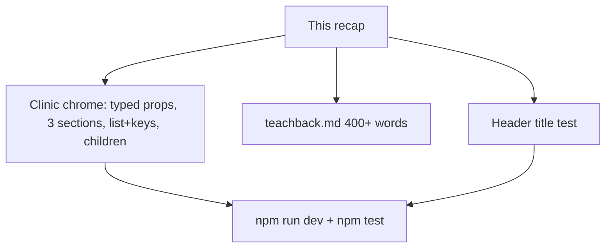

# Month 6 · Week 1 · Day 6
# Independent: Clinic Admin Chrome (Static)

**Month index:** [../../README.md](../../README.md)  
**Week 1:** [1](day-01.md) · [2](day-02.md) · [3](day-03.md) · [4](day-04.md) · [5](day-05.md) · Day 6 (today) · [7](day-07.md)  
**Week rhythm today:** Independent project work  
**Study time:** 3–4 focused hours  
**Days 1–5 textbook files:** closed for the *challenges*. Repair from **this recap**.

---

## How to read this chapter

Today you prove Week 1 without a type-along. The complete explanation below **is** the lesson. Read a section. Close it. Say it in one sentence. Then build.

If you catch yourself copying the Day 4 inventory page into a “clinic” by renaming SKUs to tickets, stop. New domain, new copy, same *rules*.



Allowed during challenges: this file, your notes, the error in front of you.  
Not allowed: Days 1–5 as a paste source, Project 4’s spec as a layout to clone, AI writing `App.tsx`.

If you are stuck more than 25 minutes, open **only** Day 1 or Day 2 **in this textbook**, read one section, close it, continue. Record the lookup.

No `useState`. No React Router. No class components. No `dangerouslySetInnerHTML`. No `any`.

---

## Complete explanation (this book is the lesson)

You already practiced these ideas. Here they are again in full, so a later review never requires another page.

### React is a UI library, not a backend

React runs in the **browser** (this course). Components are **functions** that return a **description** of UI (JSX). React turns that description into DOM inside `#root`. It does not replace HTTP, FastAPI, or PostgreSQL. It replaces you walking the DOM by hand for every change.

**Wrong belief:** “I need React to make a website.”  
**Correct:** Month 2 sites were websites. React is for **apps** whose UI will change a lot. This week the UI is still static. The *structure* is what you are learning.

### Boot

`index.html` → empty `#root` + module script → `main.tsx` → `createRoot(...).render(<StrictMode><App /></StrictMode>)`. Serve with Vite **`npm run dev`** over **HTTP**, not `file://`. `StrictMode` is development checks, not a visible wrapper. Do not remove it to silence double logs you do not have yet.

```tsx
createRoot(document.getElementById("root")!).render(
  <StrictMode>
    <App />
  </StrictMode>,
);
```

`App.tsx` is the first component, not “the website.”

### A component is a PascalCase function

```tsx
export function Header({ clinicName }: { clinicName: string }) {
  return (
    <header>
      <p>{clinicName}</p>
    </header>
  );
}
```

You include it as `<Header clinicName={clinicName} />`. `<header />` (lowercase) is the HTML element. That distinction is the whole naming rule.

Function components only. No `class Header extends React.Component`.

### JSX rules

One parent per return: a fragment `<>...</>` or a landmark (`<main>`). Two adjacent tags without a wrapper are a syntax error because a function returns one value.

Braces `{clinicName}` interpolate expressions. `.map(...)` is an expression; that is why lists work inside JSX.

| Do not write | Write |
|---|---|
| `class=` | `className=` |
| `for=` on a label | `htmlFor=` |
| unclosed `` | `` |

**Wrong belief:** “I’ll paste HTML and it will work.”  
**Correct:** you will translate attributes. That translation is the skill.

### Props, types, children, boundaries

Props are **read-only arguments**. Type them:

```tsx
type Visit = { id: string; patient: string; when: string };

type VisitListProps = {
  visits: Visit[];
};
```

Optional props use `?`. Default in the destructure when you have a sensible default. **`any` is banned.** Types **erase**; they still catch `clinicName={42}` at compile time.

Do not mutate props (`visits.push(...)`). Derive locals for display (`const label = clinicName.trim()`).

**`children`** is the nested JSX. Type `ReactNode`. A wrapper (`Shell`, `Panel`, `Card`) that only supplies chrome should take `children` rather than `bodyHtml: string`.

**Composition** beats a mega-prop component. Three **sections** today means three composed regions (for example: schedule, rooms, notices) — not one `Dashboard` with `showSchedule`, `showRooms`, `showNotices`.

A **boundary**: receive / own / must not invent. `App` owns the clinic name and the arrays. `Header` receives the name. A `VisitRow` must not invent the visit list.

When two children need the same string, it lives in the **parent** (`App`) and is passed twice. Two hard-coded clinic names are a bug.

### Lists and keys

```tsx
{visits.map((visit) => (
  <VisitRow key={visit.id} patient={visit.patient} when={visit.when} />
))}
```

**`key` is the `id`**, unique among siblings, stable. Not the array index. Not `Math.random()`. Index appears to work on a static list and then poisons you in Week 2 when the list reorders.

### Button vs link vs div (Day 4, still true)

`<button type="button">` for actions. `<a href="...">` for navigation. Do not use `<div>` as a button. Do not use `<a href="#">` as a button. ARIA only if native HTML cannot express it. A `Button` kit component must still render a **real** `<button>` so `getByRole("button")` can find it.

React does not add keyboard support to a `div`. A real `<button>` already has role, focus, Space, and Enter. `aria-label` on a button whose children already say “Print list” is redundant and can fight the visible name.

`className` composition is a string join: `["btn", `btn--${variant}`, className].filter(Boolean).join(" ")`. No `clsx` required.

Three sections does **not** mean three boolean props on one `Chrome` component. It means `App` nests three regions (each a component or a `Panel` with `children`). Worked shape — you invent the copy:

```tsx
<Shell clinicName={clinicName}>
  <VisitPanel visits={visits} />
  <RoomPanel rooms={rooms} />
  <NoticePanel>
    <p>Shift change at 15:00.</p>
  </NoticePanel>
</Shell>
```

`Shell` owns chrome and can render Header/Footer using `clinicName`. It must not invent the visits array. `VisitPanel` maps with `key={visit.id}`.

### XSS

JSX **text** is safe (`{note}` is `textContent`). **`dangerouslySetInnerHTML` is forbidden.** There is no sanitizer in this course yet. Pass children or strings as text.

### Tests you already met

Vitest + `jsdom` + Testing Library. Query **user-visible** behavior: `getByRole("heading", { name: "…" })`, `getByRole("button", { name: "…" })`. Do not make `container.querySelector(".header-title")` the contract.

A new Vite app does not include this stack. Install and configure it from **this** recap:

```powershell
npm install -D vitest @testing-library/react @testing-library/jest-dom jsdom
```

`vitest.config.ts` next to `vite.config.ts`:

```ts
import { defineConfig } from "vitest/config";
import react from "@vitejs/plugin-react";

export default defineConfig({
  plugins: [react()],
  test: {
    environment: "jsdom",
    setupFiles: "./src/test/setup.ts",
  },
});
```

`src/test/setup.ts` is one line: `import "@testing-library/jest-dom/vitest";`. In `package.json` scripts: `"test": "vitest run"`. Import `{ expect, test } from "vitest"` and `{ render, screen } from "@testing-library/react"` in the test file. `environment: "jsdom"` is why `document` exists. Missing setup is why `toBeInTheDocument` is “not a function.”

Today’s required test is the **Header title** as a heading or named banner text — see Challenge 3. If the clinic name is only a `<p>` in a banner and the **page** `h1` is “Today’s board”, test the contract you actually designed: either Header exposes a heading, or you test `getByRole("heading", { name: "Today’s board" })` **and** `getByText(clinicName)` for the wordmark. Document the choice. Prefer: the page `h1` is unique and tested by role.

```tsx
test("page heading is the board title", () => {
  render(<Header clinicName="Harbor Clinic" />);
  // Adjust to *your* Header: heading vs wordmark <p>.
  expect(screen.getByText("Harbor Clinic")).toBeInTheDocument();
});
```

If Header’s wordmark is not a heading, **also** test the `h1` from `PageHeader` or `App` with `getByRole("heading", { name: "Today’s board" })`. A `getByText` on a string that also appears in the footer is weaker than a role query. Tighten it.

**Wrong belief:** “I’ll query `.brand` because that is the class I wrote.”  
**Correct:** classes change in a refactor. The accessible name is the contract.

### Teach-back quality

A teach-back that lists keywords (`JSX props children key`) is a glossary. A teach-back that tells the story — why Footer must receive `clinicName`, why index keys lie, why a `div` button fails `getByRole` — is teaching. Aim for the story. If you cannot write 400 words, you do not yet own the week. Re-read **this** explanation, then write. Do not open Day 1 as a paste source.

### Typed fragments you adapt (not a page to paste)

`App` owns data. Everything else receives props. This is the shape, not Harbor Clinic’s copy — invent yours:

```tsx
type Visit = { id: string; patient: string; when: string };
type Room = { id: string; name: string; status: string };

type ShellProps = {
  clinicName: string;
  children: React.ReactNode;
};

function Shell({ clinicName, children }: ShellProps) {
  return (
    <>
      <Header clinicName={clinicName} />
      <main>{children}</main>
      <Footer clinicName={clinicName} />
    </>
  );
}
```

`VisitPanel` maps with `key={visit.id}`. It must not call `visits.push`. It must not invent a fifth visit. If two panels need the clinic name, they do not each hard-code it.

**Wrong belief:** “I’ll put `clinicName` in a module-level `let` so Header can import it.”  
**Correct:** that is a hidden global. Pass the prop. Week 2’s state will live in a component; a module `let` will not re-render.

**Wrong belief:** “Three sections means `Chrome` takes `showVisits`, `showRooms`, and `showNotices`.”  
**Correct:** compose. Boolean flags on one mega-component is the API you are unlearning today.

`BOUNDARY.md` is three questions per component, in sentences:

| Component | Receives | Owns | Must not invent |
|---|---|---|---|
| `App` | nothing from a parent | `clinicName`, `visits`, `rooms` | a router, a fetch |
| `Shell` | `clinicName`, `children` | landmark chrome | the visit array |
| `VisitRow` | one visit’s fields | `<li>` markup | the rest of the list |

If `VisitRow` needed the whole array, your boundary is wrong — the parent maps.

### Windows, Vite, and what “independent” still means

PowerShell needs the extra `--` before `--template`. Serve **HTTP**. `node_modules` stays untracked. You may scaffold `independent` or reuse a Week 1 folder with a **new** `src/` tree; a dedicated app is cleaner because imports cannot accidentally point at Day 4’s inventory names.

No `useState`. If you add a counter “just to see clicks,” you have started Week 2 during Week 1’s exam. Delete it.

---

## Today's contract

By the end of this day you will be able to:

1. Scaffold (or isolate) a static **clinic admin chrome** with typed props, three composed sections, a keyed list, and a `children` wrapper.
2. Teach Week 1 in **400+ words of prose**.
3. Run a test that locks the **Header / page title** a user would see.

**Today's gate**

> `npm run dev` shows a clinic shell I can explain, `npm test` locks the title, the teach-back is paragraphs a human would speak, and nothing here is Project 4 with the serial numbers filed off.

---

## Time box

| Block | Minutes | Work |
|---|---|---|
| A | 20 | Read this recap; speak boot + props + key |
| B | 80 | Challenge 1 — clinic chrome |
| C | 40 | Challenge 3 — Header title test |
| D | 50 | Challenge 2 — teach-back prose |
| E | 20 | Git |

---

# Challenge 1 — Clinic admin chrome

**New Vite app** *or* a folder `independent/` under `month-06`. Prefer a dedicated app so imports stay honest:

```powershell
cd ~\fullstack-lab\month-06
npm create vite@latest independent -- --template react-ts
cd independent
npm install
npm run dev
```

Fictional **clinic admin chrome**. Invent Harbor / Northline / a name you have not used as a *dashboard clone*. This is **not** Project 4: no mock auth wall, no TanStack Query, no “tickets table copied from the spec,” no Redux, no Router.

### Required

1. **Typed props** on every reusable component. `type` aliases. No `any`. No `React.FC` superstition.
2. **Three composed sections** inside `main` (examples: today’s visits, room status, staff notices). Each section is a component or a `Panel` with a heading. `App` composes them.
3. **List + keys:** at least one array of `{ id: string; ... }` mapped to rows/cards with **`key={id}`**.
4. **Children wrapper:** a `Shell` or `Panel` that takes `children` (and maybe `title`) and wraps chrome — padding, `<section>`, heading. Do not pass HTML strings.
5. **Shared name:** `clinicName` (or `boardName`) owned by `App`, passed into **Header and Footer**.
6. **One `h1`** for the page. Semantic `header` / `main` / `footer`. CSS you type. No Tailwind required.
7. If you include a control: real `<button type="button">` or real `<a href>`. No `div` buttons. Disabled is honest if the action is not wired.
8. `BOUNDARY.md` for `App`, the wrapper, and one list child.

Delete unused Vite demo logos. Keep `StrictMode`.

---

# Challenge 2 — Teach-back

`teachback.md` (**400–700 words**, prose):

Explain components, JSX (fragment, `className`, braces), props and why they are read-only, `children`, composition vs mega-props, keys, why JSX text is safe and `dangerouslySetInnerHTML` is not, and how a Testing Library role query matches Month 2’s “use a real button.”

Not a bullet dump of keywords. Not a paste of this file. Write as if a classmate missed Days 1–5. Include at least one **Wrong belief / Correct** pair in full sentences.

---

# Challenge 3 — Test the Header title

Install and configure from **this file’s** recap (config + setup + `test` script). `user-event` is optional (no click). Do not paste Project 4.

One required test: **Header (or page header) exposes the title text** via `getByRole("heading", { name: ... })` if that title is the `h1`/`h2` you chose, **or** — if Header is only a wordmark — test `PageHeader` / the `h1` in `main`. The file may be `Header.test.tsx`. The claim in `TESTS.md` must name which string you locked.

Deliberate: change the heading text in the component, see red, restore. Or render Header with `clinicName="Harbor Clinic"` and assert that name if Header’s heading *is* that string.

```powershell
npm test
```

```powershell
cd ~\fullstack-lab
git add month-06/independent
git commit -m "Week 1 Day 6: independent clinic chrome and title test."
```

---

## Definition of done

- [ ] Independent app/folder runs on Vite HTTP
- [ ] Typed props, three sections, keyed list, children wrapper
- [ ] Header and Footer share one name from `App`
- [ ] Teach-back is 400+ words of prose
- [ ] `npm test` locks a heading/title claim
- [ ] No `useState`, no Router, no Project 4 clone
- [ ] Commit exists

---

## Optional review links

Week 1 React is explained in this chapter. These pages are for later checking, not for first learning.

- [React: Thinking in React](https://react.dev/learn/thinking-in-react)
- [Testing Library: `getByRole`](https://testing-library.com/docs/queries/byrole)

---

## Tomorrow

Week review: speak the synthesis, a tiny static mini-build, six debug prompts, retro. Week 2 preview: **`useState`**, events, controlled inputs. Repair the weakest hole **today** if the teach-back already showed it.
