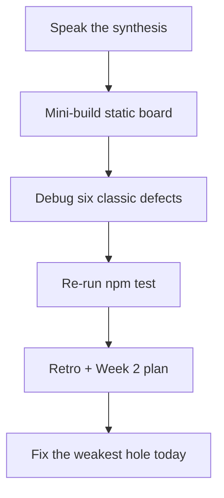
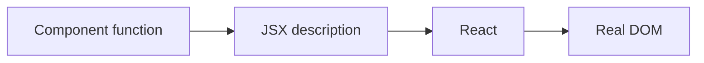

# Month 6 · Week 1 · Day 7
# Week Review — Components, JSX, Props, Composition

**Month index:** [../../README.md](../../README.md)  
**Week 1:** [1](day-01.md) · [2](day-02.md) · [3](day-03.md) · [4](day-04.md) · [5](day-05.md) · [6](day-06.md) · Day 7 (today)  
**Week rhythm today:** Review, repair, plan Week 2  
**Study time:** 3–4 focused hours  
**Student state:** You have scaffolded Vite, composed static pages, typed props, written a first Testing Library test. Today those ideas must still live in your head — from **this file**, not from a hook catalog you have not earned yet.

Do not start Week 2 because the calendar moved. Start Week 2 because this file’s gate is true.

---

## How to read this chapter

This is a **closed-book teaching day**. The synthesis below is the lesson, written so you can re-learn Week 1 from this page alone if the week is foggy.

1. Read a section. Close it. Say the idea in one honest sentence.
2. Then do the review blocks in order. During the mini-build, Days 1–6 stay closed. If you go blank, re-read **this synthesis**, not a random article.
3. Repair the weakest topic **today**. Week 2 (`useState`, events, controlled inputs) assumes components, props, and JSX are automatic.



---

## Week synthesis (the lesson, in this book)

**React** is a UI library: functions in, DOM out, inside `#root`. Vite serves **HTTP**. `createRoot` + `StrictMode` + `App`.

**Component:** PascalCase function. Returns JSX or `null`. Function components only.

**JSX:** one parent or fragment; `{expressions}`; `className`; `htmlFor`; self-closing tags. Not HTML; looks like it.

**Props:** read-only inputs, typed, data down. Shared strings live in the parent. **`children`** is nested JSX. **Composition** beats mega-props.

**Lists:** `map` + stable **`key` = id**, not index.

**A11y:** `<button>` acts, `<a href>` navigates; no `div` buttons; ARIA only if native cannot. Same Month 2 rules inside React.

**Safety:** JSX text is safe. `dangerouslySetInnerHTML` is `innerHTML` — forbidden. No `any`.

**Tests:** Testing Library queries **roles and names**, not `.card-title`.

The rest of this file unpacks each sentence so a student who only has **today’s file** can still teach the week.

---

## Today's contract

By the end of this day you will be able to:

1. Teach Week 1 aloud from the synthesis, without opening Days 1–6.
2. Build a tiny static board from memory (typed list, one `h1`, Header/Footer shared name).
3. Diagnose six classic defects (two JSX roots; `class` vs `className`; mutated props; missing key; `div` as button; `dangerouslySetInnerHTML`).
4. Re-run `npm test` on a Week 1 app and record PASS.
5. Write a retro and a Week 2 plan, then repair the weakest React topic today.

**Today's gate.** Closed-book:

> I can explain component → JSX → DOM, typed read-only props, `children`, keys, why a button is a `<button>`, and I have a green `npm test` this week.

If you cannot, stay on Week 1. `useState` on a mushy props story becomes two problems.

---

## Time box

| Block | Minutes | Work |
|---|---|---|
| 1 | 40 | Closed-book: speak the synthesis |
| 2 | 50 | Mini-build: `review/` static board |
| 3 | 35 | Debug six defects on paper |
| 4 | 20 | Re-run tests |
| 5 | 25 | Retro + Week 2 plan + repair |

---

# Complete explanation — React you must still own

## 1. What problem React solves

The screen must stay in sync with **data**. Hand-editing the DOM for every click does not scale. React’s bet: write a **function** of the data. When data changes (Week 2), React calls the function again, diffs the description, updates the DOM.

**Wrong belief:** “React is the backend.”  
**Correct:** React is the **view** in the browser. `fetch` and APIs still exist. You did not use them this week.

## 2. Boot sequence

1. Browser loads `index.html`.
2. `#root` is empty. A module script loads `main.tsx`.
3. `createRoot(document.getElementById("root")!).render(<StrictMode><App /></StrictMode>)`.
4. `App` runs, returns JSX, React creates DOM **inside** `#root`.

`StrictMode` extra-invokes some logic in development on purpose. It is not a second UI. Leave it on.

**Wrong belief:** “`App.tsx` is the website.”  
**Correct:** the HTML document is the website. React fills one node.

Vite: `npm create vite@latest name -- --template react-ts` (extra `--` in PowerShell), then `npm install`, `npm run dev`. Open the **http://** URL. Never `file://` for this app.

## 3. Components and JSX

PascalCase function. `<Greeting />` is a component node. Lowercase `div` is HTML-like.

**One parent.** This is illegal:

```tsx
return (
  <h1>Title</h1>
  <p>Body</p>
);
```

A function returns one value. Wrap with `<>...</>` (fragment: no extra DOM node) or with `<main>`.

**Braces** for expressions: `{clinicName}`, `{items.map(...)}`. No `if` statement inside `{}`.

**`className`**, not `class`. **`htmlFor`**, not `for`. Self-close void tags.



**Wrong belief:** “JSX is HTML.”  
**Correct:** JSX is syntax that compiles to JavaScript. Reserved words force `className`.

## 4. Props, children, composition, boundaries

```tsx
type PanelProps = {
  title: string;
  children: React.ReactNode;
};

function Panel({ title, children }: PanelProps) {
  return (
    <section>
      <h2>{title}</h2>
      {children}
    </section>
  );
}
```

The parent **passes**. The child **reads**. Data flows **down**. Type props; optional `?`; no `any`; this course does not require `React.FC`.

**Read-only:** do not assign to props; do not `push` on a passed array. Make a local derived value.

**`children`** is how wrappers work. Mega-prop Cards (`showTable`, `footerAlign`, …) are a worse API than nesting.

**Boundary:** receive / own / must not invent. Shared `shopName` / `clinicName` lives in `App`.

**Wrong belief:** “More props is more reusable.”  
**Correct:** compose.

## 5. Lists and keys

`key` identifies a sibling across renders. Use a **stable id**. Index keys look fine until insert/reorder: React reuses the wrong child. `Math.random()` is a new identity every render — worse.

```tsx
{shifts.map((shift) => (
  <article key={shift.id}>
    <h2>{shift.label}</h2>
    <p>{shift.detail}</p>
  </article>
))}
```

The `key` sits on the **outermost element returned from `map`**. Putting `key` on an inner `<h2>` does not identify the article. `key` is not an HTML attribute you style; DevTools Components shows it.

**Wrong belief:** “The list is static this week, so index is honest.”  
**Correct:** the habit is the skill. Week 2 will reorder. Assign `id` when you type the array.

## 6. Buttons, links, ARIA

Month 2: **`<button type="button">`** for actions; **`<a href>`** for navigation. Style however you want; the tag is the role.

A `div` with a class `btn` is not a button: no role, no keyboard contract. `role="button"` on that `div` **lies** unless you also fake tab and keys. Use `<button>`.

ARIA **first rule:** native HTML first. Do not `aria-label` a button that already has visible text.

`className` join: `["btn", `btn--${variant}`, className].filter(Boolean).join(" ")`.

## 7. XSS and types

`{userString}` interpolates **text**. That is safe like `textContent`.

**`dangerouslySetInnerHTML={{ __html: s }}`** is `innerHTML`. Forbidden this month. You do not have a sanitizer. Pass `children`.

`.tsx` still **erases** types. `any` still turns the checker off.

## 8. Tests

Vitest + jsdom + Testing Library. `getByRole("heading" | "button", { name })`. Not `container.querySelector(".card-title")` as the contract. `npm test` → `vitest run`. Setup: `@testing-library/jest-dom/vitest`.

A test that stays green when `Button` becomes a `div` is not testing the Day 4 contract.

```tsx
import { expect, test } from "vitest";
import { render, screen } from "@testing-library/react";
import { Header } from "./Header";

test("board heading is visible", () => {
  render(<Header clinicName="Harbor Clinic" />);
  expect(screen.getByText("Harbor Clinic")).toBeInTheDocument();
});
```

Prefer a **heading** role when the string is an `h1`/`h2`. If the wordmark is a `<p>`, test the page `h1` by role **and** the wordmark by text. Document the choice in `review/TESTS.md`.

**Wrong belief:** “I’ll skip tests today because this is review.”  
**Correct:** a green `npm test` on a Week 1 app is part of the gate. If it is red, the week is not finished.

## 9. Composition story you should still tell

`App` holds `boardName` and the array. `Header` and `Footer` both receive `boardName`. A `Panel` takes `title` and `children`. Three shifts are three mapped articles, not three boolean props. That paragraph is Week 1.

Windows scaffold if the review folder is a new app:

```powershell
cd ~\fullstack-lab\month-06
npm create vite@latest week-01-review -- --template react-ts
cd week-01-review
npm install
npm run dev
```

HTTP only. Extra `--` before `--template` is required in PowerShell.

---

# 1. Closed-book explanation (40 min)

Speak every Week 1 topic from the synthesis. Close Days 1–6. You may keep **this** file open for the first pass, then close it and speak again.

Cover, out loud:

1. React vs “a new language” vs “the backend”  
2. `index.html` → `createRoot` → `App`; why HTTP  
3. `StrictMode`  
4. PascalCase; one parent / fragment  
5. `className`, `htmlFor`, braces  
6. Typed props; read-only; where shared data lives  
7. `children` vs mega-props  
8. `key={id}`  
9. Button vs link vs `div`  
10. JSX text vs `dangerouslySetInnerHTML`  
11. `getByRole` vs CSS selectors  

If a topic is under two true sentences, it is weak — write it down for the retro.

---

# 2. Independent mini-build (50 min)

New folder **`~\fullstack-lab\month-06\week-01-review\`** — either a tiny Vite app or a `src/` you add to an existing lab. Days 1–6 closed. This synthesis is allowed.

Static **shift board** (fictional clinic or shop — not Project 4):

1. `App` holds `boardName` and three `{ id, label, detail }` items.
2. `Header` and `Footer` receive `boardName`.
3. Map to small articles; **`key={id}`**.
4. One `h1`. Landmarks.
5. Optional: one disabled `<button type="button">` and one real `<a href>`.

No `useState`. No Router. CSS you type. Serve with Vite HTTP if this is its own app.

`review/OUTLINE.txt`: heading outline before you argue with CSS.

---

# 3. Debugging (35 min)

`review/DEBUG.txt` — cause in **full sentences**, not “React is weird.” For each: what the program / compiler does, why a beginner believes the wrong thing, what to write instead.

**A. Two roots in JSX** — `return (` two sibling tags `)`. Why it fails. What fragment vs `<main>` changes in the DOM.

**B. `class` vs `className`** — why `class` is the wrong attribute in JSX; what you see in the DOM / console when you get it wrong.

**C. Mutated props** — child does `props.items.push(...)` or reassigns a destructured prop. Why the parent is surprised. What “read-only” means when the prop is an array.

**D. Missing key** — `map` without `key`, or `key={index}`, or `key={Math.random()}`. What keys are *for*. Why a static list still should use ids.

**E. `div` as button** — `<div className="btn">Save</div>`. What the accessibility tree is missing. What `getByRole("button")` does. The fix (`<button type="button">`).

**F. `dangerouslySetInnerHTML`** — why `{comment}` is safe and `__html` is not. What XSS lesson from Month 3 this repeats.

The labels A–F are the exam. The parentheticals are hints, not your answers. Write **your** sentences.

---

# 4. Re-run tests (20 min)

In **one** of: `week-01-kit`, `week-01-catalog`, or `independent`:

```powershell
npm test
```

Record command, date, PASS/FAIL in `review/TESTS.md`. If FAIL, fix **today** — a broken title test is a Week 1 defect, not a Week 2 story.

Optional: run the review mini-build’s tests if you added one heading test. Not required if the mini-build is HTML-only in a hurry; then say so honestly and add the test as repair.

---

# 5. Retro + Week 2 plan (25 min)

`review/retro.md` — solid / weak / lookups / hours.

**Week 2:** **`useState`**, events (`onClick`, `onChange`), lists that **change**, conditional rendering, **controlled inputs** (the React state is the source of truth for the field). Explained in Week 2 day files. You will need today’s props-are-inputs picture: state is what the component **owns** and can update; props still come **in**.

Repair the weakest topic **today**. Re-read that section **in this synthesis**, then change a real file (key, heading, `Button` element type, a test) until the claim holds.

```powershell
cd ~\fullstack-lab
git add month-06
git commit -m "Record Week 1 React review."
```

---

## Week 1 definition of done

- [ ] I can teach component, JSX, props, children, keys from this book
- [ ] I scaffolded Vite `react-ts` without a tutorial at least once this week
- [ ] Static pages compose; one `h1`; landmarks
- [ ] A real `<button>` and a real `<a>` somewhere this week — not `div`s
- [ ] At least one RTL `getByRole` test green
- [ ] DEBUG.txt has six causes
- [ ] Retro names the Week 2 plan honestly
- [ ] No `useState` this week (that is tomorrow’s job, not a skipped gate)

If any box is still false after repair, do not pretend Week 1 is finished. State will not hide a `div` button or an `any` prop.

---

## Optional review links

Week 1 React is explained in this chapter. These pages are for later checking, not for first learning.

- [React: Your first component](https://react.dev/learn/your-first-component)
- [React: Passing props](https://react.dev/learn/passing-props-to-a-component)
- [React: Rendering lists](https://react.dev/learn/rendering-lists)
- [Testing Library: About queries](https://testing-library.com/docs/queries/about)

---

## Next week

**Day 1 of Week 2** introduces **`useState`**: a value this component owns, a setter that queues a render, and why mutating a local variable does not update the screen. Events and controlled inputs follow. Come in able to say today’s gate in sixty seconds.
