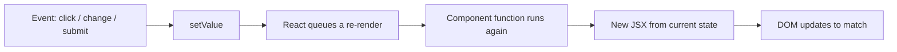
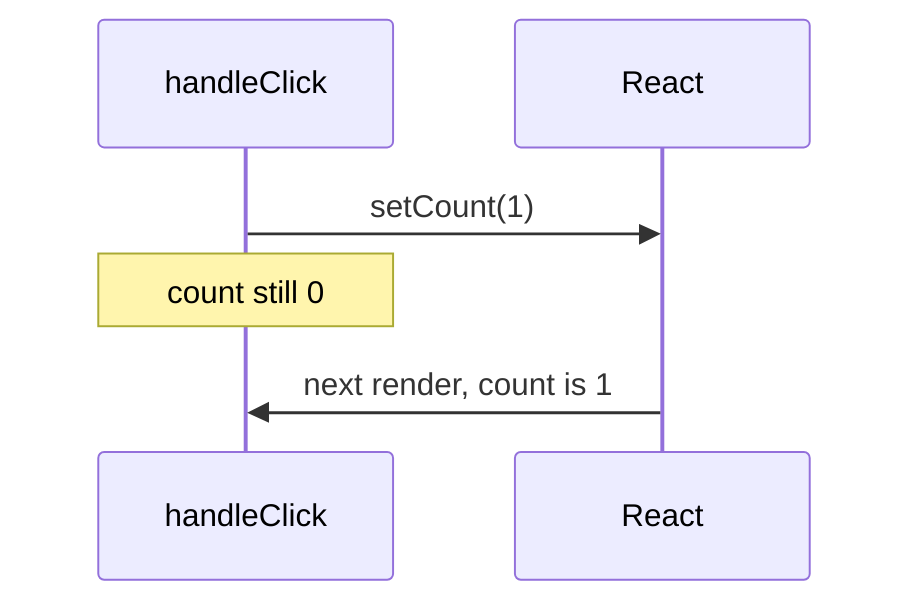
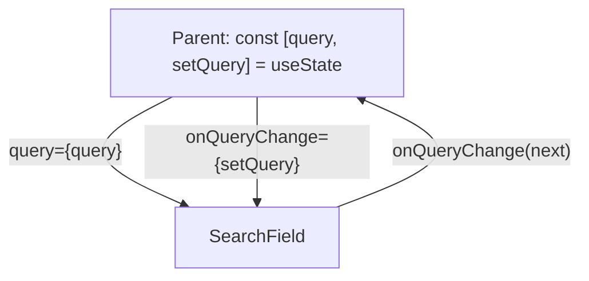
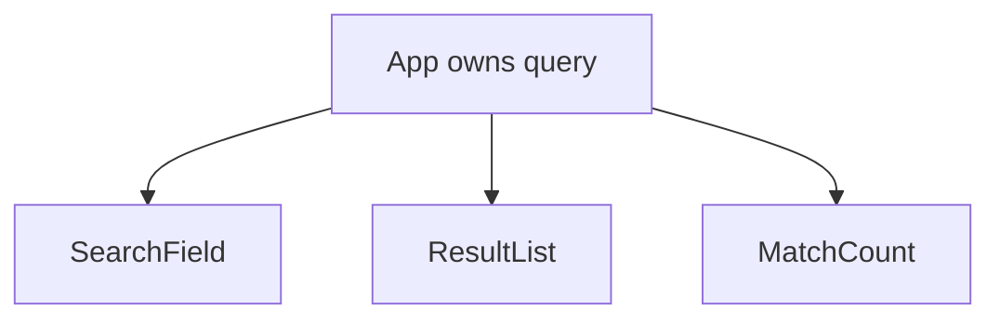

# Month 6 · Week 2 · Day 1
# useState, Events, and Lifting State

**Program:** Full-Stack Mastery · 18 months  
**Phase:** 2 — Modern frontend  
**Month index:** [../../README.md](../../README.md)  
**Week 2:** Day 1 (today) · [2](day-02.md) · [3](day-03.md) · [4](day-04.md) · [5](day-05.md) · [6](day-06.md) · [7](day-07.md)  
**Week rhythm today:** Learn + type-along  
**Student state:** Week 1 gate. You can scaffold Vite `react-ts`, return JSX, type props, and compose. You have not been required to make the screen change after a click.  
**Study time:** 3–4 focused hours

**This week covers:** state, events, forms, lists, keys, conditional rendering, controlled inputs.

Today: **`useState`**, **event handlers**, and **lifting state**. Lists, keys, and forms that own the typed value are Day 2. Do not skip them. If you only memorize “there is a hook called useState,” tomorrow’s keys will feel like folklore.

Project 4 is **not** this week. Labs live in `~\fullstack-lab\month-06\`. This textbook will not give you the dashboard.

---

## How to use this textbook

This is not a video transcript and not a tutorial to skim.

1. Read a section. Close it. Say the idea in your own words.
2. Type every lab. Do not paste a generated `App.tsx` you cannot explain.
3. When the compiler or the browser errors, **read the error**. Then fix it. That *is* the lesson.
4. Do not keep an explanation you cannot repeat without looking.
5. AI may explain or review. It may not replace your reasoning.

If you finish early, do the stretch — not another React article.

---

## How to read this chapter

Week 1 components were **functions of props**. Same props, same tree. A click did nothing unless you cheated with `document.querySelector` — and that fight with React is how beginners spend a week.

**State** is data the component **owns** and can **change**. When it changes, React calls the function again with the new value. The screen is a function of props **and** state.

If that is still abstract: the light switch is state; the bulb is the render. Flip the switch and the same fixture now describes “on.”



Read each section. Close it. Say it in one sentence. Then type the lab. When the counter stays at 1 after three clicks, that is today’s lesson, not a broken install.

---

## Today's contract

By the end of this day you will be able to:

1. Write `const [value, setValue] = useState(initial)` and explain both names.
2. Explain that **`setValue` queues a re-render**; the next line still sees the **old** value.
3. Use **`setN(n => n + 1)`** when the next value depends on the previous one.
4. Wire **`onClick`**, **`onChange`**, **`onSubmit`** by **passing** a function, not calling it.
5. Call **`preventDefault`** on submit so the page does not reload.
6. Pass **values down** and **callbacks up**; **lift** state to the common parent when two children need the same data.
7. **Copy** objects and arrays instead of mutating them; **compute** derived values during render.

**Today's gate.** Closed-book:

> State lives in the component that called `useState`. `setState` asks React to render again; it does not return the new value. Children change parent state by calling a function the parent passed. I copy arrays. I do not store `items.filter(...)` in state if I can compute it.

If you cannot say that, stay here. Day 2 controlled inputs will not rescue a mushy “hooks update the page.”

---

## Time box

| Block | Minutes | Work |
|---|---|---|
| A | 50 | Theory |
| B | 55 | Scaffold `week-02-state` + counter + Toggle |
| C | 70 | Independent: lift `query` |
| D | 20 | Git |
| E | 15 | Recall |

---

# Block A — Theory

## 1. What problem state solves

Week 1 `Greeting` always said hello to whoever the parent passed. That is enough for a static shell. It is not enough for a click counter, a toggle, or a search box.

**The problem:** some data **starts** in the component and **changes because of the user**. Props cannot do that — the child is not allowed to assign to a prop (Week 1: props are read-only).

**React’s bet:** keep that data in **state**. When you ask React to change it, React re-runs the function and diffs the new tree.

**Wrong belief:** “I’ll keep a `let count = 0` in the component and increment it.”  
**Correct:** `let` inside the function resets on every render. React does not know you changed it. **`useState`** is how you tell React “this value is part of the UI’s memory.”

```tsx
function Broken() {
  let count = 0; // dies every render
  return <button onClick={() => { count += 1; }}>{count}</button>;
}
```

That button will show `0` forever. The click ran. The variable changed in that one call. Then React did not re-render (you never asked), or if something else re-rendered, `count` is `0` again.

---

## 2. `useState` — the two-element box

```tsx
import { useState } from "react";

function Counter() {
  const [count, setCount] = useState(0);
  return (
    <button type="button" onClick={() => setCount(count + 1)}>
      Clicked {count}
    </button>
  );
}
```

Read it like ordinary JavaScript:

1. **`useState(0)`** — “React, remember a number. First time, it is `0`.”
2. The return is a **two-element array**: current value, and a **setter**.
3. **Destructuring** names them. Convention: `[thing, setThing]`. The names are yours; the order is not.
4. **`setCount(...)`** — “please remember this instead, and render me again.”

Rules that matter today:

- Call **`useState` at the top of the function**, not inside `if`, loops, or nested functions. Hooks are a list React matches **by call order**. Skip a call and the list desynchronizes. (Week 3: same rule for `useEffect`.)
- The **initial argument runs for the first render** of this instance. Later renders ignore it — `useState(0)` does not reset every time.
- You may call **`useState` more than once**: one box for `count`, another for `on`. They are independent.

TypeScript: `useState(0)` infers `number`. `useState(false)` infers `boolean`. If the value can be `string | null`, write `useState<string | null>(null)`. **Do not** use `any`.

**Wrong belief:** “`useState` is a global store.”  
**Correct:** each **component instance** has its own state. Two `<Counter />`s on the page have two counts.

---

## 3. `setState` queues a re-render — it is not a return value

```tsx
function handleClick() {
  setCount(count + 1);
  console.log(count); // still the old number
}
```

**`setCount` does not return the new count.** It does not change the `count` binding in this function call. That binding is a `const` from this render. The **next** render will get a new `count`.

Think of it as dropping a ticket: “next draw, use 1 instead of 0.” This draw already happened.



**Wrong belief:** “I can `const next = setCount(count + 1)` and use `next`.”  
**Correct:** the setter does not return the new value. Compute `const next = count + 1` yourself if this handler needs it, then `setCount(next)` — or wait for the next render.

**Batching:** React 19 groups several `setState`s from one event into **one** re-render. `setA(1); setB(2);` does not paint twice. That is a gift. It is also why “I logged after setState and it is stale” is normal.

---

## 4. When the next value depends on the previous — functional updates

This looks fine:

```tsx
setCount(count + 1);
setCount(count + 1);
```

It is not two increments. Both lines read the **same** `count` from this render (say `0`). Both ask for `1`. You get `1`.

When the next value **must** be based on whatever is already queued:

```tsx
setCount((n) => n + 1);
setCount((n) => n + 1);
```

React calls your function with the **latest pending** state. Two functional updates → `2`.

**Rule:** if you write `setX(x + …)` and `x` came from this render, you are saying “from **this snapshot**.” If you might fire more than once before a render, or you are inside a timeout/effect later (Week 3), prefer **`setX(prev => …)`**.

A counter that increments **once per click** can use `setCount(count + 1)`. A “+2” that calls the setter twice must use the function form. Practice the function form on the counter anyway. The parameter name is yours (`n`, `prev`); TypeScript infers it.

**Wrong belief:** “Functional updates are for experts.”  
**Correct:** they are for **honesty** about which value you mean. Use them whenever the formula mentions the old value.

---

## 5. Event handlers — pass the function, do not call it

JSX event props take a **function**. React will call it when the event happens.

| HTML-ish name | When |
|---|---|
| `onClick` | click (use a real `<button>`) |
| `onChange` | input/select/textarea value changed |
| `onSubmit` | form submitted (Enter in a field, or a submit button) |

```tsx
<button type="button" onClick={handleClick}>Save</button>
<button type="button" onClick={() => setOn((v) => !v)}>Toggle</button>
<button type="button" onClick={() => deleteItem(id)}>Delete</button>
```

The **broken** version is `onClick={handleClick()}` — that **runs while rendering**. `onClick` receives whatever `handleClick` **returned** (often `undefined`). If `handleClick` calls `setState`, you can loop: render → setState → render.

**Wrong belief:** “I have to call it so it runs.”  
**Correct:** you **pass** it so **React** can call it later. Parentheses mean “now.” The delete arrow is a function; `deleteItem(id)` without an arrow would run at paint time.

`type="button"` on a button **inside a form** matters: a button with no type **submits** (Month 2 / Month 3). Use `type="submit"` for the real submit control and `type="button"` for everything else.

---

## 6. Synthetic events and `preventDefault`

React gives your handler a **synthetic event** — an object that looks like a DOM event (`preventDefault`, `target`, `currentTarget`). For this month, treat it as “the event.” You do not need the old browser-difference lecture.

On **submit**, the browser’s default is: **navigate** (often a GET to the current URL with `?` query params). The page reloads. React state in RAM dies. Your list looks like it “flashed and reset.”

```tsx
function handleSubmit(event: React.FormEvent<HTMLFormElement>) {
  event.preventDefault();
  // now read state and update it
}
```

Put `onSubmit={handleSubmit}` on the `<form>`. Month 3: same `preventDefault` rule. React did not abolish HTML forms; it wrapped them.

You will type `React.FormEvent` / `React.ChangeEvent<HTMLInputElement>` for handlers you extract. Inline arrows can often infer. **No `any` on `event`.**

**Wrong belief:** “React forms don’t reload, so I can skip preventDefault.”  
**Correct:** they reload unless you stop the default. Missing `preventDefault` is the “it saves then the page is empty” bug. Day 7 will debug it on purpose.

---

## 7. Where state lives — values down, callbacks up

**State lives in the component whose `useState` created it.** There is no secret parent store this month (no Redux, no Context until Week 3).

A child that only **displays** the value receives it as a **prop**. A child that must **change** the value receives a **function prop** (a callback). The child calls the callback. The parent’s setter runs. The parent re-renders. The child receives the new prop.



```tsx
type SearchFieldProps = {
  query: string;
  onQueryChange: (next: string) => void;
};

function SearchField({ query, onQueryChange }: SearchFieldProps) {
  return (
    <label>
      Search
      <input
        value={query}
        onChange={(event) => onQueryChange(event.target.value)}
      />
    </label>
  );
}
```

The input is **controlled** — React state is the source of truth. Day 2 names that pattern fully. Today you need the **direction**: the string does not live in `SearchField` unless `SearchField` called `useState`.

**Wrong belief:** “The child can `setQuery` because it rendered the box.”  
**Correct:** the child can only call what it was **given**. If it never received a setter, it cannot change the parent.

You may pass `setQuery` itself if the signatures match (`(next: string) => void`). You may wrap it (`(next) => setQuery(next.trim())`) if the parent wants to enforce a rule. Either way, the **ownership** stays in the parent.

---

## 8. Lifting state

If **two** children need the same data — a list that filters and a heading that shows “3 matches” — the data cannot live in only one child. The other would not see it.

**Lift:** move `useState` to the **nearest common parent**. Pass the value down. Pass callbacks down.



**Do not** duplicate `useState("")` in `SearchField` and `ResultList`. Two boxes, two truths, a bug that looks like “the list doesn’t listen.”

**Do not** lift *everything* to `App` as a hobby. If only `Toggle` needs `on`, keep `useState` in `Toggle`. Lift when **sharing** starts.

Week 1 called this a **boundary**: what it owns vs what it receives. Today the owned thing can change.

**Wrong belief:** “I’ll use a global variable.”  
**Correct:** a module-level `let query = ""` is not on React’s radar. No re-render. Lift, or (Week 3) Context when many distant children need the same value.

---

## 9. Never mutate state objects or arrays in place

State can be an object or an array. **Do not edit the existing one.**

```tsx
// WRONG — mutates the array React already rendered
items.push(newItem);
setItems(items);

// WRONG — mutates a field
item.done = true;
setItems(items);
```

React compares with **`Object.is`** (think `===` for objects: same reference). If you mutate and pass the **same** array, React may skip the update. Even when it does re-render, you have corrupted the previous snapshot (debugging becomes gaslighting).

**Copy:**

```tsx
setItems([...items, newItem]);
setItems(items.filter((item) => item.id !== id));
setItems(
  items.map((item) =>
    item.id === id ? { ...item, done: !item.done } : item,
  ),
);
```

`[...items]` is a **shallow** copy of the array. `{ ...item }` is a shallow copy of one object. Nested objects need their own copy if you change them. Today’s labs are shallow. That is enough.

**Wrong belief:** “`.push` then `setItems` is fine because I called set.”  
**Correct:** you must pass a **new** array (or a new object). The copy *is* the update.

---

## 10. Do not store derived values in state

If you can compute it from state (or props) **during render**, do that.

```tsx
const [items, setItems] = useState<Item[]>(initialItems);
const [query, setQuery] = useState("");

const filtered = items.filter((item) =>
  item.title.toLowerCase().includes(query.trim().toLowerCase()),
);
```

`filtered` is **not** state. It is a local. Every render recalculates it. That is cheap for a handful of items. It cannot go stale relative to `items` and `query`.

**Wrong:** `useState` for `filtered`, then `useEffect` to copy `items` into it (Week 3 will call that an unnecessary effect). **Wrong:** `setFiltered` inside `onChange` **and** keep `items`. Two sources.

**Store:** the **source** facts the user changed (`items`, `query`, `on`).  
**Compute:** counts, filtered lists, `isBlank(query)`, labels.

Month 3 `isBlank` still applies: `query.trim() === ""` is a derived boolean, not a third piece of state.

**Wrong belief:** “More useState is more React.”  
**Correct:** more state is more ways to desynchronize. Derive.

---

# Block B — Type-along

## B1 — Scaffold

In PowerShell:

```powershell
cd ~\fullstack-lab\month-06
npm create vite@latest week-02-state -- --template react-ts
cd week-02-state
npm install
npm run dev
```

If `create vite` asks questions, choose React + TypeScript. Extra `--` after the app name is required on Windows PowerShell (Month 6 README).

Delete the demo counter and logos from `App.tsx`. You will type a real counter. The Vite demo is not today’s lab — you must be able to explain every line you keep.

Keep **React Developer Tools** open (Week 1). Select your component. The **hooks** section shows state. That panel is the truth; `console.log` is a flashlight.

## B2 — Click counter

`src/Counter.tsx`:

Type a component that:

1. Calls `const [count, setCount] = useState(0)`.
2. Renders a `<button type="button">` whose label includes the number (JSX text, not `innerHTML`).
3. `onClick` uses **`setCount((n) => n + 1)`**.
4. A second button sets the count back to `0` with `setCount(0)` (literal next value — no need for the function form).

Render `<Counter />` from `App`. Click three times. Confirm DevTools shows `0 → 1 → 2 → 3`.

**Deliberate bug:** temporarily write `onClick={handleClick()}` (create `function handleClick() { setCount((n) => n + 1); }`). Save. Watch the console / a freeze / a growing count without clicks. Read it. Restore `onClick={handleClick}`. Write one sentence in `EVENTS.txt`: parentheses run now; the prop needs a function.

## B3 — Toggle

`src/Toggle.tsx`:

```tsx
import { useState } from "react";

export function Toggle() {
  const [on, setOn] = useState(false);
  return (
    <button
      type="button"
      aria-pressed={on}
      onClick={() => setOn((value) => !value)}
    >
      {on ? "On" : "Off"}
    </button>
  );
}
```

Put `<Toggle />` in `App` next to `<Counter />`. Two instances prove they do not share state. `aria-pressed` tells assistive tech this is a toggle (Month 2). `{on ? "On" : "Off"}` is a ternary — Day 2 treats conditionals fully.

## B4 — Break mutation on purpose (object)

Booleans are primitives — you replace them. For an object, type `src/BrokenName.tsx`:

```tsx
type Person = { name: string };

export function BrokenName() {
  const [person, setPerson] = useState<Person>({ name: "Ada" });

  function handleClick() {
    person.name = "Grace"; // mutation — then you "set" the same object
    setPerson(person);
  }

  return (
    <button type="button" onClick={handleClick}>
      {person.name}
    </button>
  );
}
```

Click. If the label **does not** change, you have seen the skip. Fix:

```tsx
setPerson({ ...person, name: "Grace" });
```

Write `IMMUTABLE.txt`: same reference, possible silent skip; spread makes a new object.

Remove `BrokenName` from `App` when done. Do not ship mutation as the feature.

---

# Block C — Independent

Still in `week-02-state`.

**Lift a `query` string.** You choose one honest shape:

- **A.** `App` owns `query`. A child `SearchField` receives `query` and `onQueryChange`. A sibling `QueryEcho` receives `query` and renders `Searching for: {query}` (or “empty” when `query.trim() === ""`).
- **B.** Keep the `<input>` in `App` and pass only `query` down to `QueryEcho`. That is also lifting — the input never lived in the child. Prefer **A** so you practice callbacks.

Rules:

1. Typed props. No `any`.
2. Controlled input: `value={query}` and `onChange` that calls the callback with `event.target.value`.
3. `<label>` with visible text (or `htmlFor` + `id`). Month 2.
4. A `<form onSubmit={...}>` around the search field. `preventDefault`. Submit may `console.log` the trimmed query or show it in the echo — **no navigation**.
5. Do **not** store `trimmed` in state. Compute `const trimmed = query.trim()` in the parent render if you need it.
6. `BOUNDARY.md`: for `App`, `SearchField`, `QueryEcho` — receive / own / must not invent.
7. CSS you type. No Tailwind. No UI kit.

Stretch: two `SearchField`s bound to the **same** `query`. Typing in either updates both — proof the parent owns the string.

---

# Block D — Git

```powershell
cd ~\fullstack-lab
git add month-06/week-02-state
git commit -m "Month 6 Week 2 Day 1: useState, events, lifted query."
```

Add `node_modules` to `.gitignore` if it is not already there. **Never commit `node_modules`.**

---

# Block E — Recall

Close the file.

1. What does `useState(0)` return?
2. Why is `console.log(count)` after `setCount(count + 1)` the old number?
3. When must you write `setCount(n => n + 1)`?
4. Why is `onClick={handle()}` wrong?
5. What does `preventDefault` stop on submit?
6. Where does state live, and how does a child change it?
7. Why `[...items]` instead of `items.push`?
8. Why is `filtered` not a second `useState`?

---

## Definition of done

- [ ] I can explain `setState` as a re-render request, not a return value
- [ ] Counter uses a functional update; Toggle uses `useState(false)`
- [ ] I caused `onClick={handle()}` on purpose and restored it
- [ ] `query` is lifted; two children share it (or I can explain why the input stayed in the parent)
- [ ] Form submit does not reload the page
- [ ] No in-place mutation of objects/arrays; `IMMUTABLE.txt` exists
- [ ] `BOUNDARY.md` exists
- [ ] No `any`, no `dangerouslySetInnerHTML`
- [ ] Commit exists

---

## Optional review links

`useState`, events, and lifting are explained in this chapter. These pages are for later checking, not for first learning.

- [React: State — a component's memory](https://react.dev/learn/state-a-components-memory)
- [React: Queueing a series of state updates](https://react.dev/learn/queueing-a-series-of-state-updates)
- [React: Responding to events](https://react.dev/learn/responding-to-events)
- [React: Sharing state between components](https://react.dev/learn/sharing-state-between-components)

---

## Tomorrow

**Lists, keys, conditional rendering, controlled inputs, forms.** Filter a list. Add an item with a form that is the source of truth. Delete through a callback. Keys will be **ids**, not indexes.
