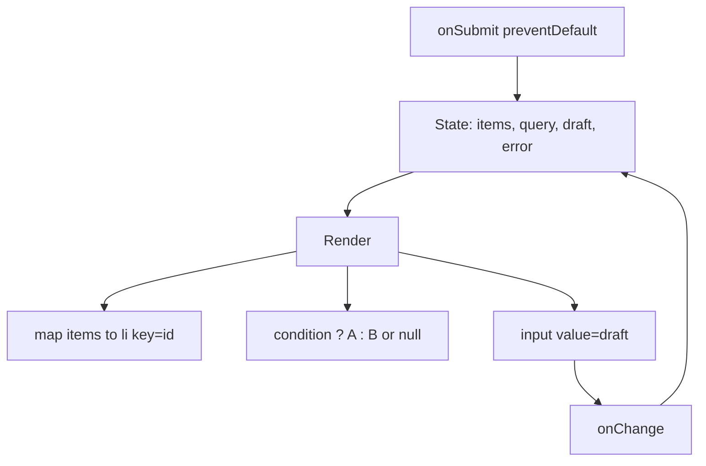
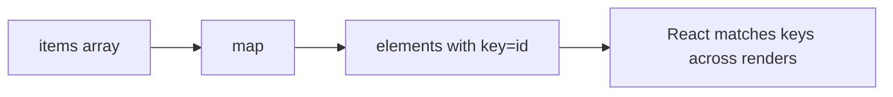

# Month 6 · Week 2 · Day 2
# Lists, Keys, Conditional Rendering, and Controlled Forms

**Month index:** [../../README.md](../../README.md)  
**Week 2:** [1](day-01.md) · Day 2 (today) · [3](day-03.md) · [4](day-04.md) · [5](day-05.md) · [6](day-06.md) · [7](day-07.md)  
**Week rhythm today:** Exercises + debugging  
**Study time:** 3–4 focused hours  
**Prereq:** Day 1 gate. You have `week-02-state`. You can lift a string, pass a callback, and `preventDefault` on submit.

Yesterday the screen could change. Today the screen **lists** things, **hides** things, and treats an input as **React’s** value — not the DOM’s secret.

---

## How to read this chapter

A list in React is still an array. You **map** it to elements. Each element needs a **key** so React can tell “the same item moved” from “a new item appeared.”

A form in React this month is **controlled**: the `value` (or `checked`) comes from state. The `onChange` writes state. There is one source of truth.

Uncontrolled inputs (`defaultValue` + a ref) are **Week 3**. Prefer controlled this month. You will not “save time” by mixing both on one field.



If two children need the list, the array lives in the parent (Day 1 lift). Today the parent will also own the **draft** string for “add item.”

---

## Today's contract

By the end of this day you will be able to:

1. Render **if/else UI** with a ternary; render **nothing** with `null`; avoid `0 && <X />`.
2. Give list items **stable id keys**; explain why **index** keys fail on insert/reorder and why **random** keys remount every render.
3. Build a **controlled** text input, checkbox, and select.
4. Submit a form: `preventDefault`, **trim**, **`isBlank`** (Month 3), show an error as **JSX text**.
5. Delete a row by calling a **callback** with an id; update state with a **copy** (`filter` / `map` / spread).

**Today's gate.** Closed-book:

> Controlled means `value` plus `onChange` — React owns the string. Keys are stable ids. `condition && <X />` is wrong when `condition` can be `0`. I trim and reject blank with `isBlank`. I never `innerHTML` the error.

---

## Time box

| Block | Minutes | Work |
|---|---|---|
| A | 50 | Theory |
| B | 55 | Type-along: keys + controlled field + checkbox |
| C | 70 | Independent: filterable list of 6 + add form + delete |
| D | 20 | Git |
| E | 15 | Recall |

---

# Block A — Theory

## 1. Conditional rendering — expressions, not `if` inside JSX tags

JSX `{ }` takes an **expression**. You cannot write `{ if (x) { ... } }`. You **can** write a ternary, `&&`, a variable you computed above `return`, or a function call.

### 1.1 Ternary — if / else UI

```tsx
{on ? <p>The lamp is on.</p> : <p>The lamp is off.</p>}
```

Use this when both branches are real UI. Keep the branches **short**. If each side is a page, compute a `let body` with `if` **above** the return, then `{body}`.

### 1.2 `null` — render nothing

A component may `return null`. A ternary may use `null` as a branch:

```tsx
{error === null ? null : <p role="alert">{error}</p>}
```

`null` is a valid React child meaning “no node.” `undefined` is also skipped. Prefer an explicit `null` when you mean “hide this.”

Do not return `false` as a clever hide — it works for some cases and confuses readers. `null` is the honest empty.

### 1.3 `condition && <X />` — the `0` trap

```tsx
{count && <p>{count} selected</p>}
```

JavaScript `&&` returns the **left** value if it is falsy. `0` is falsy. React then **renders `0`** — you see a literal zero on the page, not a hidden paragraph.

Month 3 falsy list still applies: `false`, `0`, `""`, `null`, `undefined`, `NaN`.

**Safe patterns:**

```tsx
{count > 0 && <p>{count} selected</p>}
{count === 0 ? null : <p>{count} selected</p>}
{!!count && <p>{count} selected</p>}
```

`count > 0` is a **boolean**. `&&` then cannot leak `0`. Prefer that over `!!` if the question is really “greater than zero.”

**Wrong belief:** “`&&` is the React if.”  
**Correct:** `&&` is JavaScript. If the left side can be `0` or `""`, you will paint that value. Use a boolean left side, or a ternary.

Empty arrays are truthy (`[] && <X />` **does** render `<X />`). Filter length is the usual question: `filtered.length > 0`.

---

## 2. Lists — `map` returns an array of elements

```tsx
{items.map((item) => (
  <li key={item.id}>{item.title}</li>
))}
```

`map` is an **expression**. That is why it lives in `{ }`. A `for` loop is a statement — use it above the return if you must; prefer `map` for straightforward lists.

Each **sibling** in that array needs a **`key`**. The key is not a prop your `li` receives (you cannot read `props.key`). It is a hint for React’s diff.



---

## 3. Keys — stable ids, not indexes, not random

**Good key:** a string (or number) that **means this record** and **does not change** when the list shuffles. Database id, `crypto.randomUUID()` assigned **once** when the item is created, a slug that is unique in this list.

**Index as key** looks fine for a static “three slogans that never reorder.” It **fails** when you insert at the top, delete in the middle, or sort:

| Render | Index 0 | Index 1 | Index 2 |
|---|---|---|---|
| Before | Ada (you typed in a box keyed 0) | Bea | Cy |
| After insert “Zo” at front | Zo (React reuses index 0’s DOM — **Ada’s leftover input**) | Ada | Bea |

React thinks key `0` is “the same row.” The **text** of the row may update from props, but **state inside the row** (an uncontrolled input, a toggle, focus) sticks to the index. Controlled inputs in the parent are safer, but **focus and animations** still attach to the wrong item. Use **ids**.

**`key={Math.random()}`** (or `key={crypto.randomUUID()}` **inside the map**) makes a **new** key every render. React tears down every row and mounts new ones. Cursors jump. Toggles reset. The profiler looks like a fire.

Assign the uuid **when you add the item**, store it on the object, use that stored id in `key={item.id}`.

**Wrong belief:** “Keys are for the compiler.”  
**Correct:** keys are for **identity across time**. Wrong keys are a state bug that looks like CSS.

Unique among **siblings**, not globally unique across the whole app. Two different lists may both have `key="1"`. Do not use the array index if the list can grow, shrink, or reorder — today’s lab can.

---

## 4. Controlled inputs — React is the source of truth

```tsx
const [title, setTitle] = useState("");

<input
  value={title}
  onChange={(event) => setTitle(event.target.value)}
/>
```

Every keystroke: event → `setTitle` → re-render → `value={title}` paints the box. If you forget `onChange`, the box **freezes** (React keeps passing the old `value`). If you forget `value`, the box is **uncontrolled** (the DOM owns the string). Do not mix: `value` without `onChange` is a locked field; `value` plus DOM tricks is a fight.

**Type the event** when the handler is a named function:

```tsx
function handleChange(event: React.ChangeEvent<HTMLInputElement>) {
  setTitle(event.target.value);
}
```

`event.target.value` is always a **string** for text inputs — even if the user typed `0`. Month 3: `"0"` is a real query. `isBlank("0")` is false.

**Wrong belief:** “I’ll read `input.value` from the DOM on submit and skip state.”  
**Correct:** that is uncontrolled. Week 3 refs. This month the submit handler reads **state** (or a `FormData` you still copied into state as you typed — prefer state).

Placeholder is not a label. Use `<label>`.

---

## 5. Uncontrolled + ref is Week 3

```tsx
<input defaultValue="Ada" />  // DOM owns it after mount
```

`defaultValue` sets the initial DOM value. Later React does not drive it. You would grab a **ref** to read it. That is a real pattern (large forms, file inputs). **Not this month.** If you set `value` **and** `defaultValue`, React will warn. Pick one. Pick **controlled**.

---

## 6. Forms — submit is the keyboard-friendly path

```tsx
function handleSubmit(event: React.FormEvent<HTMLFormElement>) {
  event.preventDefault();
  if (isBlank(title)) {
    setError("Enter a title.");
    return;
  }
  setError(null);
  const next: Item = { id: crypto.randomUUID(), title: title.trim() };
  setItems((current) => [...current, next]);
  setTitle("");
}
```

1. **`preventDefault`** — no reload.
2. **`trim`** — spaces are not a title (Month 3 blank).
3. **`isBlank`** — reuse the idea: `title.trim() === ""`. You may copy a typed helper:

```ts
export function isBlank(s: string): boolean {
  return s.trim() === "";
}
```

In TypeScript a `string` prop does not need `typeof` if the type already forbids `null`. Still trim. `"   "` is blank. `"0"` is not.

4. **Error as JSX text** — `<p role="alert">{error}</p>`. Not `innerHTML`. Not `dangerouslySetInnerHTML`. User strings stay text (Month 3 XSS).
5. **Functional update** when appending: `setItems(current => [...current, next])` so two fast submits cannot clobber each other.
6. **Clear the draft** with `setTitle("")` after a successful add so the box is ready again.

Put `onSubmit` on the **`<form>`**, not only on the button. Enter in the field submits the form. That is the keyboard path Day 4 will demand. The button is `type="submit"`.

Native `required` can help. You still trim: HTML `required` treats `"   "` as filled. Your `isBlank` is the real rule.

---

## 7. Checkbox — `checked` + `onChange`

Checkboxes are boolean, not strings.

```tsx
<input
  type="checkbox"
  checked={done}
  onChange={(event) => setDone(event.target.checked)}
/>
```

**`checked`**, not `value`, is the control. `event.target.checked` is `boolean`. Using `value` on a checkbox is the HTML submit name/value pair — not how React drives the toggle.

**Wrong belief:** “Checkbox uses `value` like a text box.”  
**Correct:** drive it with **`checked`** and `event.target.checked`. `value` on a checkbox is the HTML submit pairing, not the boolean.

A list of done flags: do not keep a parallel `boolean[]`. Keep `done` **on each item** and `map` a copy:

```tsx
setItems((current) =>
  current.map((item) =>
    item.id === id ? { ...item, done: !item.done } : item,
  ),
);
```

---

## 8. Select — controlled too

```tsx
const [slot, setSlot] = useState("");

<label>
  Slot
  <select value={slot} onChange={(event) => setSlot(event.target.value)}>
    <option value="">Choose a slot</option>
    <option value="morning">Morning</option>
    <option value="afternoon">Afternoon</option>
  </select>
</label>
```

`value={slot}` on the **select**. Options have `value` strings. Empty string is a valid “not chosen yet” if you type `slot` as `string`. A union `"morning" | "afternoon" | ""` is even better (Month 5 literals).

**Wrong belief:** “The select is native, so React doesn’t need `value` on it.”  
**Correct:** without `value={slot}`, you are uncontrolled again. Keep the selected option in state.

---

## 9. Derived filter — still not state

```tsx
const filtered = items.filter((item) =>
  item.title.toLowerCase().includes(query.trim().toLowerCase()),
);
```

Six items. Filter on every render. No `useEffect`. No `filtered` in `useState`. Day 1 rule still holds.

Delete:

```tsx
setItems((current) => current.filter((item) => item.id !== id));
```

The child button calls `onDelete(id)` — it does not splice the parent’s array.

---

## 10. Security and a11y (this week’s slice)

| Rule | Why |
|---|---|
| JSX text for titles and errors | Same as `textContent`. No `dangerouslySetInnerHTML`. |
| `<button>` for clicks | Not `<div onClick>`. Keyboard and role come free. |
| `<label>` for every input | Role/name for Day 5 tests and for humans. |
| `role="alert"` on error | Dynamic error should be announced. Native `required` does not replace your trim message. |
| Keys are ids | Wrong keys mis-associate row state — including a checkbox you later add. |

---

# Block B — Type-along

Continue `~\fullstack-lab\month-06\week-02-state`.

### 1. `isBlank`

`src/isBlank.ts` — typed, no `any`, export the function. Probe it in your head: `isBlank("  ")` true, `isBlank("0")` false.

### 2. Conditional `0` trap

Temporarily in `App`:

```tsx
const count = 0;
return (
  <div>
    {count && <p>Has selection</p>}
  </div>
);
```

See the **0** on the page. Fix to `count > 0 &&`. Write `AND.txt`: one sentence on why `0` leaked.

### 3. Controlled field + select

One form with a text input and a select, both controlled, both labeled. Submit logs (or displays) the pair. `preventDefault`. Blank text → error paragraph as text.

### 4. Key experiment (optional but recommended)

Map three strings with `key={index}` and an `<input>` **inside** each `li` (local state or even uncontrolled). Reorder the array (a button that `setItems([...items].reverse())`). Type in the first box, reverse, watch the **text stick to the row position**. Then switch to `key={item.id}` and repeat. Write `KEYS.txt`.

---

# Block C — Independent

Filterable list + add + delete. Still this app (new components are fine).

**Spec:**

1. Type `Item` as `{ id: string; title: string }` (add fields only if you need them; do not invent a dashboard).
2. **Six** starter items with **hand-written ids** (`"svc-1"` … or uuids you paste once). Hard-code the array as `useState` initial — not fetched (no `useEffect` this week).
3. **Search** box, controlled, lifted if a sibling needs `query`. Filter is **derived**. Case-insensitive `includes` on `title` is enough.
4. **Add** form: controlled title field, `onSubmit`, `preventDefault`, `isBlank` after trim, error as JSX text, new item `{ id: crypto.randomUUID(), title: trimmed }`, `setItems` with a **new** array.
5. **Delete** on each row: `type="button"` so it does not submit the add form. Callback `onDelete(id)` to the owner of the array.
6. **`key={item.id}`** on the list row component or `li`. No index. No `Math.random()`.
7. Empty filter results: show a short message (ternary or `null` + paragraph). If `filtered.length === 0`, do not leak `0` with `&&`.
8. Semantic list (`ul`/`li`). CSS you write.
9. `BOUNDARY.md` update: who owns `items`, who owns `query`, who owns the draft title.

Stretch: a checkbox **done** on `Item` with controlled `checked` and `map` copy. Filter “all” is enough today; Day 3 will add all/open.

```powershell
cd ~\fullstack-lab
git add month-06/week-02-state
git commit -m "Week 2 Day 2: keyed list, controlled add form, delete callback."
```

---

# Block E — Recall

1. Why can `{count && <p/>}` show `0`?
2. What does `return null` mean?
3. Why do index keys break on insert?
4. Why do random keys remount every render?
5. What two props make a text input controlled?
6. Checkbox: `checked` or `value`?
7. Why `preventDefault` on the form, not only a mental note on the button?
8. Where does `isBlank` run — on the raw keystroke or on the trimmed string at submit? (Both can be true; say when.)

---

## Definition of done

- [ ] I can teach the `0 &&` pitfall without looking
- [ ] List uses stable `id` keys; KEYS.txt or I can describe the reverse experiment
- [ ] Add form is controlled; blank shows a text error
- [ ] Delete copies the array via `filter`
- [ ] Filter is derived, not state
- [ ] No `any`, no `dangerouslySetInnerHTML`, no Router/Query/RHF
- [ ] Commit exists

---

## Optional review links

Lists, keys, and forms are explained in this chapter.

- [React: Rendering lists](https://react.dev/learn/rendering-lists)
- [React: Conditional rendering](https://react.dev/learn/conditional-rendering)
- [React: Controlling a component with state](https://react.dev/learn/sharing-state-between-components#controlling-a-component)
- [React: `<input>`](https://react.dev/reference/react-dom/components/input)

---

## Tomorrow

From memory: a **todo-like** list — add, toggle done, filter all/open. Days 1–2 closed during the drills. Repair from **this week’s day files in this book**.
